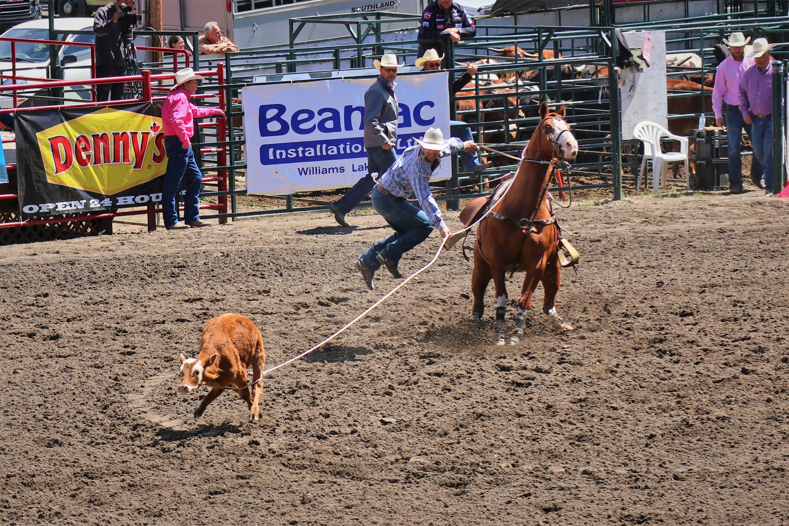
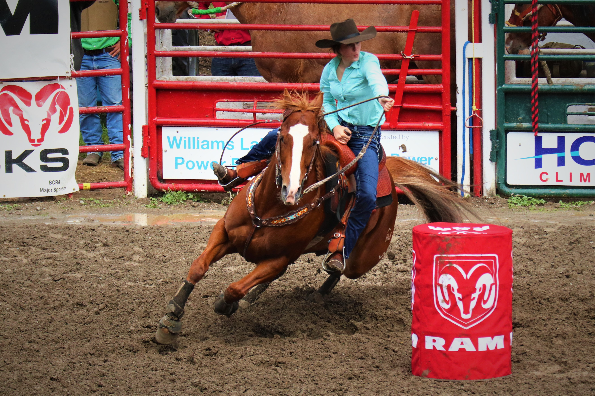

#### # I
清晨五點，門外的木板嘎嘎作響，我躺在床上眼睛微張，陽光灑進小木屋裡襯著牆、襯著地板，整個空間輝映著溫暖明亮的橙黃色調。這溫暖的地方就是我這幾天的家、一個屬於獵人家庭的木屋。

這裡是個叫做 150 Mile House 的小城，是位在溫哥華北方車程八小時的荒野之地，如此浪漫的地名源自於 1860 年代在加拿大西部興起的滔金熱，兩百多年前的英國殖民者自南方的城市 Lillooet 開始開拓一條名為 Old Cariboo Road 的道路，而道路兩旁的城鎮就已與Lillooet 的距離來命名，如果妳在地圖上找到這條道路，就會發現附近不乏其他相同浪漫的地名，像是 Horsefly，像是 Lac La Hache。

現在的 150 Mile House 已經沒有當時的掏金熱潮，有的卻是一股溫和柔軟的氣息，牛群、馬群、廣大的牧場及大片的森林守護著此地分布各的的放牧家庭。我期待在這個安靜的小地方聽見歷史的故事。

我掀起被蓋坐起身，好冷。窗外的溫度計顯示著攝氏 5 度，噢，記得昨晚的數字還在 27 的，真是任性的內陸氣候。我披上薄夾克，腳下踩著鋪著陽光的木頭地板，樓下已經飄來淡淡的奶油香味。

#### # II
幾天前因為公事的關係，從 Williams Lake 開了一個小時的山路到了 Chilcotin 部落找 John。兩個月前和 Kathy (一位系上的教授) 來考察時見過 John 一面，當時沒什麼交流，只是靜靜的在一旁聽他們說話。Kathy 和 John 是老朋友了，她在 25 年間送了不少學生來 Chilcotin 做研究，野外調查期間若有遇到任何機械上的問題，都是請 John 幫忙維修照護。

「Sunny, please find the key belongs to the smaller trailer and give it to John.」

一封來自 Kathy 的短信，她就要我憑著兩個月前的記憶開到一個深山的地方、找到一個只見過一面的人…  幸好住在 Chilcotin 的人家很少，左顧右盼地也就找到了這個兩個月前曾經拜訪過的木屋。

「Hi John, this is Sunny. Do you remember me? 」我下了車，眼前這個人既熟悉又陌生。

「Oh yeah. I remember you, Sunny. Please come in.」是有點沙啞而溫厚的嗓音，我不記得長相，但記得這個聲音，看來是找對地方了。

我們坐在木屋的二樓，大大的落地窗把窗外的壯闊都接進了屋裡。我捧著熱茶跟他說明此次拜訪的目的，並開始聊起天。原來他是個捷克人，在他 25 歲那年就自己獨自來到加拿大生活，那時的他連英文都還不會說呢。新生活、新語言、新環境，一切都要謙虛地從零開始。他說在他那個年代，每個人都嚮往著北美洲的生活，這裡有大車、大房、大山大水。「It is much bigger than I had imagined.」John 看著窗外的Farwell Canyon 這麼說道。我則笑著點頭同意，到加拿大未滿一年的我深有同感。

忽然間我的眼角餘光瞄見了窗簾下的木頭顏色，定睛一看，一把真槍就這樣大喇喇地坐落在距離我五米遠的地方，然後我又看見了牆上那些象牙白色的鹿角。這可有趣了。

「Are you a hunter?」我放下手中的茶杯，小聲地問道。

#### # III
是的，John 是一位 hunter（我後來才知道，幾乎所有住在 Chilcotin的人家都會狩獵）。

每年秋季是他們的狩獵季節，在加拿大狩獵是受到法律規範的，每一年、每一個人只能獵捕某些特定的動物，而且也有數量的規範，像是 Moose、Black bear 這些族群數量逐漸下降的生物就被嚴格的保護著。John 說他每年都會打一隻鹿，但就一隻鹿。狩獵得來的鹿肉將會是他接下來一整年的肉類來源。他帶我去看後院的一棵樹，那棵樹上就掛著幾個鹿角，風吹來時就匡匡匡的互相撞擊著，像風鈴。

John 又從地下室搬出了三把槍，22 cal rifle、243 rifle，和電影上才看過的左輪手槍。我驚呆了。「Do you wanna try?」John 遞給我那一把 22 步槍，好奇心百分百的我立刻點頭如搗蒜。槍托上肩，我想起上回在俄羅斯的野外有試過空氣槍，用的子彈僅如米粒大小，槍身也很輕，而這回真槍實彈則重多了，但拿起來卻有沉穩的舒適感。瞄準器的十字已經對準遠方松樹下的紅色靶心，「碰!」，子彈打到鋼板的聲音在寧靜中顯得響亮。
九發子彈、九個落在紅心的彈痕。

「Oh girl, what are you made of….」John 滿臉驚訝地看著我，而我則像小朋友贏得比賽般驕傲地笑著。「You can drive a truck and you can shoot. Sunny, you must be a Chilcotinian!」John 拍拍我的肩，用那雙微笑著的藍色眼睛看著我。

噢，如果說 Chilcotinian是勇敢而自信的代名詞的話，那麼我很希望，我是的。

#### # IV
「Sunny, you will be a great hunter if you want.」。如果有機會我真的很想嘗試，一次也好。

John 帶我去參觀地下室的冰庫，左邊一包一包的鹿肉是去年秋天打來的，最上方一大袋的雞肉，還有分塊裝好的牛肉都是村落的鄰居屠宰後分享，右側一條條銀白色的 Lake Trout 則是在附近的湖裡釣的 (蔬菜水果在這裡反而稀少，必須要開車一小時才能到最近的城鎮購買，因此可以自給自足的肉類反成為了主食)。等今年秋天的時候，這個冰庫又會為了過冬而再度裝滿，也許又會有幾隻新成員入住吧。我有幸嚐了鮮甜的 Trout 及鹿肉，美味極了。

或許不同於許多人認為的殘忍，我打從心裡的敬佩我眼前的這些獵人們。狩獵，不是奪取一條生命，而是審慎的評估自己的所需、評估對生物群集的影響後，再謙虛的向這片土地求取。找尋獵物、躲藏、等待、射擊、搬運、屠宰、保存，獵人們所訓練出的技能世代相傳，而我也相信狩獵絕非易事。當我們在超市如此輕易地買下一盒牛肉時，看不見的是隱藏起的故事，而他們卻可以真真實實的與自然的韻律共處著。

我打從心裡的羨慕。真好，能夠如此真實而貼近自然的生活著。

#### # V
獵人座椅上的那鹿角，是他能從森林裡取來的，最美的紀念品。鹿群是屬於森林的；黑熊是屬於森林的；麋鹿是屬於森林的；人類也是屬於森林的。我們從森林裡走出來，但真實的內心卻從沒離開過那呼吸著的大地。

我聆聽著，並沉醉著。

#### # VI
看來 Williams Lake 要發生甚麼大事了。

從 Riske Creek 回到 Williams Lake 的高速公路上，二十度的氣溫伴著徐徐微風，又是一個涼爽誘人的午後。開在我們前方的 logging truck 漸漸地減速，我跟在後頭，儀表板的紅色指針從八十降到二十。

「噢，是馬!」我搖下車窗，清脆響亮的馬蹄聲規律地此起彼落，約莫五十匹馬就這樣縱列在高速公路上前進著，那場景就像電影裡商人長征的馬隊。看他們統一色系的穿著打扮，我猜是來自同一個原住民部落的人。「That’s so cool!」坐在副駕的 Alice 跟我發出一樣的驚嘆。我一手握著方向盤，一手抓著相機，小心翼翼地跟在馬群後。

「Stay behind!」身著亮橘色背心的男子對著我們的車大喊，我只好乖乖地跟在後頭，Alice 趁機探出頭問了他們此行的目的。「We are going to the Rodeo.」那男子給了我們一個禮貌地微笑。

「Oh Rodeo!」我驚喜了一下，記得幾天前還聽到鎮上的人在談論，這就是傳說中 Williams Lake 一年一度最繁華的盛事。看來又有有趣的事情可以瞧瞧了。

#### # VII
說起 Rodeo（牛仔競技），腦中浮現的畫面總是西部電影裡那黃沙滾滾的場景--身著牛仔帽、長馬靴的牛仔面對面站著，氣氛凝重而嚴肅，忽然兩人同時拔起腰帶右側的左輪手槍。「碰!」。煙硝味四起……。

好吧，真實的 Rodeo 除了沒有左輪手槍外，其他都是真的。

最早的 Rodeo 可以回溯至 1820 年代，當時美洲西部的牛仔們為了測驗自己與同行間的工作技術，聚集起來互相切磋牧牛的技巧，彼此較勁的項目像是 Calf roping（套小牛）、Team roping（兩人合力套住公牛）、Steer wrestling（從馬上跳下來扳倒公牛） 等等。Rodeo 在近幾年逐漸受到一般大眾的喜愛，開始舉辦正式的比賽，像是全加拿大最盛大的 Calgary Stampede，或是第二大的 Williams Lake Stampede，這些 Rodeo 就像是年度運動會一般凝聚著鎮上牛仔的精神。

對於住在 Williams Lake 的男孩來說，騎馬是必備技能，能夠參與Rodeo 更是榮耀的象徵。而此刻的我，早已經沉迷在沸騰的歡呼聲與澎湃的情緒中。啊，真是太帥氣了!

#### # 後記
坐在我左邊的女生聊起天來，她叫 Lisa ，是個挪威來的女孩，令人驚訝的是，她也是一位訓馬師...

