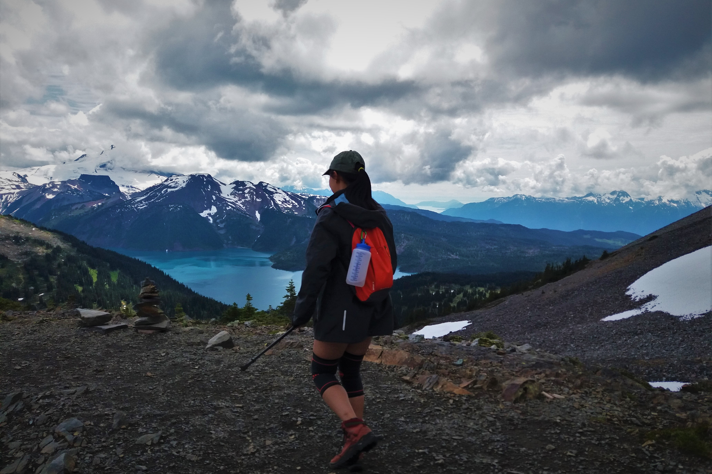
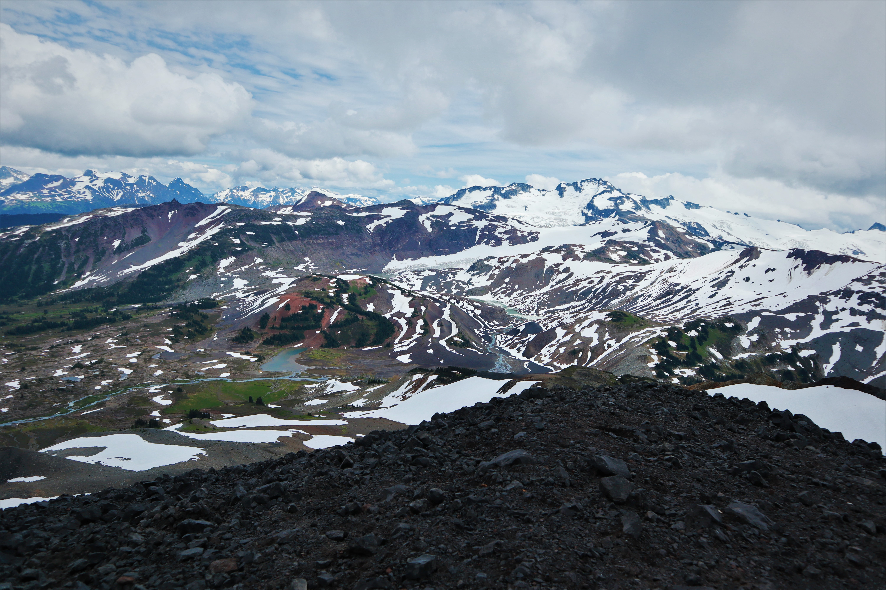
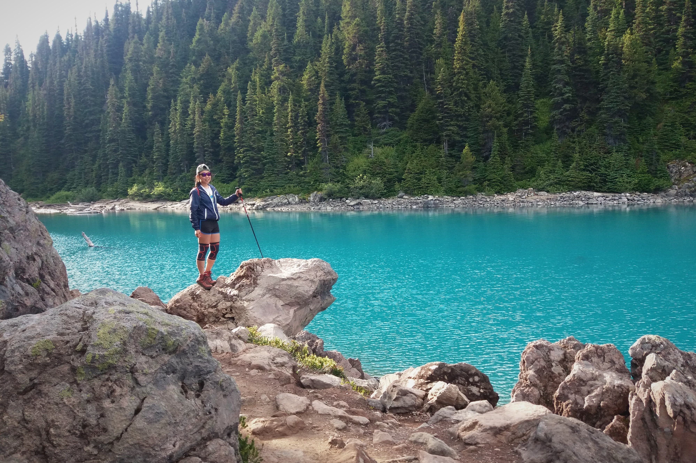
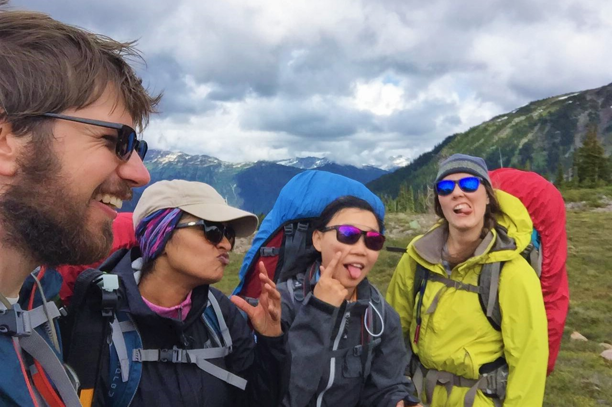
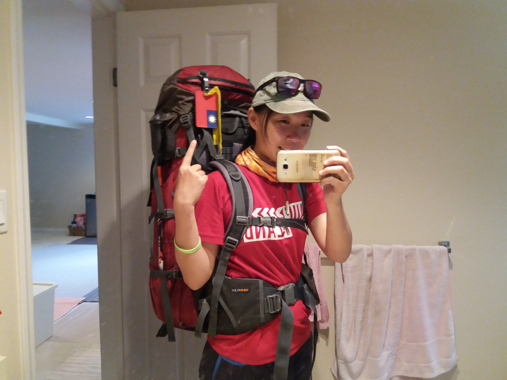

#### # I
想當初來到加拿大時，隨機只能帶上兩件 23 公斤的行李，其中一件就奉獻給登山背包和心愛的登山用具們（i.e.,帳篷、睡袋、睡墊…），畢竟又是個山巒綿延的國度，怎麼能抵擋得住陽光和綠的誘惑。

上回和 S 與 Z 到 Squamish，我指著遠方的山頭說，「That’s my dream this summer!」。那是 Black Tusk，遠看就像台灣的大霸尖山。「Sunny, we will take you there.」他們說。

#### # II
熊袋，似乎是個在台灣不存在的東西，但在這裡是個登山的標準配備。

加拿大西南地區的熊有兩種，Grizzly Bear 以及 Black Bear，其中又屬 Black Bear 常見許多。來到這裡快兩年了，果真在野外遇過不少黑熊，所幸距離都甚遠，四目相對幾秒後對方就悻悻然離去。但，親眼見過熊，就真能感受到那股肅然敬畏。在這個「有熊國度」，帶上熊鈴、防熊噴霧、熊袋，是保護自己也是保護熊的最佳方法。

這裡的登山露營區大多數都設有熊袋，顧名思義就是在夜間時把所有的食物以及會散發出氣味的物品掛在高處，以避免熊靠近露營區甚至嘗試進入帳裡。如果沒有既有的熊袋，就必須自己帶上長繩、拋繩將食物掛在樹上。S 及 Z 對於這點非常謹慎，連我的牙膏、防曬油都在傍晚被沒收、一併掛了上去。

我看著空中一袋一袋的佳餚美食，「阿…若是肚子餓了就來這裡翻找食物好了。」心裡笑著。

#### # III
Black Tusk 是加拿大西南岸山群裡出了名的火山，當地 Squamish 的原住民稱之為「t'ak't'akmu'yin tl'a in7in'a'xe7en」，意為「傳說之鳥的登陸之地」，而那漆黑的山頭，即是被傳說之鳥的閃電擊中之處。噢，順帶一提，傳說之鳥就是雷鳥（Thunderbird），掌控著整個星球的上半天球，只要振翅就能發出閃電射向地面上的生物。

現實上的 Black Tusk，則是個複式火山（stratovolcano）的火山口，因週期性的噴法而在周遭層層堆疊起火成岩、火山灰及火山碎屑，從 Helm Creek 到 Black Tusk 之間的路程，鋪滿了火山碎屑岩，一整個就像是走在黑色的沙漠上，由夏雪襯出的黑。

#### # IV
山頂上的照片。當時風大，又是在火山峭壁旁，連拍個照都戰戰兢兢。

其實真正的山頂還要再往上攀一小段，一直走到人稱「煙囪」的地方，再手腳並用的攀岩向上。出發前就聽說過這是一段具有危險性的路，但從沒想過竟是這樣的壯闊又嚇人--兩旁是近乎垂直的峭壁，而通往山頂的就只有一條寬約兩米的稜線。這裡全都是火山碎屑岩鋪成的石子路，容易鬆動又有可能隨時崩塌。

總之我就在山頂前停下了，同伴們也一致認為太危險，而眼前壯闊的景象早已令人滿足，尤其是那歲月侵蝕留下的火山遺跡，如波濤巨浪般震撼。絕非我的文字及攝影能力可以呈現。

#### # V
總是這樣不可思議的湛藍。有人說是人們在枯水期於湖底畫上了藍，有人說是湖水反射了天空的藍，也有人說是湖裡還有冬天未融的冰。而真正的成因其實是一種細碎的岩石碎末（rock flour），因冰河移動時侵蝕而大量的懸浮於湖中，再因散射而形成的藍。

也許就這樣望著望著，就不小心掉進那如翡翠般的 Garibaldi Lake。

#### # VI
Definitely one of my favorite pictures of this wonderful hike. Thank these cute people for the highlight of this summer!

#### # 後記
背上背包的自己，看起來是這樣的。

