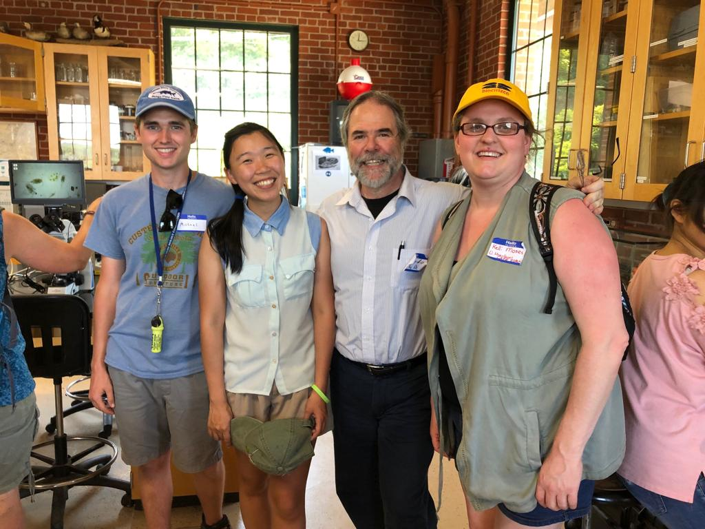
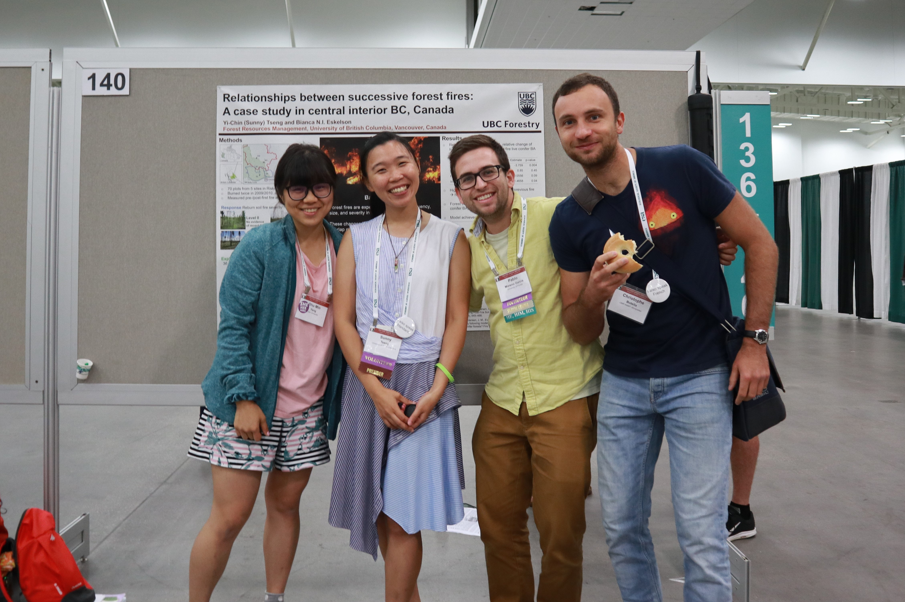
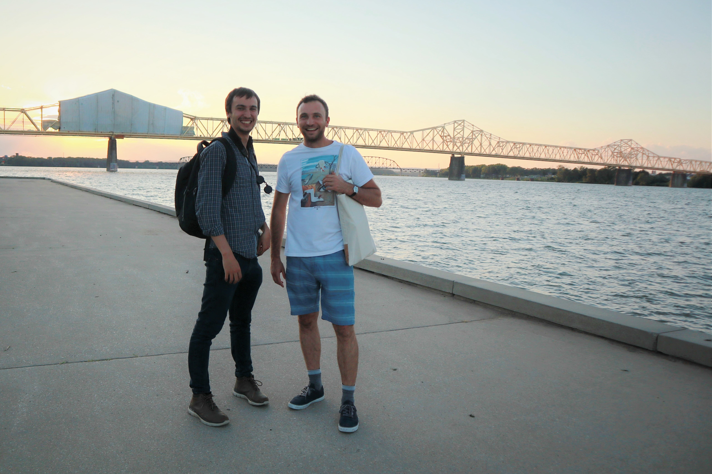

#### # I
這回千里迢迢的飛到了美國東岸的小鎮，來到了一年一度的生態學盛事。參加研討會，最讓人興奮的莫過於巧遇舊朋友、認識新朋友了。本日最經典，莫過於這位照片裡右二的阿伯。

我:「阿伯你是從哪裡來的?」(搭訕模式開啟)

阿伯:「我從智利來的喔，就是那個在南邊很長的國家。」

我:「哇! 我也有一個朋友是從智利來的喔! 我們在 UBC 常玩在一起。」

阿伯:「他叫甚麼名字?」
我:「Tomas。」

阿伯:「Tomas Ibarra!? 他是我以前帶過的學生! 妳也做鳥類研究嗎?」

整個會議有幾千個人，竟就這樣搭訕到了智利的阿伯，機運甚妙。最後阿伯還說：「Sunny 妳之後一定要來智利錄鳥音，我們這裡有很多很好的鳥類學家，帶著 Kathy (我在UBC的老師，也是他的朋友) 一起，我跟 Tomas 來招待妳們!」。

看來，這個機運必須好好把握啊!!好想去聽聽那在南半球的聲音。

#### # II
今天跟著 Chris 來到他在 Ohio 河畔的 Biology Field Station，這個研究站自1971年至今，已經收集了近50年的野外資料，除了基本的監測水溫、水位、酸鹼值、微生物多樣性，他們也做魚類調查、貝類寄生（Parasitic）等研究。

Ohio river 並不是一條好命的河流，身為美國第二大河流，一路由東北至西南流經六州，治理起來本當不容易。在我看來，這裡與淡水河河口的水質甚為接近。當地人都說，Ohio river 是受汙染的河川，下去游泳的人都會因有害的藍綠藻而生病。最諷刺的是，Ohio 一詞的本意竟是「Good River」，連傑佛遜總統在18世紀都曾寫道「The Ohio is the most beautiful river on earth. Its current gentle, waters clear…」。

Chris 說他現在最想要做的事情，就是教導下一代，Ohio river 會變成這樣並非自然，而是我們造成的，但是我們可以藉由了解生態系的理論、建立制度，幫助河流回到美麗的樣貌。在這裡做研究要懂魚、懂貝類、懂藻類、原生生物，還有河流的歷史與現在的政治，尤其是當他分享他對下一代的願景，那熱情實在令人感動。

真的是非常、非常令人敬佩的一位學者。

PS. 貝類寄生研究簡單來說就是貝類寶寶需要寄生在魚鰓宿主上才能完成 life cycle，而為了幫寶寶們找到宿主，貝類媽媽們又演化出各樣妙招，十分刺激有趣!

#### # III
這次來ESA，不僅要報告、當司儀，還接了一份詢問台的志工工作。後來會議中實在太忙碌，忍不住開始利用上班時間做起自己的事情。那天與一起值班的 Pablo 認識的過程就是這樣的...

我:「我有一個朋友等下要演講，我想畫一張卡片給他。」（混水摸魚）

Pablo:「好啊沒問題，那我們一起來畫畫好了。」（一起混水摸魚）

兩個人就這樣邊進行著詢問台的工作、邊聊天、邊低頭畫畫。一個小時後...

我:「我畫好了!」

Pablo:「我也是喔!」

一看成品，天啊! 竟然就這樣開發了另一個藝術家 Scientist...立馬被列入好友名單。

#### # IV
感謝在早八的 Poster 報告還有好朋友們來捧場。

分享研究成果的同時，想起了去年夏天開著四輪傳動車，走遍70個樣區、親手量過每一棵樣區裡的樹，還記得炭黑的雙手與擾人的蚊子，也記得把老師說不能帶回的樹牌偷偷的撿了一個回來，上面寫著1996，只比我年輕兩年的樹牌。

PS. 最喜歡這些可愛的朋友們。

#### # V
ESA 的最後一篇分享，獻給這兩位帥氣的男孩、我這幾天來的最佳玩伴。

P 來自挪威「University of Tromsø」，是間位在北極圈以北的大學，曾經參與在苔原的野外調查，同時也是個超級birder，這幾天跟他出去賞鳥他總是能以迅雷不及掩耳的速度認出每個物種，儘管他總說他對北美的物種很不熟悉…。C 則是來自法國的浪漫男孩，擅長生物統計與機器學習，專精於物種空間分布的模擬。一聊之下，發現他竟是 Willem-Pier（Xeno-Conto 創辦人）的朋友，使用的研究方法跟我也很近似，實在令人驚喜。

這兩個男孩不僅是非常好的研究學者，更是最佳玩伴，我們約好了下次再見面的時候，彼此都要更加進步、並努力朝著心之所嚮前進。能在一趟會議裡交到這樣的好朋友、遇見各式各樣的人，還意外獲得了（也許）可以前往智利錄音的機會...

此行足矣。

