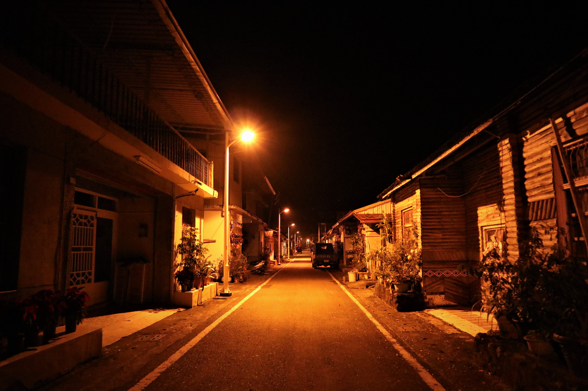

#### # I

After this new year day, my gap year is officially over (but actually three months more). 

轉換身分將近一年，又迎接著新階段的到來，生活像是玩耍一般流暢自然。

Live every moment with courage and hope. It’s not an easy opportunity to be in the human life. 

不論過去在哪裡、現在在何處、未來又留在誰的心裡，擁有的都已經太多。

Every sparks in life would rich your personality, and life story.

我張開手（打開心），連結著所有連結。

#### # II
新年開工至今，那瑪夏、烏石坑、九份二山、塔塔加，七天中有六天都在安靜的山上，不論是新年數鳥，或是野外錄音，對於能夠體驗台灣冷冷的冬天感到深有榮幸。

這樣的冷、寧靜、眾人縮在一團等鳥吱吱叫，是熟悉的。

無意間參與了寒流下、全台最高海拔（!?）的新年數鳥，感謝水雞大大、還有彩鷸學姐兩位主調的帶領，也感謝鳥兒在冷天正常發揮（找不到的還是找不到），學到、也錄到很多吱吱叫的鳥兒。最開心的是，難得可以和這六位好夥伴一起，再次體驗，手被凍到麻掉的感覺（笑）。

照片OS：「聖誕樹都舉起來！」。新的一年也要繼續華麗下去！

