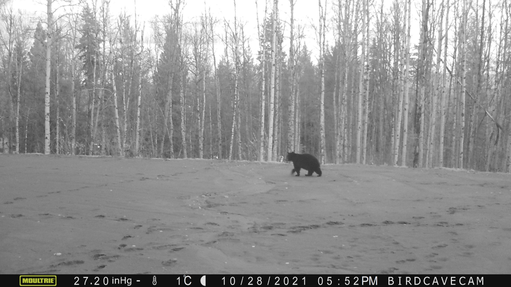
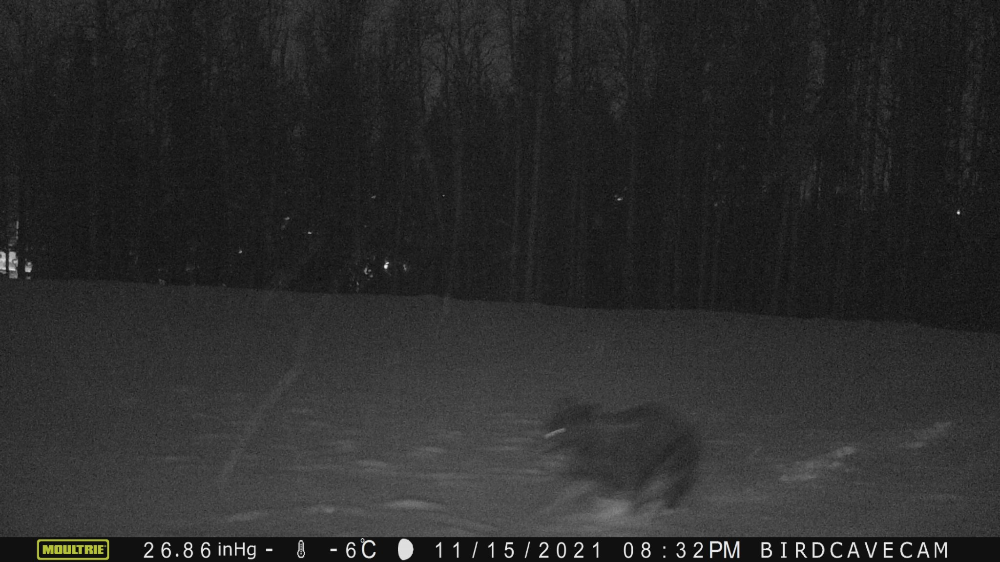
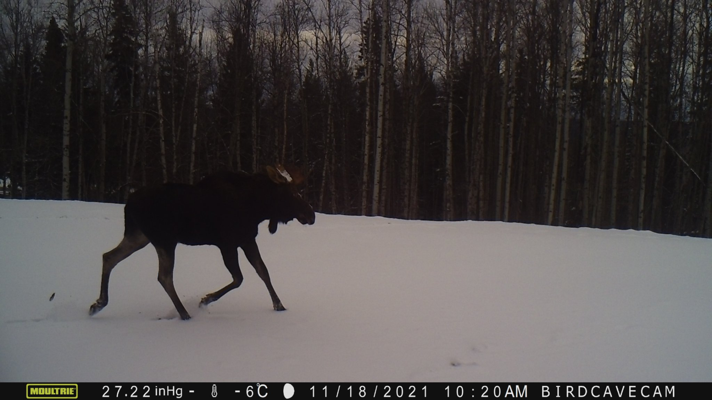
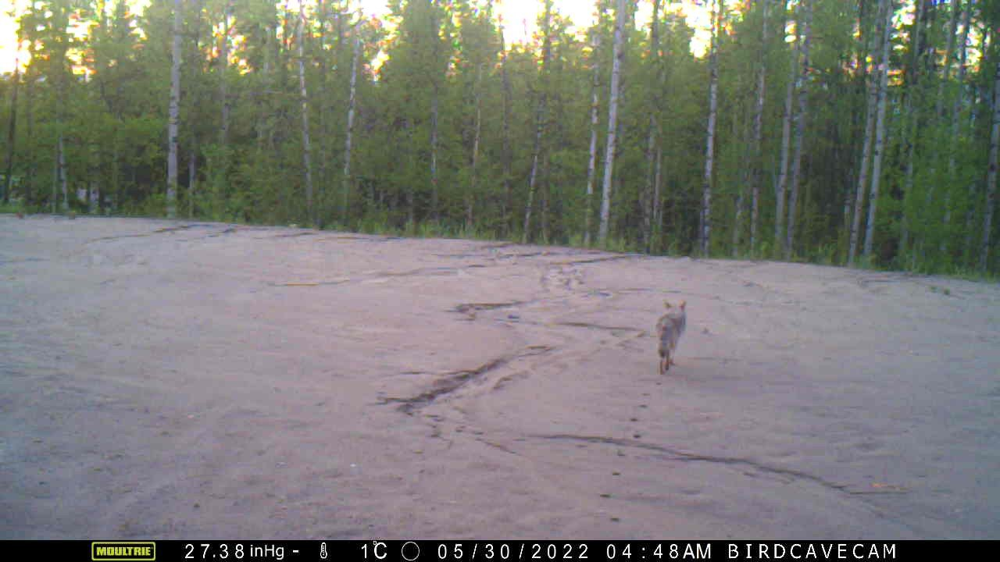
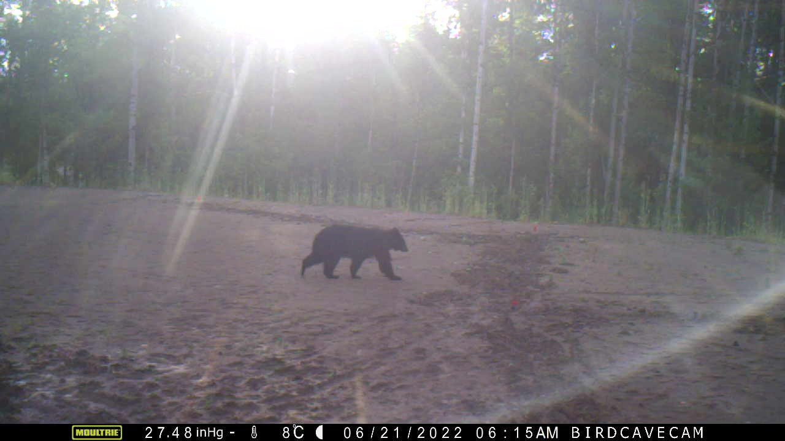
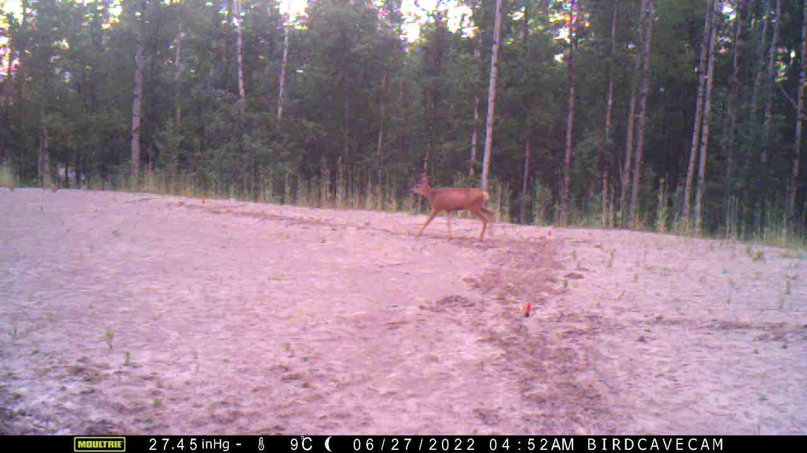
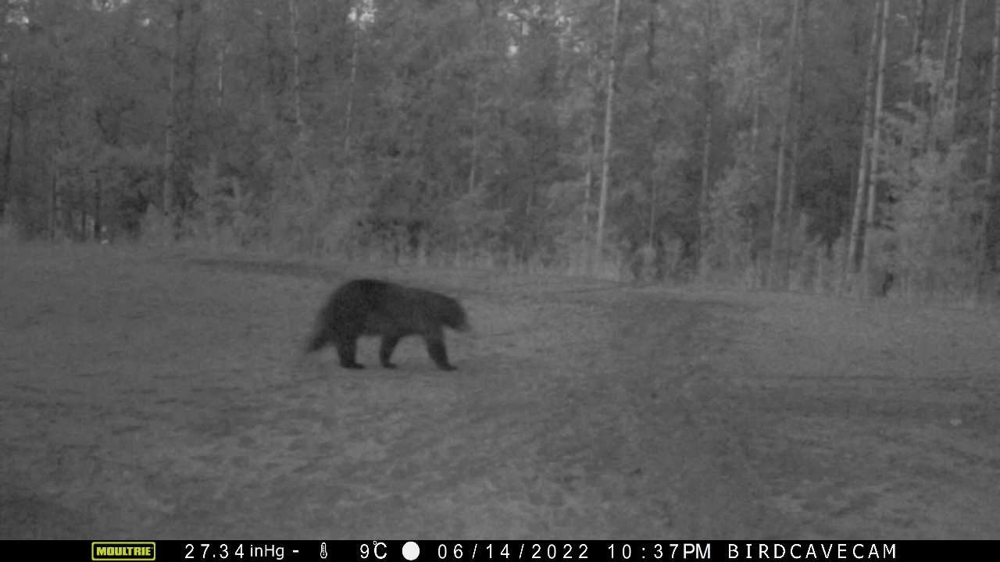
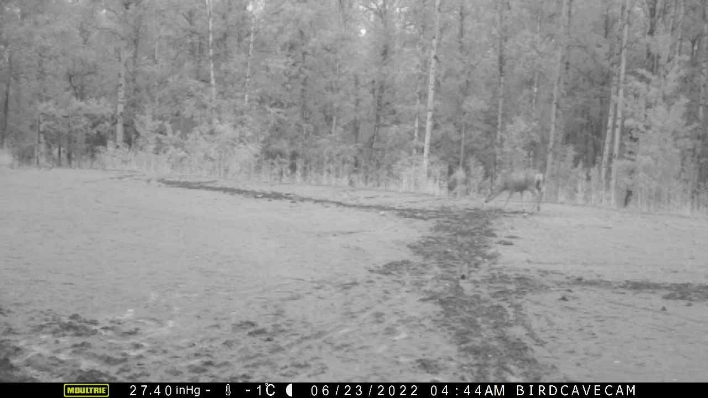

精選一些這些日子來在後院收集到的小精靈們（by 自動相機），因一旁就是整片森林且沒有籬笆，才會有這麼多大型哺乳動物們。

平時常見雪上或爛泥地的足跡，偶爾會有排遺，親自在小鎮裡近距離見過的就只有 Blackbear。注意到照片裡動物的出沒時間，其實都和人的生活很近呢（每次開門都要先左右看看）。

想起有次下雪要出門，地面上驚見一整排新鮮的黑熊足跡，直接嚇得把門關上。

PS.1 整理照片看到去年冬天拍的照片裡，那個積雪之深阿，光看就讓人覺得冷（抖）。

PS.2 後院自動相機正式撤退。

