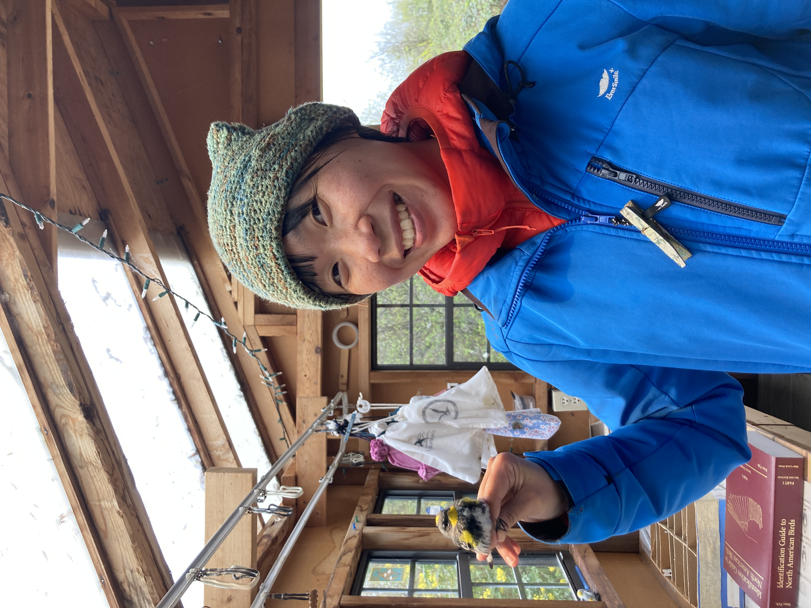
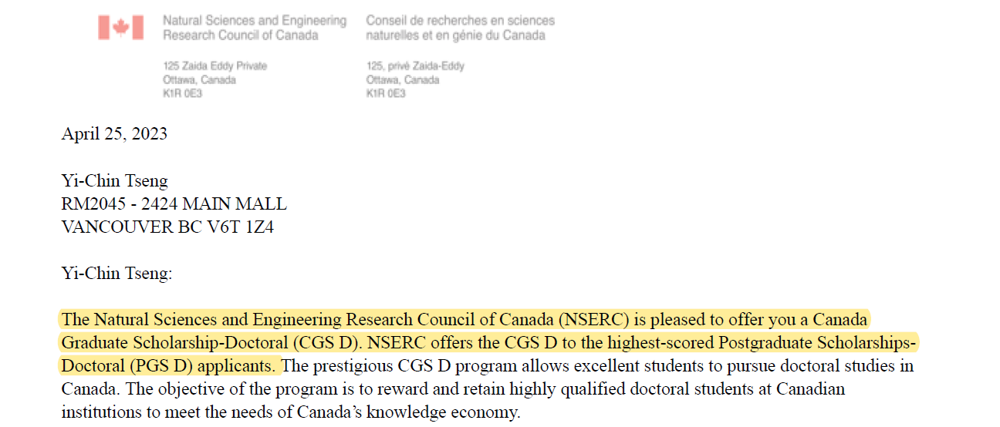
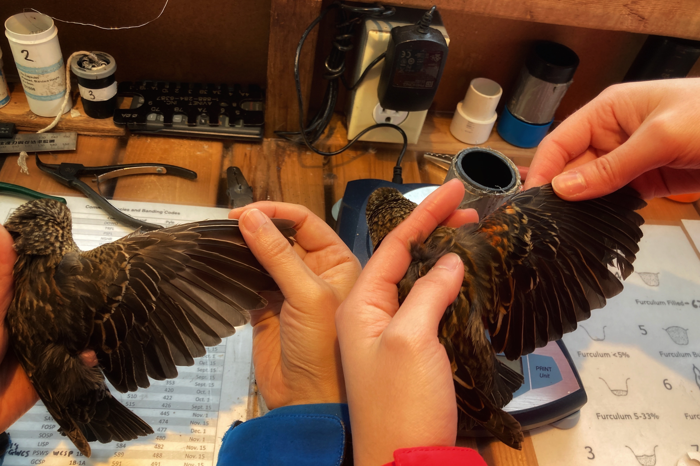
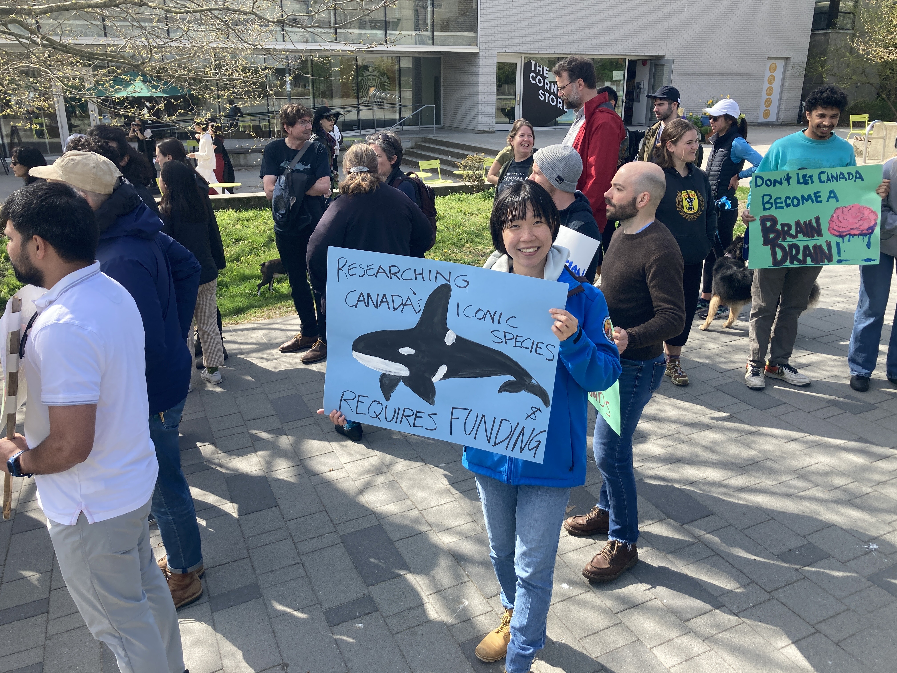
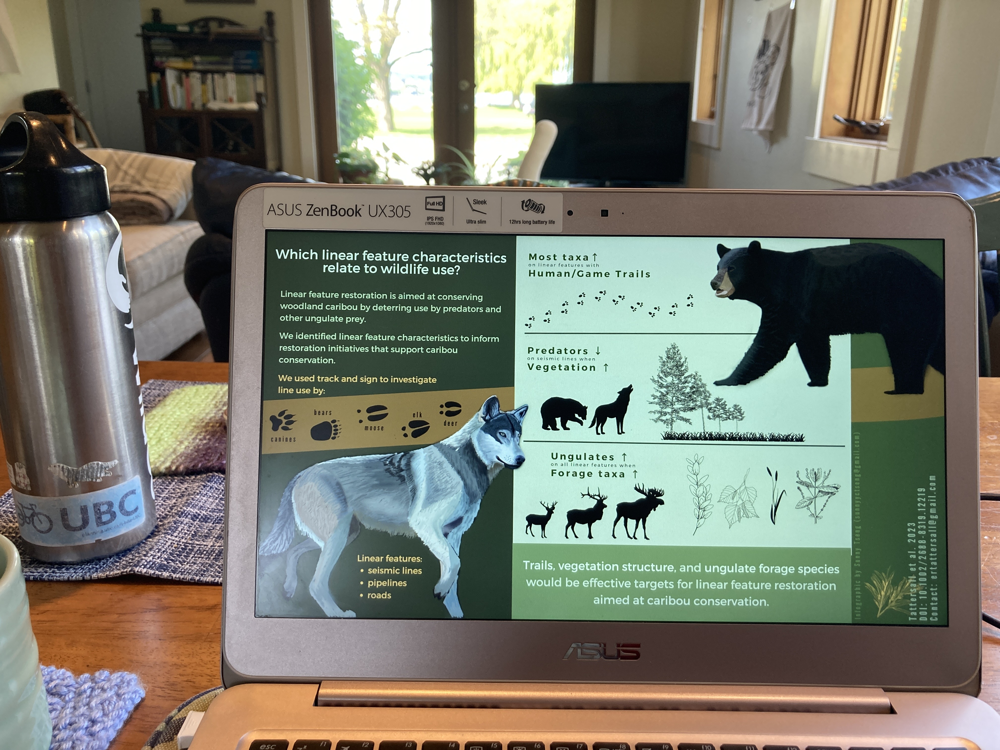
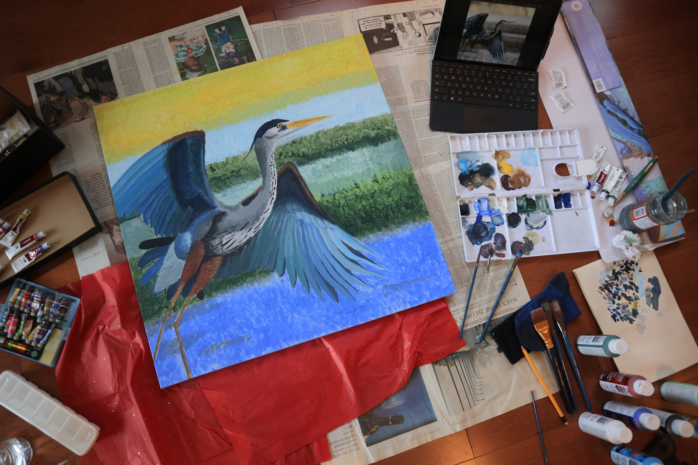
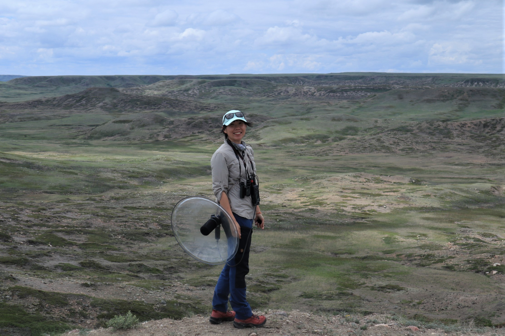
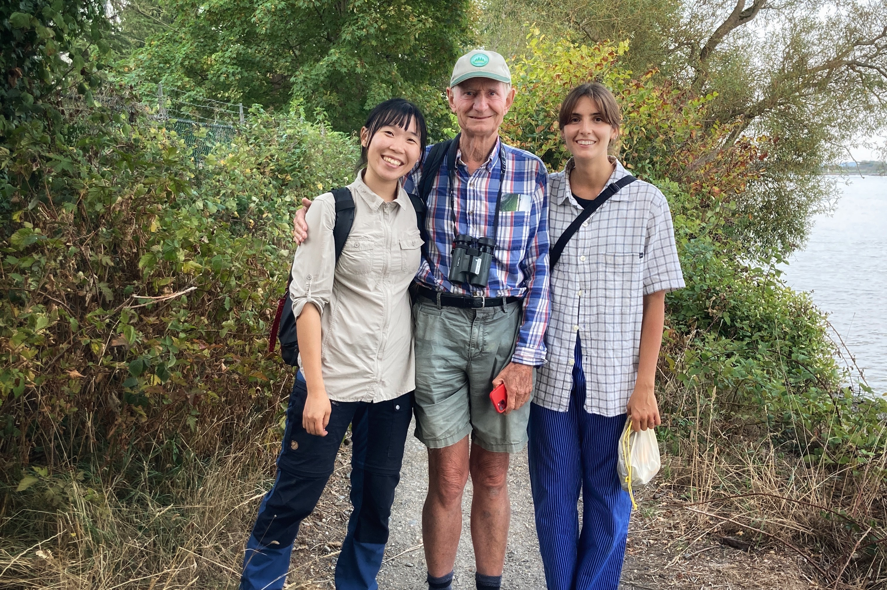
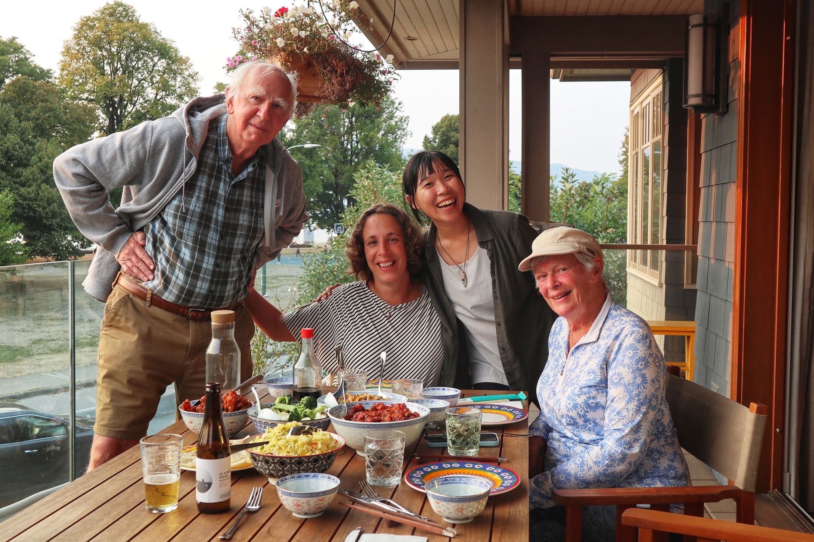

#### # I
久違的鳥兒筆記第三季（?）來啦！隨著北半球鳥兒的季節慢慢來到，繫放、標本、研討會、野外調查、演講、錄音等事項也越來越充斥著生活，累積到了一個不寫下一點東西很對不起回憶的地步（笑）。

第一站就來到好久不見的 WildResearch IIBO 繫放站。

錯過了去年的秋季，這次的春季遷徙趕緊把握機會，清晨五點架網，騎著腳踏車在漆黑的 downtown 穿梭，坐著公車、搭著 skytrain，最後再被心地很好（但回覆訊息很慢）的 Bander in Charge (Julian) 從車站撿到繫放站。整個熟悉的場景撒在眼前。

一到達繫放站就收到 Assistant Bander (Sean) 傳來訊息，說有張網鳥很多需要支援，「Are you comfortable doing extraction?」Julian 轉頭看我，一口答應，幸好我接到的鳥兒們都很配合，肚子都乾淨的露出來不太掙扎，當場下著點小雨，有點冷但手還是溫暖的，讓解鳥的時間壓力小了很多，當慢慢從鳥的腳、右翼、左翼、頭解下網時，那個感受非常幸福啊（笑），然後就在到達繫放站的十分鐘內解了兩隻鳥，也在本季第一次到繫放站就幫鳥上腳環量測。真的很喜歡、非常喜歡這裡的 Banders 互相信任、互相學習的關係（畢竟我的繫放也是在這裡學起的），接下來的繫放會越來越順手的。

今天總共抓到 37 隻，個人最愛是 Golden-crowned Kinglet，最驚喜的則是 Rufous Hummingbird，我不會解蜂鳥，一看到馬上 pass 給別人（笑）。唯一的回家作業就是要多讀書，那些 Complex Basic Strategy 還有 Complex Alternate Strategy 的 diagram 要再來貼在牆上啦。Such a wonderful beginning of the season!

PS. 和 Julian 還有 Sean 聊天，鳥類的圈子真的很小，一下子就發現許多共同好友，過去在 UBC、UNBC 還有在 Birds Canada 打滾過的經驗都會把鳥類研究小圈圈的人們連結起來。

#### # II
結果寫到第二篇就離題（笑），但也是因為鳥兒研究而申請到的 Scholarship 應該也不算太離題吧。

就在剛剛，得到Canada NSERC 的 Canada Graduate Scholarship – Doctorial (CGS - D) 啦！收到訊息一整個默默地尖叫（？），跳起來繞房子跑三圈，然後打電話給朋友通知好消息。

這個 NSERC CGS-D 是加拿大政府提供給自然科學領域博士學位的最高獎學金，直接 fund 整個學位的年數，只有加拿大公民或擁有永久居留權的人申請， 基本上就是要跟所有加拿大的當地學生競爭的意思。去年底申請時本想碰碰運氣，沒想到一路通過學校初選、送到全國，今天就收到好消息啦（啊～）一整個興奮到不行，難以言喻的興奮啊，特別是在一個越來越像家的國家，慢慢的被認可、被包容、被需要的感覺。

博士班絕對是世界上最幸福的工作之一了（當然需要機運，更需要努力）。能夠自己發想研究、設計調查、又能夠被社會支援著並需要著，覺得能在這裡、跟這群人一起工作實在太幸福。常常覺得自己獲得的太多，真的需要努力學的地方也太多，只能盡力做、盡力分享，並好好享受著。

PS 1. 現在唯一要想的是收到 NSERC 之後原本的 MITACS 該如何處置，學校可能會擋同時收到兩個 major funding 的限制（靜觀）。

PS 2. 申請 NSERC 時用的是 PhD proposal，整本論文都跟鳥音偵測以及鳥類生物多樣性相關，有機會再來慢慢分享 🙂

#### # III
鳥兒豐收日，四月的最後一周，光一個早上就收了一百多隻鳥。

架網、開網、巡網、解鳥、上腳環量測。一項一項的都慢慢地越來越熟悉，而今天也獲得了一個人生第一次 – 第一次解上網的蜂鳥（hummingbird）。以前看到蜂鳥都直接 pass 給別人，想說這麼小又這麼脆弱…今天第二輪巡網時剛好只有我一個人，差點錯過這隻亮橘色的 Rufous Hummingbird，實在是太小太像落葉了。沒有退路的狀況下只好自己動手。

解 Hummingbird 跟其他鳥一樣，首要步驟都是先判斷鳥從哪個方向上網，但 Hummingbird 有時會比較難判斷，因為他們太小，有時候會連頭帶翅膀一起穿過網。所幸我遇到的這隻還算和平，只是簡單的纏到一下，小心的用左手三根指頭固定住身體，右手解網，很快就把鳥摘下來了。輕握在鳥兒身上的左手拇指，清楚的可以感受到那強力而快速的心跳，還有身體傳來的溫度。

除了蜂鳥之外，其中一次巡網也遇到 Kinglet 派對，一口氣十幾二十隻 Kinglet 上網，四個人一隻一隻慢慢摘下來，有一隻纏得很複雜，花了我將近十分鐘，不停地跟鳥兒說話幫他保暖。有 Golden-crowned 也有 Ruby-crowned，慢慢的數量越來越平均。小小一隻手中的鳥兒，真的是太多奇妙之處了。

PS. 前一晚到阿寧家住，因為聊天而晚睡（12）、繫放而早起（4），整個作息像是大學期末考前。

#### # IV
拿著別人的研究物種亂入遊行。

在加拿大的研究生是有最低薪資（stipend）保障的，在這裡做研究就像是一份正職工作。薪資的來源除了校內校外獎學金、學生助教、研究助理等等，最重要的部分是來自 faculty member 的政府資金，這筆經費非常重要，在學生的研究調查或薪資需要幫忙時，學校的老師可以自由地動用這筆經費。

但這筆政府的經費並沒有隨著近幾年的通膨而成長，特別是在溫哥華這樣物價高漲的城市，UBC的研究生、博士後儘管做著高品質的研究，有些卻無法在這個城市生活、維持一個家庭的支出。五月一號早上十點，全加拿大各大院校的研究生在各地舉辦遊行，希望能讓政府聽見，政府對於基礎研究的預算需要提高、研究人員是需要被重視的。

第一年剛到 PG時，曾歷過一段 funding 不穩定的狀態，當時正經歷 course load 以及 qualifying exam 多重壓力，一方面在學術上要維持好的產出和表現，但另一方面卻擔心著經費甚麼時候才會下來，完全可以體會經濟無虞對於研究生活有多麼、多麼重要。（幸運的，目前已經有穩定充裕的研究收入，但不是所有研究生都能這樣的幸運…覺得這是一個體制上必須改變的現況，並希望政府能聽到這群人的聲音。）

PS 1. 這張照片非常珍貴，是遠從日本而來的阿謙幫忙拍的。沒錯，人家遠到北美來旅行還把人家抓來一起遊行 XD

PS 2. 然後遊行的當下就認識一樣做聲音研究的新朋友了（認識朋友的好方法）。

#### # V
最近工作範疇慢慢拓廣，除了自己的研究工作外，也開始接案幫忙設計 infographic 啦！

這次是受到好朋友 Erin 邀請，她在 Alberta 北邊針對 Caribou 棲地的研究剛好發表，需要有張 infographic 幫忙推廣研究成果（Infographic 是個用圖像化傳達研究成果的方法，主要的分享對象是非本領域的人，所以資訊要盡可能簡單易懂，且詳盡正確）。對我來說，能夠把新學到的電繪技巧、再配上強大的美編工具，做出這樣漂亮又具有科學性的一張圖真的是…心花朵朵開。再次體會到能夠以喜歡的事情對科學有小小的貢獻有多幸福。

那隻狼和熊，是戰戰兢兢的，花了好幾個小時在螢幕上一筆一筆的畫。

近幾年在加拿大 science communication 的風潮越來越興起，不論是針對一般民眾的講座或推廣工作坊，或是針對在學術圈裡研究人員的溝通技巧訓練，再到 infographic 這樣子非常強大的圖像化溝通的方法。覺得自己非常享受這樣做為橋樑、協助知識傳遞的角色。

PS 1. 這次用到的工具有 GIMP 與 Canva，加上觸控螢幕的電繪。覺得視覺設計真的是個非常吃經驗的工作，要看過夠多漂亮的東西，好好咀嚼消化後，自己才能有直覺去設計。跟寫作很類似的。

PS 2. 連續發了好多篇跟野生動物相關的文，是不是應該改名叫野生動物筆記 XD 可以涵蓋的比較廣一些。

#### # VI
為了某人畫上超大幅的 Great Blue Heron。

一起看完電影 The Notebook 都已經過了夜半，才矇著眼睛送上這幅超大的生日禮物，把稍早一起畫的鶴望蘭放在一起，看了好久才捨得放開。

作畫的過程中，再次體會到畫作中一步一步進展需要的堅持與心意。因為一直近距離看著畫作，有時因為一小點失誤就覺得可能毀了整幅畫。但一直到完成後站遠看...

一直相信畫到最後會變美麗，最後的畫就會是美麗的。

PS. 壓克力的顏色從遠看真的亮麗到讓人心裡一顫。馬拉松式的作品，最喜歡這種帶著特別意義的成果。

#### # VII
三月底，驚心動魄的 UNBC 3MT 初選，還記的窗外下著大雪，零下二十度的天氣，比賽前一天在朋友家臨時抱佛腳，練到半夜十二點才睡。

比賽當天熟悉又陌生的校園，下午一點的比賽，一整個早上都心神不寧，在圖書館找了個自習室不停的計時。2:55, 2:53, 2:54... 練到每次的誤差都在三秒之間才對自己滿意。

幸好有好朋友陪著。Lisa, Ben, Charlotte，還有 Faezeh, Ian, Julia, Hari, Ken。印象很深刻，在台上的三分鐘，其實大腦是一片空白的，時間像是快轉一般，但是在看到台下觀眾專注的眼神，又或是收到一震熱烈笑聲時，又會頓時被拉回現實。

當評審宣布 First Place 以及 People's Choice 的那一刻、全場搖著 Cow bell 歡呼的那一刻、雙手發冷講不出話來的那一刻，才知道得獎的時候可以比演講的當下心跳更快。

照片是上星期代表 UNBC 到 Saskatoon 去加拿大西岸的比賽，共有 16 個來自各個學校的代表，在這樣的場地比賽，真的是非常過癮！從醫學、心理、生物、畜牧、材料設計等等，每個講者都得在三分鐘之內抓住觀眾的注意力，這些人的演講魅力真的是厲害到不行！

最無遺憾的大概就是可以在結尾的時候讓全場觀眾驚艷大笑了，能有這樣的結果已經了無遺憾（樂），都要感謝 M 在觀眾席扮演臨時貓頭鷹。
這裡附上我自己複賽的 3MT 連結，同時大推其他 15 位參賽者的演講：https://www.youtube.com/watch?v=rgn1N6OT7LU...

#### # VIII
兩周前和 UBC 的夥伴們一起到實驗林去換相機，就這麼看到人生第一隻美洲獅啦！

好啦不是親眼看到，但是就在我們到樣區前的兩天，有隻美洲獅就大搖大擺的在相機前的倒木上攀行，走近那根倒木、摸摸上面的苔癬，好像還留著大貓的溫度（想太多），每次收相機的時候確認照片：兩天前的美洲獅、一天前的棕熊、六個小時前的黑熊…

看到這麼近的照片第一反應就是跟夥伴們一起在森林裡大吼大叫（笑），很喜歡這些動物們，但很希望看到他們的時候，是有著安全距離的。用相機看到森林裡的大型生命，是一大享受。

#### # IX
趁著到 Saskatoon 開會的機緣，一路南下到靠近美國邊界的 Grasslands National Park ，習慣了大山大海的 BC，到了加拿大中部一片平坦的草原甚是震撼，Ferruginous Hawk, Western Meadowlark, Common Grackle 等等在乾燥的草原上才會看到的鳥兒，一天見到的鳥種一半以上都不認識，好像來到外星球，再搭配上大片大片的土撥鼠聚落，一隻一隻在草地上冒出來縮下去，遠方再來一隻巨大的 Bison。

當地的牧民和土撥鼠勢不兩立，在酒吧開玩笑說你們在路上撞到一兩隻也沒關係（因為牛隻容易因為土撥鼠的洞穴而絆倒受傷）。我們住的小鎮 Cadillac 只有 98 個人口，小小的非常溫馨安靜，鎮上的人都彼此認識，旁邊比較大的小鎮 Val Marie 的鎮長聽說人很好但不識字（八卦）。每天回家都要好好地做 tick check。

和小夥伴在國家公園裡 Car camping 了一晚，以北斗七星，還有疲憊而興奮的日出結束這回合。

PS. 超適合架棲架的地方。

#### # X
業餘寫手，默默地也寫到《保育季刊》的第三篇了！第一篇寫美洲黑熊、第二篇寫河狸、第三篇回歸本行寫寫蓋房子（！？）。每次在保育季刊發表都讓人好驚豔，厲害的美編都會把文章變得好漂亮（視覺系動物）。

感謝笑語學長捎來訊息叫我趕緊發文（哈），他說他要分享 😊 寫這篇文章最逗趣的就是要給 Cascade 團隊的爺爺跟阿伯們看，他們用 Google translation 讀我的文章，還問我為什麼文章裡有 grandpa（爺爺）, uncle（阿伯）, princess（公主），甚至還要用 kungfu（功夫）來做鳥屋，簡直就是要寫一個迪士尼劇本。我整個無法解釋、被問到啞口無言（大笑），再一篇非常可愛逗趣的小寶貝。

以下節錄片段，全文請見留言連結。

“在臺灣的生態人一定對於「猛禽棲架」這個名詞再熟悉不過，猛禽棲架是在2017年由屏科大研究團隊首次在臺灣應用，利用猛禽喜好站於高處的習性，架設棲架吸引猛禽進行生態防治已然成為熱潮。然而，就在臺灣太平洋的另一端，溫哥華，這裡也有一群人正利用洞巢鳥需要大型巢穴的特性，來吸引猛禽至特定地點繁殖，這種猛禽就是倉鴞(Barn Owl；Tyto alba)。倉鴞是誰？吸引倉鴞來人造巢箱居住繁殖，對於該物種、對於生態又有甚麼樣的價值呢？讓我們繼續看下去。”

#### # XI

最美的夏天，就是有爺爺奶奶，跟溫暖的陪伴們一起。

