#### # I
帶著美美的海報要出發啦。這次卯起來把學術海報當成幫客戶的 infographic 來做，看著電繪的筆觸大圖輸出後真的有莫名的滿足感，每看一次就暖一次。

然後，跟 Derek 爺爺介紹海報的時候就立馬發現打錯字（玻璃心碎），爺爺還笑我「妳字已經這麼少怎麼還會有錯字」（哭笑不得），好啦，30 跟 13 應該差不多吧（自我安慰）。

P.S. 一早五點到機場，有鄰居大姐姐 Philippa 相送備感溫馨。

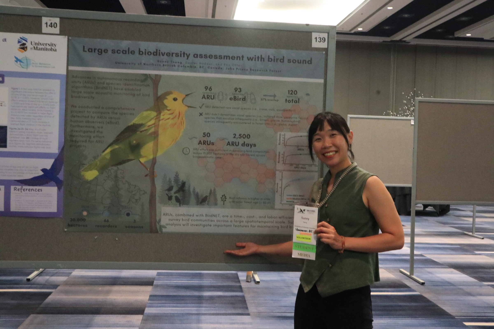

#### # II
近幾年仗著只要出差（參加會議、野外調查）都會有學校全額補助的緣故，在不熟悉的城市都會開始搭計程車往返機場跟開會地點，非常的方便而迅速，又不用做什麼功課（要怎麼付款、怎麼搭車、在哪裡轉乘）。

來到 Toronto 心念一轉搭上火車，沿途問路再當個當地的初學者，久違的旅行感頓時升起。拮据的旅行很幸福（明明只是搭個火車也能有這麼多感想）。

然後就在出外靠朋友的世界裡在異地與朋友相聚，覺得超幸福！

P.S. 話說跟 Ontario 頗是有緣，去年的大型會議也是在 Toronto，過上了夢幻而奇妙的五天。

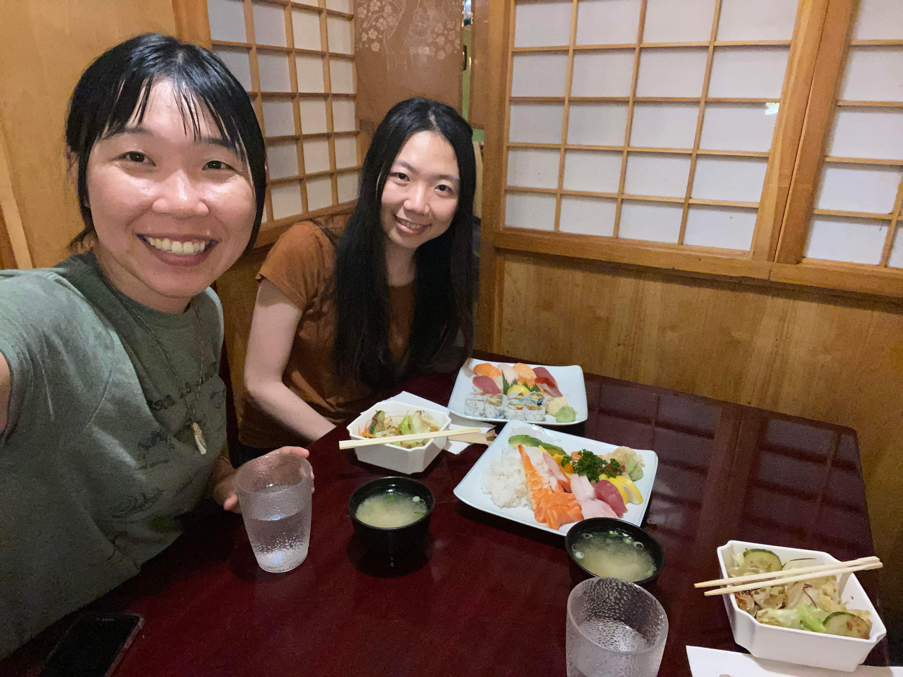

#### # III
今天是朋友日。Jasmine 的晚睡和我的西岸時差剛剛好調在一個完美的中間點，一起起床到 Toronto island 上享受紐約沒有的空曠綠地和乾淨沙灘，本來想游泳耍帥但立馬被救生員叫上岸（汗顏），回程的高中小妹妹開船超快讓我的帽子差點就永遠留在 Ontario Lake。

竟然找得到放了真的芋頭的芋頭奶茶。

帶著道具海報默默地亂入 Jasmine 的會議當擺攤小天使（偷偷摸摸），偷偷聽了幾秒生物統計的 oral，完全不同的領域真的超級帥氣。能夠跟朋友這樣一期一會互相打氣真的是…最最最暖心的事情，一直說一直說好像有說不完的分享，說再見的時候還是一樣的不捨（泣）。

坐上往 London 的火車，右邊的藍色衣服女生從上車就開始打開 word 寫 paper (字裏行間穿插著 ”citation” 字樣)，想必也是要去一樣的 conference ，開始有會議要開始的真實感了 ：） 

接下來是 social 技能要點好點滿的一週。

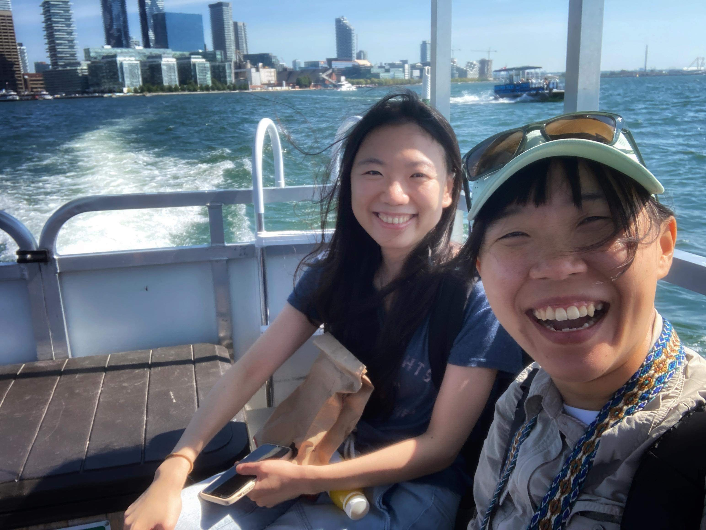

#### # IV
雖然上網查了 London 是個有著人口將近四萬的城市，但一早六點半走到開會地點時那個冷清程度，不禁讓人懷疑。

早上從 Airbnb 的公寓下樓，長長的階梯接到紅磚牆的道路建築，立馬被蜘蛛網網了滿面（立馬清醒）。下午到街上採買也是流浪漢與衣衫不整的街道樣貌。想起以前去過的小鎮們、想起 Prince George，住慣了溫哥華習慣了西岸的安全常會忘記小鎮裡的貧窮與艱困。

#### # V
第一天就開始體認到鳥類圈子有多小。Field trip 到處找人家搭訕，結果找到一個在 BC Birds Canada 工作的人（磨刀霍霍）。

Me：「I used to work in Birds Canada with David Bradley.」

Y：「Oh Cool! I am working there with him now.」

（到這裡已經很巧了，能和一個陌生人有個共同的朋友）

Me：「（覺得眼前這個人有點眼熟）Wait… were you in a birding trip in Boundary Bay 2 years ago? With Birds Canada people?」

Y: 「Yes! I was there! With David and Catherine! I remember you now! We saw a Long-billed Curlew at that day! 」

也太巧了吧，而且兩年前偶然一起賞過一次鳥還記得彼此（然後 Y 還記得當天看到什麼鳥），到底是什麼樣的記憶力。然後明明都在溫哥華卻要到加拿大的另一邊才在相認（笑）。完全不能做壞事的圈子。

P.S. Cardinal & Blue Jay 一次解鎖，閃亮亮的紅色藍色真的美。

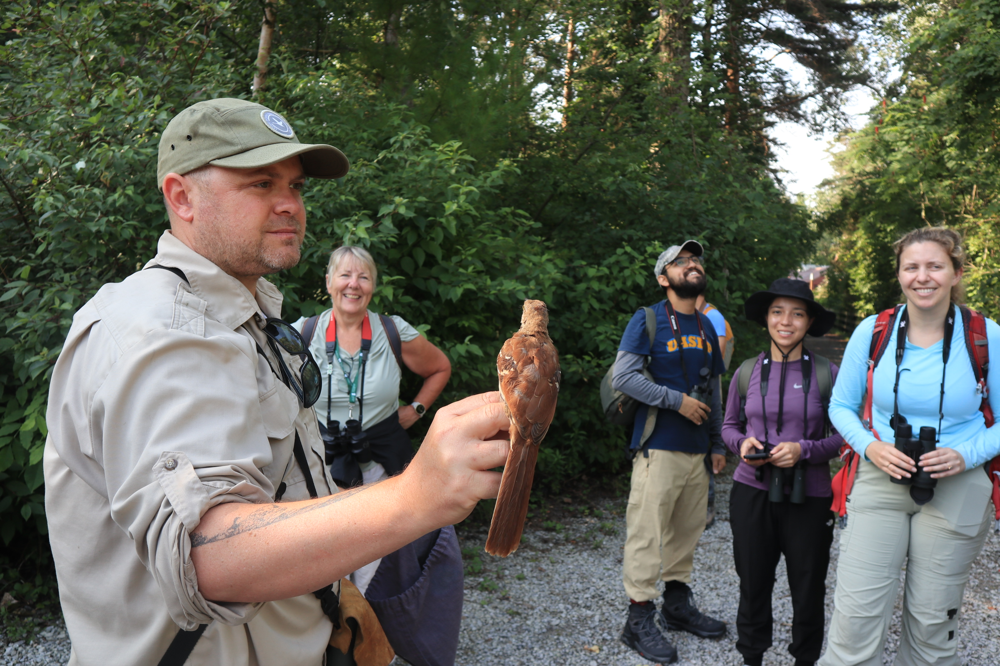

#### # VI
在 London 搭了公車（在這種地方搭公車真的需要點勇氣），等車時遇到一位阿姨搭訕「這裡有停 7 號公車嗎？」，我說不知道，我在等 1 號公車，但這個站牌超簡陋完全不知道有哪些車會停，我連我的車會不會停都不知道。

阿姨轉了個方向攔下了一個騎腳踏車的大叔「喂！這裡有停 1 號公車嗎？」，「有噢！」。

阿姨轉向我「對噢，妳在這裡等，1 號車等下就來了」，然後阿姨就走掉了⋯我愣了兩下才冒出一句謝謝。有沒有這麼好心。

然後收到開會用的名片啦！難得在加拿大可以有精緻美麗的小東西！那個質感也很不錯耶。太開心啦啦啦！

P.S. 在會議裡認識的第一個新朋友是住在德國的奈及利亞阿伯！超好笑超可愛的。

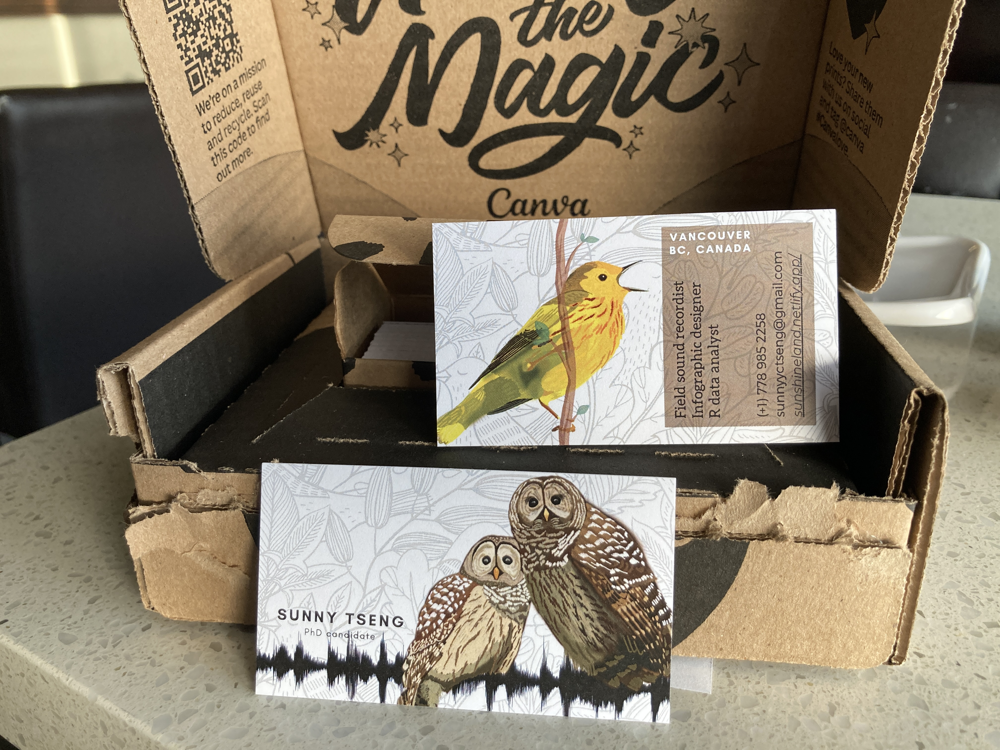

#### # VII
工作坊是目前參加大型會議最享受的橋段之一。 

bbsBayes2 workshop: 在北美享有悠久歷史的 BBS 資料庫，終於在近期有專屬的 R package 做 status & trend 的分析，主要是用 Stan, Bayesian based model 來做，但 package 寫的甚是完好，在一個工作坊的時間就可以學會、跑完一個物種在北美的 status & trend! (最基本的 model)。

看這些 package 的幕後工程師在面前真的無限崇拜！也打算在自己論文裡面用上 BBS 的資料。

依照類似的 workflow 和 modelling process，應該是很有機會用在台灣的 BBS 資料的！如果也能把台灣的 BBS 資料分析做成一個 R package 那真的會非常酷！（不負責任許願）。

Package 的名字叫做 bbsBayes2。

P.S. 紀錄一下人山人海和好朋友們 ❤️

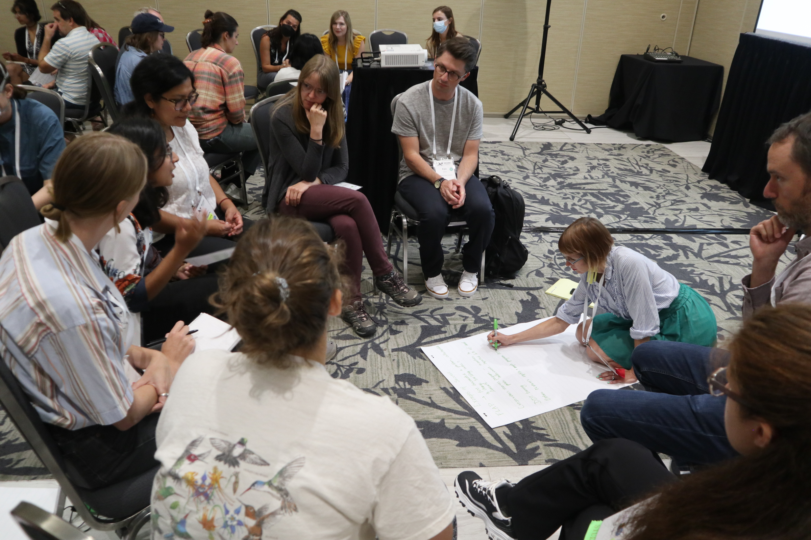

#### # VIII
有太多事情發生了但先私心分享一下今天的 poster session 。是有史以來最成功的一次 poster presentation 惹。把海報做的美麗果然是重點，還有隨身備上名片還蠻好用的。

還收到了來自 Cornell Lab of Ornithology 的人來聽，說他們很開心看到有人在用他們的技術在做研究，還鼓勵說之後可以申請過去一起工作(Awwww) 。還有我的學術偶像也有來聽～（默默遞名片）。

每個人經過的時候偶爾都會收到「Oh this is beautiful…」。講到都沒聲音了但是換來這些 cool connections，超級值得 ❤️ 

P.S. 感謝芳妤幫忙拍的照片～

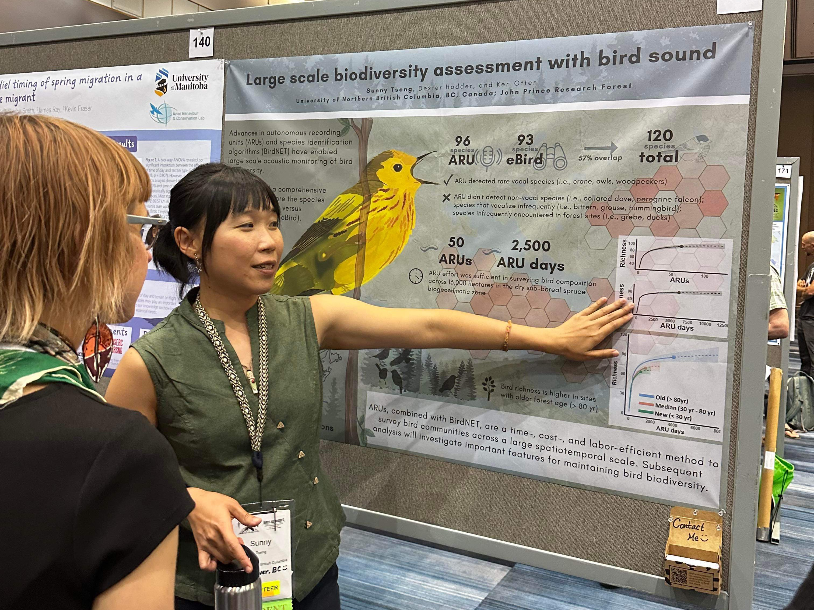

#### # IX
聽障者同時也是鳥類研究者。

兩年前參加 IOC 時認識了一位錄音師，而那位錄音師也是一位聽障者，讓我非常驚艷，聽不到鳥兒要怎麼錄鳥音呢？

這次會議超級有幸可以跟幾位聽障者一起在野外賞鳥，親眼看到手譯員在野外幫忙翻譯鳥導的介紹、解釋鳥的名稱、方向，然後看他們用相機紀錄一張張美麗的照片，看他們興奮地用手語交流著發現，那是個沒有聲音的興高采烈。

身為一個錄音者很好奇他們要怎麼學習鳥音。他們說他們需要大量的依靠視覺，用頻譜的方式來認識聲音。

其實感觸蠻深的，其中一位女孩在野外時嘗試跟我對談，和他們交流時也總是能被誠懇的眼神深深感動。總是能在他們身上多學到、多聽到不曾想過的故事。

P.S. 其中一位女孩說，像是這種學術會議報告，如果能開上自動翻譯字幕，對聽障者來說會是非常大的幫助。

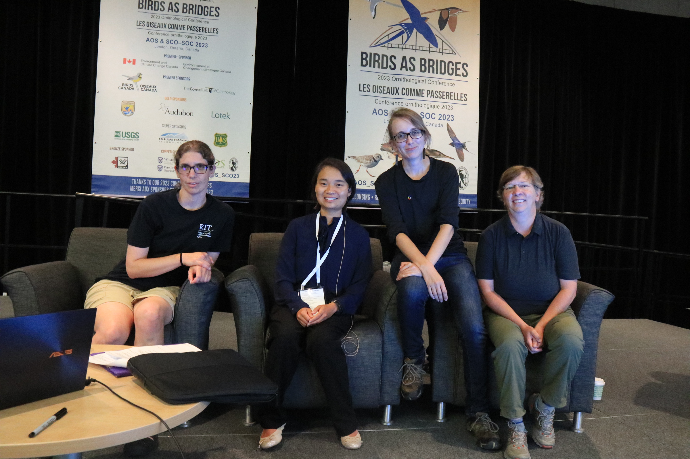

#### # X
大概是這場會議（學術上）收穫最多的一場 Seminar 了，整個加拿大有在做聲學的人大概都在現場（超級興奮）。記個幾個重點：

- 加拿大的主要聲音資料庫 Wildtrax，現在已經結合 BirdNET，只要研究者上傳 ARU 資料馬上可以由 Wildtrax 遠端辨別物種。

- Cornell 發展的 Raven Pro 現在也結合 BirdNET，也是利用簡單的介面很快就可以分析大量聲音資料。

- 加拿大有 50 個物種已經有偵測的鳴唱密度與物種隻數的回歸，從這裡就可以用 ARU 資料來推 abundance。

- Canadian Wildlife Service 有做 BirdNET 的準確率檢測，他們現在用的 threshold 所有物種統一是 0.6。

一結束馬上衝上去要了聯絡方式，發現講者因為用過我在 xenocanto 的錄音，知道我的名字（笑），世界超小。

PS1. 默默 tag 鳩，覺得台灣的 SILIC 和加拿大的 Wildtrax 性質很像。

PS2. 這篇要好好讀：Artificial intelligence (BirdNET) supplements manual methods to maximize bird species richness from acoustic data sets generated from regional monitoring

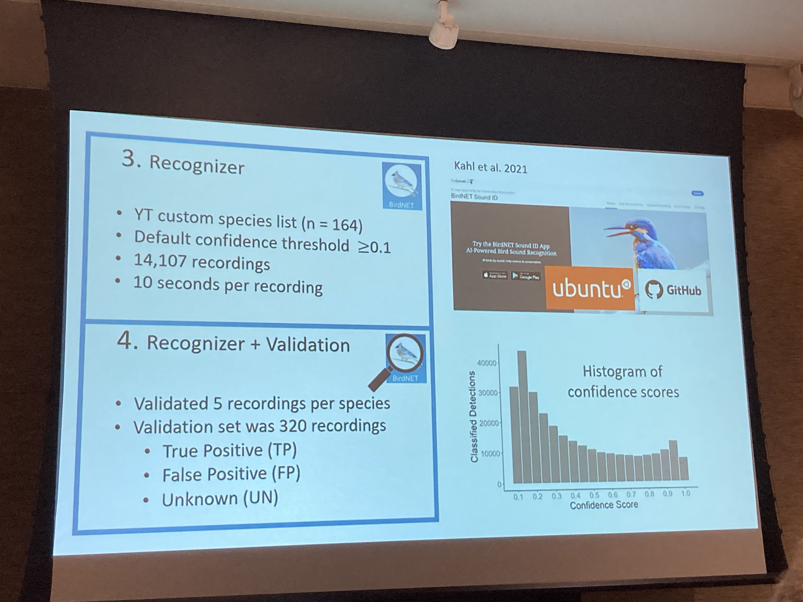

#### # XI
參加學術會議是個燒腦又燒體力的工作，而且主辦單位永遠有辦法讓你更累（笑）。

像是要大家早上六點起床跑個 5k 回家洗澡後再回來繼續聽演講 social，之類的。

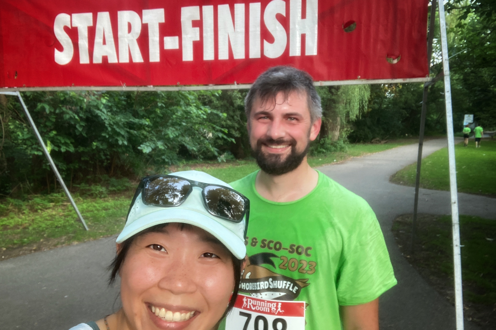

#### # XII
一起認真工作討論研究，也要用力玩在一起。

最後一晚是音樂和舞蹈的夜晚，台上的樂手們都是道地的鳥類學者，像是小提琴手 Alice Boyle，我不知道讀過幾篇她做 elevational migration 的研究，現場的都是學術研究精湛的人們。

現場的歡樂氣氛連肢體不協調的人們（i.e., 我）都可以跳舞跳到腳痠然後流汗到不行（笑），覺得社交舞真的太可愛了！感謝有好朋友 Betty 陪著～

一起開心一起笑著，比舞技或什麼的都重要。

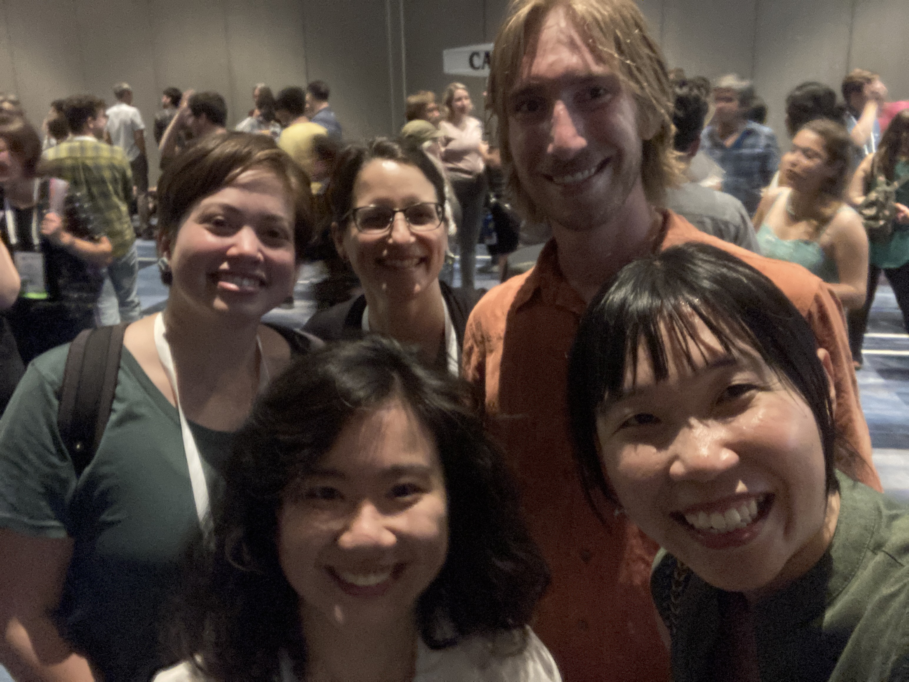

#### # XIII
醞釀了一整個星期，終於來到這場閉幕的 storytelling event! 是場沒有 parallel、聚集了所有 participant (目測三、四百人)的大場合。

能站在這樣的大舞台上，和世界各地的鳥類學者說上一則在台灣發生的故事，真的很過癮。

出乎意料的沒有很緊張（但有一整天的坐立難安）。鎂光燈照在身上，除了前排以外，其實看不清楚台下觀眾的臉。對我來說最享受、最動人的，就是放上我的錄音的那 15 秒，全場數百個人極致的安靜，想像鳥兒就在我們眼前飛過。真的太美了。

演講後，有好多人來，說這完全就像一場 Ted talk 等級的演講。而我呢，上台前其實只想著台下有好多我熱愛的人們，我想跟他們分享我的故事，簡簡單單的初衷。

PS.1 下台後獲得了好多擁抱、好多微笑，說著 “congratulations“，說著故事的畫面彷彿就在眼前。抱著每個人的時候自己也快哭了。想著，就是這些溫暖的人們，才會讓我在這個小小的圈子有滿滿的歸屬感的啊。

PS.2 發現大家都會笑在很意外的點（笑），我在台上都會困惑「咦，原來這很好笑嗎」，然後我精心埋藏的笑點都會一陣安靜（惑）。

PS.3 台下的大家，大多來自加拿大、美國的鳥類研究學者，有來自 Cornell Lab 的、做全加拿大鳥類資料庫的、聲音監測的、發展 R package 的… 🙂

#### XIV
像大姐姐的存在。

和 Steffi 的緣分在兩年前就開始了，而終於在這次會議親自見到！兩年間互相在彼此的場合幫忙講了 virtual workshop，還當了為期數個月的筆友，好幾封親筆書信在加拿大兩岸往來，寫季節、寫工作、寫心情。

開會第一天跑去 Steffi 的 workshop ，她一開始還認不出我（笑），見筆友的心情非常幸福，現場看著她分享工作成果也真的讚嘆不已。

我演講完後她也跑來給了我大大的擁抱（都快哭了），不論是在人生上或是學術上都是好夥伴，也是讓我好想學習的榜樣，未來也一直會是好夥伴。

照片是最後一天我們都在音樂晚會上跳舞跳到全身汗（笑）。

PS. 在一場聚餐她幫忙買了單，她說，「This is what we do for students. You will do the same in the future.」會好好放在心裡，好好記得，要開心的，把擁有的也分享出去。

#### XV
完美的一週。一群人在一起總是會有做不完的好玩事情。

有開會累到不行但每晚都會一起看攀岩比賽的室友、有在線上見了好多次面而終於親自見到的筆友、有新誕生的學術偶像（誤）、有從碩班就認識到現在的老師、有一起跳舞的好朋友、還有新認識的好朋友們。

滿滿的收穫寫在筆記本裡、留在照片裡、存在心裡。也會把滿滿的動力化成行動，有太多好玩的事情等著做了！

但在做任何事之前，先讓我好好補眠一晚（躺）。

