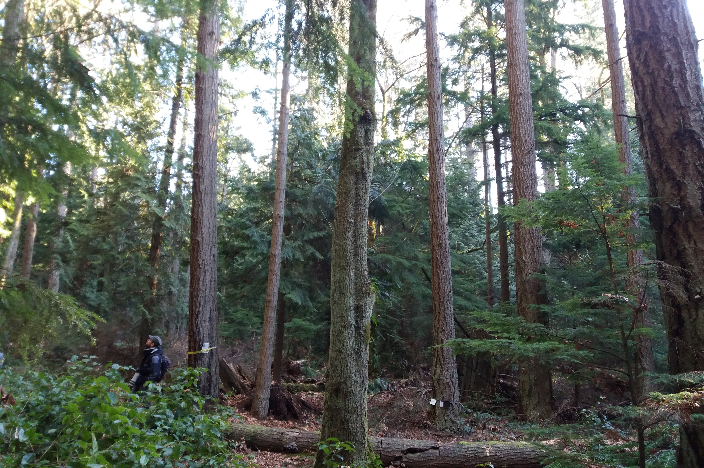
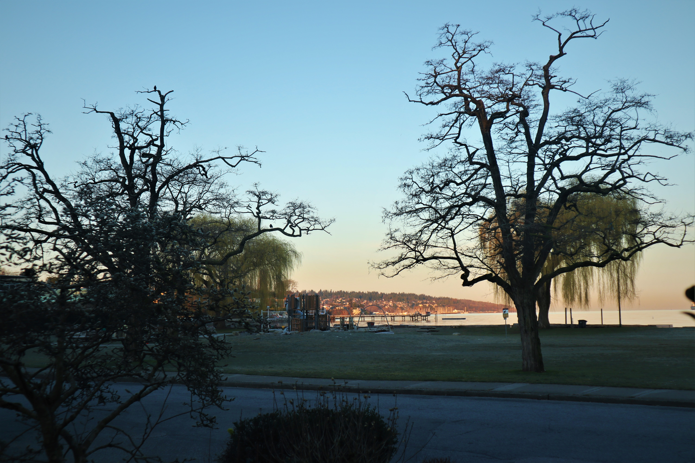
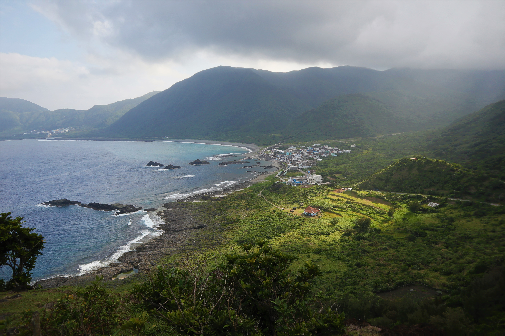

#### # I

昨天（3/17）加拿大宣布封邊境，除 citizen 或 PR 其他禁止入境，UBC 也建議國際學生返回原國家，台灣對加拿大的旅遊警示直接升上二級。目前 BC 確診數 103, 光前一天就增加了 30 例。

學校。上週三（3/11）特地請了假回學校去收信（因為持續搬家所以我的地址一直放 UBC 的），當時學校還一切如往，學校正常上課，路上也完全沒有人在戴口罩，大家口頭上會說「亞洲跟歐洲那邊好像很緊張」，但這裡的人 party 照開、聚餐照聚，好像這件事情是在火星發生似的，還說研究生才不會被病毒影響。只是兩天後，北溫出現社區感染，UBC 直接宣布 3/16 起全面線上教學，3/18 教職員工及研究生避免到校，系辦等也會線上進行作業。

政府。加拿大政府在防疫真的是慢了好幾拍，樓下的美國都在風風雨雨了，政府還是堅持不守邊境、不限制入境、只宣導但不強制十四天隔離。兩天前BC確診數扶搖直上，大家都開始緊張，我還跟朋友抱怨，我們這裡學校關了、滑雪場關了、大型活動都禁止了，機場還是沒有動靜，一個國家都沒有管制，等於是放任門戶大開，讓人看了又急又氣。Trudeau 當時還在鐵齒說我們目前就算沒管邊境疫情還在掌握之中。結果 3/17 一覺醒來就發現邊境被關了…真的是一開始都不動，一次就全關（苦笑）。

工作。也差不多是五天前，我問 Boss 能否把資料搬回家在家工作？他歪了頭想了三秒說不太好，還是來辦公室吧。我說好，結果昨天戰戰兢兢地搭了一個小時的大眾交通運輸工具到辦公室，馬上就被開車來的同事罵，說為何妳現在還要來。她說 Boss 自己都在家工作了，沒有理由我要繼續待在這裡，立馬幫我打電話給 Boss，馬上獲得從今以後在家工作的指示（笑）。同事還很有義氣的直接把我載回家，告訴我不要再搭公車了，這種時候遇到這樣的義氣相挺，真的是感動到不行。

生活。美洲這裡的情況大家應該都很明瞭，衛生紙、廚房紙巾、消毒水等等該空的就全空。前幾天本來想囤點米跟麵，也是差不多全空了。那天戴著口罩到超市採買，還被當地女生用嫌棄的眼神觀看，真的很想跟她說，妳怕，我也擔心阿。現在是非常時期大家就多體諒一些吧。

朋友。我們家房東目前正在山上度假，知道邊境封鎖的消息馬上捎來關心，問我接下來要如何打算，我說，應該會把事情安排好盡早回台灣了，我在訊息裡打了「Never experienced this kind of thing in my life.」他回「Your life? Also in my life which is a good deal longer! This is totally extraordinary!」，覺得 Derek 阿伯有種莫名的正向能量。

雖然一離開加拿大短時間內就回不來了，但考量各種因素下還是覺得回台灣比較有保障。本來預計五月初回台灣的班機，也會改早了，就算回去也會自己好好自主隔離，不要帶給大家麻煩。接下來的野外調查行程，會再繼續評估（雖然我覺得有 87% ...）。

PS. 照片是一個月前和朋友到北溫爬山時所攝，當時我們都還無憂無慮的呢，現在我們去爬山附近的 Lynn Valley Care Home 已經有三位確診死亡案例了，真的不謹慎不行。

#### # II

真的是每天都是心臟大考驗，一早打開電腦手機都好需要勇氣。決定寫點紀錄給大家。

給在台灣的朋友們。

就如中央流行疫情指揮中心所說，昨天台灣確診 23，也預計這幾天是機場人數的高峰，很多在國外待不下去的、覺得不安的、或是旅遊回來的（不解釋），都有可能這時候回到機場，請已經在台灣的人千萬要注意小心。現在政府已經全面實施「所有入境者: 居家檢疫14天」，意思就是，如果你有朋友最近剛旅遊回來，你是不應該在14天內見到他/她出現在居家以外的場所，也拜託要互相提醒這件事的嚴重性。現在出門在外也要提高警覺了，隨著人口移動複雜，口罩能戴則戴，勤洗手少摸臉。

給計劃要回台灣的朋友們。

照顧好自己絕對是照顧好身邊的人的第一要件。各國機場大概是病毒濃度最高的場所，千萬要小心注意，以下就列幾點我想到的。提前確認班機check-in，減少在機場等候時間。前往機場、候機、待機時全程戴口罩也避免與人交談。隨身帶著乾洗手隨時消毒，手不要亂摸任何表面。非必要不使用廁所，若真的需要也要盡量消毒環境。上飛機不要蓋航空公司發的毛毯、不要吃飛機餐、盡量不要移動不要使用廁所。下飛機確實申報（很重要！），在國外有台灣手機門號的已經可以事先線上申報（https://hdhq.mohw.gov.tw/ ）。

給要幫忙隔離的家人們。

先給要幫忙隔離的家人們一聲道歉，這時候回來的台灣人真的都會帶給你們生活上很大的不便，但還是有好多需要好好注意的地方。第一個要認知到的是，這時從國外回來的人都不是100% 安全，最好的相惜就是保持距離，然後不要鐵齒，謹慎為上。之前有篇寫得很好的居家隔離 protocol，先附上（https://www.facebook.com/groups/europe.tw/permalink/2780029405448516/ ）。這一步一定要謹慎。被隔離者請記著要跟家人有適當的溝通，請家人在回台前先準備好隔離的步驟與需備物品，這段隔離對保護自己跟保護家人都好重要。拜託拜託多注意。

給選擇待在國外的朋友們。

有太多話想對你們說了… 這段時間大家都辛苦了，也許留到下篇再來談。

最後要說，台灣的防疫人員真的辛苦了，每次看著新聞都會忍不住落淚（我是部長粉絲，討厭的記者請走開），大家都好想要平安度過，但唯有全部人一起才能達成的。我的同溫層大概對這件事情都很謹慎，只希望交友圈廣大的人可以繼續督促大家，讓更多人一起重視、一起守護我們心愛的人。

#### # III

請想想，回去台灣的人，回不去台灣的人，的辛苦。

如果你也曾在那個不安全的城市裡，親眼見到超市的貨物沒了、身邊沒有醫療物資、自己不屬於這裡、被歧視、身處的國家又各種拖延散漫手足無措。如果你也曾感受過生命受到威脅，人與人之間不再信任，連朋友相聚擁抱、連出門散步這樣的能力都失去了。你還會選擇留下來嗎？

如果你知道搭飛機是個高風險的活動，知道一離開就可能要放棄這裡的學業、工作、交友圈，放棄好不容易爭取到的、到國外見見世面的機會，除了小心翼翼好好保護自己之外其他都不能控制，穿著防護衣、雨衣、頭套手套上飛機，一趟 10 小時的班機不吃不喝不上廁所。你，還會選擇走嗎？

部長前幾天說了「國外的這些學生…他們在覺得有危險的時候，唯一想到的，就是他的母國，那母國怎麼可能會拋棄他們呢。」這時候除了理性上一起防疫、每個人都做好自己能盡的心力，體諒與同理心大概就是最重要的、可以將大家放在一起的要素。每個人都有他人不能體會的辛苦，相信大家都是這樣的。

最後還是想要提醒，這兩周是台灣關鍵的防疫時期，因為有大量的人民歸國，居家檢疫是否踏實半憑法律規範、半憑個人自律。要居家檢疫的，請踏實做好。而大家出門在外能戴口罩則戴，勤洗手少摸臉。真的拜託拜託，不要在此時鬆懈了。
最後，給你心愛的人一個隔空擁抱吧，會很溫暖的。

#### # IV

Derek 載我到機場，路上，我們沉默。

晚餐的時候他邀我到房裡看些老照片，其中三張老英式風格的照片特別引我注意。「這是我祖父。」照片攝於 1914 ，他的祖父（母親的爸爸）站在一棟老舊建築前，牽著馬，祖母、祖父的弟弟、弟媳也一樣在照片裡。在攝下照片的四年後，1918，Spanish Influenza 爆發，祖父的弟媳死於此疾病。當年在英國，好不容易撐過第一次世界大戰，病毒的肆虐卻奪走比戰爭更多的人命。「Do you know that flu killed between 10 and 50 million people?」他說，當時感染人數，可是近乎全球人口的四分之一。

「這是我父親。」他指著第二張照片，同樣的建築，同樣的場景，換上 20 年後的人與事。Derek 的父親，經歷了第二次世界大戰。

「這是我。」第三張，2003。他說，自己的人生，比起父親與祖父，是不能形容的順遂與平安，他恰好在二戰的一年後出生，而儘管是 H1N1、SARS 都沒有像現在造成城市封城、國家鎖國。「This is way more serious than all the events that I have experienced.」。

我沉默。

他明知道自己是高風險族群，卻在得知我飛機時間時義不容辭地說要載我去機場，也說加拿大有甚麼事情，他都可以幫忙。是英式的紳士風格讓他如此的嗎？說呢，為什麼，為什麼人心可以如此的善良與體貼。

「Sunny, it has been a truly pleasure to have you stay with us.」往機場的路上沒甚麼車。「I hope we will still be here next time you come back to Canada.」這也許是我人生中第一次感受到，甚麼叫做生離死別。

Derek 用他 70 多年的人生提醒我，我們正在寫歷史。

#### # V

我們為彼此獻上，最真摯的情感。

我大概永遠也忘不了，離開溫哥華的那天，陽光有多美好、多和煦，沙灘上的孩童們輕巧的跳躍著，我站在草地上遠望，一站就是半小時。空氣中瀰漫著一些緊張、一些焦慮，除此之外，一切都像所有那些一般般的日子，這裡仍是那個繫在我心上的城市。那天，恰好是春分。

好奇妙的感覺，本來，應該要是歡愉的，在這個萬物漸醒、鳥兒北遷的季節。一切都太倉促了，焦慮與緊張無法否認，但又必須控制自己，用理性的那面去完成待辦事項。在這時候，落淚是不被允許的，脆弱也是不被允許的。

一上午的時間整理住屋，一下午的時間寫信。我把能留的物資都留下來了，因為我知道在這裡的人們，比我更需要它們；我也把能留下的情感，都留下來了，因為我知道，那可以溫暖別人很長、很長一段時間的。

幾封信裡的祝福、幾幅畫裡滿滿的愛（大概只有創作者本人才能了解，一幅作品裡可以帶著多少情感…）。希望那可以帶給你們溫暖。希望大家都能平安。

PS. 花園裡種下的百日菊，好不容易長出了小芽，好興奮，卻無緣看著它們慢慢長大了。

#### # VI

身為一個錄音愛好者，塞了一行李箱的錄音設備回來似乎也不算稀奇。又，因為行李要跟著一起隔離的緣故，這些天的居家檢疫就成了家中錄音的好時間。

不意外的，Cities and Memory 在近期發起了一個 Project，叫做Sounds from the global Covid-19 lockdown – Stay home sounds。一句話來說，就是邀請世界各地的錄音師記錄城市裡難得的寧靜。近日在錄音的社團裡已經看到很多人上傳封城後的錄音並 comment：「The best noise reduction plugin is human quarantine.」又好笑又無奈。

不可否認的是，這次的事件將成為全世界人的共同記憶，非常深刻的那種記憶，而我們正想用聲音，去記錄這段驚人的歷史。

傍晚時已經將 SM4 設定好放在窗台，藉著時差的優勢，最近也都三四點就起床，用集音盤錄了一些 Dawn Chorus。近期會盡快整理出來與大家分享。

PS. Sounds from the global Covid-19 lockdown: https://citiesandmemory.com/covid19-sounds/?fbclid=IwAR3lV8hoDOUpay97sXk4c9wtri6AG-skptYHhyUbL0V1vEKs2sHvxv-_a3w

#### # VII

如果沒有 COVID-19。

算算這個時間，現在的我應該跟著 Boss 在慶祝兩個月的工作結束，說不定我們會一起去Westham Island 的森林裡錄音。四月中的時候，我不是會在 Brunswick 的沼澤上追捕 Western Sandpiper，就是在 Kamloops 的大草原上小心翼翼的抓 Long-billed Curlew，又或是回到心愛的 Riske Creek 架設野外錄音機。

五月初的時候，我會來到蒙古，跟著 Batmunkh 到西部的 Khovd 繫放站幫忙，那裏的繫放站才第二年開放，恰好很需要大量的人力。我也會趁著難得到蒙古的機會，見見在 Ulaanbaatar 草原上的好朋友，當年可是因為他們才愛上這片宏偉的國度。
然後，就是安排好久的俄羅斯野外調查…（啊，可是兩年前就申請好的計劃呢…）心心念念的北極苔原啊。我的手機封面就是三年前拜訪研究站的照片，我還記得那個被我稱之為錄音天堂的地方，也記得永晝為整片冰封世界帶來的滿滿生命力…我告訴自己有一天一定要回去的，只可惜今年又錯過了（這是最後一個取消的行程，本來一直在想折衷方法飛到俄羅斯，一直到 3/17 俄羅斯外交部禁發所有種類 VISA，才正式放棄）。

現實世界就如大家所見的，要長途移動、與人見面都是高風險的活動。但山不轉路轉，總還是有新鮮事在等著，那些過去的規劃就讓他們發生在另一個宇宙吧。

PS. 突然想到，今天愚人節，是我跟 Peter 阿伯認識滿一周年的日子，如果我還在溫哥華，說不定我們會在花園裡再種上一季的向日葵。

#### # VIII

解除隔離。

當時戒慎恐懼地說要隔離的時候，爸爸特地讓出了他的房間（因為有獨立衛浴），好讓我在家的移動範圍可以減到最小，十四天來除了接機當天，跟家人是連面都沒有見到。我的行李有 87% 都還原封不動的擺在房間角落，回國當天穿的鞋子也在。那天就是一進家門，就把自己跟所有碰過的東西都關進房裡了。我的世界只剩下一張床、衛浴、還有一扇可以看到後山的窗。

原本以為 14 天沒甚麼，對於善用網路的我應該不會有甚麼影響，也在第一天就列下了每日的待辦事項，像是錄音、畫畫、吹口琴、寫作、研究、跟關心好朋友等等，每完成一件就打個勾，慢慢的讓隔離生活步上軌道。但還是沒想到，才第 7 天就開始浮躁，開始會看著窗外的樹發呆，還要把小房間的擺設東移西移想像自己是在一個不一樣的地方。

幸好媽媽總會在送貨餐盤上放些「只能看不能吃」的東西，也會特別傳訊息來說叫我不要把地瓜或奇怪的水果吃掉了（當下聽到還真的想放回餐盤還她），但後來這些小物就變成了桌前的療癒小品。也幸好這幾天來都有好夥伴陪著，讓我的隔離大小事都能有人分享，一起看電影、聊天、看記者會、討論疫情、討論天氣。好幸運即使距離再遠也能把快樂帶給彼此（爸爸說常聽到房間裡傳出「燦爛的笑聲」）。

適才看到時間接近 12 點比跨年倒數還緊張（跨年都在夢裡過的），倒數5分鐘時開始放 Frozen 的 For the first time in forever，2 分鐘、1分鐘，12 點整直接雀躍地把房門大開！

然後，再默默地關起來。畢竟是睡覺時間了，明天還要好好整理搬回自己的房間呢。

PS.1 雖然已經解隔離，但決定自我多加隔離幾天以確保周圍的人平安，加上最近連假結束，外頭氣氛十分緊張。

PS.2 這樣就聽不到溫柔的里長阿姨每天早上九點的電話問候了。

PS.3 健康狀況一切正常，被餵食地很好。

PS.4 天啊，終於可以見到這個小房間以外的世界了。

#### # IX

是的，偷跑出來了。

世界上的疫情正在水深火熱，台灣也是，從一月初過年的武漢封城、二月的遊輪停靠、三月的留學生返台、四月的連續假期人潮。這些日子來最常和朋友講的話就是「世界變得好快」，才一天，身處的城市就有可能風雲變色。

好久沒有搭乘大眾交通運輸工具、好久沒有真實的見到人、也好久沒有與人有肢體的碰觸了，我這樣一個熱愛擁抱的人，給了社交距離就是給了心裡的距離。就在這樣紛亂的時空裡，沒想到竟也幸運的，我找到了一個令我魂牽夢縈的人，記得 J 曾對我說過，「當你開始會對一個人患得患失，大概就是喜歡上了」。

返台後居家檢疫十四天，後來又在家附近多待了一些時日確保自己安全，終於在今天踏上了小小的旅程，想起過去的自己都是勇敢，一趟旅程可以花上一個月來規劃、整理、收集資料。待在家裡久了，連外面的世界長什麼樣子自己都開始懷疑。而蘭嶼這個小夢想阿，如今就將實現。終於有回到台灣了的感覺，對，就是要有那樣混亂中的熱情、炎熱的艷陽、一窩蜂的人潮、還有老舊房子裡的吊扇，伊呀伊呀的轉著。鐵軌上的車廂一路向南，我沉浸在沉穩搖晃的舒適氛圍裡。

真的好久好久了，上次這樣的旅行。

.jpg "")

#### # X

「要平安回來喔。」學長在群組訊息裡這麼說。

不知道怎麼著來的緣分，與孝宇學長跟麗貞學姊總是特別有緣，不像是朋友，倒像是偽裝的小父母，我總覺得自己被他們安妥的關心照顧著。連居家檢疫時都不時稍來關心，還組成了臨時的河烏樂團讓我玩耍。

紅鳩洗澡、熱血羽球、黑翅鳶棲架、天天散步、紅鳩吃西瓜…，每次見面總有好多好多有趣好玩的事情，這兩個人真的很有趣，在一起總是有說不完的好笑的故事，也許是因為兩個人都愛笑的緣故吧。但今天真的是熱到了，第一次覺得，台灣真的好熱好熱，也馬上打消了要在蘭嶼徒步環島的念頭，在沒有適當裝備及準備，還是不要冒險行事好。沒想到這樣就被台灣的熱嚇到了，真不愧是台灣，也真不愧是加拿大的馴化結果。

電扇、微風、熱氣、雜草刺癢、汗流浹背。「我也覺得住在這裡很幸福」。

#### # XI

轉眼間決定回台灣已經一個多月了，回頭看看這年頭的前四個月，充滿意外。

一月，獲得了人生第一份在加拿大的工作；二月，發表了人生第二篇paper；三月，溫哥華成為一個令人緊張的城市；四月，所有野外調查臨時取消，知道甚麼叫做居家檢疫、甚麼叫做戰備物資、甚麼叫做全民防疫、甚麼叫做計畫趕不上變化。而後，遇到了一個眼神溫柔的人，也幸運地找到了臨時的落腳之處。

從搭上編號為 CI31 的班機至今，已經比過去三年加起來在台灣的時間還長。真有趣呢，每次回台灣總有不一樣的感覺，從青春時單純的熱愛、到後來的不適應、再到如今的欣賞。一整個社會要改變應該不是件容易的事，所以變的，應該是自己吧。每天每天的新聞更新，都讓我越來越覺得自己的國家是個不可思議的地方。想起三月中每天起床看新聞的泣不成聲，搭飛機時的緊張忐忑，檢疫時的複雜心緒，到現在已經可以回到以往心理平穩的狀態，從沒想過，光是踏在自己的土地上，就能如魔法般地令人安心。

各種意外，也各種幸運。

前陣子有機會跳進海裡小試身手，才驚覺…上次在海裡看魚，是三年前了；上次被豔陽曬得黝黑，是三年前了；上次細聽蟬聲，是三年前了；上次追夕陽日落，也是三年前了。初認識的 T 聽完笑我說，「妳這三年是白過的嗎？」我大笑，應該不能這麼說，只是很久沒有回頭了，而記憶卻總是這麼容易流逝。

不論如何，在這段「零確診」成為鼓舞代名詞的日子裡，會繼續好好的充實自己，把握每個意外的巧合與機會。然後給自己的小目標是要多認識台灣的小鳥們（握拳）、錄到兩百種鳥音（遠望）、多寫程式（點頭）、還有多上山下海（！？）。

