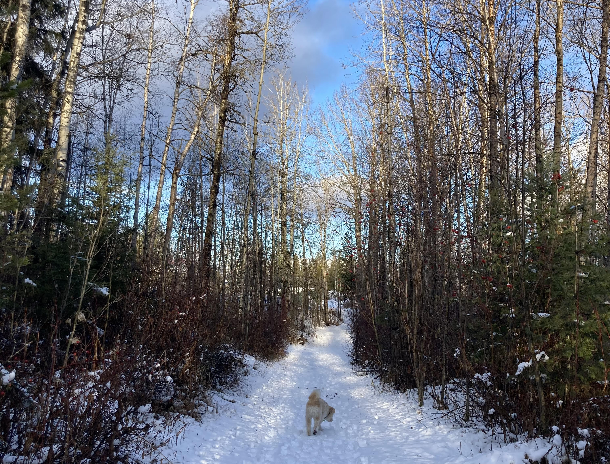
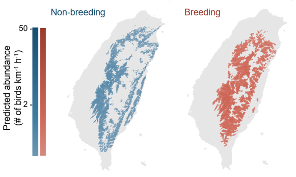
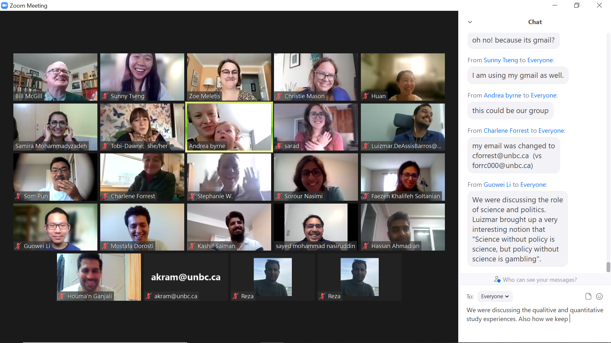
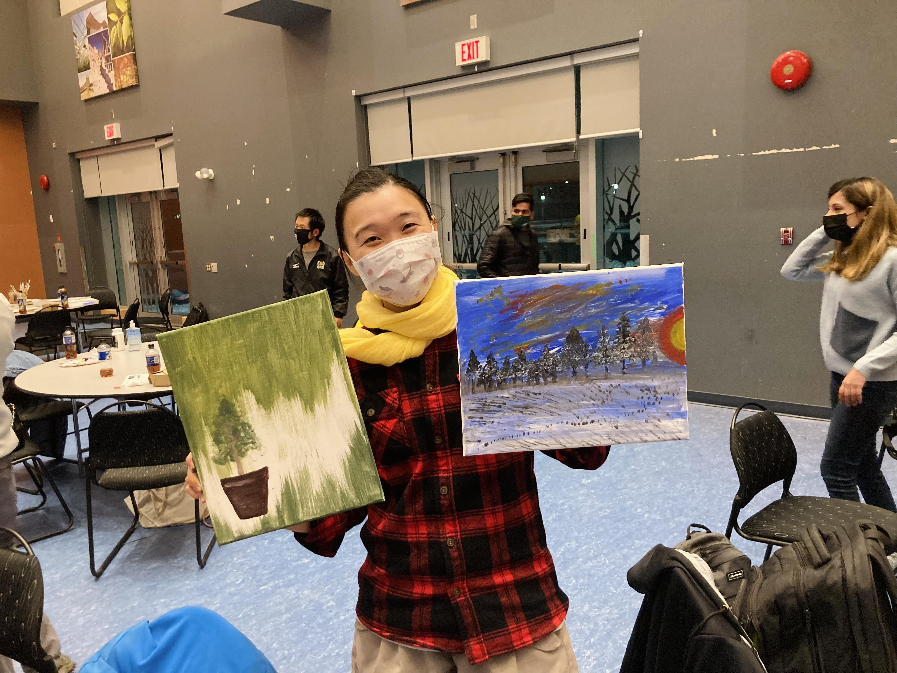
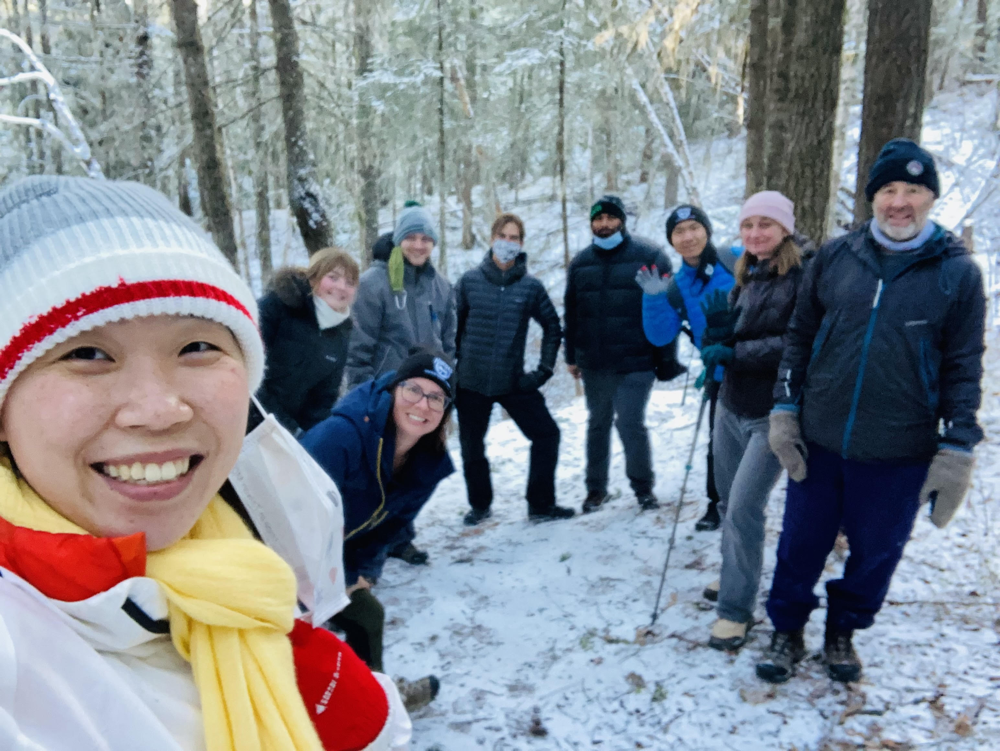
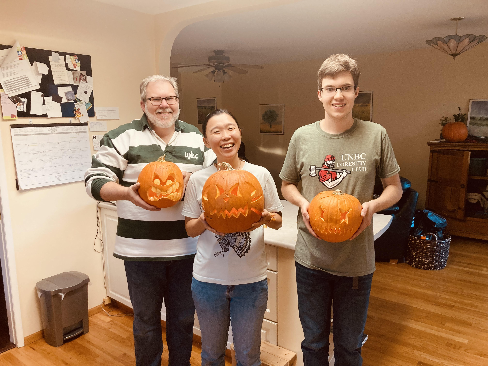
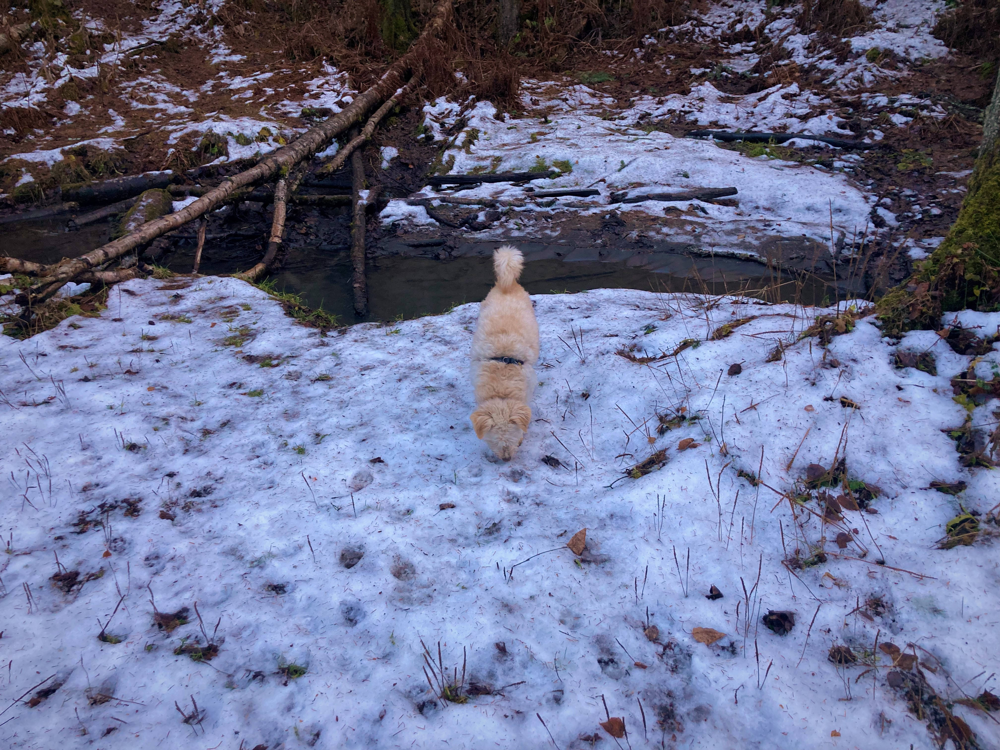

#### # About
In the UNBC NRES 801/802 course, I was asked to write a report called “Personal Critical Assessment”. The purpose of this document is to reflect the learning period during the course, the first three months of my Ph.D. journey. However, I found my reflection throughout the course can not be separate from my daily life experiences – my research, my teaching, and my interactions with the new environment and friends. 

Based on this fact, I put down some topics in this report to record important things happened, and the message I learned from them. Not all the topics are closely related to the NRES 801/802 course, but the course played an important role to raise all these thoughts.

#### # Big Data in Research
In one lecture during this semester, NRES 801/802 invited Dr. Joseph Shea to give NRES Ph.D. students a talk entitled “Big Data in Research”. This talk was especially of interests to me as part of my research is related to this field. 

The features of “big data” included “3Vs”: volume, variety, and velocity. Even though there is no single solid definition of big data, these are the three main aspects that make big data different from old fashioned data. In recent years, big data became a popular word in different fields, including biology, ecology, social science, and even engineering. My research field, conservation ecology, also joined the world of big data.

Volume - Research directions in conservation ecology had been changed by big data in the last decades. Techniques has been developed to quickly collect data, such as camera traps, autonomous audio recorders, unmanned aerial vehicle, and satellites. Those techniques can help collect data in a much wider spatiotemporal scale, thus expanding the scope of research questions that researchers can potentially answer. The spatial scale can be extended from single patch of land to a landscape consisting diverse habitats; the temporal scale can be extended from single breeding season to whole year monitoring. Typically, techniques used in big data have features such as easy to deploy, overcome observer bias, and have wide coverage.

Variety – Not only the amount, the format of data is another aspect that makes big data special. Conventionally, data were collected in an identical form in a research project to achieve consistency; however, challenges of manipulating different format of data is unavoidable in big data era. Collected data can be video (.mp4, .mov), audio (.mp3, .wav), image (.tiff, .jpg, .png), spatial vectors (.shp), and occurrence data (.csv, .txt), etc. They can also be either structured, unstructured, or semi-structured data. Accordingly, platforms are built to provide synthesized data, sometimes also known as citizen science: eBird, Xeno-Canto, iNaturalist, GBiF, and NEON. 

Velocity – Given the volume and variety of data, it is impossible to tackle data in a conventional way.  Open-code and free sharing platform had become the major development. Nowadays, programming language such as R, Matlab, and Python are essential analytical tool for all researchers to learn. Open-sourced code sharing platform such as GitHub also becoming popular in recent decades. Furthermore, free computing engines are also available nowadays such as Google Colab and Compute Canada. 

Big data is such an intriguing, unpresented tool that allows us to answer complexed ecological questions that we won’t be able to ask before. One most attractive concept of big data for me is cooperation. No matter it’s citizen science platform or resource sharing system, it’s so excited to see the key themes of big data are: sharing, free, open-sourced, inter-disciplined, and cooperated. 

P.S. The figure is my past research project using big data to map large scale spatiotemporal distribution of birds. 

#### # Comprehensive Appreciation of Research
Throughout the research journey, we all learned the importance of cooperation and interdisciplinary at some point. In the NRES program, it is stated that most of the research are in one of these three fields: earth systems & dynamics, ecological patterns & processes, and societal structures & value.

Before diving into the question about cooperation and interdisciplinary, I want to clarify the definitions about words with close meanings. Disciplinary – one academic discipline; Multidisciplinary – multiple disciplinary goals under one thematic umbrella; Interdisciplinary – cross disciplinary boundaries; Transdisciplinary – cross disciplinary and sectoral boundaries. 
Now is the question: how to make scientists work together for a specific goal and cross disciplinary boundaries? My answer is – communication.

Before taking the NRES 801/802 course, my concept about cooperation is more like multidisciplinary. I do agree that people coming from different fields have different expertise, and I know it is important to gather opinions from different people. However, my approach is to “divide” the project we are sharing and everyone gets to choose where their expertise are in. This would avoid disagreements and sometimes enhance the efficiency in managing projects; however, we might have less opportunity to communicate and to learn from other perspectives. 

After doing the group project of the NRES 801/802, I gradually realized the true meaning of interdisciplinary; it is all about communication. Communication means to getting to know each other, to know the common goal, to know the difficulties we might have and how to “blend” our skills together. It is a time-consuming practice and sometimes frustrating as there are always disagreements in a group. We listen to each other, trying to find the best solution for the team. In the end, we all learn from each other and the knowledge is “blending” together to become a good result.

The beauty is, getting agreement and disagreements are both important. That’s the way we learn, we grow up, and we listen to each other. 

#### # Work Life Balance
Most people would agree that we assign our time differently when we are students compared to when we are employees (i.e., hired by someone). 

Being a student, such as in high school or undergraduate degree, it is common that the daily schedule is mostly “designed” by other people. It is not surprising that students work on school assignments during evenings or weekends, which is the free time people get to decide what they want to do. On the other hand, being an employee, it is often expected that evenings and weekends are the time employees shouldn’t be doing the work-related thing. To be specific, those times are given to employees to enjoy freedom. 

I am not saying that the work-related thing is not enjoyable. Here I just want to point out the different perspectives of assigning our time during the identity transition. On top of this, I have been told I should treat Ph.D. as a job instead of a student position.  

Thinking back, I was the kind of graduate student who works ten hours per day, six days per week. It was not a good practice. After entering the Ph.D. position, I decided to change. I tried to have a stable daily schedule – come to the office before 9 am and work until 5 pm. In the evenings, I go to exercise, do reading, chat with family and friends, make artworks, and plant plants. I also spend my weekend baking, walking dogs, doing things I couldn’t do during workdays. I tried to avoid bringing work-related tasks back home. After three months of practice - it was fulfilling. I love my Ph.D. work, I also love my free time with all those “personal projects”. Finding the balance between my work and “personal projects” made me feel I hold control of my life. 

Before, I thought people can only be loved by working hard. But now I changed my mindset. And this mindset is also agreed by my supervisor, who once told me “Sunny, I will be happier if I know you find a balance between your research work and life.”

#### # Friendship
The way I got introduced to Prince George was quite dramatic. 

August 20th of 2021 was the date I planned on driving from Vancouver to Prince George. A couple of days before that date, all the highways (yes, I mean all), was blocked due to fires and landslides. The town of Lytton was burnt down, the Merritt was evacuated because of the wildfire hazard. With the pandemic, it was so stressed to travel to a new city under such unstable situation. Anyway, I managed to arrive at Prince George, but it is just the start of the challenges. 

Two days after we arrived at Prince George, my friends left back to Vancouver. That was the first moment I had a strong feeling of loneliness – “It is my first time being in this city”, “I don’t know anyone here”,  “I don’t have mobility”, “I don’t know where to get grocery”, “I haven’t found a place to stay’… It was stressful, especially when I realized I am facing all these challenges by myself. From there I started to realize the feeling of “treating a place like home” comes from trusts between people in that place. Imagine that, if there is a person with me at that moment, I wouldn’t be so worried. 

This is where friendship comes in – I figured I must build up connections with people to feel comfortable living in this city. 

The beauty of the graduate-level course is exactly it – we can meet the cohort that is going to be together through our research journey. I grab as many opportunities as I could to interact with the Ph.D. cohort. We attended student activities together, had weekly walks together, participated in talks together, exercised together…We got to share our happiness and worries. It’s amazing that when you express your emotion with someone, you suddenly feel you have the motivation to face the difficulties. 

I could confidently say, Prince George is a lovely city, because of all these lovely people. 

#### # Being a Teacher; Being a Student
Two Teaching Assistantship (TAship) was assigned to me this semester. I have to teach students in their third/fourth year in university. In the beginning, I didn’t know how much this TAship would influence my perspective of view toward how to maintain the instructor-student relationship. 

The stories started with observations of my students. I found students can be broadly categorized into two kinds – the kind that is so bright that they can finish all the assignments by themselves, and another kind that asks lots of questions and needs lots of support. Surprisingly, I found the fulfillment of being an instructor comes from interacting with the second kind of student. By helping the students state out their questions and figure out the solutions – the moment I heard “I now understand! Thank you so much Sunny!” is truly magical. 

I started to think – what kind of student I am from my supervisor’s perspective? Well, I can say I am the first kind of student. Since young, I was always regarded as a “smart student”. I always took this as a compliment and thought I must stay perfect. This made my personality very strong, yet very tough – I am not used to calling for help when I need it. 

After the experience of being an instructor, I realized that “asking questions” won’t make the instructor think you are silly or anything like that. In opposite, the instructor would feel trusted and very happy. That is such a relief – I don’t need to be perfect in front of my supervisor. He is the person who wants to know my goal, and he will try his best to support me. The key thing I need to do is to be open to him, to trust him, and to enjoy the process while pursuing my dream.
Being a student, I know I don’t need to be the perfect one to be liked. Being an instructor, I want my students to know my biggest fulfillment comes from their growth, and I will do all I can to support them. 

#### # Cultural Shock and Reverse Culture Shock
All international students must be familiar with this – “it’s awkward to talk to local people.”, “I felt I don’t belong to here.”, “it’s so hard to make friends”… All those complex emotions can be summarized as a term: cultural shock. However, probably not so many people have heard another term called: reverse cultural shock. 

Reverse cultural shock, also known as re-entry shock, often occurred when returning to one’s home culture after getting used to a new one. In these couple of years, I have experienced both cultural shock also reverse culture shock. I was born and raised in Taiwan. From 2017 to 2020, I moved to Vancouver for my MSc. From 2020 – 2021, I moved back to Taiwan. Then in the Sep. 2021, I moved to Prince George for my Ph.D. 

Never enough to say how difficult it is to adjust to new environments. For me, it is the lack of common experience with local people makes the strange feeling I have. One solution I found for the (reverse) culture shock is to create common memory with people I interact. Try to bridge the relationship based on common experiences, common thoughts, and common ideas. 

One interesting thing I found is that – whenever I am ready to open my mind, the world will open so many opportunities to me as well. 

