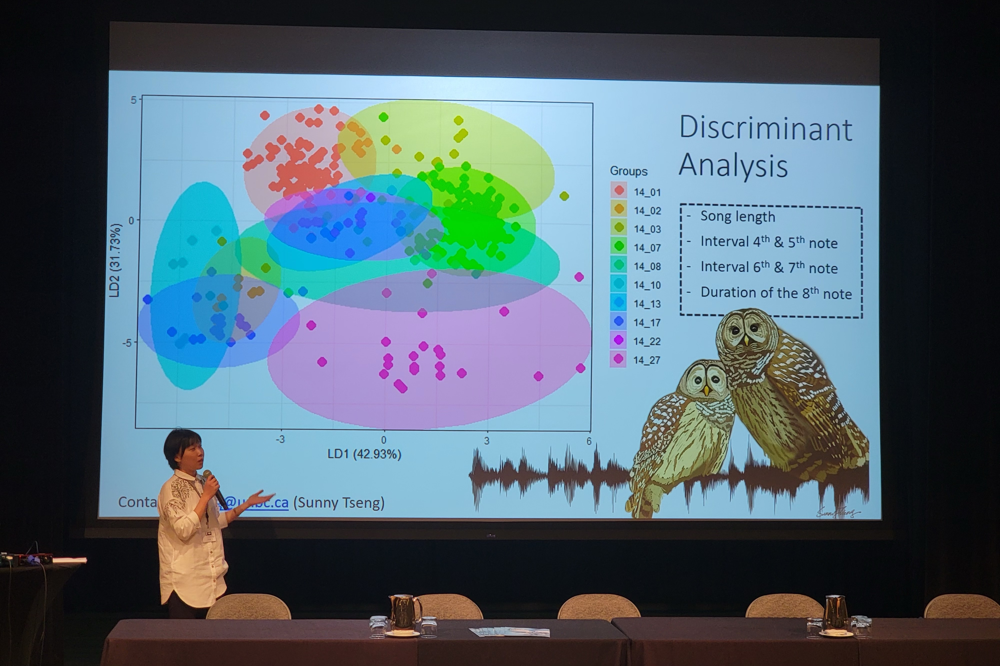

在 TWS 會議上拿到 Student Presentation Award 首獎啦 😊 

回想大三那年，人生第一次國際會議的 oral，因為英文報告而嚇到不行的自己，完全沒有想到有一天可以這麼享受站在國際會議的舞台上，用著另一個語言分享著自己的研究、帶上自己的畫作，並以 non-native speaker 的身分獲得會議的發表首獎。

The Wildlife Society 的會議集結了加拿大各地研究野生動物的學者，這禮拜以來聽了超多 moose, deer, marmot, horse, bear 還有 mountain goat 的研究，多數都是用 camera trap 的研究們，身為少數用 ARU 的人，在這裡還是感受到滿滿歸屬感。最喜歡在會議上認識大家了，I am such a social person. 

這次的演講整個玩性大發，直接請台下的朋友幫忙學貓頭鷹叫，講到最後可以讓兩百多個觀眾大笑拍手真的是最大的成就感，真的好喜歡站在台上，笑著、盯著觀眾席，看到觀眾們微笑回應，也越來越享受從座位上站起、走上台時的興奮還有雙手冰冷的刺激。而最愛的，仍是知道台下有一群夥伴們正一起幫忙加油著。

謝謝你們，UNBC 水獺先生、UBC WildCo lab、還有在 JPRF 一起出野外的夥伴，是你們讓我更享受做研究的過程。

很溫暖的歸屬感，好愛這樣大家一起努力、為著所愛的事情，或認為重要的事情，而向前進的感覺。TWS 是個溫暖的大家庭啊，帶著滿滿回憶與 friendship，明年見。 

Photo credit: Anastasiia Nykonenko

