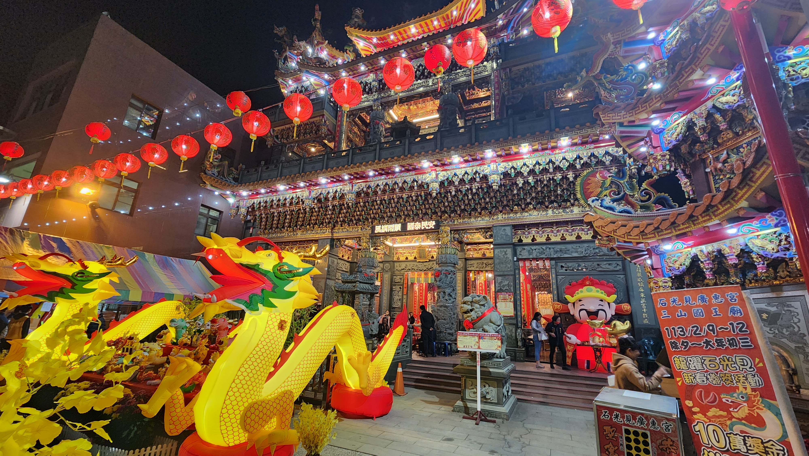

#### # I
我躺在溫哥華的床上，抱著電腦寫下這些文字。和自己約好，想要為我們的旅程寫下日記的，卻在每天的疲憊中還是放任了回憶，以及當下稍縱即逝的情感。如今再寫，只能看著照片，還有對照著少數的字跡，慢慢地體會並寫下一些印象深刻的片段。時間軸上會盡量依照真實順序，但就不講究了。

至於 Gintas，我和朋友提起時總是寫「立陶宛先生」，因為人家是立陶宛人，而標題的「緊賺」，是爸爸載我到機場時，幫人家取的綽號，爸爸沒辦法發出標準的 Gintas，只好用台語來擬聲，沒想到就讓人家的名字變成喜氣洋洋又樂趣滿滿，我當時笑了好久，直說真是好名字!

不過話說，爸爸載我到機場後就出了小小的車禍，他的車頭撞到別人的屁股，照片上連車牌都歪了，講電話時一副輕鬆的說是自己太輕鬆了在吹口哨沒注意（惑），但還能這樣開玩笑應該就是沒事了。我在爸的車上也是哭的一蹋糊塗。「妳知道妳是爸媽的寶貝女兒吧!」阿...每次回台灣都得承受這樣的心痛。回台灣再久都不夠。只能每次都多提醒自己，要好好把握陪家人的時間，好好把握這樣豐沛的溫暖。

#### # II
除夕夜前一天。哥哥載著我和媽媽南下佳冬。

剛回台灣的第二個周末，南部傳來消息說大阿伯去世了，爸媽、還有當時在嘉義參加朋友婚禮的哥哥，都南下拜訪阿伯和家人們。我的話則是在台北等著參加研討會。爸爸今年過年還是沒有回南部，但他說，如果知道阿伯的狀況，就一定會排假，好好安排去陪阿伯的家人。

媽媽則是在出門前一天感冒了，輕微發燒，喉嚨痛，之後還有出現四肢痠痛的症狀。我在出發當天早上'還因為她一直看電視而吵了一架。哎呀，爸爸趕緊跑出來抱著媽媽，說別氣了，然後默默的把我抓到旁邊，教我怎麼討媽媽歡心。現在想起來那個畫面還是很催淚。是很深情的爸爸。

總而言之，我和阿哥還有媽媽三人在卡拉OK還有賞車大會的進度下，花了五個小時開到了屏東!那個屏東老家的溫馨感阿，大舅和舅媽在小房間裡，宗得還是和哥哥不停打電動，樓上的燈，很陌生的是暗著的...往年每次回來時，都會有婆婆在二樓的客廳看電視，然後我都會在關門後，大聲的叫「婆婆!」，換來一聲「奕晴，歸來囉!(客語)」。婆婆住在養老院了。

第一件事情是把所有的棉被和枕頭到放到洗衣機，因為知道不久後容易過敏的 Gintas 即將來訪。

PS. 想到，這天還發生了一個小插曲，Gintas 突然傳訊息來說他有朋友初一到台北，他想先到台北見對方，在初二南下屏東。我一整個衝動，想說這個從來沒有經歷過人類史上最大遷徙活動的人竟然跟我說要在初二南下。幸好後來被勸退。

#### # III
除夕。免不了的拜拜，帶婆婆去寮仔、在婆婆家拜、回爸爸家拜。

因為爸媽都是屏東佳冬人的緣故（他們是國小同學），每年過年我們都有兩倍的體驗可以過，兩倍的拜拜、兩倍的親戚數量、兩倍的年夜飯、兩倍的歡樂。早上小舅舅回來，一下子就帶我去載婆婆，回寮仔。每次回來，小朋友都大一歲、而長輩們都老了一歲。好心疼。以前都是開開心心的領紅包，現在則是希望每年回來大家都平安健康就好。

回到屏東的聲音，是紅鳩、狗狗鳴唱、不絕於耳的過年歌曲，還有總是停不下來的廣播。我知道廟裡有直茭大賽啦!是要宣傳多少次才夠（笑）。

#### # IV
Gintas 來了! 我們從十點半在左營見面，一直到下午四點才到屏東家。

有點不可思議，就這樣空降了一個立陶宛男孩到左營車站。還在大過年的初一。他一下車就跟我說想去看龍虎塔，我心想，是這麼有精神的嗎，那個光走路就要半小時耶，是不知道我們距離屏東家還有一段距離嗎。其實這段旅程中不停地有這種想法，覺得自己總是沒辦法把行程和人家解釋得很好，讓人家接下來要去哪裡都不知道(笑)。

第一站先去了百貨公司買鞋子，逛了幾個百貨後還是決定了第一雙相中的 Nike，搭了火車到潮州，打電話給哥哥來接，卻只獲得了「在吃飯」。立刻暴怒，覺得太不夠義氣了吧!心裡想著人家已經做了13個小時的飛機，外加 3 個小時的高鐵，還不讓人家簡單點回家。最後是在潮州搭到國光號，等了好久好久，才順利降落在石光見的家前市場。

期待旅程中的一切。

好好睡了一覺，和大家一起吃飯一起玩了桌遊。

#### # V
初二回娘家，早上幫忙大家買了飯糰早餐，去廟會看舞龍舞獅。

