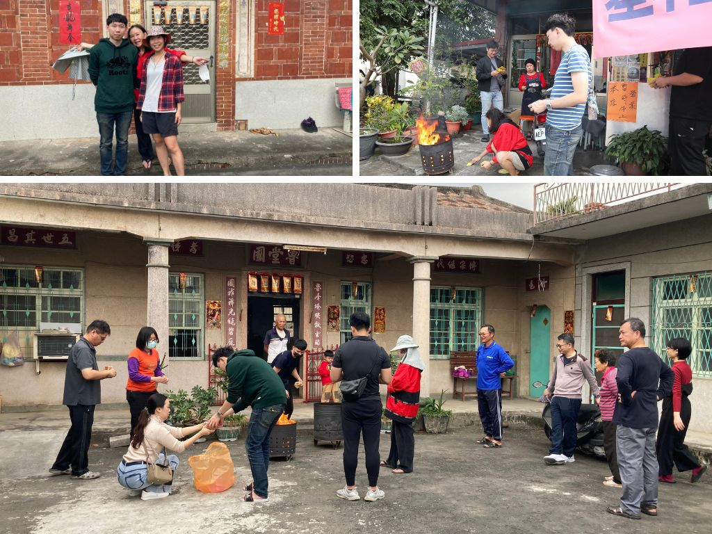
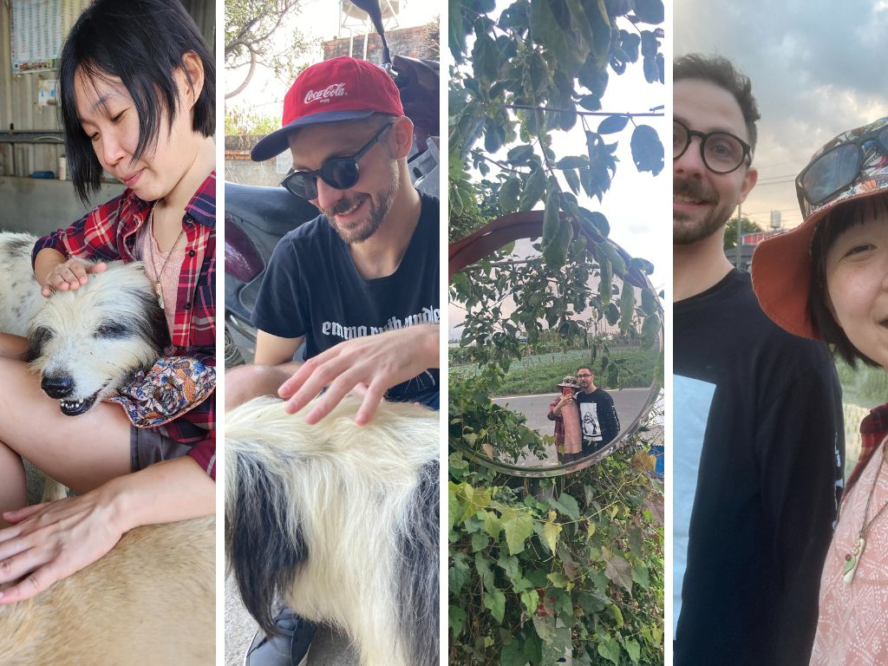
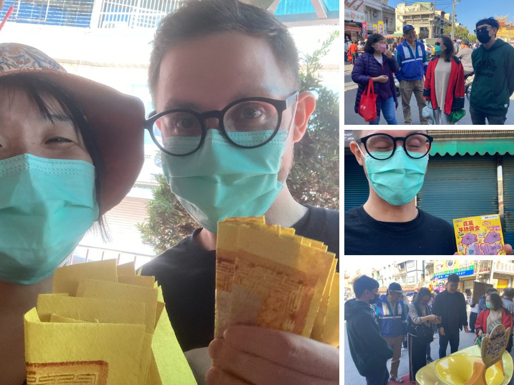
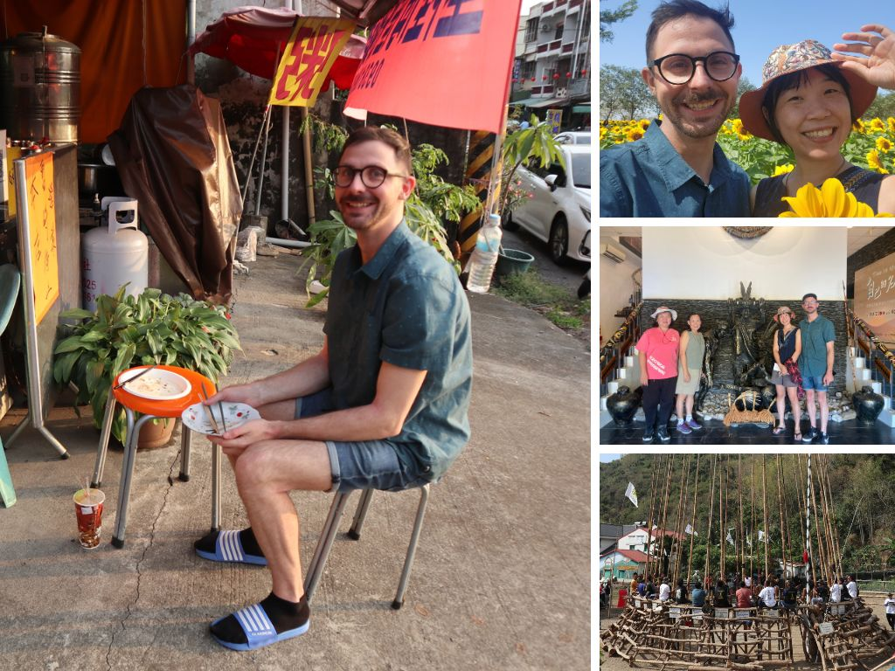
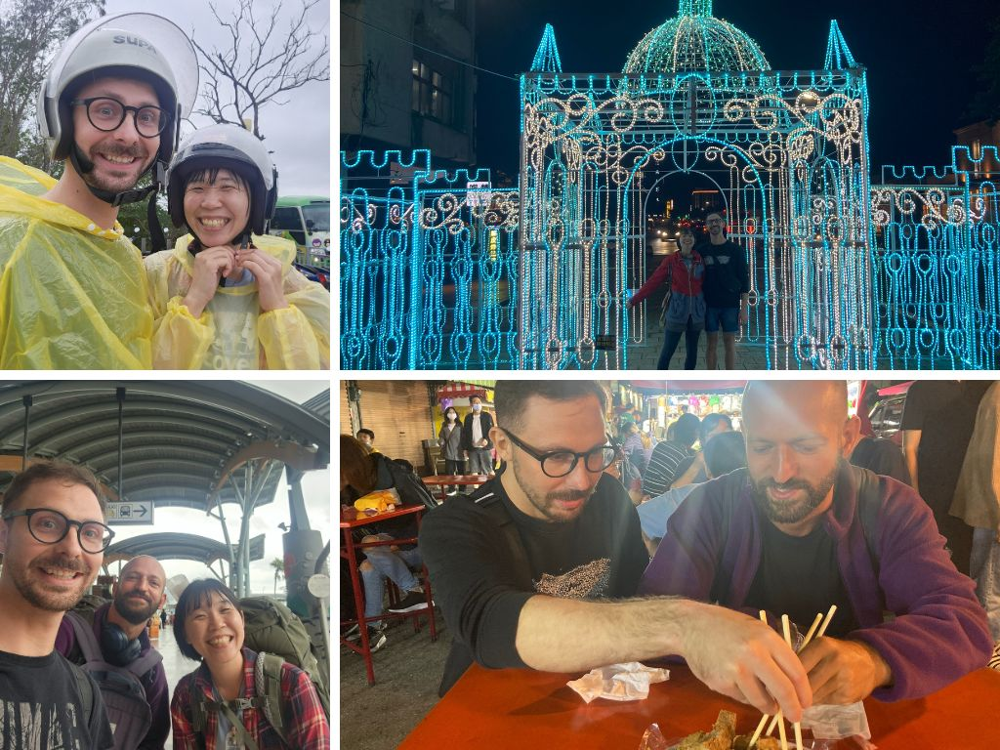
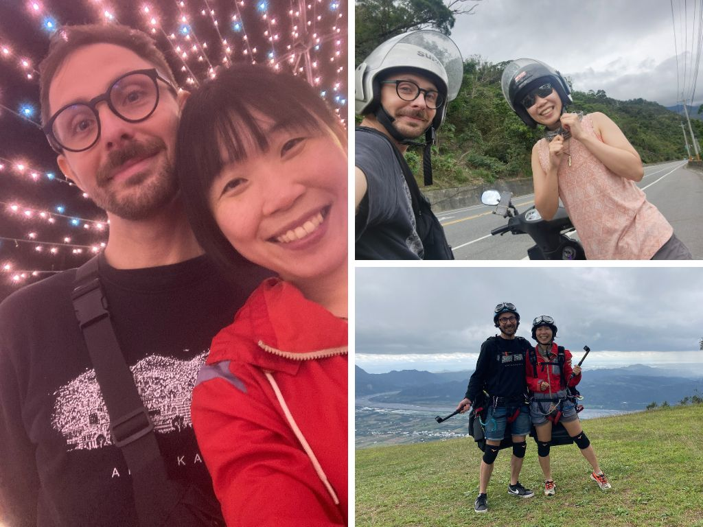
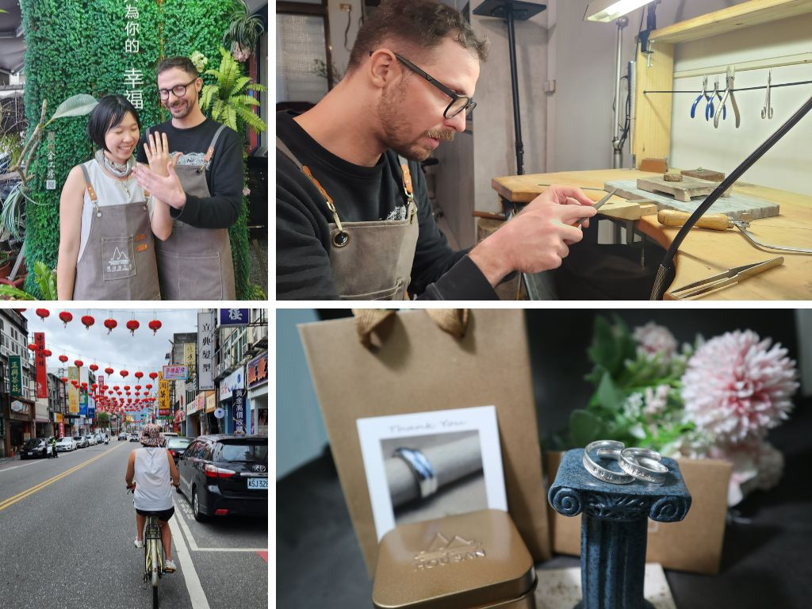
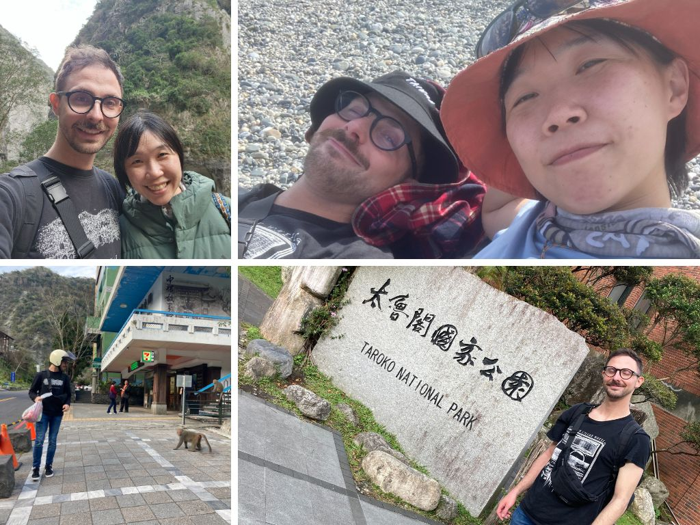
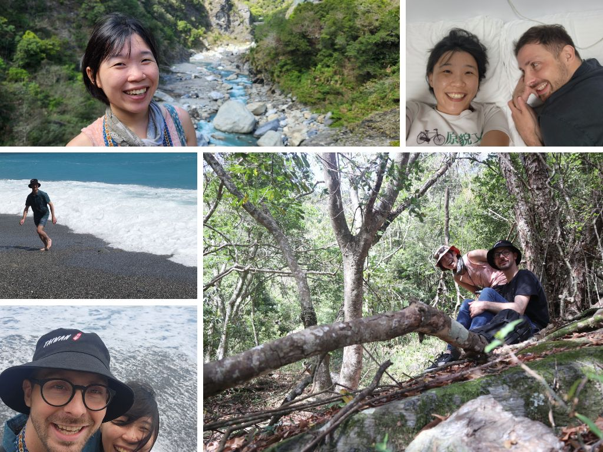
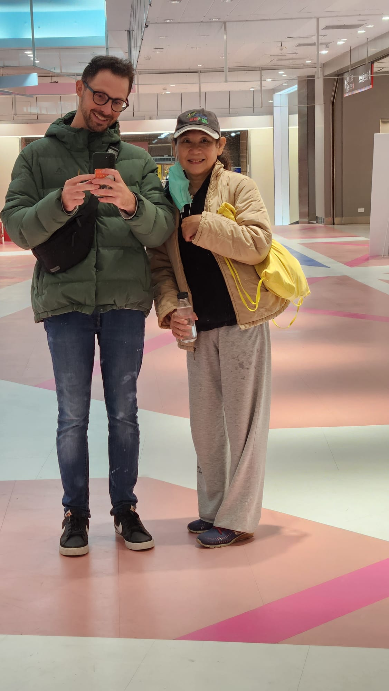

#### # I
我躺在溫哥華的床上，抱著電腦寫下這些文字。和自己約好，想要為我們的旅程寫下日記的，卻在每天的疲憊中還是放任了回憶，以及當下稍縱即逝的情感。如今再寫，只能看著照片，還有對照著少數的字跡，慢慢地體會並寫下一些印象深刻的片段。時間軸上會盡量依照真實順序，但就不講究了。

這段旅程回憶起來非常的甜，非常的自在、非常的美。我們一起去過了哪些地方，很重要，但對我來說更重要的是每個和你走過的路、牽過手的溫柔，都和這些地方產生了連結。真正讓我心裡愉悅的，是每一段躺在沙灘上的對話、是一起看海被海浪震懾、是一起為了可愛的過程大笑。

至於 Gintas，我和朋友提起時總是寫「立陶宛先生」，因為人家是立陶宛人，而標題的「緊賺」，是爸爸載我到機場時，幫人家取的綽號，爸爸沒辦法發出標準的 Gintas，只好用台語來擬聲，沒想到就讓人家的名字變成喜氣洋洋又樂趣滿滿，我當時笑了好久，直說真是好名字!

不過話說，爸爸載我到機場後就出了小小的車禍，他的車頭撞到別人的屁股，照片上連車牌都歪了，講電話時一副輕鬆的說是自己太輕鬆了在吹口哨沒注意（惑），但還能這樣開玩笑應該就是沒事了。我在爸的車上也是哭的一蹋糊塗。「妳知道妳是爸媽的寶貝女兒吧!」阿...每次回台灣都得承受這樣的心痛。回台灣再久都不夠。只能每次都多提醒自己，要好好把握陪家人的時間，好好把握這樣豐沛的溫暖。

#### # II
除夕夜前一天。哥哥載著我和媽媽南下佳冬。

剛回台灣的第二個周末，南部傳來消息說大阿伯去世了，爸媽、還有當時在嘉義參加朋友婚禮的哥哥，都南下拜訪阿伯和家人們。我的話則是在台北等著參加研討會。爸爸今年過年還是沒有回南部，但他說，如果知道阿伯的狀況，就一定會排假，好好安排去陪阿伯的家人。

媽媽則是在出門前一天感冒了，輕微發燒，喉嚨痛，之後還有出現四肢痠痛的症狀。我在出發當天早上'還因為她一直看電視而吵了一架。哎呀，爸爸趕緊跑出來抱著媽媽，說別氣了，然後默默的把我抓到旁邊，教我怎麼討媽媽歡心。現在想起來那個畫面還是很催淚。是很深情的爸爸。

總而言之，我和阿哥還有媽媽三人在卡拉OK還有賞車大會的進度下，花了五個小時開到了屏東!那個屏東老家的溫馨感阿，大舅和舅媽在小房間裡，宗得還是和哥哥不停打電動，樓上的燈，很陌生的是暗著的...往年每次回來時，都會有婆婆在二樓的客廳看電視，然後我都會在關門後，大聲的叫「婆婆!」，換來一聲「奕晴，歸來囉!(客語)」。婆婆住在養老院了。

第一件事情是把所有的棉被和枕頭到放到洗衣機，因為知道不久後容易過敏的 Gintas 即將來訪。

PS. 想到，這天還發生了一個小插曲，Gintas 突然傳訊息來說他有朋友初一到台北，他想先到台北見對方，在初二南下屏東。我一整個衝動，想說這個從來沒有經歷過人類史上最大遷徙活動的人竟然跟我說要在初二南下。幸好後來被勸退。

#### # III
除夕。免不了的拜拜，帶婆婆去寮仔、在婆婆家拜、回爸爸家拜。

因為爸媽都是屏東佳冬人的緣故（他們是國小同學），每年過年我們都有兩倍的體驗可以過，兩倍的拜拜、兩倍的親戚數量、兩倍的年夜飯、兩倍的歡樂。早上小舅舅回來，一下子就帶我去載婆婆，回寮仔。每次回來，小朋友都大一歲、而長輩們都老了一歲。好心疼。以前都是開開心心的領紅包，現在則是希望每年回來大家都平安健康就好。

回到屏東的聲音，是紅鳩、狗狗鳴唱、不絕於耳的過年歌曲，還有總是停不下來的廣播。我知道廟裡有直茭大賽啦!是要宣傳多少次才夠（笑）。

#### # IV
Gintas 來了! 我們從十點半在左營見面，一直到下午四點才到屏東家。

有點不可思議，就這樣空降了一個立陶宛男孩到左營車站。還在大過年的初一。他一下車就跟我說想去看龍虎塔，我心想，是這麼有精神的嗎，那個光走路就要半小時耶，是不知道我們距離屏東家還有一段距離嗎。其實這段旅程中不停地有這種想法，覺得自己總是沒辦法把行程和人家解釋得很好，讓人家接下來要去哪裡都不知道(笑)。

第一站先去了百貨公司買鞋子，逛了幾個百貨後還是決定了第一雙相中的 Nike，搭了火車到潮州，打電話給哥哥來接，卻只獲得了「在吃飯」。立刻暴怒，覺得太不夠義氣了吧!心裡想著人家已經做了13個小時的飛機，外加 3 個小時的高鐵，還不讓人家簡單點回家。最後是在潮州搭到國光號，等了好久好久，才順利降落在石光見的家前市場。

期待旅程中的一切。

好好睡了一覺，和大家一起吃飯一起玩了桌遊。

#### # V
初二回娘家，早上幫忙大家買了飯糰早餐，去廟會看舞龍舞獅。

食物上，完完全全的征服了這位立陶宛男孩的胃，然後呢，他今天對於發票載具的發明非常的驚艷，說怎麼會有可以把發票當樂透，進而鼓勵全體人民督促商家繳稅的。他說要把這個寫進立陶宛報告書，說怎麼可以把一個國家治理的這麼有效率。

下午一起打了桌球，真的是爽快耶，以前練起來的技能都沒有忘，而且是打桌球會開心的!

傍晚媽媽才藝大爆發建議一起烤 pizza，結果只剩我、阿姨、和 Gintas 在作業。烤了幾片，吃了一片，之後進行了「穎川堂」書法大賽，看誰寫的字漂亮，哈，輕鬆獲得首獎 500 元!最後還要選「誰寫的最醜」、「哪張是你兒子寫的」之類的，超級好笑!

#### # VI
初三東隆宮 - 帶 Gintas 到繁華的廟裡拜拜，然後馬上被海鮮嚇到不能進華僑市場。原來是光聞到海鮮就會過敏的男孩。

每年到東隆宮已經是例行事務了，這次開了三車，宗得帶著大舅舅和舅媽、小舅載我和 Gintas，而哥哥則是帶著阿姨和嬤嬤。因為前幾天哥哥不開心的緣故，讓我都不敢坐他的車了(笑)，幸好媽媽機靈，趕緊提議換車。

讓 Gintas 燒了紙錢、拿香拜拜，還拿了一張廟裡的護身符去過了香爐。一張黃黃的紙長得像太極。我和阿姨還去了消災解厄的，用了一張旗在身體前後來回揮舞，像是要把惡靈驅離。最後世和送了 Gintas 兩張樂透，真是逗趣極了，馬上重了 400 塊!太可愛了，沒想到最會和 Gintas 互動的，竟然是世和，不僅英文講得好又非常友善。

拜完東隆宮之後大家提議到華僑市場吃海鮮，Gintas 光聞到魚的味道就快昏過去了，只好放他自己一個人去海邊走走。從抵達屏東之後就一直過敏到現在的男孩，其實有點辛苦。他自己到藥局找到了斯斯鼻炎膠囊，說是目前吃過的藥裡面最有效的。

#### # VII
初四，枋寮花田，兼烤肉!

一早和媽媽阿姨去了花田散步，沒有甚麼特別的安排，就是這樣緩緩地散步感覺就很舒服。太陽大到我們必須找陰影處才能坐下好好地聊天。我和阿姨還有媽媽在聊天時，Gintas 就自己滑手機。我其實有問過，不知道他這樣會不會覺得被冷落，但他說沒有甚麼關係，他不想要因為自己的拜訪而打擾到我和家人相處的時間。

嬤嬤後來又載著我們到了來義鄉排灣族的白鷺部落看刺球。在小小的博物館裡也是繞了幾圈。一直到小舅舅打電話來，說要去載婆婆回家，才又跑回去，準備下午的烤肉大會。

嘉嘉跟我說，烤肉那天姿吟會一起過來，下午遇到時，她說「哇奕晴妳帶了一個帥哥回來」，Gintas 還在埋頭訂機票，準備他的下趟行程。最後和大家一起烤肉、放煙火。算是最美好的回憶能有的樣子了。

#### # VIII
高雄，一起吃了早餐、世和帶我們一起去參加狗狗 party、還有第一天的酒宴。

每和家人道別一次，就再哭一次。因為相聚的時間都太過美好。連柴米油鹽醬醋茶的時光，都像珍珠一樣寶貴。

#### # IX
火車隆咚隆冬的一錄向東，開始兩個人的小旅行。

Gintas 在搭火車前到寶雅買了一條直被我嫌棄到不行的毛巾。說真的，我一直覺得自己是個很難一起旅行的人(笑)，因為太常都是自己一個人過生活了，很多生活習慣、做事效率、喜歡的事物。那條毛巾又大又不吸水，光看到我就覺得很不適合旅行，但是又不知如何溝通。就是一個需要訓練溝通的狀態。

說到溝通，常常我們都是這樣，我先有了情緒，表現的方式通常是逃避，而總是要花上 Gintas 好一陣子的探索才能知道我到底在想甚麼。像是之前在華僑市場，我很想要跟家人一起吃海鮮、在溫哥華游泳的時候睡過頭、像這次在寶雅想要買很多東西帶在路上。說真的，每一件都只是小事，而且回想起來他的動機全部都是良善的。也許下次覺察到自己有情緒的時候，問問自己「真的是這樣嗎?」。

想當個更溫柔的人。

回到往台東的火車上，Gintas 說他有個朋友 Krill，今天也要搭車到台東，好巧不巧，我們就在隔壁車廂!!Krill 留著大鬍子，頭髮理的短短的近乎光頭，從他被公司裁員之後，現在已經自己在東南亞旅行了將近四個月的時間。往返了泰國、柬埔寨、越南、韓國，非常厲害。光是看照片本來讓人敬畏，但一聊天之後他的聲音之輕柔還有用字之好笑，相處起來非常的輕鬆自在。而隨手拈來的旅行故事也是令人嚮往。在車上小聊之後約好晚上一起逛鐵花村和夜市。

下了車之後，才發現我的民宿訂在知本，離台東騎車需要 20 分鐘。找了台東火車站前一間路邊的租車店，兩天 125 的機車才 500 塊，車子很新性能又好，非常的划算。而機車騎起來也很快就回想起那個感覺。一路通往知本蘑菇。

晚上的鐵花村也是美美的，在旁邊的微光市集有駐唱歌手，我們就在那裏坐著聽了好久。簡單的暖暖的，很幸福。我點了三首歌:「暖暖」、「夜空中最亮的星」還有「海洋」，大概就是這樣簡單而美好的傍晚。

PS. 然後竟然在台東觀光夜市遇到嘉慧!太太太誇張了!但也是好欣喜阿，十年不見的老同學了一樣漂亮一樣美。

#### # X
飛行傘大概是此行的精華之一!

機車一到鹿野高台上的平原，馬上就被抓去辦手續、簽名。有個五分鐘的行前訓練短片，唯一的重點就是「run run run, no stop, no jump, just run!」。覺得教練很厲害，還來不及害怕時就帶著妳一躍而下。

晚上去了民宿老闆推薦的忠義堂去洗溫泉，兩個人 200 原訂了一間 40 分鐘的房間，真的是太好玩了吧!從來沒有想過洗溫泉會有這麼有趣的體驗，因為隔音很差的緣故，都可以聽見左鄰右舍的溫泉聲，像是我們的隔壁就是一家人帶著兩個小孩。不知道我們的英文對話是否也會被隔壁的聽見。很喜歡這樣非常簡單、又非常道地的體驗!

洗完溫泉出現了吹風機小插曲，我自己帶了吹風機，廟方卻不提供插座，覺得都帶了還用他們的投幣式，豈不是太虧。Gintas 一句「Come on!」，說不要為了省點這樣的小錢，尤其是已經到了這樣划算的地方。我說好，覺得 Gintas 是個懂得體貼，並想學習溝通的人。

而溫泉區外面的小小燈光展，也讓我們吃飯聊天、散步了很久，還在河邊跳起舞來。覺得這樣的小地方的傍晚，總是特別迷人。

#### # XI
出發到花蓮前再去早餐店「妳男朋友，帥噢!」。

終於帶了人家到海邊走走，然後立馬曬傷。再到卑南遺址公園去散步了一下。再次搭上快速的自強號，買了台鐵便當的台東特別版。我們此行不知道已經吃過多少個台鐵便當了，是我的熱愛，轉介也成為 Gintas 的熱愛。自強號到達花蓮時已經傍晚，簡單梳理一下就出發花蓮又一村。

花蓮的又一村比起台東的鐵花村小上許多，商家的多樣性不夠高。唯獨逛街的時候隨手拿起首飾幫 Gintas 戴上，他逗趣的說「Yes I do」，旁邊的人都笑翻了，唯獨我很想要嗆他。

吃了粥。我們兩人到家時都累到不行，倒頭就睡，完全沒想到隔天將是 Gintas 的一場災難。

#### # XII
一整天的上吐下瀉。

今天大概是整趟旅程最驚險的一天了，Gintas 早上起床就說身體不舒服想吐，然後就去廁所上吐下瀉，我原本以為只是一般食物中毒只要讓腸胃休息一下就好，沒想到他連早上要一起騎車到海邊都沒有辦法，光是路上就想吐。我們趕緊回家，我幫他買了三瓶舒跑，交代人家在家裡好好休息。如果下午的精工行程趕不到也沒關係，看他很難過的樣子我心裡也好難過。

中午回家探望，他看著電腦包著棉被睡著了。好心疼。我摸他的額頭，沒有燒，但他說全身無力且肌肉痠痛，好像比早上還好一些，於是我們就出發上路，到了騎車 20 分鐘外的吉安去體驗精工(本來還想說如果 Gintas 還是身體不舒服的話我就自己做了個人的戒指 XD)。精工的部分非常精彩!從融銀、敲打、退火、延展、壓平、到整形、刻字。每個步驟都非常的新奇有趣，只是 Gintas 在旁邊一副快要昏過去的樣子 XD 我一邊做還一邊覺得等等是不是要幫忙帶他去廁所吐。

可憐的上吐下瀉，師傅說有可能是病毒型腸胃炎，如果再嚴重的話可能要看醫生。我心裡好著急阿，在國外看醫生可不是簡單的小事，雖然知道就算沒有健保也是便宜，但還是內心一翻掙扎。Gintas 說他在磨戒指的時候非常的專心，幾乎忘記了自己身體不舒服的事情。

最後回家馬上倒。然後就是連續好幾個小時的高燒，從回家六點，到睡前，都是一直高燒不止、手腳冰冷。他一直說很冷，額頭及身體卻是燙到不行，可以煎蛋的燙。但儘管在這麼不舒服的時候他還想給我看 Ferien，現在回想起來真的非常的貼心。但我真的著急到不行，還在跟人家吵要不要吃粥 XD 一邊查急診、一邊去藥局買藥、打電話給媽媽、跟 Carry 討論計程車、擬定了各種可能會發生的情況及應對。無能為力的感覺。

一早起床奇蹟似的燒就退了，也沒有想吐的感覺，只是跟我說有點肚子餓。天啊小夥伴，你真的是我見過最驚人的身體，這樣的康復速度，以及壓力下還是溫柔的包容及反應。

#### # XIII
騎機車上太魯閣。

在花蓮租機車的時候遇到了一點小插曲，機車行的老闆似乎看我是女生，所以給我們一台後座及車廂都很小的車，連引擎發動的時候都若有似無的，我在紅燈停車的時候整個覺得重心很不穩，簡而言之就是一台太小的車，不論是騎車的我，或是座車的 Gintas 都覺得不舒服。

騎回去跟老闆說要換車，結果換來各種嘮叨。"太重的機車妳不會騎啦!"、"妳現在全部都是聽男生的啦，我看得很清楚"、"妳不要給我弄壞噢"、"我原先給你的車還比較好"。真的很想大罵，要給車就爽快一點，少在那邊看我不懂就要占我便宜，男生女生又怎麼樣了，後來的那台車里程才 4000 多，硬是要比先前一台新，還要跟我一直爭。

不過我還蠻開心可以為了我們的想法及感受站出來。喜歡這樣的自己。

上太魯閣之前去了一趟七星潭，我們躺在距離浪的邊緣不遠的礫石灘上，悠閒地聊天，一個大浪襲來，Gintas 要抓鞋子、抓我、抓鑰匙，整個超忙碌的結果鞋子的外圍都濕了，幸好裡面沒有濕，勘穿。

上太魯閣的路，彎彎曲曲，想到自己是第一次這樣載人上山，從以前都是被照顧的角色，慢慢地變成了可以稍微照顧人的角色了。沿途的震撼就不用說，Gintas 說他已經在後座拍了不下百張的照片。機車過隧道時超級冷，終於把羽絨衣派上用場!今天我們的笑話是「I told you!」，因為我一直嫌棄人家的毛巾與羽絨衣(笑)。

PS. Gintas 看到野生的台灣獼猴超級無敵興奮!

#### # XIV
不知不覺就到了旅程的最後一天了。滿滿的不捨。

沿途的風景蜿蜒向下，陽光灑在山壁上，美而震撼。Gintas 很喜歡壯闊的山景，與幽幽閒閒地散布。我呢，光是只要在太魯閣這樣的環境下，就已經滿足的可以。好想念台灣的山。好想爬山，好想爬百岳。不是想征服甚麼，單純的只是想要多看看世界，說來有趣，走的好遠好遠之後，才更覺得能好好地了解自己的家園是很幸福的一件事情。請帶我去爬山好嗎。

很強烈的不捨感，兩個人的小小旅行即將告一段落，接下來就是和家人在一起的時光。和一群人在一起、還有只有兩個人的小生活，真的很不一樣。

喜歡與 Gintas 兩個人的小旅行。經驗值 get，滿滿的幸福感 get。

#### # XV
飛回溫哥華的那天，把 Gintas 留給爸爸媽媽，聽說去了台北總統府、台灣博物館、西門町，還在元宵節去了人爆炸多的平溪。把 Gintas 操到不行(笑)。覺得媽媽真的很厲害，Gintas 也很厲害!應該是個美好的台灣結束之旅噢!

