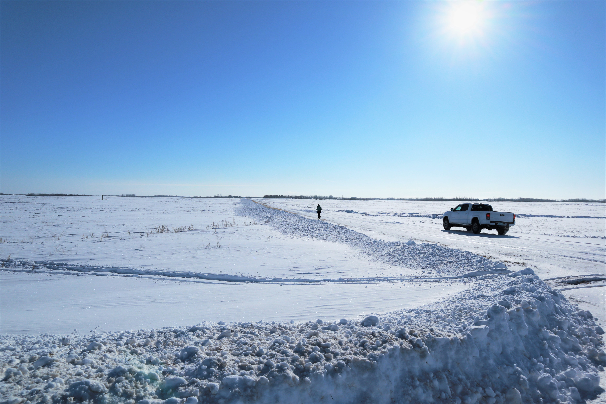
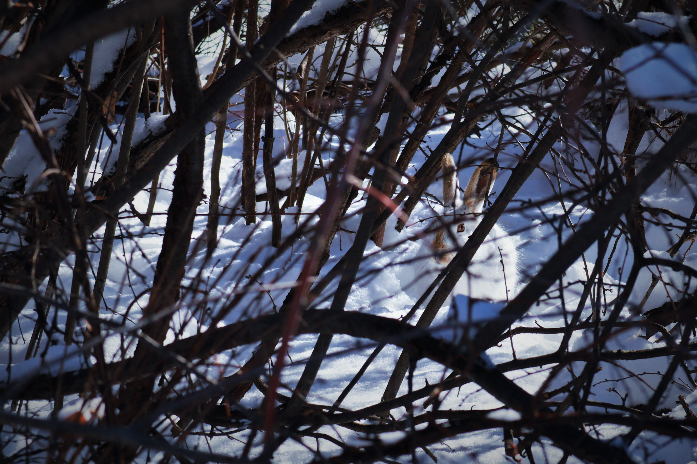
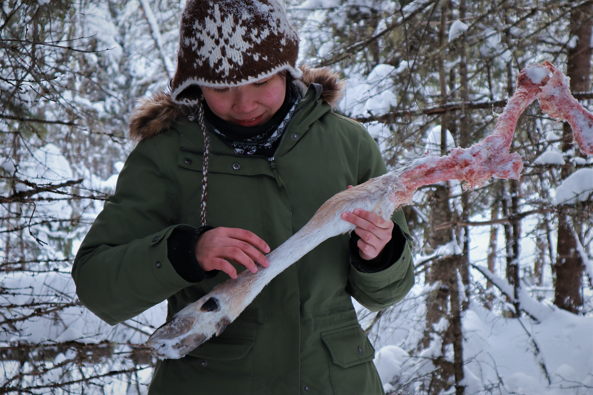
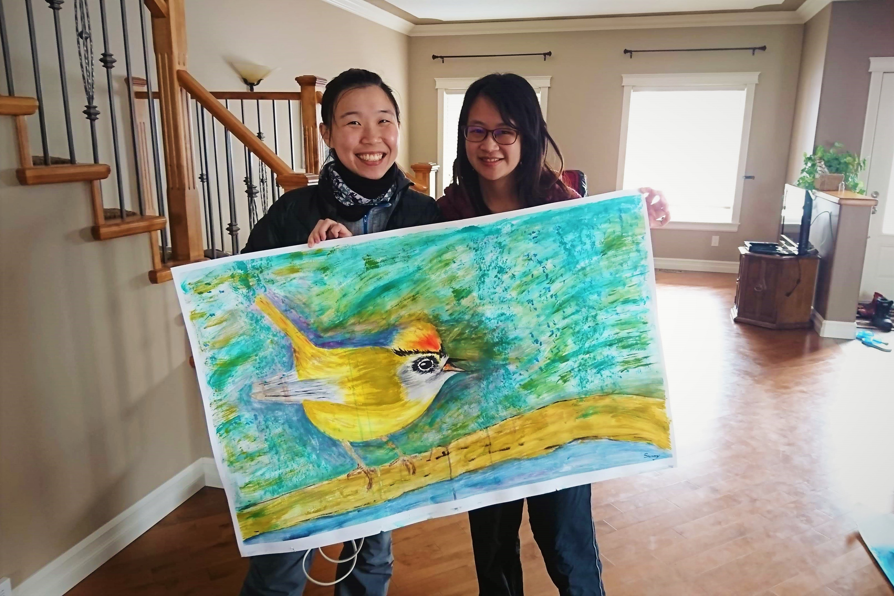
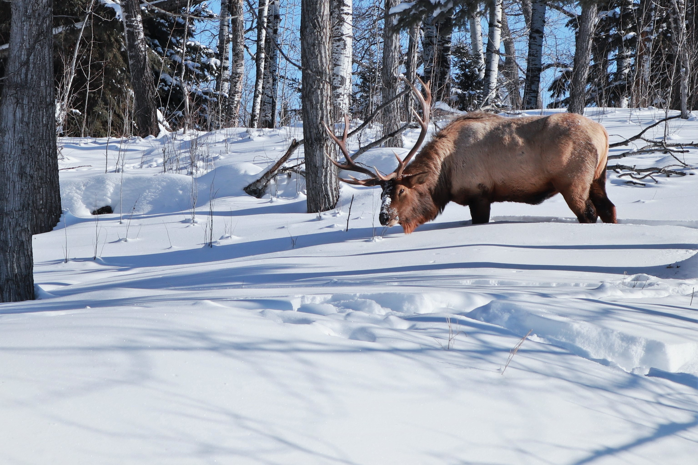

#### # I
「在冬天，我們過著與內心相處的生活，我們的生命在此時是溫暖且愉悅的。」--《湖濱散記》。

又是一個多月前的故事了。當時趁著學校放假、助教跟研究工作暫告一段落，偷偷瞞著老師又飛到了遠方。我在地圖上把 Saskatoon 標了記號，這次，為了體驗冬天而去的，也是想找回那個曾經在冬季擁有過的溫暖。

Saskatoon 位在加拿大中部的大草原（Prairie，後來才知道這跟蒙古大草原用的是同樣的字），聽說在我到達前一周溫度降到零下四十度。嗯，零下四十度，就是那個把熱水撒在空中會瞬間結冰的溫度，難怪雪鴞在冬天時喜歡來 Saskatoon 了，這裡又平又冷，在空中乍看之下就像北極苔原，牠們一定覺得在這裡過冬很有家鄉味。在我眼裡，飛機上看到的 Saskatoon 就是一整片的白，很像冰雪奇緣裡的艾倫戴爾。

和朋友在機場碰了面，寒暄一翻後並肩走到停車場，我意外地發現自己每呼吸一次，都會在自己臉頰上多添一點霜，連呼吸道裡都有冰凍的感覺，啊，心裡不禁非常緊張，但看他們倆都若無其事的樣子，看來應該是正常的冬季現象。在車上，V跟我解釋，每個住在 Saskatoon 的人都可以分辨好幾種雪花的種類。「大概是冬天太無聊了吧…」，她用可愛的語氣說，「沒事就一直看雪」。

住在 Saskatoon 的人以為一年有四個季節—近冬季、冬季、嚴寒的冬季、與適合工作的季節。

#### # II
美景不用說了，在 Saskatoon 的冬天還可以看到各種跟雪有關的動物，像是雪鴞、雪鵐、雪雁、小雪怪、像是雪兔。

在零下三十度時出門需要精打細算，也要全副武裝，毛帽、圍巾、兩層羽絨衣、大手套、雪褲、厚襪子…每次要走到室外前，都得先花上五分鐘的時間整裝，出門就像包粽子。有時還真懷疑當初為什麼要在這樣冷的地方建立城市。通常，路上是見不到幾個行人的，自己在外面走路時，聽到的只有腳底下的雪發出的喀哧喀哧聲，但這時候還不能放鬆，否則一不小心就會讓呼出的水蒸氣把頭髮都結冰了。

這時候的散步很自在，也很冷。

那天我就在University of Saskatchewan 的校園裡緩慢地散步，儘管陽光閃爍，但這種時候的太陽都是假的，只要赤裸著雙手不到三分鐘就會失去知覺。當我正細細品嘗著新環境帶來的新奇，忽然看到雪地上有個白色的毛茸茸物體正跳耀著，是雪兔（Snowshoe hare）！我一個箭步往牠的方向靠近，接下來就展開了與這隻雪兔的一番追逐戰，只可惜戴著笨重的裝備們移動起來實在笨拙，不一會牠就跳跳跳的隱身在茫茫的白雪中，只在雪地上留下了一排輕巧的腳印。

嗯，原來這裡是個散步也可以遇到雪兔的城市啊。

#### # III
Prince Albert 國家公園位在 Saskatchewan 南方溫帶草原與寒帶針葉林的交界，對於很少看到大片森林的 Saskatoon 居民來說，應該是個殊異的生態系（Saskatoon 是個完美的大草原，廣大而平坦，因此非常適合種植穀物，像是大麥、小麥等），對我來說有點像回到了BC 省的山上，但多了許多樺樹與雲杉，還有滿滿的、白茫茫的雪。

寒帶針葉林佔了整個加拿大約60% 的面積，卻只容納了 13% 的人口，因此常被視為最少受到人為干擾的生態系之一（啊，如此幸福），也因此可以謙虛地欣賞原始林的樣貌-- 謙虛地欣賞，自然的樣貌。

那天 S 就這樣在雪地裡開著車，一路上我們都在注意大型動物的痕跡，我的視覺在雪地上是不行的，左看右看，只見了地面滿滿通向森林的腳印。忽然間 S煞了車，「那是甚麼?」，他說他好像看到了一個頭骨。

他是對的，一個鹿的頭骨就躺在森林的邊緣，這樣尺寸的鹿在這裡只有兩種，非 White-tailed deer 就是 Mule deer，頭骨表面的毛皮都已經不見，也不知道是自然腐化或是被掠食者取下，我們試著在附近尋找蛛絲馬跡…我另外發現了幾撮毛髮與狼群混亂的腳印（像放大的狗腳印），而S在森林裡找到了那隻鹿的左前腳。我們都不禁驚呼。

根據當時的低溫（約零下二十），很有可能已經是幾天前的事件了。我們小心地把牠們放回原處並離去。自然的樣貌在我的心中漸漸地改變，自然的美，在此時又多添了危機與死亡的氣息。

#### # IV
不是巧克力喔，是壓克力。

已經是上個月情人節左右的故事了，當時遠到住在 Saskatoon 的學長姊家拜訪，看到學姊家裡的畫板上好大一幅冰山的畫，筆鋒飄逸柔軟、色彩冷冽，讓我眼睛一亮、立刻燃起藝術魂…。

早上的時候到零下二十度的雪地玩耍，晚上就回家乖乖畫畫。第一次畫大幅畫、也是第一次用壓克力，就像是要一個詩人寫出科幻小說一般，同樣是寫作，但隔行確實如隔山。這讓我整幅畫都在「不知所措」的狀態下完成。只記得學姊一直提醒我「妳要畫出妳自己想要的感覺，而不是別人的期待」。

我很享受壓克力顏料層層疊起的質感，也喜歡水份比例能製造出的不同色彩效果，最喜歡有人可以一起畫畫，在我覺得快毀了一幅畫時告訴我其實它很美。

#### # V
你在寒冷的雪地裡走著，用雙腳緩緩撥開地上的積雪，咀嚼著殘存於嚴冬的細枝。你朝了我的方向瞅了幾眼，不知道是無懼，抑或是習慣了人類的出現，你並沒有離開。

我就這樣站在雪地裡與你對望了許久，我曾在無數獵人的牆上看過你的鹿角，也看過許多屬於你同伴們的標本，但只有你的眼神才這樣的真實與深邃。「謝謝你。」我閉上眼睛輕輕地說。其實自己也不知道為什麼，在洶湧澎湃的瞬間，能夠說出的就只有這樣簡單的字詞。

那個象徵著榮耀與力量的生物啊，希望你在這個被保護的森林裡，可以一直這樣無懼的活著。

#### # VI
我發現，有些文字，就是當窗外的陽光閃爍時，就再也寫不出來的（笑）。

“Most people are on the world, not in it.” said by John Muir. I say, winter is one of the moments that you can truly listen to your heart. Great appreciation to this wonderful, beautiful, and cheerful winter in Saskatoon. Great appreciation to the moment that I can feel my heart.

