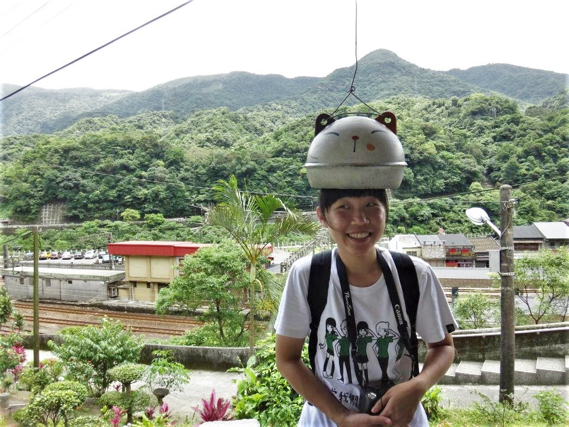

親愛的北一女孩們，妳們都好嗎?

我是個不善於記憶的人，十年了，那些高中生活的點點滴滴，早已經從我僅有的腦容量裡靜靜地流走，若不是因為身在異鄉讀書、恰逢北一日，大概也沒有機會又這樣讓回憶洶湧澎湃了起來。

突然很想念妳們、想念一起穿過綠襯衫的妳們。

想起以前都要五點半起床趕火車、想起以前都會在火車上算數學、每天都會從很鄉下的四腳亭一路通車到最都市的台北、想起以前高中的我很倔強（也很害羞）。想起以前都會樂隊練習到七八點、再綠衫黑裙的奮力在公園路上奔跑著、進到捷運八號入口、搭上最後一班火車回家。

我記得了，當時高一後恭第一學期結束，我是班上第 23 名，當時容瑄學姊來找我，我一直哭，而她則是一直笑我、直說我太可愛。在16歲女孩眼裡，那些如天大的事情，現在看來都是好可愛的回憶。

我也記得了，因為又萱學姊與懿尹學姐而進的北一樂隊（閃亮亮的樂隊啊），想起暑訓都要邊跑操場邊唱歌，冬天下雨還是要邊聽音樂邊走圖，當時的操場都會打舞台燈，儀隊在旁邊練槍，我們就在一旁淋雨走圖。當時可以精準的八步走一碼、可以穿著帶跟的靴子遊行十公里、還可以一連舉上好幾首歌的小號（健壯的小手臂）。一群女孩在一起，好像就沒有甚麼做不到似的。

綠襯衫，是一身，也是一生的驕傲。感謝北一女中給了我如此美好的青春歲月，願當初一起奔跑微笑享受陽光的妳們，現在也都一切順心喔。

愛妳們。

