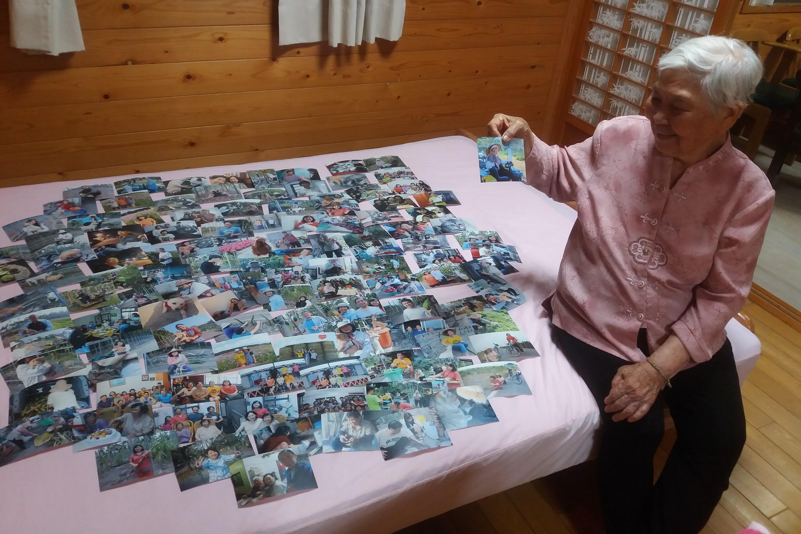

與其說是寫給外婆，更想表達的是對整個大家族的依戀，那些她的兒女、與她兒女的兒女，因為血緣、語言、共同記憶而聚起的家。

這幾天舉辦了所謂的「家族旅遊」，把舅舅、舅媽、阿姨、姨丈與表兄弟姊妹們幾乎都找齊了，一起到台中山上過了一晚。我們是常見面的，每逢過年或是暑假，總是會回到屏東那個大大的家、那片寬闊的田，一起聊天打鬧，享受著被人群圍繞的幸福。我都還記得小時候的我特別依賴人群，從熱鬧的屏東回到冷冷的台北，總是又哭又鬧地說覺得孤單，一定會在電話裡跟外婆聊天、要外婆來台北陪我，不知道她有沒有記得。

小時候都會想，如果不用長大多好。

小時候屏東的家裡種檳榔，大家的共同記憶就是不分老幼過年時一起摘檳榔，別人在放鞭炮，我們就把檳榔搬到電視機前邊看邊摘，後來還有一起削甘蔗、摘木瓜、挖芋頭、包酪梨、種火龍果苗…在屏東的生活跟著一群人一起，好像就能有永遠都做不完的有趣事情、每次都會有特定的主題讓大家一起玩耍。這些都是只屬於我們的共同回憶噢。後來田裡經歷了一些變革，當初在田裡打鬧的孩子們也已經開始工作獨立了，每個人也開始各有各的生活經驗。

仔細想想，這些都是從外婆開始的呢，從她到媽媽，再從媽媽到我，何其幸運可以擁有這樣貼近自然的成長歷程，也總是有這群我喜愛的人一直陪伴著，儘管還是無可避免的長大了。這此特別送給外婆歷年來屏東家裡各種照片，數一數，也有七年了呢，最想送給外婆的應該是回憶吧，畢竟那才是甚麼都無法取代的、最珍貴的事情。

我特別請外婆選了一張她最喜歡的照片，她笑了一下，選了自己在割草機上笑的燦賴的那張。

