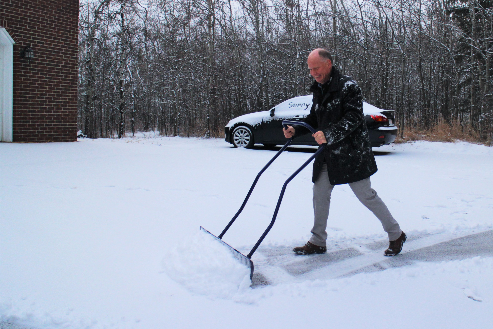

#### # I
我沈浸在攝氏兩度的空氣裡，每一口呼吸，都能嗅到冰箱冷凍庫的味道。但身體並未感到寒冷，因為我正揹著一身家當，快步穿梭在繁鬧的街道中。

現在是學校的期末考周，大家都在水深火熱，但我還是厚著臉皮用很多天的「加班」跟善良的指導老師換了長長的假。我說，我很想去東邊一個寒冷的城市看看。

自溫哥華向東北穿越落磯山脈，Calgary，就靜靜坐落在高山的另一側。這個城市可是冷得出名，冬天零下二十、三十，都是「正常」的溫度，不過我當然不是為了這樣的寒冷而去，而是為了雪鴞。在嚴寒的冬天，雪鴞會從北極南下，Calgary 平坦空曠的田野濕地，正好就是雪鴞覓食的最愛。雖說自己從來不是一個專業的賞鳥人（甚至連入門都還牽強），但一想到可以到一個雪白的城市，目的為找尋一種雪白的鴞，光是想像就令人興奮不已。

穿過車站人群，我走上巴士，並挑了一個靠窗的座位。座位的前方是兩個小朋友，右前方他們的媽媽不停低聲嚇止他們的打鬧。坐我旁邊的女孩已經累的睡著，還不時靠在我身上。巴士緩緩出站了，我與生活了三個月的溫哥華暫時道別，往另一個更冰冷的城市去了。

#### # II
雪白的世界，璀璨卻帶有淡淡的蒼涼。

我常常看著半冰半水的河流發怔，有時候想著現在這溫度正是水的固液相界線，為河裡的生命覺得冷; 有時候閉上眼聆聽河流流在冰層下的聲音，咚咚咚，和平常習慣聽見的河流聲很不同。
我到的時間還早，這條河流還沒完全被冰封起來，白雪下的冰層還不夠堅固，冰層間的縫隙還未被填滿，而縫隙之中，我還聽得見潺潺流水的聲響。那聲音，聽起來像是流在血管裡溫熱的生命。

也許再半個月之後吧，落磯山脈的雪就會將一切覆蓋，河流就不再是河流，而是精湛的藝術品; 樹木就不再是樹木，而是冰封的記憶。 一直要到再也沒有人駐足聆聽河流的時候、一直要到再也沒有人記得這裡曾經有著閃爍的生命的時候，四時交替，也許會再還給大地一片閃閃動人的森林。

#### # III
在前往 Calgary 的路途中，我停留在洛磯山脈上的一座湖邊，住了幾晚。就在住宿的地方附近，一條碧綠的河流有個名字，叫 Bow River。我花了一整天的時間，就這樣隨著河流的蜿蜒，慢慢散步。

對我來說，要乖乖的待在步道上，需要壓抑很多衝動。「河岸的冰看起來好像很穩固，也許可以踏上去看看? 」、「森林深處的雪地上好像有動物的足跡，也許可以靠近去看看? 」、「那棵樹長得好特別，好想過去拍照。」雖然自己對於雪地的經驗不多，但大部分時候仍可以處理走離步道的突發狀況，像是陷在雪深及膝的地方、像是覺得好像迷路了、又像是忘了時間讓自己的身體冷卻下來。

但今天的經驗，真的讓我嚇到了。

透明的冰層綿延至河道中心，碧綠清澈的河水奔流其下，像是水晶球一樣閃爍動人。我被迷住了，於是離開步道踩進河岸深及小腿的雪，一步一步的靠近「看起來」很堅固的冰層。然後一個深陷…我感覺到腳踝漸漸冰冷，是水！我一個轉身，掙扎著往岸上的雪攀去、讓自己的雙腳離開河床，定睛一看方剛踩出的大洞，水其實不深、冰凍的感覺也還沒有完全滲進靴裡，但我的心臟大概停了三秒。在零下七度的雪地裡弄濕自己的雙腳，這絕對還不是我可以應付的意外。

後來才知道，像這樣河岸旁的脆弱冰層，叫做 cat ice。表面上看起來晶瑩剔透，不到兩公分厚的薄冰下是空氣夾雜著流動的冰水（才會顯得閃爍動人）。但冰層在沒有水體的支持下非常脆弱，連貓咪步行於其上也得小心翼翼，更不用說是與冰雪初次見面的我。

雪白的天地，在她宏偉的美麗面前，我能感受到自己是何等的脆弱。

#### # IV
一般來說，在雪地裡走路時，只有踩在雪上的沙沙聲，還有遠方渡鴉的咕嚕嚕聲。但這天很不一樣，當我漸漸走近步道盡頭時，一陣熱鬧沸騰的狗吠聲慢慢的清晰。

是雪橇犬！我第一個瞬間就意識到自己的幸運。

一輛大卡車停在滑雪道的路口，卡車上整齊擺放著一格一格的木箱（有點像臺灣運雞用的木箱，只是大上許多），四條長鐵鍊分別綁在道路旁的柱子上，大約是小腿的高度，哈士奇們就這樣有條有理的被繫著。總共有四輛雪橇、有二十八隻狗狗，我好奇的在一旁算起數來。

Craig，其中一位 dog musher，看我在一旁探頭探腦的樣子，微笑著走來跟我介紹他們的隊伍。Byfer，一隻臉上有帥氣傷疤的棕色狗狗，是整個隊伍的領頭犬，「身為領頭犬第一要件就是要有自信、可以不怕跑在所有狗狗前面」，Craig 一邊拍拍 Byfer 的頭，一邊跟我說。後邊的還有 Ninja、Pudding、Copper、Digger…，Craig 如數家珍的一一跟我介紹。一個隊伍通常有七到八隻狗狗，每隻狗狗都有自己的性格和喜好，他說他們的團隊總共有九十六隻哈士奇，他每個都能記住名字。
「牠們就像我們的朋友一樣。」Craig 笑笑的說。

#### # V
這些哈士奇狗狗每天大約要跑七到十四公里，像今天比較溫暖（零下七度），就不能跑太多，以免狗狗的體溫過高。

狗和人不一樣，牠們沒有大量汗腺可以快速排除體內的熱，所以只能靠吞吐冰冷的空氣跟吃冰來降溫。

「吃冰?」我疑惑的問。

「恩，當我們跑到一個段落，狗狗會停下來咬地面的冰吞下，牠們需要降溫。」Craig 說。我用難以置信的眼神望向狗狗們。

「 相信我，牠們最愛的溫度是零下十五到二十度。那時的牠們會非常的開心！」 零下二十度啊…我為生活在臺灣的哈士奇感到炎熱難耐…。

忽然間，狗群裡出現一陣騷動，狗吠的聲音明顯增大、大家看起來都躁動不安，而其中幾隻狗狗甚至用力的蹬牠們的後腳想掙脫鐵鍊。

「牠們很興奮，我們就快要出發了。」

#### # VI
幾位 dog musher 開始了出發前的準備。

每隻狗狗都會被仔細檢查牠們的腳掌（有種開車前要檢查輪胎的感覺），若被發現有龜裂，就要塗上類似凡士林的乳液，並穿上小小的襪子做為保護。檢查完後牠們會被戴上一套挽具，再縱列繫在一條由雪橇延伸出的主繩上，以領頭犬為中心，而後縱隊列齊。

Criag 走向我，指著遠方一個藍色路障，他說他們的隊伍等下會從那塊路障的左側跑過，我可以在那裡等著準備拍照。我點點頭，趕緊跑去，心情既興奮又緊張，因為我知道要拍正在奔跑的狗狗並非易事，而我的機會不多。

「Go！」，原本吠叫不停的雜鬧聲瞬間安靜，轉而是二十八隻腳掌落在雪地、節奏分明的聲響，雪橇嘩-- 的一聲穿過我眼前，狗狗們各個眼神堅毅、帶著兇猛而認真的神情。太帥氣了、真的太帥氣了！

我滿心讚嘆的目送著奔馳的雪橇，一直到那沉穩的步伐聲漸漸消失在滑雪道的盡頭…我站起身拍拍身上的雪，正當準備離開時，竟聽見幾隻被留在車上的狗狗正在哀鳴（狗狗必須分趟輪流留下，以獲得足夠的休息）。我走近籠子，拍拍牠們的頭。帥氣的狗狗阿，你一定也很想跟同伴們一起奔跑在雪白的天地吧。

是啊，那才是你的天命、那才是你的世界。

#### # VII
好像是世界上許多著名的湖泊，都會以女子的姓名來命名，像是非洲第一大湖 Lake Victoria、像是美國五大湖之一的 Lake Erie，又像是我眼前這座雪白的湖，Lake Louise。

你說，哪裡有湖了？相信我，眼前這片白茫茫的雪地，在三個月前，曾是一座波光粼粼、碧綠湛藍的壯麗湖泊，只是最近天氣太冷，連她也不小心被凍到了。

我就這樣漫步著，嘗試穿越整座湖泊， 因為沒有樹木阻擋的緣故，越靠近湖心，冰冷的風就越發強勁，我的手被凍得痛了，只好邊走、邊把雙手藏在衣服口袋裡取暖。幸好我來得早，湖面上還沒幾個人，讓我可以有機會安靜的聆聽這座湖泊的聲音。我閉眼駐足，冰冷的風無情地颳過臉頰。

沒有，這裡的冰層下沒有流水聲。

在我前方的是兩道氣勢磅礡的冰川；兩旁則是佈滿冰雪切割痕跡的壯闊山壁。一個人漫步在這樣的時空裡，任何一道溫暖的陽光、冰冷的霜雪，任何一條冰川的痕跡、岩石的縫隙，都可以讓我感受到自己的渺小。

落磯山脈八千萬年的湖泊記憶，而我，只不過是個曾經駐足凝視的過客。

#### # VIII
以前在台大時上過一堂課，老師把整班的學生全帶上了溪頭，要我們在野地裡學著找「動物的痕跡」。這些痕跡可能是排遺、毛髮、食繭或是狩獵殘留的食物，還有更容易觀察的地面足跡，或是樹幹上的摩擦、咬痕。

我只記得當時的自己毫無戰鬥力，眼睛都不知道該往哪裡對焦，土壤上枝條間的細微變化，就在眼前大方展現，而我卻毫無知覺（我當時甚麼都沒找著…）。我想，如果能把當時的場景換到雪地裡，我一定能有更多斬獲。

雪地上的足跡非常清晰易見，想不看到都難。我自己看過的足跡有 Lynx（山貓，腳印像貓）、Wolf（灰狼，腳印像狗）、Hare（野兔，前後腳印尺寸相差甚大）、Deer（鹿，偶蹄較小）、 Elk（麋鹿，偶蹄較大）。辨別的依據主要是形狀以及大小，唯獨足跡大小會因為融雪而有些許的變化，因此不能完全依賴。若能更仔細探究一些細微的線索，像是拖曳的痕跡、足跡密度、步伐深度，除了辨別物種外，還可以多說出幾段「故事」。像是動物的個體數目、移動方向、移動速度、停留的時間等等。

那這照片中的足跡又有甚麼故事呢? 我猜，應該是有隻 deer 走到河邊想要喝水，卻不慎踩著了河岸的冰摔了一跤，跌的疼了，才又滿心不悅、悻悻然地走回森林…這樣的一段淒美故事吧。

#### # IX
我把自己埋在青旅公共空間的沙發裡，每天的日記工作已經接近尾聲。十點半，不早不晚的時間。在我前方十米的地方，三名男子正在打撞球。

A 戴著黑色毛帽，灰藍色棉T、寬鬆的牛仔褲、黑色休閒鞋，沒有鬍子，但好像有雙漂亮的藍色眼睛。B 一頭捲捲金髮，有鬍子，黑色棉外套、牛仔褲、Adidas 的球鞋，他是三個裡面撞球技術最好的。C 一臉酒醉的樣子，沒看清楚長相。

平常時候的我很不喜歡吵鬧的環境，但此刻伴著昏暗的燈光、還有球檯上俐落的撞擊聲，竟覺得十分享受。眼前這三個男子的競賽，像是一場漂亮的歌劇，正在上演。又不知為何，突然想起兩年前第一次隻身出國，在菲律賓。那時候的自己很緊張很害怕。而現在呢，沉浸在陌生的環境裡竟已經能像呼吸一樣自然。我很驚訝一個人可以改變得這麼快。

在某些安靜的時刻，總會想起過去的自己和現在有多不一樣，年少時狂熱的事物、厭惡的事物、緊張的、期待的、害怕的、崇拜的，全都淡去了。我就像是逆流而上的魚，任憑記憶與情感如流水一般流逝在身後（然後遺忘）。只有一些重要的片段，才會被我小心地撿起來放進口袋裡。

但我還是一直相信，深刻而永恆的感受是可以存在的，也許就像虔誠的信仰（雖然我沒有）、或真摯的愛情（可惜我也還沒真正體會過）。也許就像大衛‧梭羅在森林生活兩年後對於自然的體悟。是如何的信仰自然，才能寫下如此肯定的詩句: 「I went to the woods because I wished to live deliberately, to front only the essential facts of life, and see if I could not learn what it had to teach, and not, when I came to die, discover that I had not lived.」

如果有一天，我可以不再遺忘、不再任憑記憶流逝; 如果有一天，我能夠更細膩的掌握那些幽微的情感，並聽得見生命傾訴的話語，我一定會為自己感到很欣喜的。

#### # X
這故事說來話長。總之，我今晚就住在這個像城堡一樣的地方。

一早天微光，搭上了從 Lake Louise 前往 Calgary 的巴士。聽說這週 Calgary 的天氣異常溫暖，大概有攝氏兩、三度，這消息有好有壞。一則我再也不用擔心受凍（山上冷怕了），但這也代表不會有雪、也許會降低看到雪鴞的機會。不過總是會有有趣的事情發生的，所以不擔心。當我正望著窗外發呆時，手機震動了一下，是 couch surfing 的 host 傳來的訊息，說今早忙碌，沒辦法到巴士站來接我，問我可否自己搭車到他工作的地方見面，並附上詳細的交通指引。我說好，待會見。

巴士緩緩離開落磯山脈，窗外的景象從樹林轉為城市的建築。下巴士後順著指引，大約半個小時就到了約定的地方，這是事情不太對勁的開始。在我眼前的是個校園耶…我東張西望，發現自己身在一個叫做 SAIT（Southern Alberta Institute of Technology）的地方…難道我的 host 是個教授? 我都還沒做好心裡準備，M 就出現在我眼前。

我自認自己看人的眼光很準，哪些人是危險的、哪些人的心地善良，大概十分鐘的對話內就可以判定。而我眼前的這個人，年紀大約五十，銀白色的短髮還有紳士般的穿著，從第一句對話的態度我就敢打包票，絕對是個善良的人。

故事還沒結束。我就這樣被邀請到 M 的辦公室，像是面試學生一樣坐在辦公桌的另一側，面試的問題大概是:「How was your stay in Lake Louise?」、「How is your study in Vancouver so far?」、「What is your plan for your trip in Calgary?」。前面的都不重要，反正我很認真的回答了最後一個問題，我說我想要找雪鴞。於是我們就花了一個小時的時間在電腦上查詢雪鴞熱點，雪鴞大多出現在 Calgary 東側的湖泊，他說他明天剛好放假，可以開車帶我去找找看。我說好好好，眼睛都快掉下來。

我們談話的期間有幾個人進來找 M，像是有重要的事情要討論，於是他就留我一個人在辦公室。我一看機會來了，趕緊摸了一張桌上的名片、拿起手機查這裡到底是什麼地方、人家到底是不是教授。雖然我已經很相信這個人，但多認識一些總不是壞事。Google 告訴我，人家是整個機構的 Academic Chair。嗯，不太明白是甚麼概念，但聽起來是個善良的職稱。

「Do you want something to drink?」M 與同事討論完回辦公室後，笑笑的問我。「Milk!」我直覺地說出自己的心聲，然後換來一個錯愕的表情。「Oh, maybe some coffee with milk.」，趕緊幫自己圓場。

十分鐘後，我的手裡就捧著一杯溫熱的拿鐵，坐在副駕駛座上。窗外的風景和溫哥華很不同，這裡的人口稀疏多了，沒有高樓大廈，而有一片一片的廣大平原。我還看見幾匹馬，M 說這裡的人會養馬當寵物。一路往西約莫二十分鐘後，已經離開市中心很遠了，我們的車繞了幾個彎，緩緩停在這棟建築前。

我傻住了。「So, is it your house…?」

#### # XI
是的，眼前這座城堡就是 M 的家。我一開始還以為也許房子裡有隔間、也許住著三個家庭。並沒有。這房子就住著 M 與他的一對兒女。

我敢說我真的嚇到了，也許總統住的地方就差不多像這樣了吧，距離市中心二十分鐘遠，一旁有一整片白楊樹林，後院有池塘、溫室、倉庫還有工作間，三層樓的房子大到我會迷路（認真的會迷路）。M 帶我走上走下認識房子，幫我安頓好後，笑笑的遞給我一杯牛奶（噢，被記得喜歡喝牛奶了）。M 似乎覺得我對於房子的驚訝很有趣。

然後他又做了另一件更驚人的事。

「I am sorry, I am going to leave yourself here for a while.」 M 說他有重要的事情要回學校一趟，晚上六點前會回來。我說沒問題，那如果我想出門玩耍要怎麼鎖門。他說他平常都不鎖門的，如果真的有小偷要進來偷東西，他寧可他開門進來也不要打破窗戶，這樣他還要修理，所以我可以放心的探索他們家，也可以出去探勘一番。我說好，然後他又從冰箱拿出牛奶，幫我添了一些，轉身就出門了。

「喀。」隨著關門聲落下，我轉身看看時間，現在是下午兩點十五分。我才認識這個人四個小時，然後他就可以相信我不是壞人、一個人待在他們家?還說我可以在他們家到處探索一番?我趕緊沖個熱水澡，好讓自己清醒一些，確認自己不是在作夢。

不是夢，這樣美麗的地方與有趣的人真的存在。不過我對華麗的房子沒太大興趣，整頓好後立馬跑出門探索他們家西南方的小山丘。一片白楊樹林後是一片漂亮的草原，草原上還有冰雪的痕跡，應該是幾週前留下的。我小心的閃過草原上一種花的刺，挑了一個大石頭坐下，山丘的斜坡正對著西邊的落磯山脈與平原，我就這樣吹著風，享受生平第一次 Calgary 的夕陽。

朋友都跟我說冬天的 Calgary 沒什麼有趣的。可是我怎麼第一天就遇到了好有趣的事情、認識了很奇妙的人。並且真心期待著，接下來生命將帶來的所有驚喜。

#### # XII
從遇見M的那瞬間起，一切經歷都像作夢般的不可思議。先是辦公室內忐忑不安的面試、再來是郊區宏偉華麗的城堡，而此時最讓我驚奇萬分的，則是 M 家的後院。

一早我們正悠閒地吃著早餐，M 望著我身後的落地窗，輕聲的對我說「You see the deer?」我一回頭，「是鹿!!」，一群白尾鹿（whitetail deer）就這樣大喇喇地列隊路過M家後院，我用最安靜快速的步伐衝向落地窗，整個人貼在玻璃上看得目不轉睛。太酷了吧…目送牠們悠悠哉哉的走過後，我轉頭問:「Where do they usually live in?」我想知道附近是不是有白尾鹿的棲地。「I don’t know. They didn’t give me their address.」 ，M 笑笑的回答。

除了鹿之外，常見的訪客還有小鳥們（chickadee, downy woodpecker, nutcracker, merlin）、麋鹿（Moose），偶爾還會有郊狼（coyote）路過。M 說得一派輕鬆，一邊給我看他之前幫這些動物拍的照片。

「What an amazing place that you are living in…」這大概是我這幾天，最常跟他說的一句話。

#### # XIII
提了那麼多有關M的故事，應該也要好好介紹人家一番。這位就是名片上寫著 Academic Chair 的 M。職稱雖聽起來嚴肅，內心也不過就是個大孩子。

前晚 Calgary 降下了好久不見的雪，一早 M 在前庭忙著剷雪，我在一旁閒得發慌，就開始抓雪球往人家身上丟（可以看到衣服上的雪跡斑斑）。終於找到事情做的我，玩得不亦樂乎。只見他停下手邊工作對我說了一句:「Now, you are in trouble.」，然後就是一陣猛烈的雪球攻擊，我一下子就被打趴在地上（想當然，人家可是在雪城長大的，雪球技術自是一流）。

還有一天早餐，我透過窗戶望著他的後院，突發奇想的問他:「Can I skate on your frozen pond?」，不意外的換來一個疑惑的眼神。但十分鐘後，我就穿著他從倉庫翻出來的冰刀鞋，在小小的後院池塘，體驗了我人生的第一次溜冰。不驚奇的，M 的溜冰技術也是一流，雖然我自己摔得七葷八素，但那天的後院，我們倆的笑聲從來沒有間斷過。

幾天晚上，他會帶我到後方的小山丘散步，教我認星座、認植物，我們也會一起躺在草地上聆聽動物的聲音（有時會聽見鹿的步伐聲，還有遠方郊狼的低嚎）。我跟他說，他讓我想起了在台灣讀書的時光，尤其是在山上度過的那些日子。年輕的我們，總愛看著星空談心。

那晚的空氣很寧靜；而那天的星空，不知為什麼，特別的明亮。
能認識 M 這樣特別的朋友，是我今年冬天最溫暖的禮物。

#### # XIV
時間不多了。在 Calgary 剩下沒幾天，一直說要找的雪鴞卻一點下落都沒有。

為了增加找到雪鴞的機會，決定參加了Calgary 區域的 Christmas Bird Counting （CBC）。CBC 是個由民間發起的鳥類普查計畫，每年在聖誕節左右，北美各區域的賞鳥人就會聚集在當地設置的樣區，進行每年一度的鳥類普查，因為資料涵蓋了大範圍的時空（自1900年起樣區遍布北美），收集到的族群資料還可作為學術用途。

調查的方法很簡單（嗯，概念很簡單），也就是在一個固定的地理區域內，用一整天的時間將所有見到的鳥類物種、數量詳盡的記錄下來（需避免同個體重複計算）。今天的野外調查，我們小隊有一個人負責記錄，而其他「狙擊手」就負責清楚地喊出數據:「Four magpies!」、「Ten chickadees!」、「Two bald eagles!」，夥伴們此起彼落的聲音，如機關槍般精準快速。

而我身為一個新手，也是學的很忙碌。一下子要拿著望遠鏡觀察那些「已經被捕捉」的鳥兒們；一下子又要拿起筆記寫下沒聽過的物種，眼睛跟手都快忙不過來。一整天下來我們的小隊共觀察到 17 個物種，其中包含了肥滋滋的加拿大雁。但沒有雪鴞。

對，還是沒有雪鴞。不過不知道為什麼，我的心裡有個預感，我們好像，就快要見到面了。

#### # XV
我是一位獵人。而你，是我此行的目標。

打從第一天的旅行開始，路上的人問我為何來 Calgary，我的回答都是:「想要看雪鴞。」好像就這樣有神奇的魔力似的，Couchsurfing 的 host 說可以開車載我去找、Christmas Bird Counting 的夥伴說可以空出一天陪我去看、經過 Calgary Zoo 有姐姐送我一張 free admission。在大家的幫忙下，我終於見到了你。親愛的你。

見到你的感受很美妙，好像盼望了三世的情人，終能相見。雖然我對你來說，是敵人、是潛在的威脅，所以你才會在我望向你時，瞪大了黃澄澄的雙眼（啊，那美麗如貓的雙眼），監視著我的一舉一動，並在我小心的向前邁步時，頭也不回地轉身離去，並留給我那只有在夢中才聽過的、如驚恐剎車聲的 call。

我們之間的追逐，就在短短的幾十秒內升到故事的高潮，緊接著落幕的空白。我望著空蕩蕩的枝條，笑了。我笑自己在你面前的粗魯與愚笨、笑自己在你的面前顯得的平凡。但對我來說都已經滿足了，能親見你雪白的身影一面，真的滿足了。

而親愛的雪鴞，你可知道嗎。在為你而來的這段旅程上，最珍貴的不只是最後見到了你，我還真真實實地體會到了溫暖的人心、與信念的力量。

#### # 後記
我熱愛旅行，也不怕探險。好像身體裡奔放的靈魂，只有在陌生的那裡才可以獲得安撫。但我也漸漸的體會到，對於一趟旅程，最珍貴的不是這場夢境有多美，而是即便在夢醒之後，我還可以帶著一些省思與體悟，用新的角度去欣賞清醒之後的世界。

「Thank you for being yourself.」這段旅程中，有人這樣對我說。

他說跟我相處的時候，總是能感覺到很溫暖的能量，很真實、很愉悅（當時我們才認識彼此不到半天）。我從來沒有想過，原來自己也能像這樣感動另一個人，而且是憑藉著一個自己完全不知覺的方式: being yourself。我當然不懂，因為我看不到自己和別人有甚麼不一樣。但也許我該慢慢學會相信，也要好好珍惜這個藏在自己心裡的禮物。

原來學會聆聽自己的聲音，學會信任、學會認真看待眼前的每分每秒，也是一件會感動別人的事情嗎? 那麼明日，我將帶著更澄澈的雙眼，與溫暖的心，去細細體會真實生活的一切。旅人啊，謹記著每次回家後帶在心上的感受，是屬於妳的，旅行的意義。

說好是尋雪而去的，怎麼著，卻不小心尋回了滿滿的溫暖。

