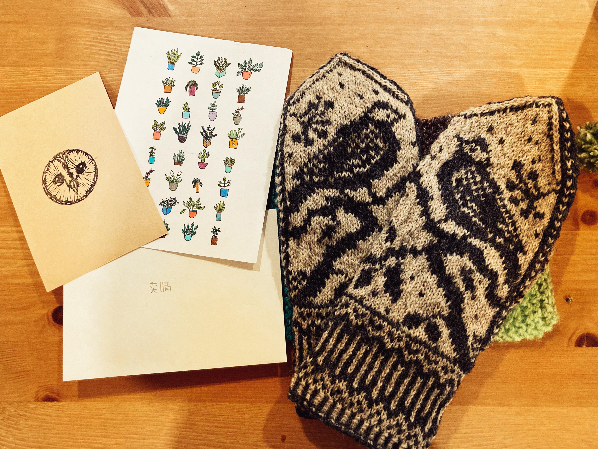

撕開 Canada Post 堅韌的包裝，看到藍灰色的毛線織品……總是會有一些包裹，收到時會瞬間感動落淚，像今天這件就是（泣）。

“White-eared Sibia inspired mittens for you… lots of love.”  Z 在信封背面寫了個好端正的「奕晴」，要知道一個初學中文的人能寫出漂亮的字有多不簡單。

聖誕節時到 S 與 Z 家裡拜訪，送了他們一張白耳畫眉（White-eared Sibia）的畫，過去也曾送過白耳畫眉的書籤，誤打誤撞剛好成了一系列，我說，這是台灣特有種，很美噢，叫聲迴盪在森林裡很好聽，他們的眼睛都亮了；那時，看到她一雙好漂亮的 mitten 放在桌上，上面有很精緻的鳥的圖騰，「是我自己編的噢！」，換我的眼睛亮了。

眼前這雙手套上有兩隻漂亮的白耳畫眉，仔細嗅一嗅，還有他們家的味道。曾經有好多回憶的地方，一起喝 gin & tonic、包水餃、一起看電影然後哭成一片（只有我哭）、睡在客廳然後一起早起出門看鳥…然後我畢業了、然後他們畢業了、然後各自都在其領域工作著。然後是電話裡的各種冒險、笑聲、與淚水，他們都在。

“One swallow does not make a summer, but one skein of geese, cleaving the murk of a March thaw, is the spring! – Aldo Leopold”，我說這裡的冬天好漫長，你們說那就更值得期待春天的痕跡。

今年最珍貴的情人節禮物，就是你們。

PS. 自從來到北方小鎮後，生活都慢了下來，也開始了手寫信的日子們，發現手寫文字、還有等待與期待的過程，很溫暖。

