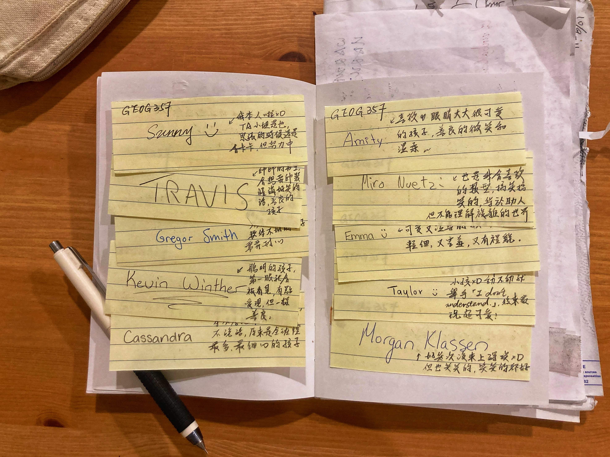
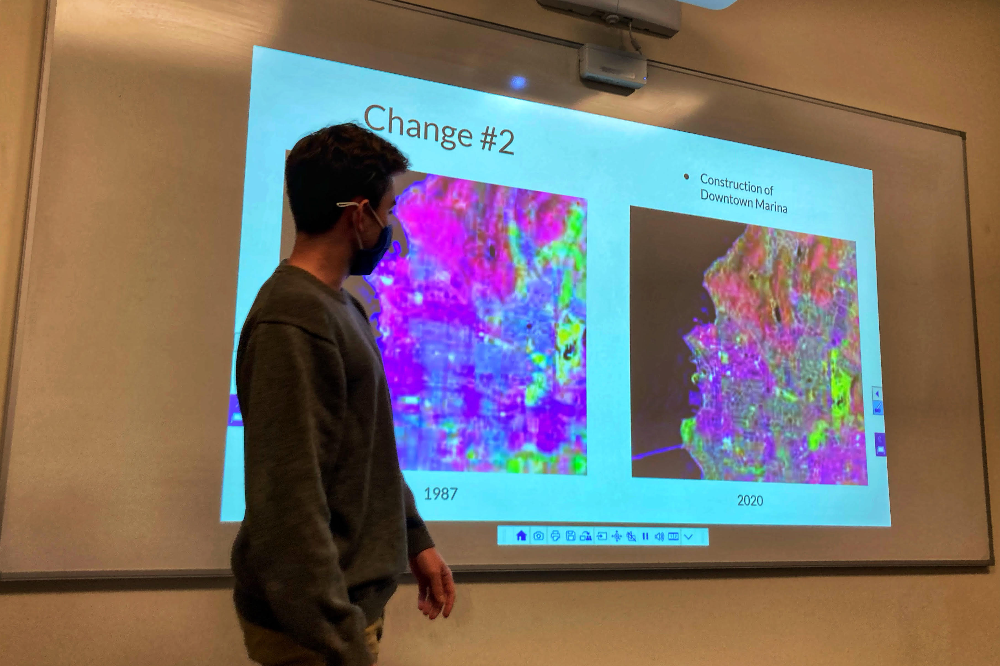
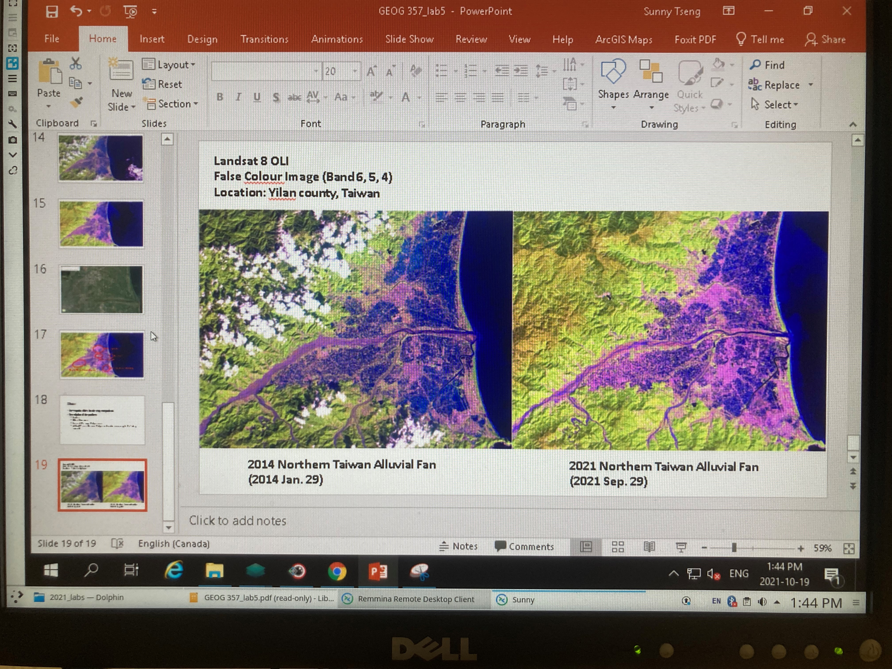
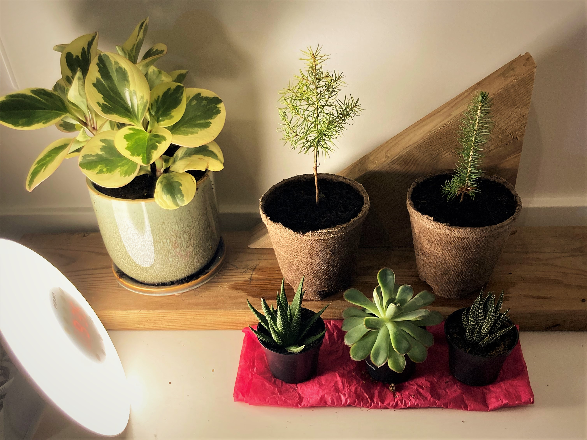
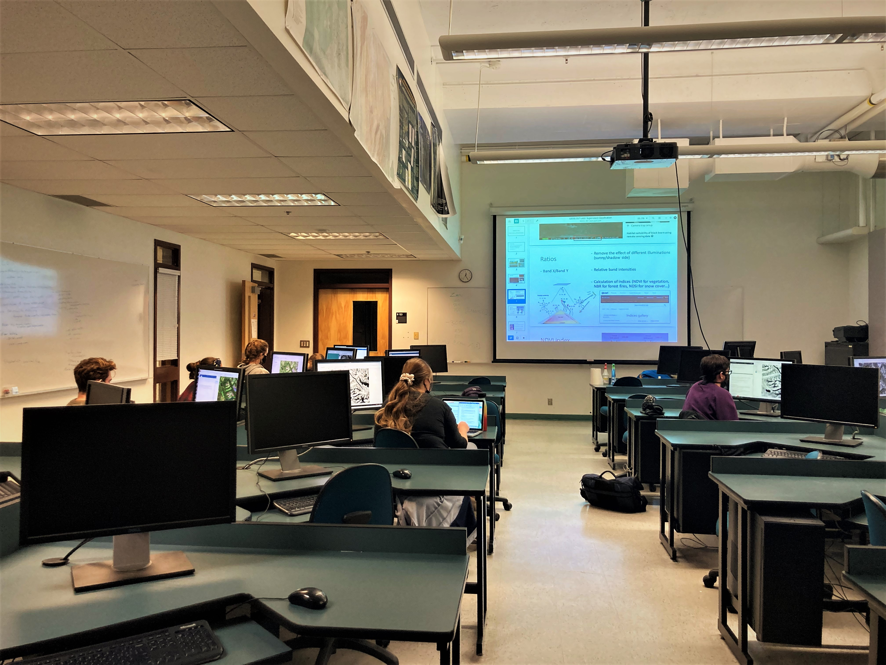
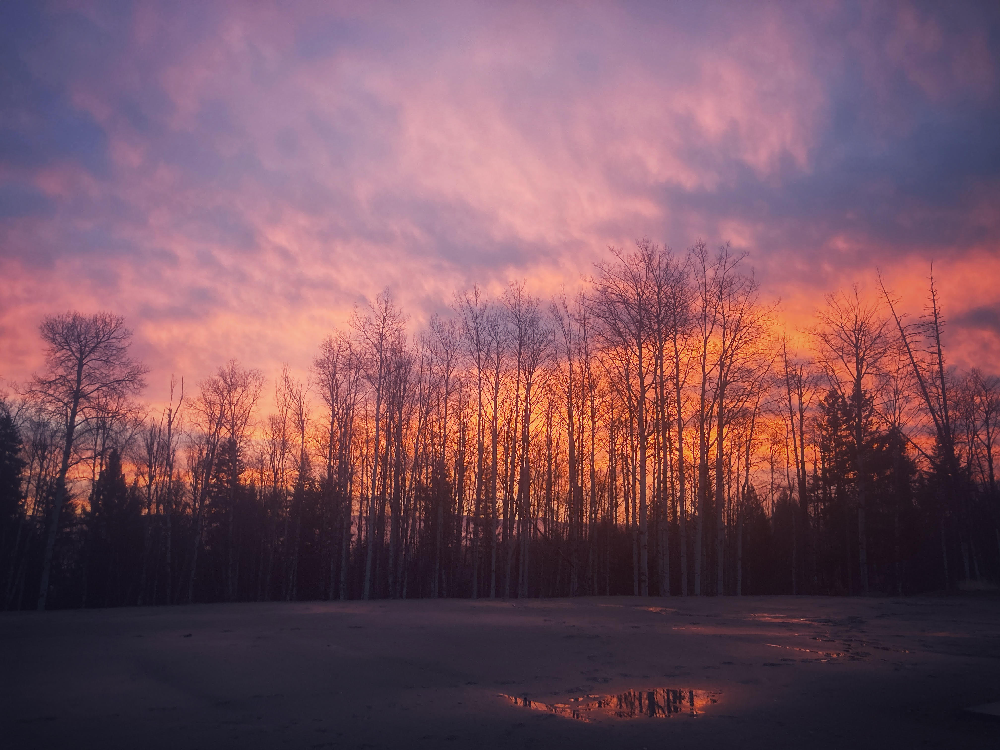
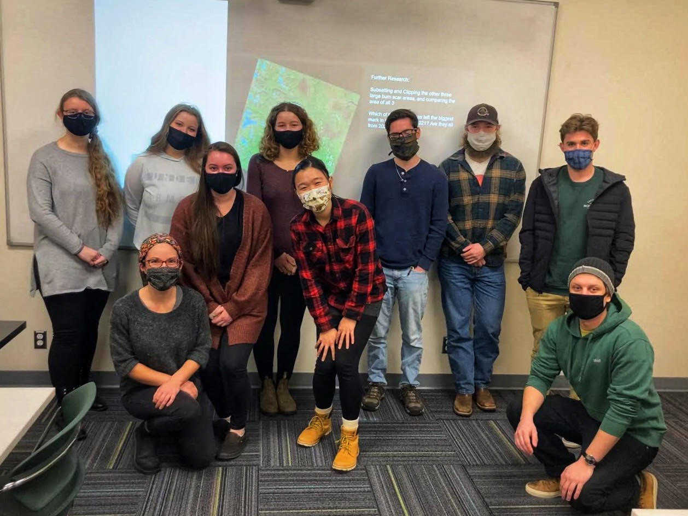
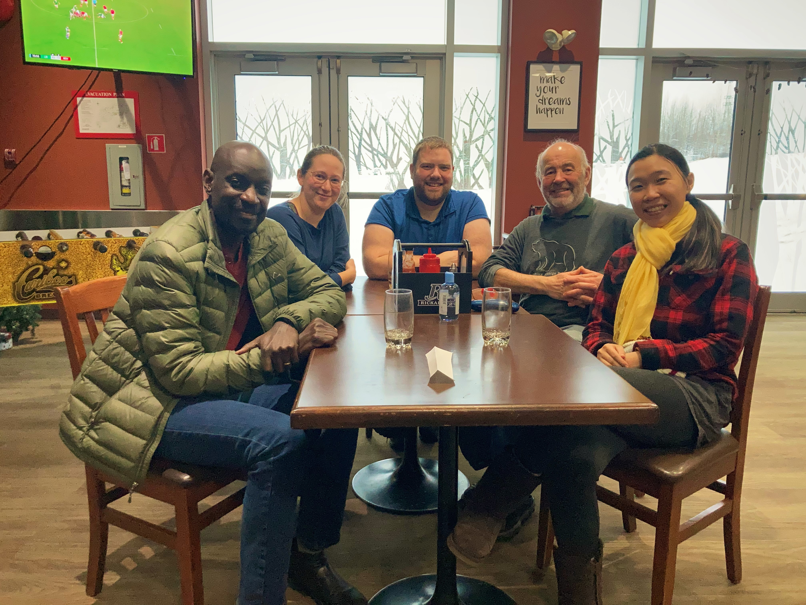

#### # I

初到加拿大北方小鎮，接收到的第一份任務，就是教書。
一堂課教大學生徜徉於衛星影像、另一堂則帶研究生著手統計分析。因為年紀相仿又個性單純，以下簡稱小朋友們。除了自己的研究外，大部分都在設計課程、改作業、教課，光是這些大概佔了我一週 20 個小時的工作時間（其實不該這麼久，但我有輕微的完美主義），Derek 爺爺說，負起責任是好事，代表這個大學對妳的相信，也把妳視為一個未來學者在培養。

說到相信，曾問主講老師是否要在教課前看過我設計的課程。沒想到竟得到「Sunny you can decide, I trust you.」。不知哪來的信任，但正因這完全的自由讓我每周都有了充滿歡笑、肚子很餓的課堂，一起和小朋友們看熊、分享露營趣事、討論到哪裡買冬季裝備、還有一起玩遊戲的週二。

上課第五週，我要十一個小朋友在紙條裡寫下名字。從此，他們進入了我的生活。

#### # II

為了促進（i.e., 強迫）小朋友們在課堂上參與，有時候我會要他們在下課前讓我看看成品。G 就是那種，一定要等到其他人都離開了，才會默默舉手的孩子。

G 很安靜，課堂上不太說話。有回課堂接近尾聲，他舉手要我過去幫忙，一看，螢幕上一片空白。「Sunny, I accidentally deleted all my images… where can I find them?」他懊惱地說，我一楞，心裡翻桌「我怎麼會知道你刪掉的檔案在哪裡…」，說是心裡翻桌，但表面上和顏悅色地問「Can you let me know what happened…」。

其實是有偏見的。在改 G 的作業時，他總是不寫標題、不寫名字，標準難改作業的其中一種，自然在他說出「我把檔案不小心刪掉了」的時候，會先想到「他是不是根本沒有做」。深呼吸，我試著聽他說、耐心的陪他找檔案，發現有個表單有被存下來，裏頭包含著所有需要的數據，他幾乎已經完成了，只是影像處理軟體忽然 shut down 使檔案遺失。

「You did a really good job!」我讀了一下數據，他得到的準確度遠高於其他孩子們，做出來的影像一定很漂亮。「I wish I can show you the map.」他聽到我的鼓勵，笑了，同時也這麼說。想想， G 遺失檔案時的懊惱，也許是因為他太想將最好的一面呈現在我面前、獲得肯定，卻因此害怕我會因為他的失誤而受到責備；所以他會在失敗的時候如此緊張與生氣，也在發現我對他的信任、並獲得正面評價時能展開笑顏。

也許，表象的情緒或行為都有其原因，若能耐心的去看待或理解，就能發現本質上的善良與熱切。從小朋友身上學會的道理（笑）。

#### # III

那天，我花了整個課堂的時間，跟小朋友們介紹臺灣。

轉眼間第七周，小朋友們的技能已經慢慢增長，可以開始做衛星影像的擷取與處理了，這周要做地景變遷，自己選一個有興趣的位置，用衛星影像看十年到二十年之間的地景變化。我說，你們可以選自己長大的地方。

「知道臺灣在哪裡嗎？」我問，「是在太平洋的另一邊...吧！」只有一個小朋友猶豫地回答。我把投影幕上的地圖拉到太平洋另一邊。「這是一個有山有海的地方、是我長大的地方，很美很美的。」我說，「我們有壯闊的山、亮綠的平原、還有綿延的海岸線。」自然地放上了臺灣的山海與暢然的綠，他們眼睛都亮了。我於是拉到東北角，示範著如何用 Landsat 來看宜蘭地區蘭陽平原的地景變化，我們一起看了近十年來城市的擴張、河流的改變、還有港口的建造與變遷。

那天課堂上與孩子的對話，不是問「知道怎麼操作嗎？」，而是問著「這是你長大的地方嗎？」、「為什麼會選這個地方呢？」、「這個地方有甚麼特別的回憶嗎？」。有人選了自己長大的城市、有人選了自己曾經野外調查後來被森林大火燒掉的樣區、有人選看冰河隨著時間的遷退、有人看了曾經居住過的地球遠方…聽他們說著，總覺得自己好像在偷聽他們的故事。

成為了偷故事的人。我以為，知識的學習需要不停的回望自己的生活經驗、與課堂以外的生活做連結，像創作藝術作品一般，不停地從生命的本質向外堆疊包裝，然後讓自己成為獨一無二的個體。

#### # IV

因為疫情的緣故，孩子們上課時都需要帶著口罩，很難透過小小的眼睛觀察他們的情緒反應。除了 A，A 是個眼睛會笑的孩子。

最喜歡眼睛會笑的孩子了。那天上課，我已經在講台上講解 lab 內容，A 才匆匆忙忙地從前門低頭進教室，手上抱著一個保麗龍箱，坐到位置上後，她禮貌性地給了我一個點頭微笑。「很罕見呢」我心想，她從來不會遲到的。

開始操作後，我在教室裡慢慢地晃了一圈，發現 A 正在看著我，微笑的眼睛示意要我過去，她彎下身來打開腳邊的那個保麗龍箱，「Wow! Tree saplings!」，顧不得教室的安靜氣氛，我止不住驚呼，箱子裡的小樹苗們實在太可愛。

「Aren’t they cute? Sunny do you want some?」
箱子裡是各種 conifer 的樹苗，有 Douglas-fir, Black Spruce, Hemlocks…我立馬點頭如搗蒜的說好！然後可愛的小朋友就在下課時捧來了兩棵小樹苗，並留下一句「Enjoy your tree.」。他們分別是一株 Douglas-fir 與 Black Spruce。我捧著滿掌的溫暖，他們，是有故事的樹。

「感覺到小夢想正從房間的角落長出來。」當天的日記裡這樣寫著，「來自一個眼睛會笑的孩子」。

#### # V

「身為一個教學者，會喜歡怎麼樣的小朋友呢？」有回坐在教室前的高椅，晃著腳，看著小朋友們埋頭賣命的盯著電腦，我這樣想著。

讓站在台上的人開心的時刻很微妙，像是講笑話時台下的人會笑、問問題時有人積極回應、大家熱烈的參與妳設計的遊戲、收到作業時會在信中和妳簡單寒喧問候，還有下課後跑過來跟妳說「I really enjoyed the lab!」。最令人暖心的，還有替他們解惑時，聽到那恍然大悟地一聲「Aw, I got it now. Thank you so much!」。被需要的感覺。

班上有幾個小朋友是名符其實的「問題寶寶」，連講義上寫的明明白白都要請我過去手把手的教；有另一種學生，非常的機敏聰穎，幾乎不用任何幫忙就可以完成需要的作業；最後一種，則是自己能夠完成任務，卻會找到更有挑戰性的問題來和我討論（我們會坐在電腦前一起找答案）。會問問題的孩子是讓人欣喜的，會問，就代表他們正活在這個課堂當下；會問，就代表他們知道自己哪裡不懂；會問，就代表他們相信我，相信我的身上有他們想要學習的東西；會問，會讓我真實的感到，一個教學者在這個場域裡的重要性。

想著，還是學生的時候，是不是會害怕在老師眼裡不完美呢？而今轉換身份，身為一個教學者，我可以說，我更喜歡不完美的學生。

#### # VI

因為南方大水的緣故，四條連通南北的網路線被沖斷了三條，學校自上周以來的網路都非常緩慢，間接影響的，就是學生無法順利下載衛星影像，這周只好早早放他們下課。

C 仍然安靜地留到最後，因為教室裡只剩我和她，想說就湊過去打個招呼。C 是個聰明，但非常安靜的孩子，講話很小聲、很慢，她總是用鬆鬆的髮帶綁著一頭金色的頭髮。圓圓的鏡框下有閃躲的眼神，感覺得出來她也想聊天，但害羞。

「How do you feel about the course?」簡單寒暄後，我問。她靦腆的點點頭，「How do you feel about the teaching?」她反問道。「還算可以」我說，「這是我在這個大學帶的第一堂課，自己教書的時候，總會想著對我影響重大的老師們、我所喜愛的老師們，然後嘗試模仿他們的形象和教學方式，希望也帶給你們一樣的感覺」。「傳遞知識以外，我也想讓整個學習的經驗是快樂放鬆的，我也正從你們身上學習」，她聽完我長長一串，小聲地回道「Sunny you did it very well. I don’t think I can teach like you did.」。

總覺得安靜的孩子特別有魅力，每一句話都會讓人深思。
PS. 圖文不符，這是我家後院的景色。拍照片的那天溫度驟降，整個城市因為路面結冰而停班停課。

#### # VII

「You should be very proud of yourself.」這是我最後一堂課，最後一句對孩子們說的話。

曾在世界頂尖的大學（UBC）帶過研究生的課；也曾在北方小小的大學（UNBC）教大學生小朋友，一個像是在互相較勁、火花繽紛；另一個則像是緩緩的陪伴。兩個截然不同的學生特質，卻是一樣的過癮。

想對這群小朋友說的是，不管你們成績如何、表現如何、不管你們口頭報告時講的再小聲、書面報告如何遲交、答案亂寫、如何在最後一堂課才在問我期末報告要怎麼做…光是鼓起勇氣完成一堂課、鼓起勇氣站上台報告、鼓起勇氣認知自己懂的與不懂的，就是一堂大學課程最好的結果。也許，這也是大學教育最重要的，讓你們從一點一點的經驗獲得成就感；從一點一點的感動，去找到自己真心嚮往的所在。

同時，想慢慢練習，讓自己成為義裕一般的老師，如此豁達隨興激勵人心，而又能在漫漫多年後仍被學生們深深記著（握拳遠望）。Class dismissed，小朋友們放飛囉。

P.S. 這是教學小組，有誤會我不是 TA 的 Anthony、很會做餅乾的 Emily、人很好車子被輪胎撞的 Matt、聖誕老公公 Roger!

