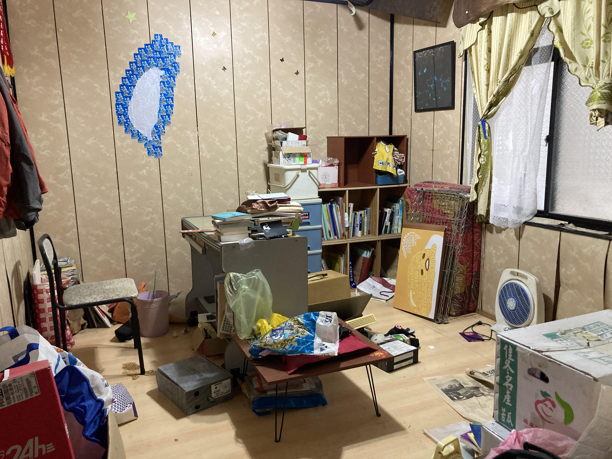
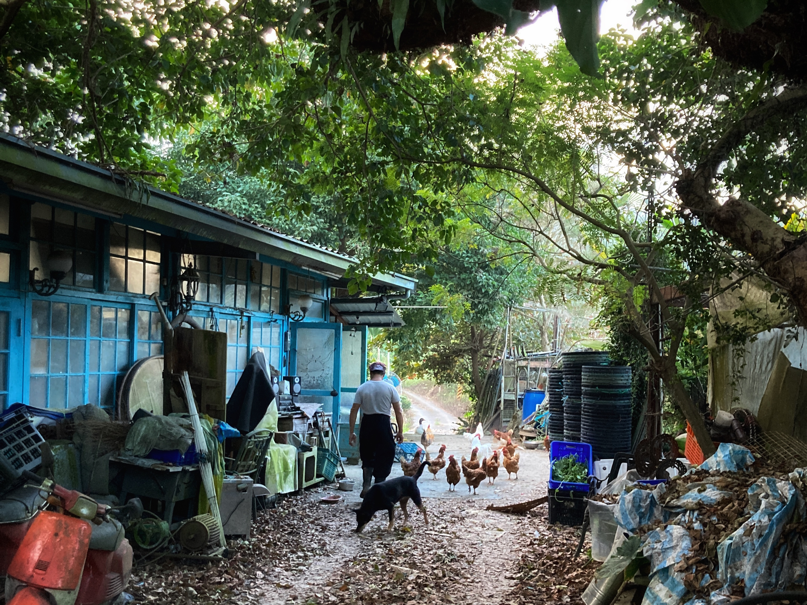
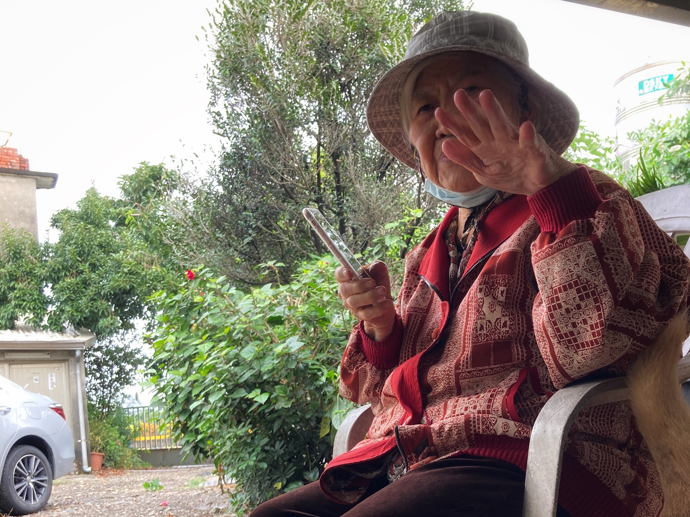

#### # I 旅經 - 東京 [聲景連結](https://on.soundcloud.com/KP5Ri)
回台灣的路上到東京拜訪運動阿蟳，還有遠從大阪前來相會的短髮阿謙。

講起來很順路，但到出發前才意識到已經三年沒有到過加拿大與台灣以外的國家。到溫哥華機場 check-in 行李時還被誤會是拿中國護照，說沒有申請 VISA 無法入境日本，行李條被檢查人員撕掉說回家去改機票，差點心臟病發。

到日本的最大衝擊是語言，沒有阿蟳阿謙在時就只能強迫日本人講英文，日本人很辛苦我也覺得好汗顏，真希望自己的日文能再好一些。待了五天下來只有一個日本人，在成田機場時主動用英文問我是否需要幫忙，還幫我買了到日暮里的車票（泣）。其他所有人都是意志堅定的用日文進行溝通，只好用唯一成句的日文跟他們說「私は日本語が完全わかりません」。

最喜歡的地方是超市、最驚人的經驗是滿員電車。

亞洲的人口密度跟北美真的是天差地遠，食物美味程度卻也是南轅北轍。有想要買一間日本超市蓋在溫哥華的衝動。各種系列的零食餅乾包裝根本滿足了有收集癖好的人們（飽）。

阿蟳一直說日本人是個很壓抑的民族，對我來說最有感的是沒辦法走路走到一半停下來看鳥、不能隨意拍照錄音、很安靜的時候不能講話、常常要把「すみません」放著。但對於一個旅人來說，美食與生活便利的誘惑完全超越這些不方便。論居住的話，可能又是另一個考量。

簡單的錄了一些路上經過的聲景，築地市場、志村三丁目到原宿的公車上、明治神宮、阿蟳家旁邊的公園小朋友、還有阿蟳家旁邊的神社，紀念一下好吃的日本還有好擅長自在拍醜照的朋友們。

#### # II 旅經 - 台北 [聲景連結](shorturl.at/akJ46i)
打下這個標題時，腦中不停浮現「台北不是我的家～」的旋律。

台北的確不是我的家，但它永遠都是回台灣、離開台灣、甚至是在海外第一個會被聽見的城市，每次要跟國外的朋友介紹我的家，都得說「它是在台北周圍的另一個城市」。踏上台北的第一天有些許的焦慮感，可能是因為濕氣太重的緣故感覺毛毛躁躁的；也可能是因為還要跟國外開會的緣故所以心神不寧。這個城市有太多的回憶、太多的連結（畢竟也在這裡生活過八年），反而會讓人想念在國外那種「乾淨」的生活圈。

從北美回到亞州的那種「震撼感」已經在東京用掉了，所以從東京回到台北就像是到隔壁的城市旅行，街道、語言、人的長相、食物、還有道路走起來的感覺。比起加拿大的遼闊，日本和台灣真的相似的可以。

回到四腳亭老家，見到一點都不親人的 Myia，我那雜亂無章的房間還是最令我陶醉，我隨隨便便就可以在那裏待上兩天兩夜翻閱舊物，要認真整理，可能也得花上一兩周的時間。而，竟然在書桌上翻到一本大學畢業前的日記，漏網之魚，看自己以前的文字莞爾一笑。有股衝動，下次回台灣要再待久一點，好好把四腳亭的家整理起來。

自從爸媽搬到暖暖新家後，才意識到原來人的記憶不會全隨著物品、或人而遷徙。心理的某一部份，就是會永遠留在那個長大的地方。我家在一個小小的小鎮，叫做四腳亭，我在那裏出生、長大、直到離開台灣。

說回台北，從下飛機到離開台北的那一週內，除了大雨或毛毛雨，我還沒看過其他天氣（笑），台北的人們還是一樣的可愛，高中認識的妳、大學認識的妳、工作之後認識的妳、還有這次旅行中新認識的學弟妹們，熟悉的街景與如迷宮般的台北車站、到處都有的便利商店與捷運公車，台北就是有這樣的魅力可以把這麼多人事物的回憶用一個城市連結起來。

我是一個台北的過客，不論是飛機上的聲音、台北捷運的聲音、或著是街道上的汽機車聲，都是我回家的路上，必經的聲景。

#### # III 旅經 - 集集 [聲景連結](shorturl.at/ctHK9)
太喜歡這裡了，很安靜、很舒適的地方。真不愧是被我深深喜愛過的小鎮。

那天從濕漉漉的台北，揹著四瓶楓糖一瓶果醬還有來自東京的 Omiyage（重爆），憑著記憶搭著火車來到台中、再憑著記憶走到干城站搭上前往集集的客運。現在回來都覺得台灣好小；小到憑著記憶就可以去到喜歡的地方。

光是坐在客運上就深深的感受到「近鄉情怯」。熟悉的街道、熟悉的路標、期待著等下就能見到朋友們的緊張，還有總是會被司機大哥搭訕聊天的客運。司機大哥知道我曾經在特生工作過，特地把客運開到三角公園再讓我下車，「好心的小姐妳慢走噢」，司機大哥大概誤會了特生的全體員工都是在救傷吧。

一股強烈的踏實安定感又馬上襲來。其實我也說不清楚到底為什麼這麼喜歡集集。

去偷襲了值夜班的警衛大哥，大哥愣了五秒後，「ㄟ！曾奕晴妳怎麼在這裡！學成歸國了噢！」；開心地走在路上對面馬路就傳來「那個是 Sunny 嗎？」，然後明剛還回了「不是啦！」（笑）。晚上出門的時候還嚇到隔壁的美如學姊。和小柯熟悉的夜晚散步、亮晃晃的火龍果點燈和貓貓。走到夜市看到散落滿地的玉米鬚和蟑X還驚嘆到「啊！好久沒有看到蟑X了！」，對啦，我的鄉愁就是甚麼都可以懷念。

一早和鳩一起吃麵包早餐、再到園區看看鳥、嚇嚇在特生的大家、晚上再一起去攀岩（感謝大家華麗救援扭傷腳的我 QAQ）、隔天再約主任打桌球（主任球技還是一樣厲害）。

這次的旅行，似乎就是回到熟悉的地方再過一次熟悉的生活，騎著鳩的機車買午餐、小莫身旁的位置還留著、還是惦記著大家/被大家記著。雖然也是以旅行者的身分來到這裡，但因故人仍在，所以特別感到滿滿的安全感與歸屬感。能在這個小鎮生活過、工作過，真的是一件很幸福的事情。

PS. 特別感謝鳩的頂樓收留。

PS. 這裡有狗狗會撒嬌、有人會在路上大聲唱歌、有老人會搬椅子到屋前聊天、空氣中有檳榔的味道、還有卡車轟隆隆的啟動聲。這段聲景是在窗戶旁錄到的挑檳榔機器的聲音。

#### # IV 旅經 - 嘉義 [聲景連結](https://on.soundcloud.com/MqDB1)
清晨五點二十，當了小跟班跟著匡的爸爸到山上採菜，前一晚沒有睡好（回台灣之後就一直過敏，剛起床時更是症狀特別明顯），手排車搖搖晃晃的滑過上山的路，開車技術還是一樣爐火純青。車子停在路旁小吃店，牆上的電視播報著寒流來襲的新聞，老闆娘俐落迅速的台語讓我清醒了許多，點了滷肉飯和豬血湯。

匡的爸爸說：「人不親，土親」。清晨時安靜的氣氛，讓這句話特別有力量。

像是匡噹一聲敲進心裡。「妳長大的地方，就會是妳的根，妳走再遠，故鄉還是和世界上的任何一個地方，都不一樣」。開車的路上，匡的爸爸說了很多年輕時的故事，像是怎麼到北部闖蕩、成家、還有決定回到嘉義的家鄉生活。瑞芳，同時是我長大的地方，也是他曾經工作的地方，共同回憶是會牽起兩個靈魂的。

天還昏昏未亮，但一點都不冷，反倒是風涼涼的吹，開始有公雞叫、有清晨鳥兒叫（山紅頭、白頭翁、小彎嘴、黑枕藍鶲、白腰鵲鴝、五色鳥、大卷尾…）。這些老房子、新的貓貓狗狗、鵝、雞、鴨、魚，一草一木都見證著時光、看著一個生命是如何踏踏實實地實踐著「夢想中」的生活。

久從北美回來一趟，這些臺灣生活上枝微末節的細節，語言、氣溫、交談的溫度、聲音，都會再次地被體會，像是獲得了以全新眼光認識這片土地的機會。

約好了下次回來一起去爬山。

#### # V 旅經 - 屏東 [聲景連結](https://on.soundcloud.com/abLzx)
屏東可以算是這趟回臺灣的主角。

每當被問起為什麼要到回臺灣，「想把握時間陪陪外婆」我總是這麼說。外婆之於我們的大家族有多重要可以另外寫上許多篇幅，但屏東這個地方本身之於我就有特別的意義，我的爸爸媽媽都是屏東石光見人，我是在屏東出生的，還是四縣客家人（並以能夠講一些客家話感到欣慰，希望之後能講得更好、懂更多歷史）。

其實回屏東也沒有特別做甚麼，陪著外婆坐在藤椅上看狗血八點檔、偶爾去田裡看看狗狗和作物們、傍晚時慢慢地在興旺的菜市場散步。外婆的問句不外乎「吃飽了沒？」、「吃飽了就去睡覺啊！」、「讀書要認真點啊，以後回來當官！」、「啊怎麼都不吃飯？」、「美國的東西好吃嗎？」（外婆似乎分不清楚加拿大和美國的差別）。

有種餓，叫做外婆覺得妳超餓。

除了一直叫我吃飯之外，外婆還會講上許多她三、四十歲時的回憶，講外公、講親戚、講她的孫子們。有時一講起來，我不回話，她都可以講上一個小時。因為聽力不好的緣故所以我們其實沒甚麼對話，但就是這樣靜靜地待在她身旁、靜靜地知道有個老練的生命還在圓融地撐起這個家，就已經滿足。

外婆的身體健康還算維持得不錯，除了心臟肥大、臉上的腫瘤壓迫到左眼、走路慢慢地，偶爾還是可以到田裡摘菜除草。小舅舅、媽媽、大舅舅、阿姨都花了好多心力照顧外婆，需要好多的耐心與陪伴。人之於一個家，很重要。小朋友們都長大獨立了，希望外婆都能開心過、放心過。

PS. 那天小舅開著車，帶著我、外婆和媽媽到屏東各處晃晃，我一路睡，但到了蕭家古厝前聽到客語歌馬上就清醒了，帶著錄音機跳下車，古厝前唱著台語歌∕客語歌的阿伯唱得起勁，但坐我旁邊的大哥一直跟我聊天，就一起錄進去了。用聽的就覺得很熱帶的聲音。

#### # VI 旅經 - 台東 [聲景連結](https://on.soundcloud.com/XVKmJ)
以台東市外的陣陣海聲紀念規模龐大的家庭旅遊！

以外婆為首的勢力團進駐台東，一次就出了六台車，浩浩蕩蕩把二十個人聚集在台東一起過聖誕節。這些人不是看著我長大，就是一起長大的人們阿（笑）。一路上吃喝行程滿檔還要容忍某人連跑帶跳的衝進海裡（然後直接濕到大腿），陽光下礫石灘上被強風吹著、笑得開心都是真的。

然後也在這次旅行中晉升為去過臺灣 KTV 的人了。最喜歡一群人一起。

#### # VI 旅經 - 臺灣
寫著這段文字的當下已經回到太平洋的對岸、跨過一個年，回想過去的三週跑跑跳跳的，也快繞了臺灣一圈，除了花蓮沒有碰到之外。

小紅登山背包像是家一樣提供我一路上的生存，雖然我一路上都嫌她太重（笑）。帶了一大堆有的沒的自以為要去絕地求生，還有一袋要送人的禮物期望著會沿途變輕，沒想到沿路交換禮物，所以回到家裡行李也差沒多少，大失策。回台北的前一天因為要聽五月天演唱會，行李實在太多太重，還要拜託媽媽幫忙把我的電腦另外先帶回台北。

踏在臺灣的土地上，本身就令人感動且安心。特別是對於長期旅居於他方的遊子來說，更能夠擁有另一番眼光來看待平凡的生活。像是出門慢跑一定會被搭訕、像是背著大背包就會被問要去哪爬山、像是菜市場阿伯知道妳會講客家話就會特別興奮、像是每個街口都會有的便利商店、像是便宜的外食、像是可以穿短袖短褲的冬天、像是親切的野狗野貓；像是，在臺灣的所有一切。

正因為是個小島，所以密集的人們有著密集的連結，可能也因此容易培養出密集的情感聯繫，不論那個密集的情感聯繫是關切、喜愛、厭惡、或是競爭。也說不上是喜歡還是不喜歡，不論如何，每次回來臺灣都會以能夠在這座小島上出生、長大而感到驕傲。

我總是跟遇見的人說，”It’s biased, but Taiwan is definitely the best country of the world.”。現在會這麼說，以後也會。也會帶著這樣的驕傲，試著為這座小島貢獻些甚麼。

