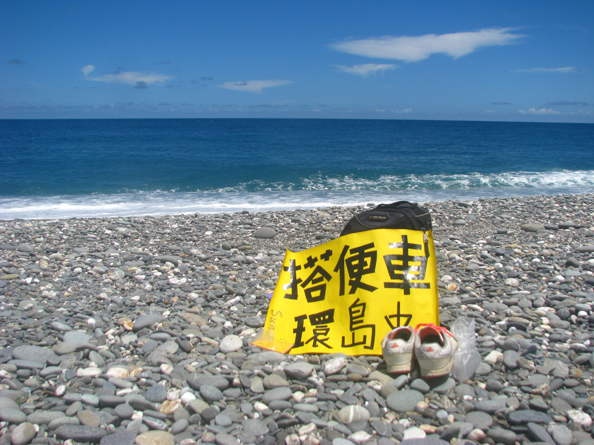

#### # I
從高中開始就有寫日記的習慣，轉眼至今，十幾本的日記，記錄著十幾年的光陰，字跡早已從潦草到工整，書寫的語氣也漸從熱血到近些年的平穩。我都還可以嗅到過去的自己呢，綠衣黑裙的自己、不畏日晒的黝黑的自己、在陽光下大笑的自己、還有勇敢闖蕩異地的自己。那些榮耀、驕傲、成就、失落、迷惘、還有勇往直前。

多麼珍貴的寶藏呢，每次回頭望去總是這麼以為。

我像是把過去化為一篇篇樸實的文字，靜靜的鎖在墨色的筆跡下。回首，總是驚訝於自己的改變與不變，也驚訝於人類記憶的健忘–許多過去總是太快就被我捨去，許多朋友都聽我說過「好漢不提當年勇，過去的故事是過去的事」，我是個擅長放下過去的人，也許就是因為太擅長放下了，為自己留下這些記錄才這樣的重要。這些文字、衣櫥裡一盒盒的信件與卡片、還有硬碟裡將近1T 的照片、錄音，都是我的回憶與獨一無二的青春，也才是完整的，我的自傳。

寫了這麼多，其實是因為最近無意間翻到過去的一些記錄，認為很值得好好地整理分享，並不是甚麼驚天動地的大事，卻是些提醒自己曾經這樣活過的，可愛的小事們。

#### # II
「每當我認為「最精采也就如此了吧！」就會遇到新的朋友，帶給我從未想過的超大驚喜！！這才懂得，人生最美的事情，就是你永遠想像不到下一刻會發生甚麼事。」

哇，已經過了好久了呢，卻仍相信數年前的那趟小旅行，是塑造我個性的重要轉捩點，關於青春、熱血、與單純的熱愛。有趣的是，從文字裡彷彿就能感受到二十歲時自己的橫衝直撞，每個句子的結尾都非要用驚嘆號不可，而且越多越好。

當時二十歲的自己就在講人生，好像太早了，就算是現在這個年紀，我也覺得太早了。不過當時就有了「人生最美的事情，就是你永遠想像不到下一刻會發生甚麼事」的體悟，就已經足夠讓現在回頭望的自己嘴角上揚「真不賴呢！當時的這個小女孩」。我想當時的她若知道我現在的經歷，也一定會非常非常的驚訝且欣喜吧。
當時的年代，可是沒有智慧型手機的，帶上一本厚厚的台灣地圖、身上三千元的現金、一雙球鞋、一個小書包、渾身熱血、數張手寫的感謝小卡與一張黃色海報。第一次在路邊打開海報招車時的緊張，彷彿都還洶湧著。

想用這段當年寫下的文字與你分享，我的青春。

