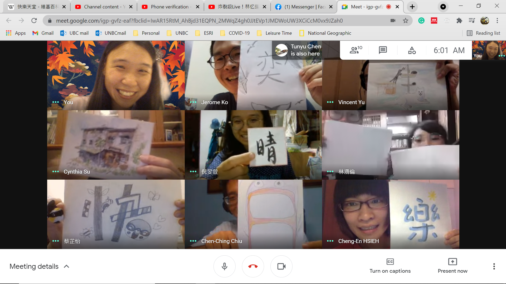
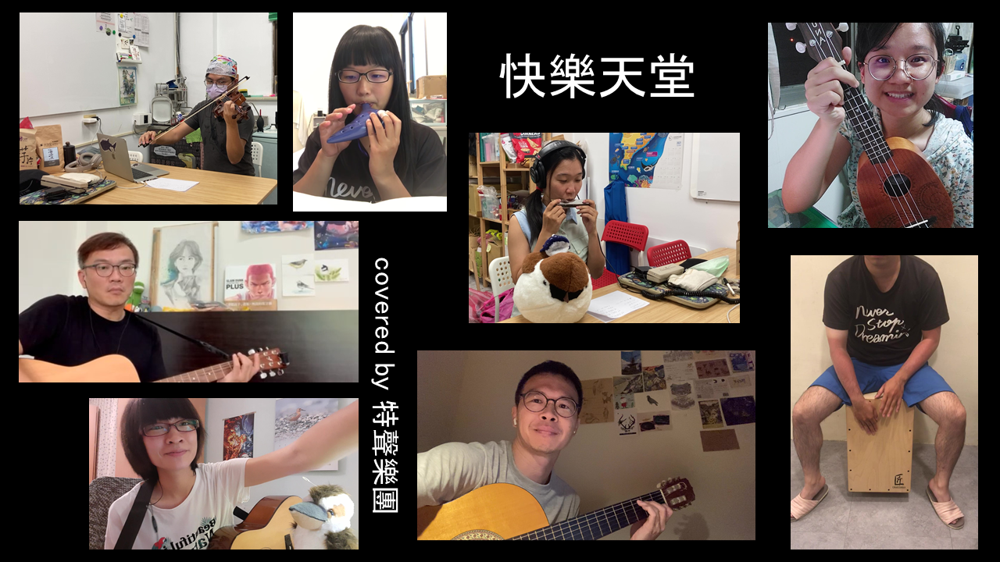
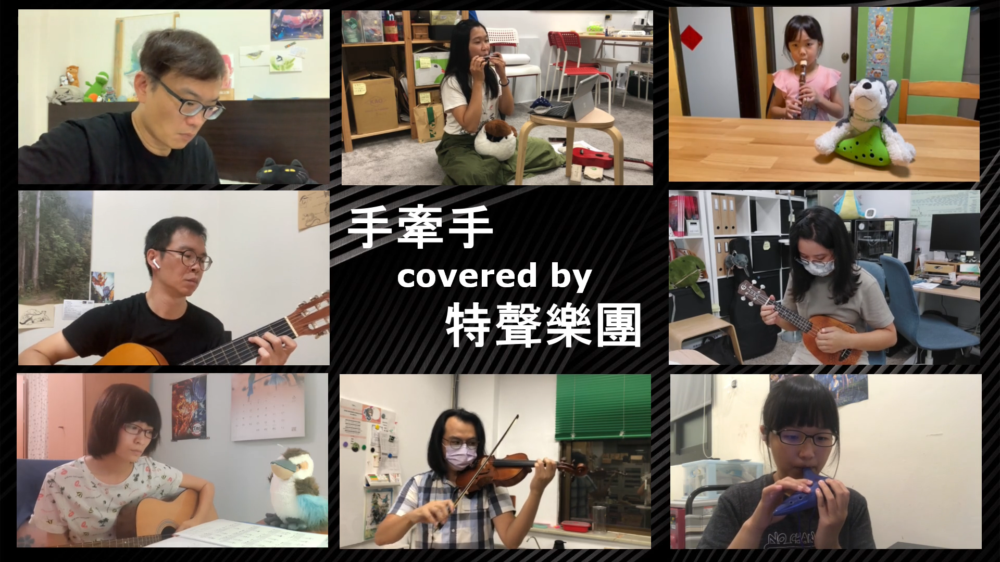

我們的音樂故事

#### # I
「Merry Christmas!」音樂聲下，我們喊出了聖誕最圓滿的結尾。

謝謝樂團的大家願意陪任性的我完成小小的聖誕心願，從計畫、編曲、排練、道具，都是好夥伴們的幫忙下才得以完成。一路的聖誕遊行，最讓人暖心的，是看到沿路眾人驚喜的表情、背後傳來聖誕老公公悠揚的笑聲，還有儘管我忘譜也會有人 cover 的安心（笑）。

對我來說太重要的日子了，而正是你們、在我身邊的你們，是讓這個節日重要的原因。也真心的希望，我們也為身邊的人帶來了一些笑容與溫暖。

從曾經的聖誕夜裡學到的，每個聖誕節都會有自己的記憶，而我，在2020的聖誕節回憶裡，有的是你們閃亮亮的身影，與悠揚的樂音（還有主任超厲害的笑聲）。

#### # II
本樂團第五次出團，就在新年的歡樂氣氛下順利落幕。

謝謝主任的友情邀約，很像回到小學時期，舞龍舞獅表演都要和好夥伴一起梳妝打扮、互相綁頭髮（笑）。大家都很可愛喔，看到觀眾們一起又唱又跳的，絕對是最讓人愉悅的事情。就像總是說到的，好玩的事情也有人一起享受，再好不過了。

大家新年快樂！

PS. 特別感謝，專業翻譜員: 溪湖塵刈蕈aka特生菜鴿 (陳奕銘) 、專業攝影師: 特生鵬魚雁 (陳惇聿)、與專業背工: 特生小當家 (吳俊毅) ❤

#### # III
有一種生日，叫做小朋友們覺得你今天生日。

名符其實的地下樂團，與胡鬧的生日驚喜。藏著的感謝，想著呢，如果心裡有話，那麼每天都能是獨一無二的特別日子。

樂團的第六次出團囉，埋伏地下室的刺激、伴著高級的環繞音效。木箱鼓、吉他、貝斯、口琴。短褲夾腳拖和草帽，還有一朵小羊種的太陽花花。
無數次感謝大家，總是包容著這般任性。要感謝所有配合演出的觀眾們，鳩，生日快樂（笑）！

PS.1 被太多人問過到底是什麼樂器了，是口琴～口琴噢，拍照永遠都看不到，但卻有著響亮溫和的樂音。

PS.2 感謝專業攝影師惇聿，還有專業暗樁小柯。

#### # IV
平常都是自己在動鬼腦筋，各種整人暗樁。一直到昨晚的呼叫視訊，和今早的辦公室封鎖線，才體會到了當事人的感受。

被強烈的溫暖攻擊的感覺（笑），瞬間飆淚。

PS. 喜歡這個：「奕晴妳上線一下，小柯叫妳」。

#### # V
八位好夥伴的遠距離演奏、十五個小時的新手剪輯，想送給你和妳。我們不用一直堅強微笑，但要永遠相信、永遠保有溫暖的力量。

「我們擁有同樣的陽光」。

PS.1 特別感謝眾人們包容著所有的天馬行空，會拉不住的那種天馬行空。

PS.2 是特聲樂團在疫情後的首次合體演出，也是我們首張有 MV 的樂曲噢（無敵興奮）！

#### # VI
如果說上首的《快樂天堂》是剪給自己的生日禮物的話，那麼這次的《手牽手》，就是盡了滿滿的心意，想要送給大家的畢業禮物。

各種形式的畢業。

「是特聲樂團在防疫期間的第二首遠距合奏囉，這次不論是聲音或是影像上的處理，都因為有了經驗，更細膩了一些。疫情期間，我們是否也都像這樣，順著世界的流動，學會慢慢的把自己放在一個坦然自在的位置，牽著身旁的夥伴一起，向前走著。」

PS. 已經從剪到眼睛脫窗的剪輯人，進化成可以一次處理二十幾道音軌囉。

