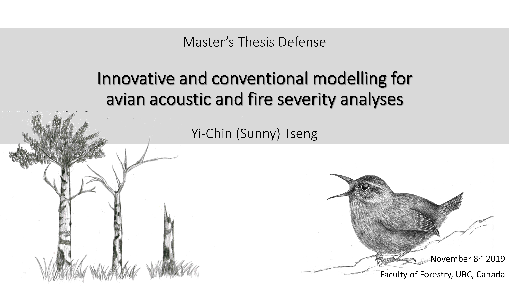
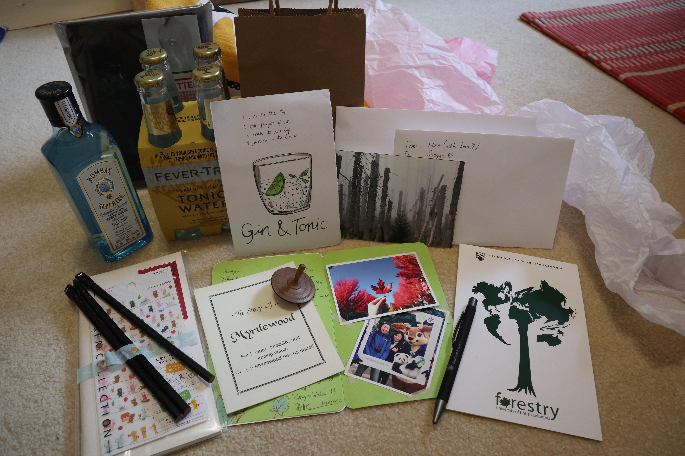
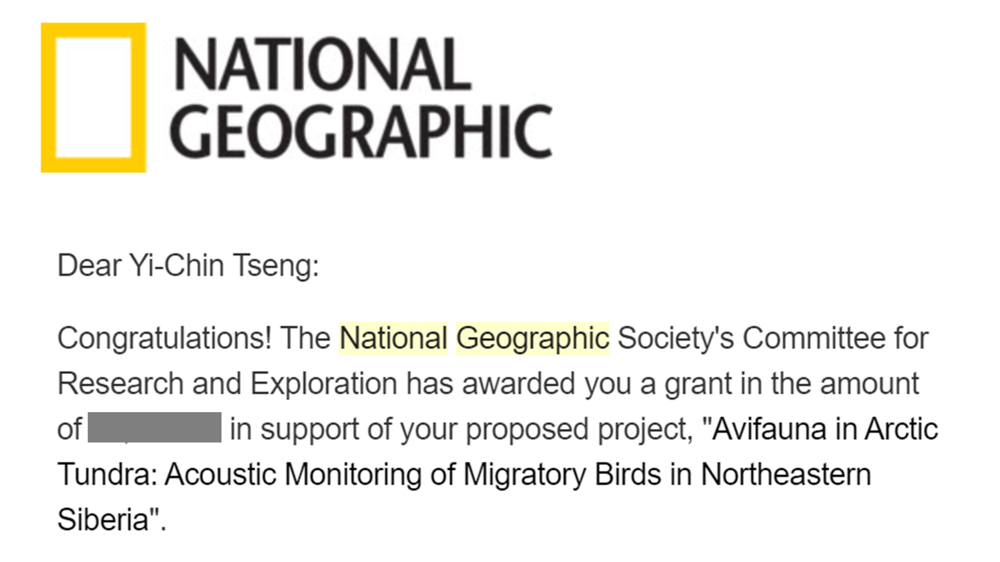
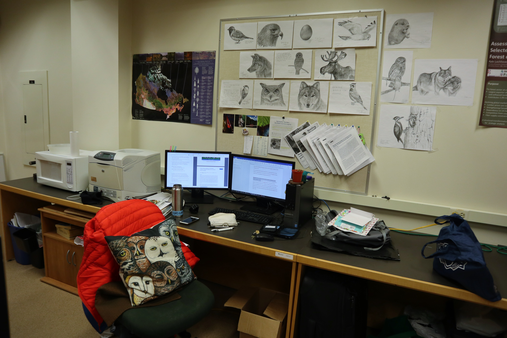
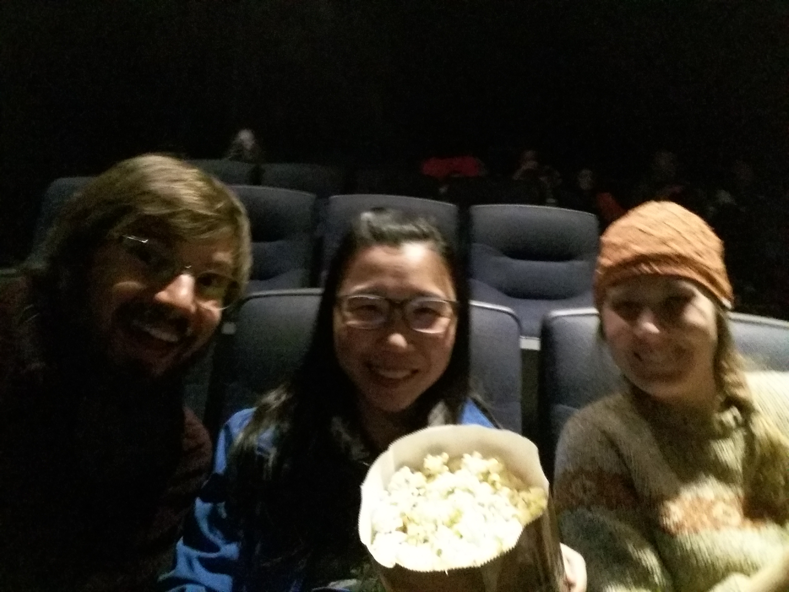
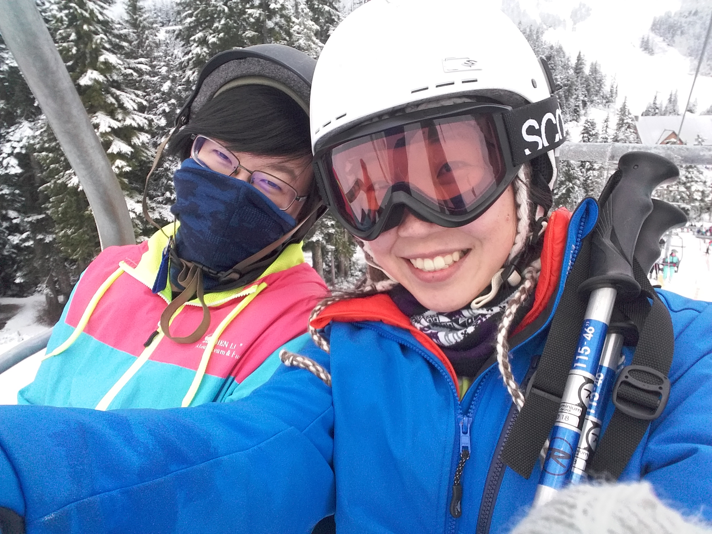
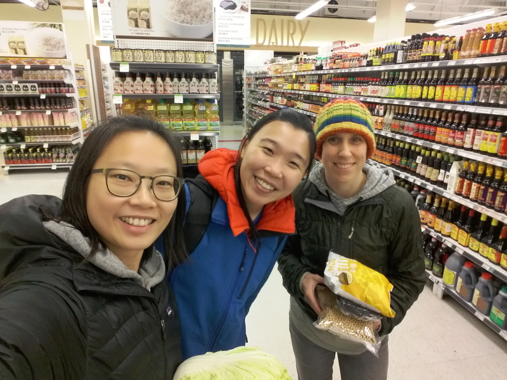
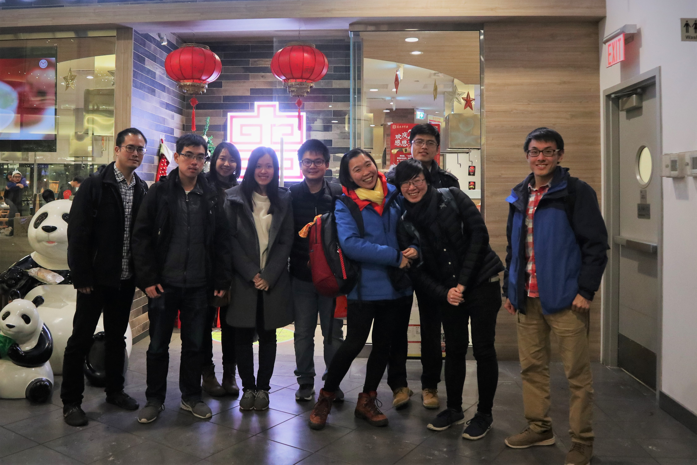

#### # I
一早打開信箱，如預期的收到了通知。終於等到這一天了，我興奮的在辦公室裡朗讀著，我的名字，與那些老師們的名字。

當年剛進 UBC 前， 就聽說過 Kathy在鳥類研究的輝煌事蹟，當時真是初生之犢不怕虎，竟就這樣邀她進了 Committee。18 年四月她邀我一起去 Riske Creek 做野外調查，要出發前才發現，原來四天的調查只有我們兩個人嗎!? 我還記得當時 7 個小時一路向北的車程，簡直就像是機智大考驗，畢竟能與一流的科學家對談這麼長的時間，是我從來都沒有的經驗。老實說，當初我們聊了甚麼其實我也記不太清楚了，大概就是一路上的地景、人文、歷史、跟鳥。對，我還記得當時她細心的教著甚麼都不懂的我，我也記得她有天把車停在一片空地，說想要看我的開車技術，她想確定我之後兩個月的野外調查能平安。她的熱情、無限體力、與絕妙的才智，我都記得。

Nicholas 則是個令人又愛又敬畏的角色。與他開始比較多的接觸是在 18 年十月的萬聖節（正是一年前的這天），萬聖節那天他來敲我辦公室的門（當然不是來要糖），直接用那帶有澳洲口音的英文快速的丟了一句「Sunny, do you take commissions?」他指了指那些我貼在牆上的素描作品，想要請我幫他畫一幅素描，精確來說，是畫他的狗。總之，他是第一個花錢買下我素描作品的人，如遇伯樂般的喜悅。而他對於科學的嚴謹則是令人敬畏的部分，一絲不苟的態度與犀利的問題，做事總是快狠準，回信從來不超過兩句話、與學生的 meeting 也從來沒超過十分鐘。我有一次跟他說「Nicholas, our meeting is always so short...」，他聽了竟回說「I can talk with you longer if you want.」我說下回吧，夾著尾巴趕緊逃出他的辦公室。

相較之下， Darren 則是個溫暖而令人安心的存在，他說話慢慢的，與人對談總是笑容可掬，當初在他的課堂上就著迷於那些經典的科學故事，羽毛演化的歷史、物種進化的悖論，還有至今仍未完全解開的謎，像是鳥類的飛翔是 tree down 或 ground up 的爭論，如何因為一篇 2003 登在 Science 對石雞的研究而有突破性的發展。正是 Darren 開了我對鳥類世界的眼界，也讓我領悟到，需要學的事情還太多太多了。

前幾天在走廊上遇到 Gary，他用了老爺爺式的語氣跟我說「Sunny, don't need to be nervous at that time. I am your chair, I will protect you.」。

終於，要換我講故事給你們聽了。

#### # II
幾天前與指導老師練習口試報告，回饋單上大大的字跡寫著「The design of your title page should reflect your thesis topics!!」當然了解老師的用心，殊不知，我也曾為這苦惱許久，因為我的論文有兩個主題，一個是鳥音分析，另一個則與森林火災相關，實在很難想像該如何將其連結（浴火鳳凰!?）。

最後決定任性地放了自己的畫，畫了心愛的 Trembling Aspen 與 Pacific Wren。

Trembling Aspen（楊屬下的北美原生種）伴我度過了兩個月在 Williams Lake 的野外調查，樣區裡的樹種不少，而我只對 Aspen 情有獨鍾。Aspen 的葉子如五十元硬幣般大小，形狀跟樹牌如出一轍，每每趴在火災後的林地裡翻找樹牌時，總是會被 Aspen 騙到、白歡喜一場，所以它在我心中，就是那種會搗蛋的樹。其實不只我喜歡 Aspen，鳥也是。當地洞巢鳥的巢穴有70% 以上都是在死去的 Aspen 上建造的，所以我每次經過 Aspen，都會輕輕的摩擦它的樹皮，時不時就會有幾隻窩在巢穴裡的鳥兒好奇地探出頭來，有次敲到了 Wood duck 家的門，母鳥唰—的一聲從我頭頂飛過，哎呀，互相都嚇了一跳。

而選了 Pacific Wren 作為鳥音的代表，自己覺得再貼切不過了，今年三月第一次進森林裡錄音，就屬牠最捧場。當時的雪都還未融、空氣裡還聽得見落葉的聲音。

倒數三天。

#### # III
平安下庄。

感謝所有到場來幫忙加油打氣的好朋友們，把小小的房間塞得滿滿的，然後把四位 examiners 包圍在中間。😝 Gary 還說「I have never seen this kind of crowd before.」，完全一個輸人不輸陣的氣勢（樂）。

感謝所有在事前、事後捎來簡訊或是簡單問候的朋友們，你們短短的字句都深深的打動我的心噢。也好謝謝 Gary, Darren, Nicholas, Kathy, 跟 Bianca，第一次體驗兩個小時的答辯，發現其實很有趣（Nicholas 的問題尤其絕妙），也發現自己比自己以為的還懂得多一點點。

就像 Y 說的，這就是一場屬於個人的畢業典禮吧，暖暖的感覺。今天實在太匆促無法好好跟每個人都說到話，但我口頭報告裡的最後一句話是真心的「Thank you all for being here with me today.」。

PS. 好想要有一張從台上往下看的照片，小小暗暗的房間與滿滿的人，真的很壯觀。 

#### # IV
原本以為結束口試之後會大哭的，結果沒有。反而是等到回家細翻著這些小禮物們，才自己在房間又哭又笑的。尤其是 Moon 送的小卡片裡，竟然放了我們兩年前的合照，兩年！竟然這樣轉眼就兩年了。而一看到 Sam, Zoe 送的 Gin & Tonic，也是一整個傻眼大笑（我們每次聚在一起都會來上一杯），看來這個冬天可以窩在家裡不怕冷了。

哎呀，又是你們讓我開始多情不捨了起來。

Translation for Nguyet Anh Nguyen: Moon, this post is to complain that your card made me cry too much. ❤️

#### # V
「我不相信命定，我認為人生就是亂數與逢機選擇。」—吳明益《單車失竊記》。

近期在收拾回憶，心中不停浮現小說裡的這句話，於是，覺得該是個好時機跟大家分享這個突然闖進我生命中的機會，關於畢業後的機會。

很幸運地，之前與 Kathy 合寫的 research proposal 得到了National Geographic 的青睞，不是人生第一次申請到研究經費，卻絕對是最令人驚喜與雀躍的一次。相信對於大部分做生態保育的研究學者，能與 National Geographic 合作都是畢生難得的機會與願望，至少我是這麼以為的。小時候看著電視上世界各地的壯麗生態系，到長大後親自與 National Geographic 的攝影師聊天，而今，沒想到自己也能成為其中的一份子。

還記得收到通知信的當下，是鳥類學期中考的上午，我還埋首在圖書館如火如荼的背誦著北美貓頭鷹的學名。

我知道自己是幸運的。常常覺得自己是個做甚麼都特別平凡的人，不特別懂鳥、不特別擅長艱辛的野外工作，又很容易忘記學過的東西，但真的是真心熱愛著收集那些美妙的聲音，熱愛著學習新技能、新知識所帶來的喜悅，更熱愛著可以貢獻所學的感覺。總覺得自己是「被命運選擇」而走上鳥音研究，而不是自己「選擇」了這條路。既然這樣，就讓我好好的享受這場有趣又充滿冒險的「逢機選擇」吧。

PS. 非常期待能藉由這個機會，與更多人指教學習噢。

#### # VI
論文寶寶正式上線了 <3 幸好放在 dedication 的素描有偷渡成功（感謝 UBC 的論文審查員）。我的 external 還直接 comment ‘beautiful drawing!’，看來以後都要靠美術天分收買觀眾了（笑）。

連結: https://open.library.ubc.ca/…/…/ubctheses/24/items/1.0385980

PS.1大家都說論文裡面的圖畫的很漂亮。

PS.2 雖然論文寶寶成功誕生，但期刊論文還在難產中。

PS.3 若時間有限可以僅翻翻 Chapter 2，個人覺得最有趣的一部份。

#### VII
經過一陣兵荒馬亂後，終於要搬離這個活了兩年的溫暖的窩。伴我度過無數周末的辦公室啊，在電腦前抱怨學生作業好難改的時間、在桌前認真畫畫的時光、還有好多 meeting 前臨時抱佛腳的緊張，都成為過去甜甜的回憶了。

今天把用了兩年的隨身硬碟改了密碼交給老師後，就算是正式離開實驗室了。行李很輕，但回憶在心裡卻都是沉甸甸的。

PS. 牆上的那些畫都被實驗室的好夥伴們認領了，他們說看到畫就會想念畫的主人。

#### 後記
終究到了要與這個城市告別的時候。再見了親愛的 Vancouver，這個承載了我兩年三個月記憶的城市。

一直都知道自己是個感傷的人，但外頭細細的小雨，又更為今夜增添了幾分離情。每一個擁抱、微笑、還有說要保持聯絡，都是真心的喔。雖然今天不小心又在辦公室跟 Stella 和 Pramilla 因為巧克力鬥了嘴，但最後還是三個人抱在一起哭（好啦只有我在哭），聽說沒有 Sunny 的辦公室會安靜很多、people can get more works done。

房間裡牆上的世界地圖也被我拿下來了。

回憶太滿，笑容太多。都是因為你們，讓這寒冷微雨的冬季都不知不覺的溫暖起來。會帶著你們的祝福繼續往前闖蕩的，滿滿的愛，獻給你們。

PS. 雖然一個半月之後會再回來，但一切都不一樣了吧。

