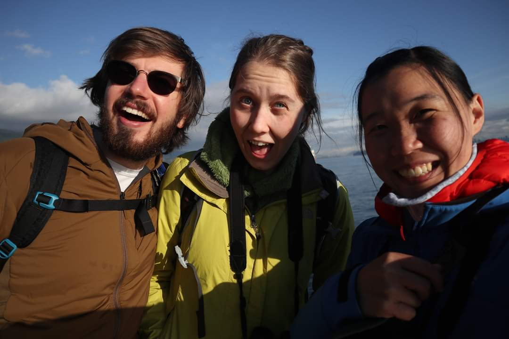
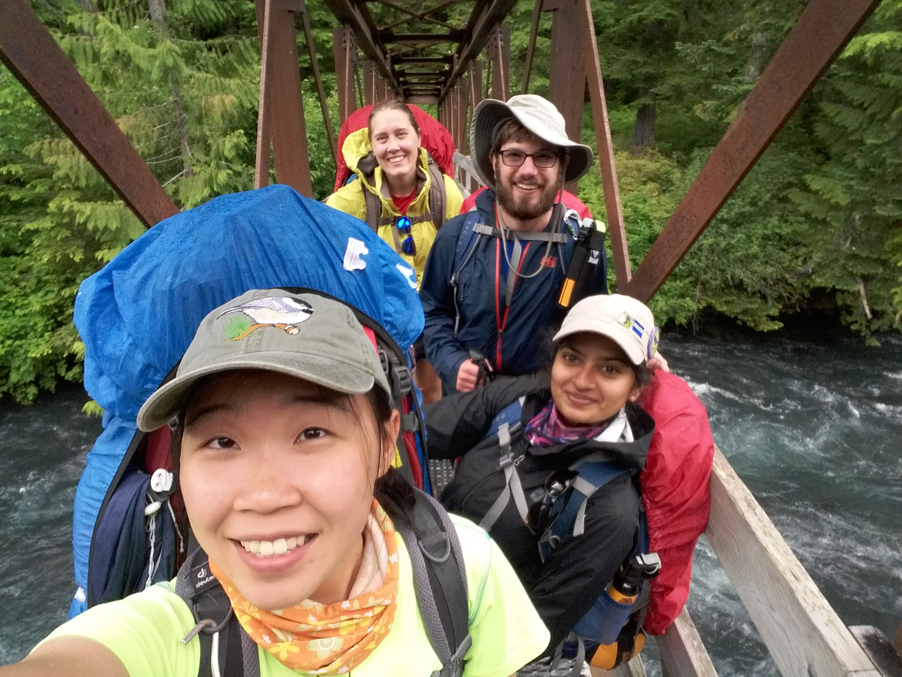
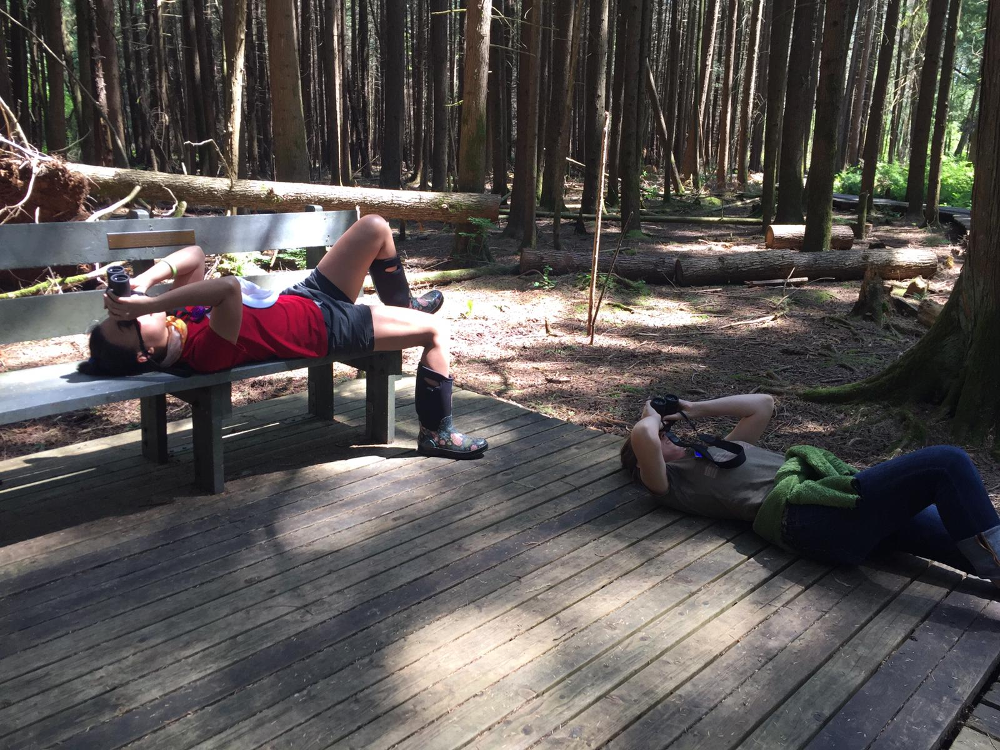
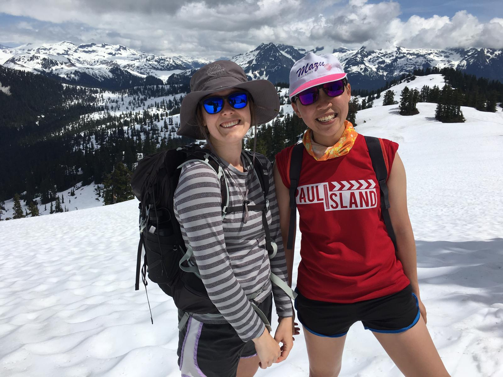
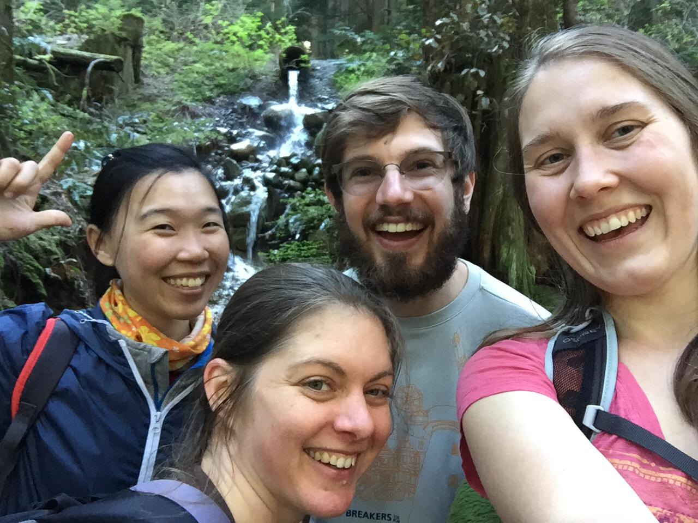
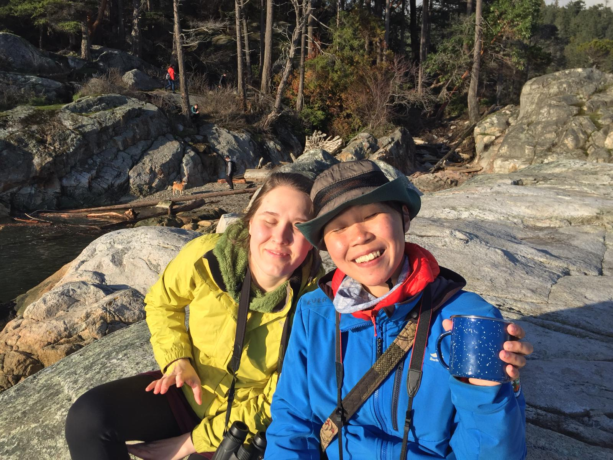

親愛的，原來我們已經一起走過這麼多地方、分享過這麼多的陽光與笑聲。冰凍的冬天與口罩遮掩的臉龐，幾乎要讓人忘記我們曾經歷過的時空，好像記憶的長度不是線性的。幸好，有回憶可以提醒、有你與妳的溫暖可以隨時讓我依靠。

和你們的相遇是在三年前的一場演講比賽，那時 S 就坐在我隔壁，自然地聊了起來，當時與許多人都是這樣，走廊上常常遇見卻不曾聊過天。從那次發現你們也喜歡賞鳥、喜歡爬山、喜歡自在放鬆的生活。從此開始了三個人的小冒險時代（題外話，後來那場演講比賽我拿下了 first price，也算是驚豔全場）。

一藍一紅的小車車載著我們到各個森林步道，雖然我常常聽不懂你們的笑話但傻傻地也就過去了。你們有時會跟我分享哪首歌好聽、哪部電影好看；我則會跟你們說臺灣有多美、食物有多好吃。大概也只有你們會陪我到電影院裡看 Frozen ，然後在散場時邊笑邊等我哭完，最喜歡的 Gin & Tonic 也是被你們開發的。大概也只有你們會開上八百公里的路程，一路把我護送到陌生的新城市；大概也只有你們能用新奇與欣賞的眼光看著我身上的一切；大概也只有你們，知道在我不知道如何是好時，只要一句「Sunny, we love you.」，就很足夠。

在聚散離合頻繁發生的路途上，能一起走過一段路程何其可貴。幾個四季的變換、又有幾個海洋的距離。現在一個人住在靠近北極超冷的地方、一個住在春暖花開的海邊、一個即將飛往未知的大陸，聽說那裏有很美的珊瑚礁，有沙漠有海。

一定會很棒的，只要知道世界上的另一端有人會心繫著，到哪裡都會很棒的。

