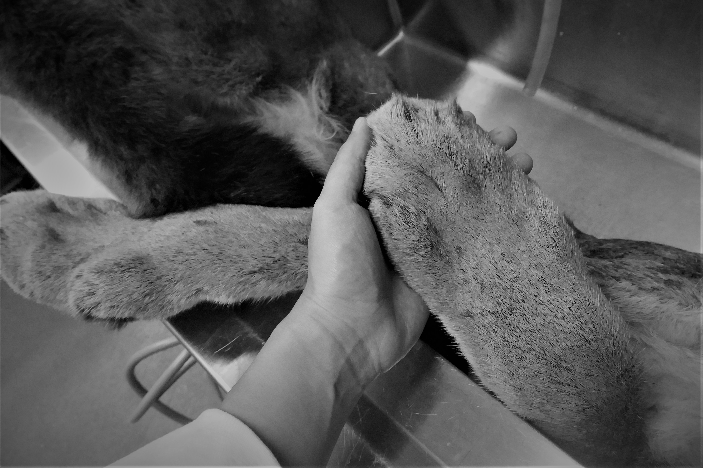

自從進了博物館學習準備動物標本後，隨著解剖的樣本越來越多，動手猶豫的時間也就越來越短。左手拉著緊貼肌肉的皮，右手劃著手術刀，整個過程就像是 ildiko 說的 「Rip and peel」。

有時候都會不小心忘了，其實自己正在做一件非常神聖的事情。

大約是兩個星期前吧，ildiko 說我們有個特別的案子要處理，於是指了指實驗室角落的大水槽，示意要我們去看看。毛茸茸的四肢露出水槽，是棕黃色的，旁邊還有一條長長的、一樣毛茸茸的尾巴。我探頭一看。

天啊！竟是一隻 Cougar (美洲獅) !!!

天啊！是作夢也想不到的際遇啊、是在野外心心念念好想見到的Cougar啊…。

這天送來博物館的總共有三隻，是媽媽以及一對女兒。她們生前因為活動範圍太過靠近溫哥華西部的一個城市，當地的居民為了保障安全，所以就請了Conservation Officer去做了「合理的處置」。仔細一看，她們的身上都有幾個彈孔的痕跡，血淋淋的痕跡。
如果你也有機會用雙手抬起一隻五十公斤的 Cougar，如果你也有機會親手觸碰到她們大大的手掌、柔軟的皮毛、親眼見到她們肌肉的紋理、強壯的骨骼，你一定也會同意，她們好美。她們的美，如此真切，就這樣直直地打到我的心上，但是，在我面前的卻是一個逝去的生命。

如果可以，我希望每個生命都有權利好好的活著；如果不行，那我希望，博物館會是她們安息的棲所。

