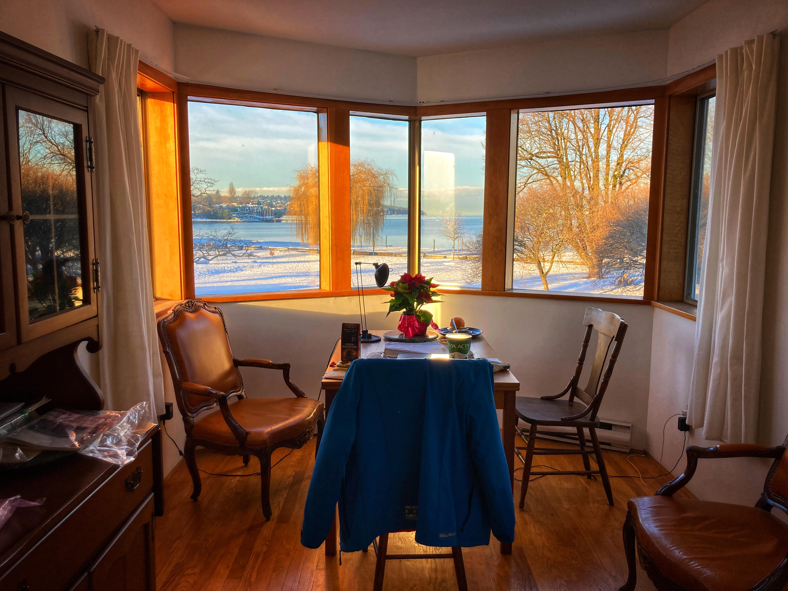
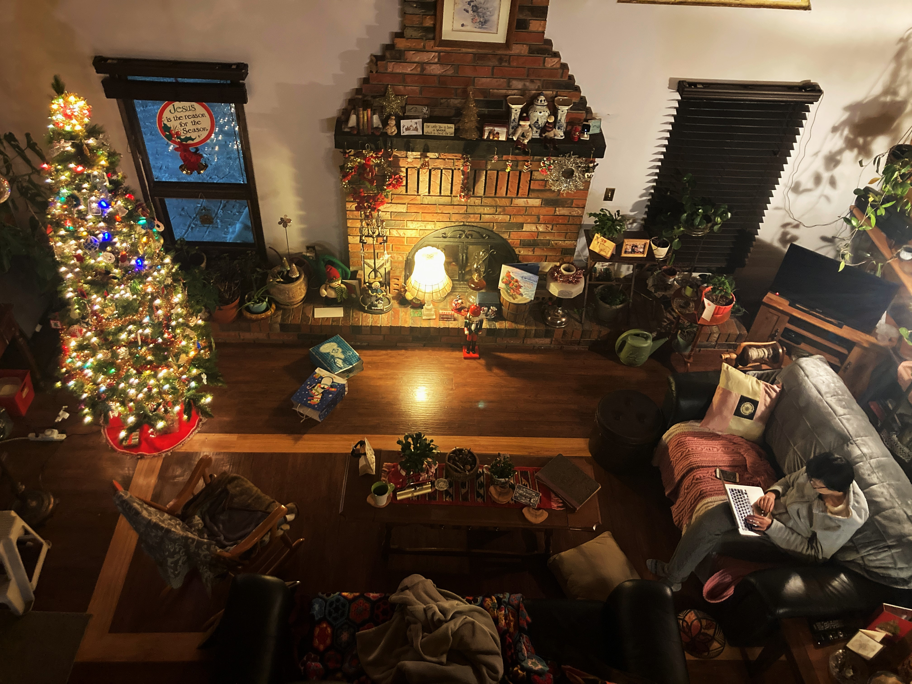

#### # I
「May I stay at your place during my visit in Vancouver?」一則訊息，換得一個假期的 Ivory Tower。

其實是因為回溫哥華想要找爺爺奶奶住，卻因為南下十個小時的車程擔心感染了病毒，所以到溫哥華的前兩天是隔離狀態，待在爺爺奶奶家隔壁的閣樓上，被我戲稱為象牙塔。

下雨出名的 Vancouver 在這幾天賞了個滿滿陽光與滿地白雪，北方小鎮的雪實在太多太冷，本想來南邊躲躲雪的，好不容易和寧搭了十個小時的車到溫哥華，第二天又是滿眼的白，這幾天總是被說，「Sunny, you brought the snow with you, eh?」（笑）。

每早陽光升起時，我總會站在面向海的那面窗前，尤其喜歡左邊那扇，望向隔壁藍綠色的家，有默契的時候，Derek 爺爺也會站在他的窗前，我們會揮揮手，過幾秒後手機就會震動，出現他的訊息「Good morning princess, the breakfast is ready.」。

這些是記著，窗前的貼心的聖誕紅，與在 Ivory Tower 度過的那個聖誕假期。

#### # II
早晨的陽光灑進閣樓裡，睜開眼，淡藍的天空與遠方映著橘紅陽光的、佈滿白雪的山，雖然今天的溫哥華和我居住的城市一樣的冷、一樣的佈滿白雪，但很清楚地可以感覺到兩個城市的不同。像是看樹，像是聽聲音。

溫哥華城市裡的樹，輕易就有百年的歷史，也許窗前的那株 Elm Tree，就曾見過 229 年前的掏金熱潮、 154 年前的加拿大聯邦建立、135 年前的燒毀半個溫哥華的大火。比起更北，位於溫帶雨林帶的溫哥華有著更多樣的樹種，而連帶著生命與歷史。樹是有記憶的，有時候，記憶越多的生命越能沉默謙遜。

另一個讓我驚豔的，是鳥聲。熟悉又陌生的 Glaucous-winged Gull 與 Canada Geese，一早能被海鳥的聲音喚醒，是在這個城市獨有的享受。還有好久不見的 Eurasian Starling, House Sparrow, Anna’s Hummingbird。以前總是習以為常的聲景，卻因為久違的再見而更使人珍惜且重視。

像是又重新認識了這個城市。旅行，對於這時候的我，是回憶堆疊的意義。

#### # III
「Because it’s that time of year!」每年的聖誕節，都需要有自己的意義。

Stella 拿出一張 A3 的紙，上面密密麻麻條列式的記錄著她每年聖誕節的，一路可以回朔到 20、30 年前。在夏威夷、在英國、在溫哥華、Vancouver island，一直到近幾年則都是在溫哥華的家裏度過，我想他們也到了由別人來拜訪過節的年齡。

一年中的這麼多日子都是雜亂無章，卻只有聖誕節這個日子被賦予了重要意義，讓 Stella 這樣記下，其實想想我自己的，17 年在 Calgary、18 年在 150 miles house、19 年在 150 miles house、20 年在集集小鎮與特生樂隊、21 年在溫哥華和 Derek 爺爺 Stella 奶奶一起。我有五年的聖誕節記憶。

我的記憶，始於我開始認為這是個重要的日子。

