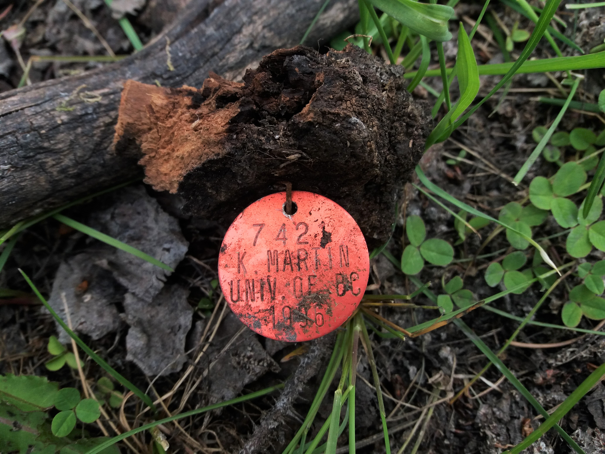

二十四歲。

Jane Goodall，正在非洲坦尚尼亞的荒野進行黑猩猩的行為學研究；E.O. Wilson，正在古巴、墨西哥以及南太平洋島嶼間收集各種螞蟻的標本；Tad Parker，正在祕魯進行鳥類野外錄音。

我所敬佩的生態學家們，他們的二十四歲都是探險的。

我的二十四歲生日過了兩次，一次在台灣，一次在加拿大。在台灣的六月九號，連線到了聲景協會的會員大會現場給了一場短講，是關於鳥音偵測的專題。而加拿大的六月九號，則是奉獻給 Williams Lake 的深山樣區，我們正在進行洞巢鳥 (cavity nester) 的調查。一整片茫茫樹海、數百個 23 年前留下的巢位座標，為了找到那一顆顆掛著紅色小牌的樹，水深及膝的沼澤都要咬牙走過、離地僅三十公分的刺網也要匍匐爬過，而帶刺的林下植物以及如黑雲一般的蚊子大軍最是讓人不適。但是，當一步步穿越森林，並找到那紀錄紙上多年前所描述的巢位時，興奮之情足已將一切不適一掃而空。

是今天拿著GPS、獨自披荊斬棘的走在樣區時，才驚覺到自己的二十四歲也是像我所敬佩的那些人一樣，正在野外奔走著。我是幸運的。能有機會來到這裡探索我所喜歡的森林。能夠對於自己在乎的事情擁有付出的能力，真的是很幸福的一件事情。

新的一歲，就讓我期待一下生命又會帶給我甚麼樣的驚喜吧! We will see how life will lead us.

PS 好謝謝朋友們的來信及問候，你們真的是我心底暖暖的陽光。想跟大家分享我好喜歡的兩則訊息: “Birthdays never make us older, they only make use wiser and more mature. Happy birthday young lady!”、” 不知不覺邁向二十歲中的我們，但願那雙眼和那顆心依然赤誠”。

