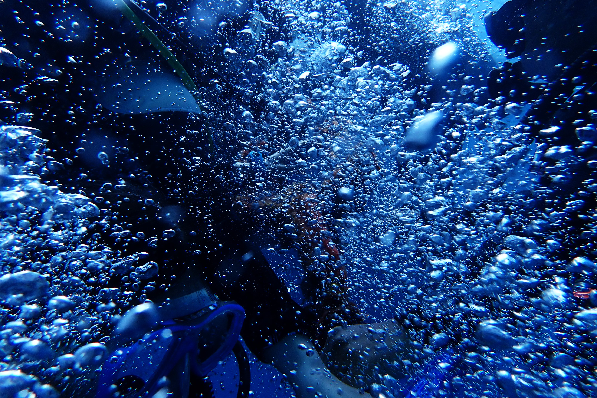

給自己的禮物，是再一次飛行的挑戰，在一片名為熱帶海洋的天空。自由、未知，與溫暖的圍繞。如果飛是一種奢望，那麼能夠飛行就是幸福的；如果想望未來是一種奢求，那麼能夠走在追求的路上，就已經是最完美的實現。

我被這座熱帶島嶼的，湛藍的海，與壯闊的山，溫柔的圍繞著。我回頭想起數年前拿著一張黃色海報、在炎炎夏日下搭便車環島的女孩，當時的她帶著一本厚厚的紙本地圖，用最赤裸裸的真心認識自己的家園、認識地圖上一個個地名的意義。大概就是從那時開始的吧，我深刻地感受到，正是這座小島，與那些島上的人們，教會我滿懷溫暖的衷心。有時自己一個人的時候，我會感謝這片土地。

長大了，這一年是澎派與變化的。因緣際會地可以回到小島上，並到了一個安靜的小鎮生活，每天的早餐時間都能有遠山相伴。也因為這個因緣際會，而讓南橫、蘭嶼、玉山、觀霧、雪山、熱帶海洋… 成為了親自走訪過的地方。汗水、豔陽、蟲鳴鳥叫，彷彿在喚回身體裡的記憶、也激起那探索的動力。我是幸運的，在變動已成規律的故事裡能夠找到自己的定位，也總是能夠遇到那些願意給我笑容的人、感受到那些不變的真心。並且，不會再因為自己的平凡而緊張、也不會因為自己的不平凡而欣喜。

是你與妳們，在我身邊的你與妳們，讓我不斷相信著，有些事情是永遠不會改變的。至今，也仍深深的感謝著，自己正幸運地擁有著那些，不多不少、剛剛好的幸福。

