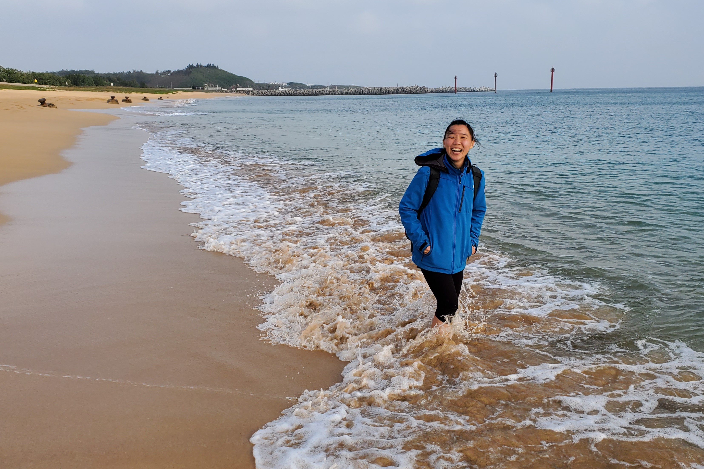
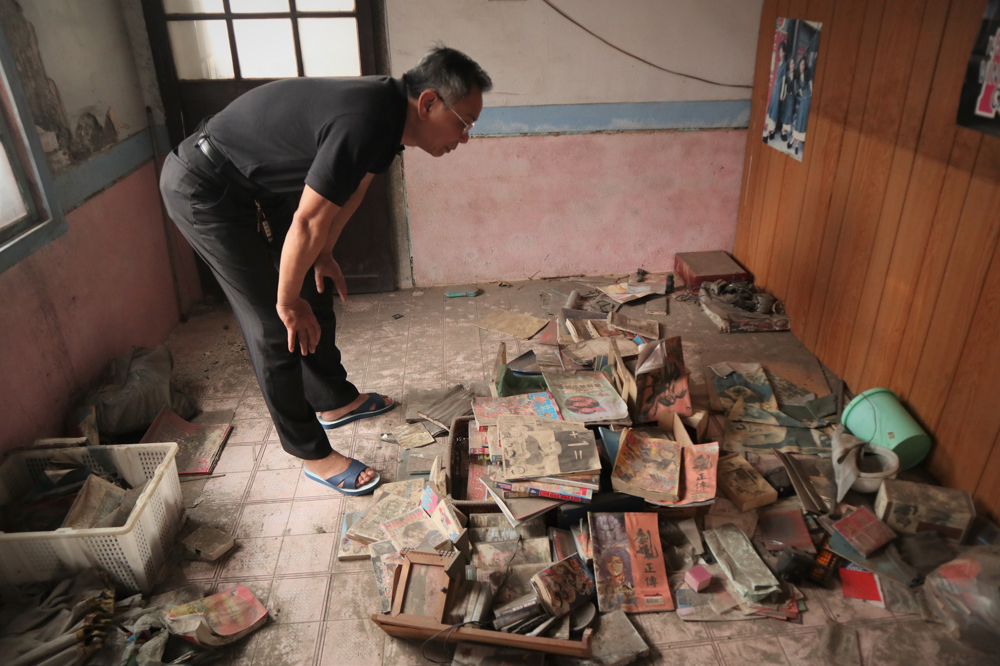
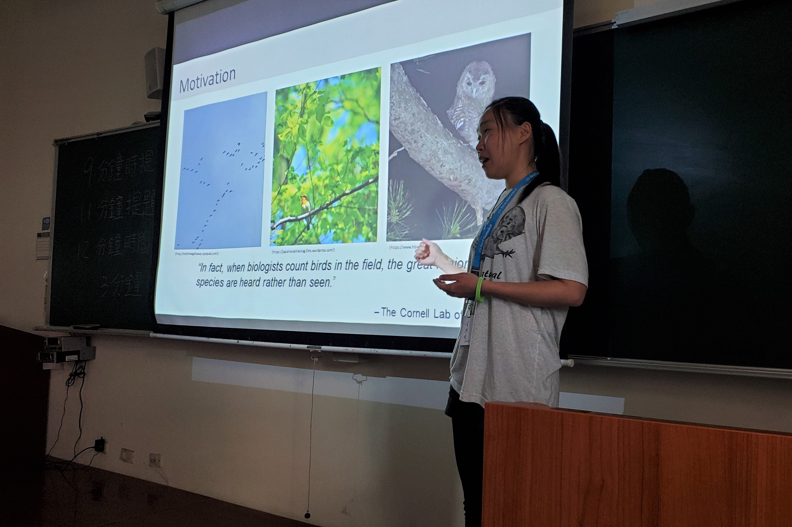
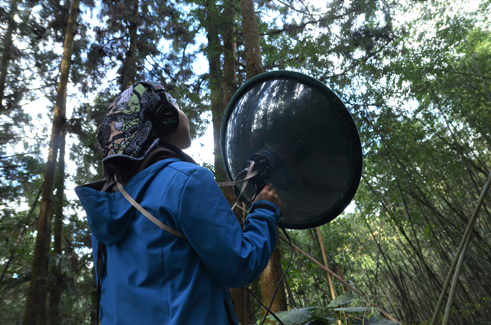

#### # I
這次很默默地回台灣一個月。

本以為自己可以用一段文字、一張照片總結這個月的生活，卻發現回憶已經超乎短短的篇幅所能敘述。明明是自己的家鄉，一切應該如故，但這三十天裡見人見景，卻像翻起了塵封已久的記憶，好像在找回兩年半前、或是更久遠以前的自己。
先是在台北見了國小國中、高中大學的老師好友、回瑞芳家投票，接著離開台北，到澎湖參加了動物行為研討會、到武陵七家灣溪幫學長調查當摸魚（聽鳥）臨時工、回屏東過年練習客家話、到嘉義山上玩耍、回台南找十年前認識的老師、上了大霸尖山（久違的百岳阿）。

不知不覺就快把台灣繞了一圈。想與你們分享那個我所愛的、所厭惡的、所依戀的以及陌生又熟悉的，我的家園。

#### # II
拜訪舊識成為了每次回台灣的重要行程。

我不是個擅長邀約的人，每次約朋友總是很臨時、見老師也都是當天突襲。回國小投票時被監票員問「曾奕晴怎麼有空回來？」，抬頭一看，竟是十多年沒聯絡的小學同學，她說我除了長高以外其他都跟小時候一模一樣。回到國中找理化老師，被老師鼓勵著繼續到處闖蕩世界，還一同被地理老師跟國文老師包圍（聊得很開心，雖然我在心裡很用力地回想一些老師的名字）。約了高中相識的女孩們一同爬山吃飯，最後當然少不了那些一同成長茁壯的大學摯友們。

大學時代認識的好朋友們啊，那些讓我如此容易就感到滿滿幸福的好友們。一月十號，台大學期的最後一天，被朱朱老師邀到課堂上與大學生分享我的人生故事（雖然我也沒比台下的他們大多少），老師問了「大學四年間最重要的收穫是甚麼？」，我說，就是那些在我身邊的朋友們，那些陪我走過小冒險時代的、那些看著我成長的、陪著我走過霧茫茫路途的朋友們，一直到現在，他們都還在我的身邊，告訴我去闖蕩時他們可以給我依靠、提醒我那些我所看不見的，自己的特質。

那些承接我的快樂與不快樂的朋友們啊，無可取代的重要。

#### # III
這次回來才發現，我搬家了。

在四腳亭的舊處仍然和以前一樣有潮潮的味道，我的房間還是一樣昏昏暗暗的，屋頂有漏水、牆壁有斑駁的痕跡。老東西都在那裏了，高中的教科書、大學的原文書、我的日記、朋友送的卡片紙條、老照片、祖譜。那可是伴我走過二十二年光陰的房間，一面牆乘載了多少吵鬧、哭泣、成長、喜悅、與燦爛。以前八、九月颱風過境時，屋外下大雨，我的房間會下小雨，還要拿水桶看著天花板接水，睡覺時也有滴滴答答的聲音，聽著風聲，還會想我們家的玻璃大門會不會就這樣被吹破了。天氣好時我喜歡爬到頂樓看山、曬太陽、曬棉被，貓咪會走在我的腳邊。我還記得被太陽曬過的被子都有一股味道，我都叫那作太陽的味道。

照片裡是我爸爸的舊家，他跟我一樣，很久以前就離開了小時候長大的家，現在那個位在屏東四合院裡的房子早已斑駁、灰塵遍佈，他卻都還能仔細的描繪出以前所有房間裡的擺設、也還能認出牆上老照片裡的人。「這是妳的阿公。」「這是爸爸的叔叔，妳的叔公，記得嗎？我們還會去台北找他們的。」「這個呢，是爸爸的叔叔的兒子。」…

原來家跟回憶一樣，是需要傳承的。也許記憶最深的，還是童年時期經歷過的那個地方吧，畢竟，只有那裏才有最真實的成長故事。

#### # IV
大三時選擇雙修森林系，是進入台灣生態圈的開始。我大概比圈內多數的人都起頭的晚吧，很多事情都得重新學起，又因為在國外念研究所的緣故，對台灣的生態環境與人也無可避免的陌生了起來。

然而這次到澎湖的動物行為與生態研討會，卻感到無比的溫馨與熟悉。特別是對特生中心的大家，不知怎地特別有緣，像是在溫哥華巧遇的小蟲、小柯跟大利學長，還有以前大方借我錄音設備的正雄學長，而最驚喜的，約莫就是見到了傳說中的紅鳩了吧（一個與網友見面的概念）。

聲景研究畢竟是自己的棲位，而能認識有志一同的夥伴也不簡單，以前就常在網路上看到紅鳩對於鳥類聲景研究的成果，十分欣賞，這次能因研討會相識實在是機緣甚妙。相約好了，要再好好加強自己的程式與鳥音專業，之後有緣就能成為工作好夥伴、一起在聲景研究上盡一份心力。 

PS. 特別感謝孝宇學長當初建議我到動行認識大家，讓我有機會能半隻腳踏進這個溫暖的小圈子。好喜歡參加研討會認識新朋友的感覺。

#### # V
因緣際會之下，跟著孝宇學長與麗貞學姊上了武陵做河烏調查，幾天裡的聲景裡都有溪水滾滾的聲響。

走在清澈見底的七家灣溪、有勝溪以及大甲溪，伴著冬陽、溪水、與那些靈巧鳥兒的身影與歌聲，冷也冷得心甘情願。沿著溪流一路上溯找河烏，雖然還是很不擅長走路（總是把自己摔得瘀青片片）、雖然很多小常識都不小心忘記了（好多樹種跟鳥種都認不得了）、又雖然溪畔的地形把自己嚇到不行（需要攀岩才能上溯的路段，一鬆手就會整個人掉進溪裡的），但這趟小旅行真的是讓我再次體驗到當初喜歡上野外調查、想要留在生態界的心情。

我的手機在攀爬過程中義無反顧的跳進溪裡游泳了，從此晉升為游過七家灣溪的手機。但找尋了幾天的河烏也終在最後一天捧場的在錄音機前大聲唱歌，因此為 XC 又添上幾筆台灣的河烏錄音（還有超好聽的鉛色水鶇）。

PS.1 河烏錄音請洽: https://www.xeno-canto.org/contributor/SPMWIWZKKC…

PS.2 照片裡的人不是我，而是某個被鳥類研究耽誤的攀岩師，一個厲害的女孩。

#### # VI
這次上大霸尖山，老天給賞了個冷氣團，為我短袖的臺灣生活畫下了一個逗點。

山上的雨下起來一點都不心軟，登山鞋老了，一下子就喝了飽飽的水，衣服也很快的被雨水及汗水浸濕。第一天藍藍濕濕的 24K，前 20K 的林道是準備，而後上九九的陡上 4K，是鍛鍊。

0K 兩隻落湯雞在叉路口休息；1K 爬十步喘十下；2.4K 聽見自己的心跳與喘息，回過頭，卻只有苦笑的力氣。2.7K 石瀑旁拿出背包的兩升水；3.5K 關掉頭燈，周圍的森林好黑好安靜；4K 左方出現了山上的蒙古包（一開始還被誤以為是廢墟）。

伊澤、加利、大小霸。爬百岳的目的從來都不是登頂（雖然我們有登頂啦），卻是一路上與好夥伴創造的回憶，讓每座山都被賦予了他自己的味道。大霸尖山，有冬天二葉松的味道，還有大風吹過森林裡、殼斗科的枝條相互碰撞的清脆聲。有大雨過後放晴的喜悅，還有身體疲憊不堪但心裡自在無比的甜蜜。上山的生活，就是這樣的單純而快樂。

一杯黑咖啡與二十公里的故事、一支大葉石礫與總是偷懶傻笑的好夥伴。大霸尖山給的回憶短短的，想起來卻都是風聲、雨聲、還有笑到會肚子抽筋的，滿滿的笑聲。

#### # VII
若不是有這塊地，帶著這些人的笑聲，我大概也不會這樣的喜歡屏東吧。

和國外的朋友介紹台灣時，總是會提到：「我的家鄉在南部喔，不是台北。」、「我們家有好大一片火龍果園，還有種香蕉、芭樂、百香果、番茄，還有各式各樣的菜。」、「我的外婆一直到八十歲了都還在田裡工作喔。」…。

每次逢年過節，總是可以與阿姨、舅舅家裡的人相聚。我小的時候這片田裡還種檳榔，我記得紅包裡能有多少錢，都得看自己多勤勞的摘檳榔（自豪一下，我好像總是小朋友群裡起最早摘最多檳榔的），小小的手指都會因為檳榔的枝條磨得紅通通。後來有了自動化機器，摘檳榔就沒這麼辛苦了，去到田裡成為大家早上下午的郊遊行程。長大後小舅舅把田裡改種為火龍果園、養了好多狗、更新了設備也建了新房舍，讓田裡更成為大家過年相聚時喜愛的好去處（小舅舅是我的偶像）。

我喜歡屏東，因為那裏總是熱鬧。因為那裏總是單純。因為那裏，總是有滿滿的感情。

PS.1 不知道我那善感的性格，是否源自從小能夠接觸到這樣稍微遠離城市的環境。

PS.2 照片裡我們在控窯，當時的地瓜都烤好了。

#### # VIII
一不小心就寫了許多太感性的話，或許也該提提這個月所做的那些「正經事」。

首先，我的 Xeno Canto 終於超過一百種鳥種了（當前物種數112）。從開始認真錄音至今也將近三年，這樣的收集速度其實算很慢的，但是就這樣慢慢地收集、慢慢的學習。對台灣鳥類的鳥功還很差，這次回來幾乎都是從頭學起。邊看邊聽，再回家查紙本圖鑑也聽聲音圖鑑。

感謝好朋友們有事沒事就陪著揹著集音盤的我到處跑，在家裡後山、澎湖、嘉義、武陵、屏東都留下了一些簡單卻銘心的紀錄，一段聲音之所以獨特，很多時候都是因為當下的故事，聽到聲音，就會想起「阿，這是跟某人一起去某處錄的」。

撇除那些留在心裡的故事，若有甚麼值得說嘴的成果，大概就是有幸為 XC 添上第一筆在台灣的河烏音檔吧。現在再聽那幾段在武陵收集的聲音，都可以感覺到潺潺溪水流過腳邊的沁涼。期許自己可以繼續這樣靜心的聆聽，並以鳥兒的樂聲記錄那些美好的片刻。

PS. Xeno-Canto profile: https://www.xeno-canto.org/contributor/SPMWIWZKKC

#### # 後記
「這些美好都會隨妳成長，回憶中也只有美好會留下。」

旅行結束總是最令人不捨的時候，轉眼，又到了回去太平洋彼岸的時間。我想我一定會很懷念台灣的暖暖的冬陽，與那些可以穿短袖到處跑、可以與你們自在大笑的日子。下次回台灣也還說不准是甚麼時間，但很期待下回相見的時候，能再一起回味這段時間所創造的一番故事，也一起分享我們的成長。

好幸運有你陪我。

