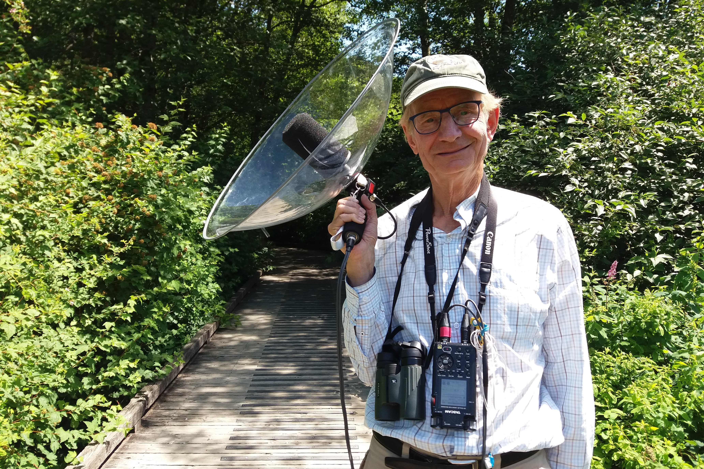
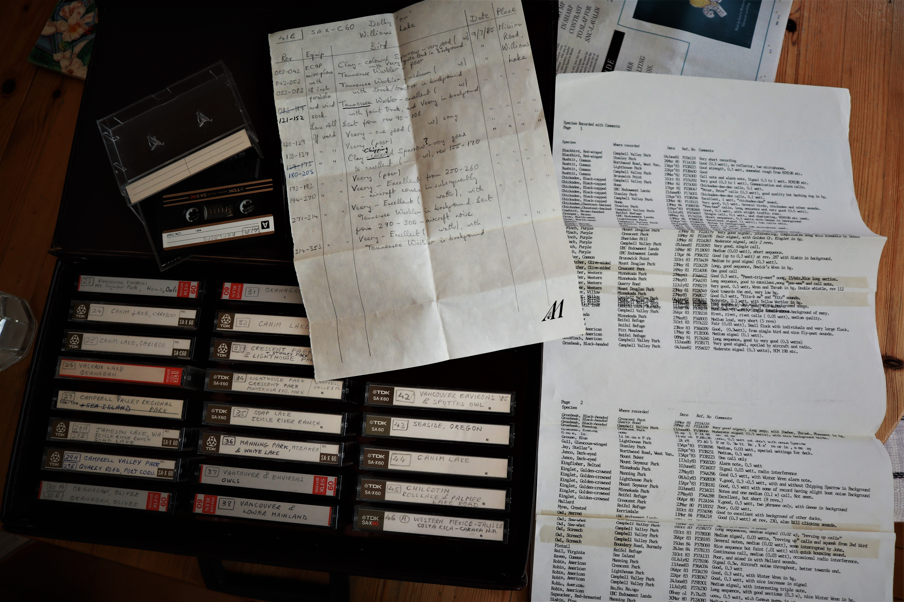
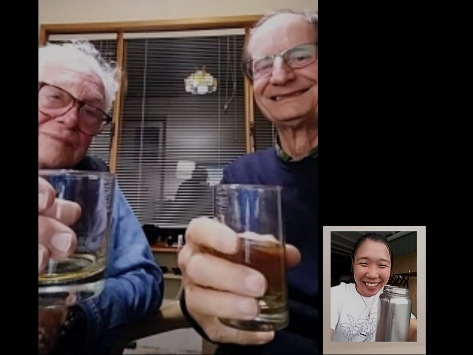

#### # I
「Wow！Your home is like a museum！」每周一回的聚會裡，我都會這樣對 Ken 與 Peter 讚嘆道。他倆都七十來歲了，每次見面卻像兩個活力旺盛的男孩，滔滔不絕地跟我說著他們年輕的故事、分享著那些「古董」。而我，幸福的當個聆聽者。

先說說 Peter 吧。能跟 Peter 認識真的是不可思議的緣分，我前陣子住在 41 街，他家就在 40 街。四月裡某個陽光遍地的早晨，我走路到超市去買菜，看到這位阿伯他家前院辛勤地幫他的藍莓澆水。「阿伯你好勤勞喔，種這麼多東西還要每天幫他們澆水。」「我還打算種更多呢！像我想要種幾朵花在那裏。」阿伯指了指身旁一個長相可笑的盆栽，與其說是盆栽，我倒覺得比較像酒缸，而酒缸的四周還開了幾個小洞。我愣了一楞，想說這種東西拿來當盆栽不會漏水嗎？「阿阿，開玩笑的啦，愚人節快樂！」阿伯笑著。對的，這位愚人節認識的阿伯就是接下來的超級好朋友 Peter。

Peter 年輕時曾是 UBC 的教授，就在那時（還年輕時），認識了他一輩子一起聽鳥音的好朋友， Ken。

Ken 有一頭捲亂的白髮，走路時背有點駝駝的，好像被甚麼東西拖著似的總是挺不直腰來，他說話有點口音（Peter 說那是加拿大口音），聽起來像陶笛奏出的音樂，呼嚕嚕的儼然有學者風範。一開始認識 Ken 還覺得他有點嚴肅，但後來才發現他是個無比細心而貼心的人。上回到他家拜訪時，他給了我幾片 peanut butter cookie 當點心，「上次妳來，給妳吃的水果塔都沒吃完，是不是怕胖、比較喜歡餅乾啊~。」挑食還不小心被發現，真的是太不好意思了。

Peter 與 Ken 是兩位經歷豐富、專業且收藏豐沛的鳥音錄音師，能認識他們，已經是不可多的的緣分，而能有機會與他們一起進行鳥音工作，更是不可奢求的機會。他們的故事實在太精采，想試著藉由我的文筆，與你們分享。

#### # II
集音盤，顧名思義就是將遠方傳來的聲音藉由拋物面的圓盤集中於焦點，因此，集音盤麥克風一般都有非常好的指向性、適用於收集單一物種的鳥鳴。集音盤是因為廣播、電影拍攝而開始被使用，而其原理更在世界大戰戰間期被發展為偵測敵機的用途（當時雷達還沒被發明，所以都得用’聽’的，來偵測是否有敵機來臨），這個用在戰爭的集音設備又有個特別的名字，叫做 acoustic mirror，可以想像是用水泥製成的、五米大的耳朵。監聽者必須站在這個 acoustic mirror 的焦點，仔細聽天空中的引擎聲，若有敵機來襲就必須採取行動。只是後來戰機飛行的速度越來越快，常常聽到敵機來襲之後也來不及躲避，當雷達設備越發成熟後這項監聽技術也就逐漸式微。

回到生態學的發展，集音盤正式被使用在鳥類聲景的錄音，是要到 1931 年一群在 Cornell lab of ornithology 的鳥類學家才開始。Peter Keane 與 True McLean 在 Cornell 物理系系館裡找到了一戰中製作集音盤的鑄模，加以改良成適合用於野外調查的集音盤，雖說是適合野外調查，當時 state-of-the-art 的錄音設備可是非常笨重、體積非常龐大的，得要靠著卡車或馬車才能進行錄音工作。真難想像用這樣龐大的器材對準一隻鳴唱中的小小鳥的場景。幾年後，Arthur A. Allen 用著這套錄音設備，成功的錄下了極危（critically endangered）物種 Ivory-billed Woodpecker 的call，這筆新紀錄，可是在當時的生態圈引起了不小轟動。

經過好幾十年的科技發展，出野外錄音再也不需要卡車或馬幫忙扛裝備了。照片裡我手裡的是 Ken 在 1970 年左右設計的集音盤，由玻璃纖維製成、非常的扎實與強韌，細看還可以發現上面有個觀鳥的小洞。而 Ken 面前的，則是我在 2018 年買的 Telinga集音盤，總重也才不到一公斤，不僅透明方便觀測，還可以折起來放進背包裡呢。

看看我手裡的集音盤，再想想八十年前用水泥製成的acoustic mirror。細翻歷史，回憶錄音人的浪漫。

P.S. Ivory-billed Woodpecker sound recording by Arthur A. Allen (https://macaulaylibrary.org/asset/6784)

#### # III
與 Peter 的相識，簡直可以寫成一本充滿韻味的書。我們是因為鳥兒、錄音、還有太陽花而認識的。對，就是太陽花，那幾朵我在他的庭院裡偷偷種下的、而後長得比人還高的太陽花。

「I have some sunflower seeds but not knowing how and where to plant them.」我跟路邊素昧平生的阿伯聊到。那時，他熱情地跟我介紹了他的藍莓果樹、繽紛的後院與魚池，我驚訝的看著眼前這位興奮的阿伯，「真有趣的人呢」，心想。最後他留給我一張小紙條，上頭寫著他的名字與電話，Peter Ward，說有空的話歡迎到他家坐坐。那張紙條就這樣被我不以為意地夾在手機殼裡。直到兩天後的早餐咖啡時間，我看著窗外的天好藍，又瞥見手機背面夾著的那張紙條，想說就去找阿伯學種花好了，於是，我傳了一封訊息過去。

不傳則已，這一封簡訊意外的完全的改變了我的夏天。因為我後來發現，這個阿伯竟然也有在看鳥、竟然也去過台灣、竟然有在蓋鳥屋、更甚者，竟然也有在錄鳥音！（不論是加拿大或台灣，都是賞鳥的人多，但錄鳥音的人少之又少）。

幾天後，那些促成相識的太陽花種子就被播種在小小的苗圃裡，每天騎腳踏車到學校的路上，我都會定期的去看看苗圃裡的種子，看他們慢慢的探成小苗，而後又漸漸長出嫩葉，我替他們澆水、施肥、任性地像小王子對他的玫瑰一般呵護著。「No, don’t cut it… they are my sun flowers…」，最後連 Peter 想為我的花兒修枝，都必須得到我的同意，儘管那是他的花園與他的家（笑）。

而後，我也因為 Peter 而認識了他的錄音好友 Ken、還有到處蓋鳥屋的 CBBT 團隊，他為我的加拿大錄音生涯揭開序幕，去過的每一趟野外旅程，九成都有 Peter 的陪伴，是貴人，也是無可取代的好友，我們各有一雙會聆聽的耳朵，與擅長觀察的雙眼。如果要寫關於我在加拿大的錄音故事，那麼這裡頭一定會有滿滿的 Peter 的身影。

「Sunny. There was a family walking pass my garden. They saw your sun flowers and their face was like… Wooooow!」我們相視，然後哈哈大笑。我們的故事就如小花圃的太陽花一般，毫無忌憚的繽紛著。

#### # IV
「為什麼會開始錄音呢？」 曾被許多人問過。

因為北極、因為西伯利亞、因為我發現自己是被需要的。

三年前申請到前往北極苔原紀錄繁殖季鳥音的研究計畫，當時的我對錄音一竅不通，簡直是瞎子摸象，四處尋找了可能的學習方法，從錄音設備、野外錄音技巧到音訊處理、分析，幾乎把台灣有在做野外錄音的人都找了一遍。而後到了北極，也順利的在那世界偏遠的角落記錄了鳥兒的聲景。回來後被 Xeno-Canto（當今全球最大的鳥音分享平台）的管理員聯絡，說想把我的錄音放在網站首頁，這才知道，原來我所收的那些錄音有多麼珍貴；而後陸陸續續的也收到各地研究人員的來信，說他們很需要我的錄音來做研究分析，這才知道，原來我的錄音，甚至是我所做過的事情，是重要的。

「為什麼會想持續的錄鳥音呢?」下一個常被問的問題。

因為人。

我太享受那些野外錄音帶來的「附加價值」了。因為錄音，讓我開始接觸拍鳥的人、做鳥類研究的人、蓋鳥屋的人、做鳥類繫放的人、做鳥類標本的人、做鳥類藝術創作的人，甚至讓我自己，也成為了鳥音研究者。更甚者，我在加拿大第一份工作的 Boss（也是鳥音狂熱分子），都是因為在 Xeno-Canto 上看過我的名字，才會連面試都沒有的就決定聘用我。我一直自認是個很多方面的初學者，也因此總能享受著初學者的奢侈，能夠不斷地向身邊的人提問、不斷的學習，在自己擅長的領域當個大人，而在其他地方，能像孩子一般的傻氣與興奮，單純的享受著被新知識包圍的快樂。

喜歡鳥兒和錄音啊，因為他們是第一次讓我有毫無保留的往前的感覺，每一個決定與嘗試，都不需要任何考慮，「我要！我想要去！」，那樣沒有顧慮的衝動，是我最愛、最愛的享受。

PS. 好啦，還有一個簡單原因，是因為我覺得野外錄音看起來很帥氣（笑）。

#### # V
「Sunny, you will notice that people who listen to birds are very hard to talk to.」有次跟 Peter 出野外時，他這麼對我說道。我一開始以為他在找藉口，因為我們總是對話到一半，他就會眼神飄移到遠方，「What’s that?」，讓我又好氣又好笑。

不久後，我發現我也得了這個「壞習慣」，只要是手拿著麥克風，就會開始耳聽四面，常和人對話到一半，就會叫對方停下來，「你聽」，然後開始細聽這些鳥兒的婉轉歌聲，我想這是聽鳥程度到了一定階段的代表（或單純不想聽對方講話的藉口）。忘記是從甚麼時候開始體悟到的，我發現錄音是個很需要安靜的工作，因此我經常是單獨行動，就算必須要有伙伴相隨，也希望是有錄音經驗的人、知道一個錄音師會需要甚麼樣的安靜程度。其實最根本的，就是「要先學會安靜，才能聽見」。

有時候也會想，為什麼 Peter 要這樣帶我到處錄音、教導我野外錄音的技巧、也跟我分享他的經驗。「 I was inspired by your enthusiasm.」，他說，「Watching you record bird sounds is like seeing myself when I was young.」，他用灰藍色的眼睛看著我。「It’s very important, Sunny. What you are doing now is very important.」。真好，能被肯定著又信任著的感覺真好。我好像從 Peter 的話語裡，承接到了一些傳承。

#### # VI
「所以我們今天是要看甚麼？」Snow Goose，會大量在 Detla 度冬的鳥種，我說。

沿著海堤的步道走，天很藍、陽光很溫暖，氣溫卻微冷，頂著海風走了幾公里都還不見大群的 Snow Goose 出現，阿寧拿出蘋果派遞給我，「幫我吃好不好，我之前買的，但太甜了我不喜歡。」…真感謝肚餓時總有這般擅長餵食的朋友。前陣子在海堤潮間帶散步時，總是能聽到遠方不時傳來「嘎嘎嘎」的聲響，瞇起眼睛往海的方向看，就會看到一大片白茫茫的雪花紛飛，身旁的人跟我說，那些都是 Snow Goose，因為退潮的緣故所以離岸很遠，我再次瞇起眼睛仔細看，依舊白雪紛飛，又像是棉絮般一團團的時而飄起時而落下「哇，如果一個白點就是一隻鳥，那也太多了吧！」我心想。如果能把牠們錄起來，那聲音一定很壯闊。

因而，促成了與寧的海堤散步。我們仔細觀察了幾隻慵懶曬翅膀的 Double-crested Cormorant，主角 Snow Goose 卻還是零零星星，到底在哪裡呢。邊走，我們突然發現那些零星的 Snow Goose 都往同個方向飛去，事有蹊蹺，我們興奮的追著天上的牠們跑。

忽然間豁然開朗。

「Sunny，我們好像在電影裡喔！」難得可以看到寧興奮的樣子，看她小跑步追在一群群的 Snow Goose 後面，相機的快門聲都沒停過。我則是抓緊機會錄了幾段滿意的音檔，錄了一陣子後，就走過去把器材交給她，想說這是個體驗錄音的好機會。不巧，正當我在教她如何操作錄音機時，遠方一大群數百隻的 Snow Goose 忽然起飛，邊飛邊叫的朝我們的方向過來，「把麥克風對準他們！」我一個閃身按下錄音鍵。

這個場景，讓我回想到曾經錄到白鶴的那段美妙音檔，也是一樣，一個人按下錄音鍵，另一個人拿著麥克風的。

最近台灣的遷徙季節也來臨了，慢慢的開始學數鷹、數水鳥，是另一種以前從未見過的風景與享受，看到那些密密麻麻的小鳥，就想起那天和寧在海堤追鳥（或被鳥追）的可愛日子。被聒噪的鳥兒圍繞著的感覺，很吵，但很好。

PS.1 錄音請聽https://www.xeno-canto.org/509698

PS.2 照片裡的人不是我，是初嘗試錄音而興奮不已的阿寧。

PS.3 看了照片日期才發現，去錄音的時間是我口試前一周，膽子真大（笑）

#### # VII
「Peter, did you remember the day that we recorded Townsend’s Solitaire?」每每提起 Townsend’s Solitaire 的錄音，Ken 總有段故事要說。

三十幾年前的一個夏天，Peter 與 Ken，相約著一起到山上野營，這趟旅程是為了想錄到 Townsend’s Solitaire 這害羞鳥兒的歌唱。費了一整天的勁，翻過幾個小山頭，卻都沒有找著。「I was so disappointed.」Ken 說，那晚，他搭起帳棚，生了營火，心想這趟旅程大概就這樣了，於是把身軀窩在暖暖的睡袋裡，聆聽著黑夜。

不知道過了多久，黑夜，星空下，一絲絲的橘慢慢滲透緻密的黑，他忽然被一陣清脆響亮的鳥音叫醒，他一個翻身，迅速拿起身旁的麥克風，熟練地按下錄音鍵。「It’s Townsend’s Solitaire!」Ken 用興奮的語調對我說「It was standing on my tent and singing loudly!」。尋找了這麼久的鳥兒，就這樣在清晨的微光裡，給了帳篷中的錄音師最振奮的早晨。

其實我一直很想問，他是先叫醒了隔壁帳篷的 Peter， 還是先按下了錄音鍵（笑）。

於是，在三十年後的夏天，我也背上帳篷，獨自開車到了杳無人煙的小山徑，等待屬於我的錄音故事。炊煮完晚餐，我瑟縮在溫暖的睡袋裡，帳篷裡搖晃的手電筒照映著筆記本上飛躍的字跡。一樣的黑夜、星空，一樣的靜謐、一樣把心把身體都交託給周遭的山林，聽著自己的心跳，我悄然睡去。帳篷外的星空照著山徑裡這頂小小的帳篷，是否也照護著帳篷內那樣喜愛著自然、喜愛探險的錄音師。

於是，滿天星辰送給我的，是從空中俯衝到帳篷旁的 Common Nighthawk，黑夜中一聲聲清晰的 booming 與 call。我和三十年前的 Ken 一樣，黑夜中一個翻身舉起麥克風，熟練地按下錄音鍵。

一段段看似平凡的錄音，都是被賦予著故事的，你會聽得見的，如果你願意。

PS.1 Common Nighthawk 錄音請聽 https://www.xeno-canto.org/490772

#### # VIII
是個值得紀念的日子呢，我的 XC 上傳鳥音筆數已經到達 736 筆了（物種數 191），每段幾秒、幾分鐘的錄音，都是心血的結晶。

錄音看似簡單，從整裝、找鳥、找到安靜的位置、錄音、音源辨認、挑選、評分、後製、上傳，遇到天氣不好的、錄音受到干擾的、設備沒有調整好的、鳥不願意叫的，還得捨棄大部分的音檔。每段一分鐘的音檔，背後可能都是十幾二十分鍾的努力，如此簡單的推算，至今我超過 11 個小時以上分析過的的錄音，背後代表著的，可能是在野外的數百個小時、與在電腦耳機前的數百個小時。多麼值得紀念。

雖然自己完完全全還是個新手，但總是幸運可以遇見好心教導我的人們，願意仔細的牽著我的手慢慢學習，與我分享他們的經驗與知識，也能不嫌棄我的莽撞與任性，同時，更慶幸自己仍樂在其中的享受著。多麼難得呢。

PS.1 錄音清單請看 https://www.xeno-canto.org/contributor/SPMWIWZKKC

PS.2 難得有稍微帥氣的照片，感謝攝影師小莫。

PS.3 會說736 筆錄音值得紀念，是因為某位我很尊敬的錄音師，也是這樣的貢獻著。

#### # IX
當溫哥華的第一場雨開始，迎來了雨季，也正式宣告了錄音季的結束。

這個季節，是睡前該泡杯熱可可的季節，也是錄音師們忙碌的季節，怎麼說呢，因為要忙著整理夏季時所留下的無數音檔，而如果，這些音檔已經是 20、30 年前的記憶，那又得更費一番功夫了。

就像 Ken 與 Peter 兩個人的錄音。

想幫他們倆處理音檔的動機，來自於有回收到 Peter 的禮物，一張 CD ，裡面包含了近乎所有 BC 省的 songbird 鳴聲，再強調一次，是「近乎所有 BC 省的 songbird」，而每段錄音，都是他們親自收集的。 耳機傳來清脆乾淨的鳥鳴，與他們倆口述的解說，真難以相信，幾十年前如此笨重又操作不易的裝備，受限制的電源、昂貴的配備與小的可憐儲存容量，要在野外、在幕後花多少時間與等待，才能有如此精美的成果。

而這些珍貴的原始音檔，就被封存在一張張充滿歷史韻味的卡帶、磁片、還有黑膠唱片裡。

「我可以幫你們把音檔轉換成電子檔後上傳，不僅能被更多人聽見，而且這樣完整而乾淨的錄音，會對科學研究很有幫助的！」當時的一句話，就促成了我們三人每周一晚上的聚會。

每到黑黑冷冷的晚上，室內的溫暖更顯珍貴，他們倆會倒杯威士忌，我則是以茶代酒。把一箱箱的錄音帶攤開，我會唸出錄音編號與地點，他們倆人就負責翻閱自己當年寫的野外筆記，找出錄音日期、時間以及現場的紀錄，我再謄寫在一份新的清單上。如此反覆的做著，他們錄音的年份，往往會是 1985、1987、1995 那樣陌生的數字，而我們評斷錄音的遙遠程度，就會用「This recording is older than Sunny or not.」來判斷（笑）。印象最深刻的，有次 Ken 念出了「This was done on 1992 June nineth.」我聽了大叫「That is my birthday! Oh, I mean, two years before my birthday.」瞬間我們三人大笑。

他們笑的，大概是眼前這個女孩莫名的衝勁，我笑的，則是歷史與緣分的幽默。原來當我還在不知名的時空漂泊時，他們就已經在這個地球上的各個角落，靜靜的聆聽著自然的聲音。

PS. 這是在我第「負」二年生日時，Ken 和 Peter 於Okanagan 所錄下的 Towsend’s Solitare (https://www.xeno-canto.org/511313)，也是兩篇文章前的主角。

#### # X
許多大大小小的任務在最近終告了一段落，往野外衝刺錄音的季節也逐漸趨緩，很喜歡那種被自己的錄音進度追著跑的感覺，無數個沒有晚餐、只有耳機與 Audacity 的日子。常常都被隔壁研究室的同事、警衛大哥、以至於中心的主任問：「怎麼又是妳，還不回家…」。

已經 200 個物種了喔，我的生涯錄音鳥種（錄音筆數 777）。

今年在台灣的錄音紀錄，已經呈現無限倍的增長，想想，年初的數字還是掛零呢！因著工作的緣故剛好有機會到處學鳥兒、到處錄音，不多不少，但已經心滿意足的盡力了。一樣還須感謝每次鳥調耐心帶著我的朋友們，那些收集到的數字不過是心血的呈現，最愛最愛的，還是在野外與你們一起創造的回憶，還有聽到鳥兒大方地對著麥克風高唱的興奮。

在這個陽光漸短的季節，會再繼續和大家分享那些野外錄音的故事。錄音的故事大大小小，好笑的居多、惋惜的一些、而記錄到好的聲音絕對是極難得而珍貴。

PS.1 記得某次跟研究室好夥伴 M 說「整理音檔好累」，結果竟獲得回答「那你下次出去就不要一直錄啊」，覺得太有道理了。

PS.2 今天一鼓作氣的把布袋鳥調的音檔整理起來，點開頁面才驚覺，竟然不知不覺的，就完成了年初對自己許下的承諾。

#### # XI
再遠，也要一起乾一杯。

阿伯們表示，無法接受看到熱帶地區仍在穿短袖的人們（i.e., 我），連看到陽台外的桂花園、火龍果園、火車呼嘯而過都覺得想念熱帶，更不用說是遠方大片的山了；而我呢，則是偶爾會想念他們那裏綿延的雨、輕落的雪、和夜裡靜靜的溫暖。但，我們有三個人、我們正共享著這個世界與這些風景。

在螢幕的對面看他們工作，最常聽到的是「We are very slow without you, Sunny. See our amazing typing speed!」（笑）偶爾聽到那些我們共同到過的地方，像 Rock Lake、Risky Creek、Williams Lake，眼前還是會浮現地景的廣闊與荒野中獨身的舒暢。阿伯們也在冷冷的冬天很努力的抽空上傳了很多音檔喔（平常都忙著做木工、餵養小鳥、賞鳥…）。如此幸運能參與到他們錄音人生的晚年，聆聽著歷史與生活。

這些關於阿伯們故事的分享，佔先告一段落，畢竟故事還是當下描寫更能顯現當時的心境。微冷的冬天裡，以茶代酒，期待未來與你們分享更多 Peter 與 Ken 的奇妙故事。

Favourite recording team ever!

