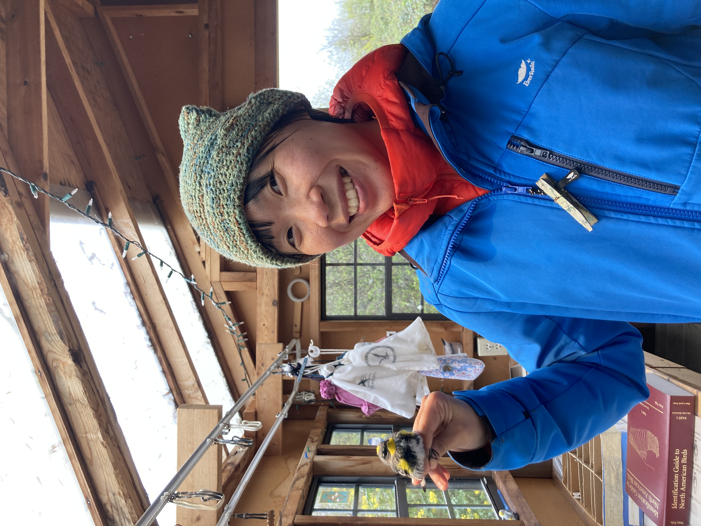

#### # I
久違的鳥兒筆記第三季（?）來啦！隨著北半球鳥兒的季節慢慢來到，繫放、標本、研討會、野外調查、演講、錄音等事項也越來越充斥著生活，累積到了一個不寫下一點東西很對不起回憶的地步（笑）。

第一站就來到好久不見的 WildResearch IIBO 繫放站。

錯過了去年的秋季，這次的春季遷徙趕緊把握機會，清晨五點架網，騎著腳踏車在漆黑的 downtown 穿梭，坐著公車、搭著 skytrain，最後再被心地很好（但回覆訊息很慢）的 Bander in Charge (Julian) 從車站撿到繫放站。整個熟悉的場景撒在眼前。

一到達繫放站就收到 Assistant Bander (Sean) 傳來訊息，說有張網鳥很多需要支援，「Are you comfortable doing extraction?」Julian 轉頭看我，一口答應，幸好我接到的鳥兒們都很配合，肚子都乾淨的露出來不太掙扎，當場下著點小雨，有點冷但手還是溫暖的，讓解鳥的時間壓力小了很多，當慢慢從鳥的腳、右翼、左翼、頭解下網時，那個感受非常幸福啊（笑），然後就在到達繫放站的十分鐘內解了兩隻鳥，也在本季第一次到繫放站就幫鳥上腳環量測。真的很喜歡、非常喜歡這裡的 Banders 互相信任、互相學習的關係（畢竟我的繫放也是在這裡學起的），接下來的繫放會越來越順手的。

今天總共抓到 37 隻，個人最愛是 Golden-crowned Kinglet，最驚喜的則是 Rufous Hummingbird，我不會解蜂鳥，一看到馬上 pass 給別人（笑）。唯一的回家作業就是要多讀書，那些 Complex Basic Strategy 還有 Complex Alternate Strategy 的 diagram 要再來貼在牆上啦。Such a wonderful beginning of the season!

PS. 和 Julian 還有 Sean 聊天，鳥類的圈子真的很小，一下子就發現許多共同好友，過去在 UBC、UNBC 還有在 Birds Canada 打滾過的經驗都會把鳥類研究小圈圈的人們連結起來。

