#### # I
小時候基礎沒打好，是時候該好好的從頭學起了，既興奮又期待。

鳥類構造-- 覺得畫畫可以讓學習變成一件好浪漫的事情。

PS. 新學期當了 Data Science 的 TA，自己也修了 Ornithology，覺得帶人學習/自我進修，都是讓人很有成就感的事情。

#### # II
要先澄清這是隔壁同學的筆記。

鳥類學的第一個 lab 就是進到學校的 Biodiversity Museum 認 30 種鳥類標本 (學期末考試是 174 種跑台，大家修完課之後都是鳥類小達人了)。看眾人都在水深火熱皺眉時，斜眼瞥到隔壁同學正認真地埋首。

「Do you also sketch?」我驚喜地問 (搭訕模式開啟)。

能認識一樣喜歡鳥、喜歡畫畫的好夥伴，真好。

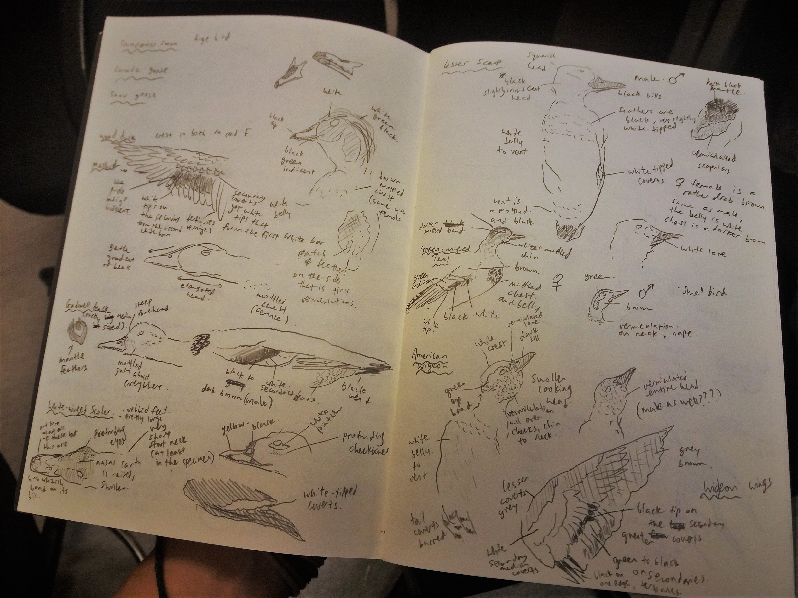

#### # III
這學期除了修課之外，也到了學校的 Beaty Biodiversity Museum 學習製作動物標本。

雖說是 Volunteer，但工作內容完全刺激滿點。第一次上工，桌上就放了一隻剛解凍的 Snow Goose 及解剖工具，我的任務就是要去除那隻 Goose 的皮 (連皮帶羽的脫下)，而它之後會被製作成骨骼標本，供學生上課實習。

噢，血腥的畫面就不放上來嚇人了，想分享的是那份新奇的感覺，打開鳥兒的身體才覺得自己懂的真的好少，關於牠們的器官、骨骼、還有羽毛，藉由這些細節就可以推敲出食性、年齡、性別和死亡原因等訊息。

還懂得太少，只好慢慢地繼續學習。

PS. 照片裡是各種 Raptor (猛禽) 的頭骨，親手參與製作過程就能體會要拿到這麼乾淨的骨頭有多不簡單。

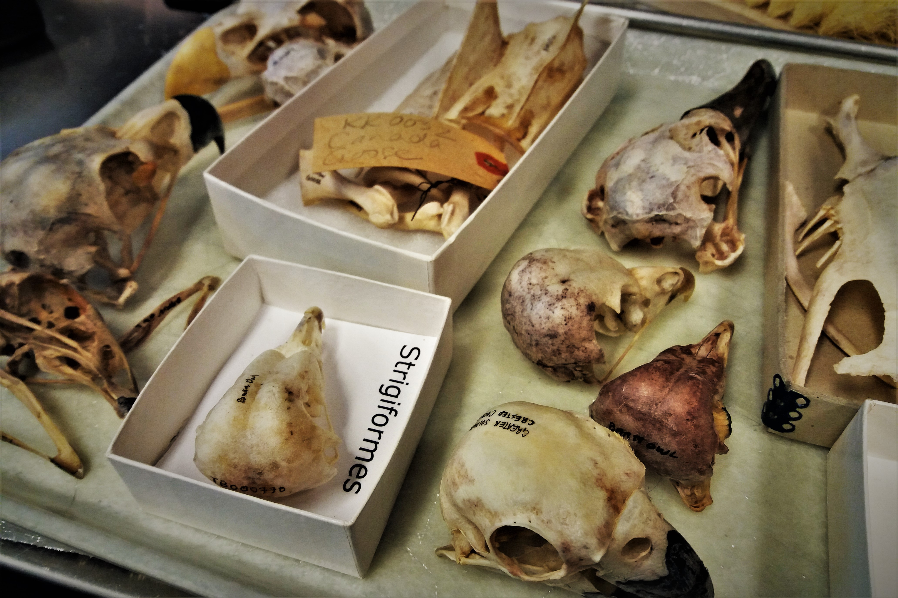

#### # IV
從鳥兒身上取下骨頭後，會送進蟲蟲箱進行消化，消化完畢的骨頭上還會有點碎屑、油脂以及蟲蟲殘骸，這時就來到了骨骼標本製作的最後步驟-- Bone washing。

Bone washing 是一項非常需要專注力的項目，尤其是對小小鳥，常常要一手用鑷子固定、另一手拿小刷子仔細地刷骨頭表面，若一不小心用力過大，很容易就把骨頭折斷了。但這倒還好，Bone washing 的頭號準則是一根骨頭都不能丟，畢竟骨頭斷了還可以再黏，拼圖少了一塊卻是怎麼也補不回來的。

P.S.1 照片裡這隻 Screech Owl 是我的第二隻鳥兒，令人驚豔的完整。

P.S.2 最近有朋友問我們博物館是否會刻意捕捉鳥兒來做標本，答案是不會的。我們的鳥類標本 (不論是 skin, taxidermy 或是 skeleton) 都來自於意外或是自然死亡的鳥。雖這麼說，在不久前的上個世紀，專程捕捉鳥類做標本的行為仍存在於世界各大自然史博物館，關於這點，還有好多故事可以之後慢慢說。

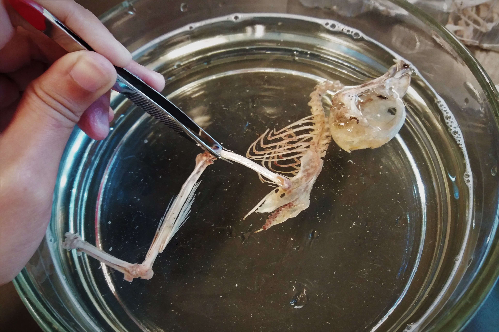

#### # V
仗著位在 Pacific Flyway 的地利之勢，Iona Island 在每年的春秋都會進行遷徙鳥類的繫放。天還未亮我們就要在田野間架起一張張的 Mist net (真的是網如其名，一不注意連我自己都會撞上)，架網的時候還常遇到浣熊一家人躡手躡腳地在黑暗中散步(笑)。

昨天清晨氣溫只有 10 度，我們卻意外地遇到了 Kinglet 大爆發，大家各個上緊發條地做 extraction (把鳥安全的從網上取下)，期間還遇到幾隻鳥兒冷到需要放在自己外套裡幫忙取暖。不過這次的經驗也真的是很好的訓練，因為要保護鳥兒們的安全，眼明手快絕對是必備技能。

PS. 繫放時最愛的鳥兒就是 Ruby-crowned Kinglet 了，看那帥氣的小龐克!

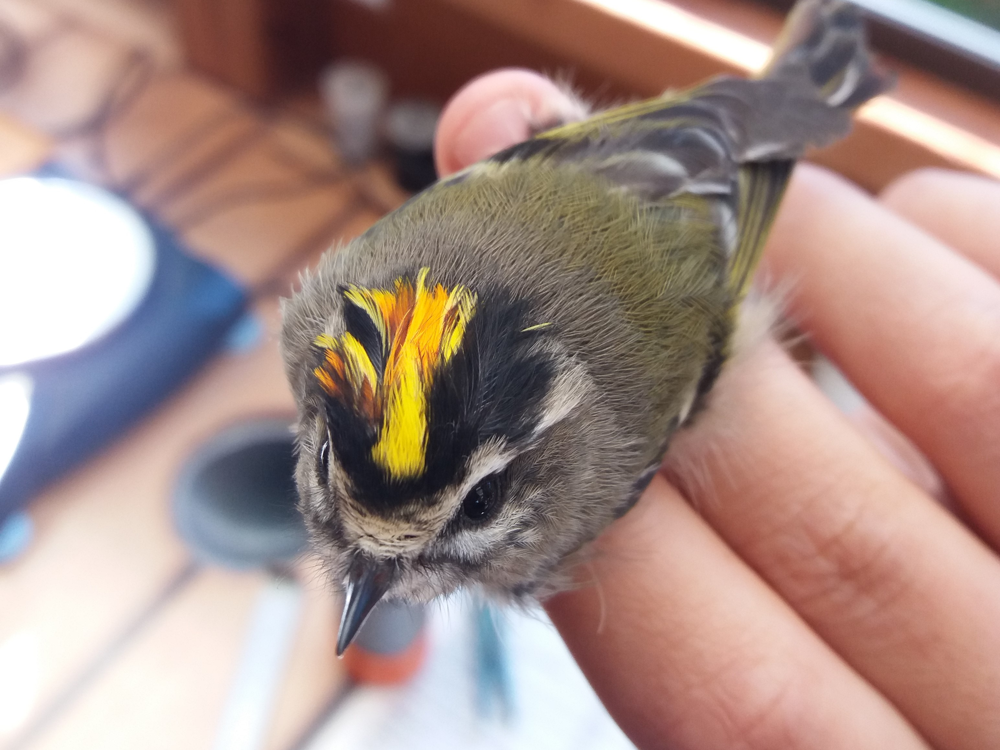

#### # VI
期中考題如下:

- Please give a brief definition of Suboscines. Which group of Suboscines breeds in Canada?

- What is the sister group of Squamata?

- How close are the Ornithischian dinosaurs and birds?

…啊。

每次一個小時的課堂結束都要回家花上數個小時複習，難得在大二的電磁學之後再度體會到聽不懂課是甚麼感覺(笑)，有時候還會懷疑老師是不是在講英文(淚)。但一點一點把以前學過的生物多樣性理論、名詞們轉成英文，實在是個很有趣的經驗。至少現在可以很有自信地說出 “Archaeopteryx is considered the earliest bird and lived around 150 MY ago in late Jurassic.”。

P.S. 照片是老師帶來課堂上的始祖鳥 (Archaeopteryx) Berlin Specimen的副本，正本展示於柏林自然史博物館。另一具相同著名的始祖鳥化石 (i.e., London Specimen) 則收藏於倫敦自然史博物館。

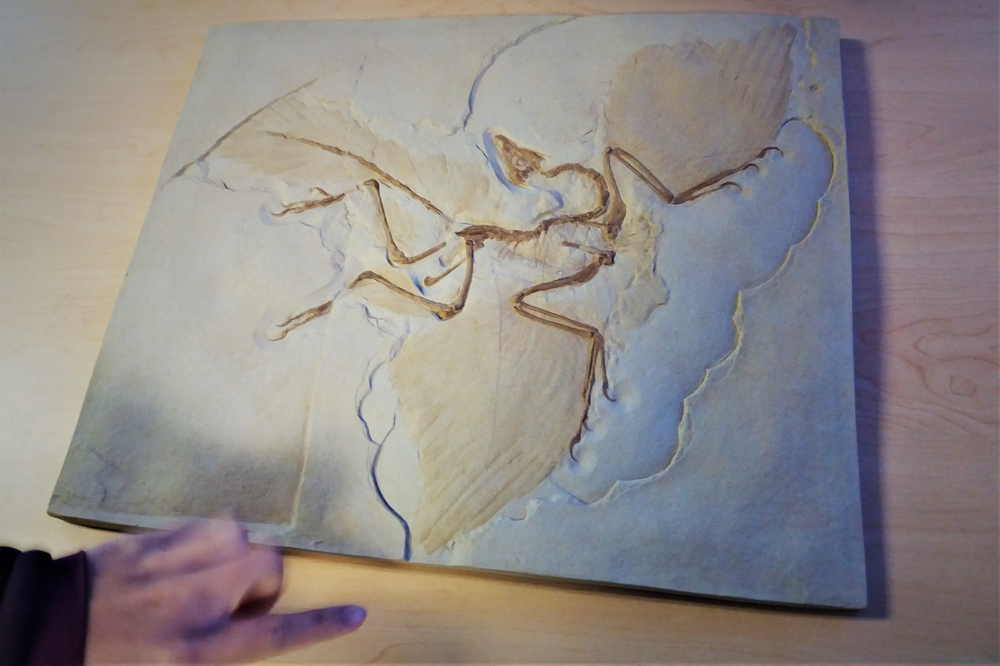

#### # VII
又新添了一隻為朋友畫的鳥兒。

One of my friends spent several summers in Simthers trying to capture this bird, Horned Lark, which is also his favorite species.

#### # VIII
在準備Lab Quiz 、背學名背到頭昏時，看到這兩隻的眼神。恩。好像在說「妳給我好好讀書，到時不准把我認錯!」。

覺得記名字不難，比較難的是要背那些在野外沒看過的物種。像這隻 Northern Saw-whet Owl 就曾在樹林裡見過，印象很深。但旁邊的 Western Screech-Owl 倒是沒見過，就像是要記住陌生人的名字一樣。

果然，學習生態學的精髓就是要多出門玩耍啊 (遠望)。

P.S. 背學名是個很重要的過程，就像在學習生態界的新語言一般，熟悉物種的分類，就能夠擁有跟更多人溝通的能力。

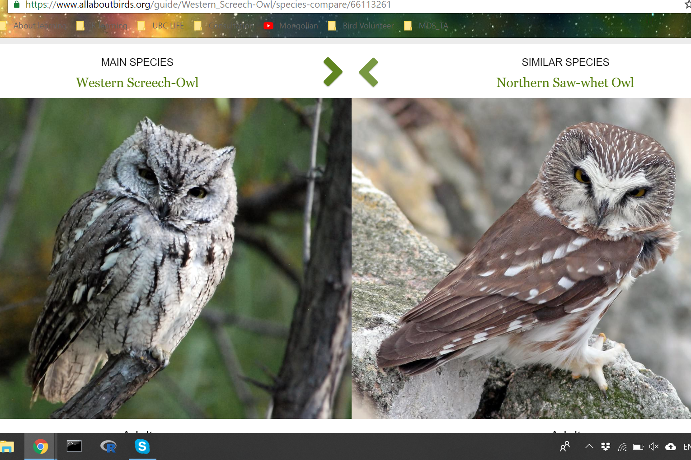

#### # IX
這是我們上課的實景，鳥類標本們、專業的 Taxidermist，每堂課都像是博物館的盛宴。

為了讓我們近距離觀察鳥類的特徵，並學習他們的分類系統，我們每周都會進到校園裡的 Biodiversity 博物館，我想，也只有博物館能夠擁有這樣豐沛的資源了。對我來說，能夠近距離觀察、甚至是觸碰這些標本是一種奢侈，好像是親身體驗了達爾文時代的學習自然的方法，從捕捉、紀錄、製作標本、收藏、到發現新物種。噢，不知道有多少鳥類學家 (分類學家) 曾經埋首於這些標本中，仔細觀察，又思索著，然後經歷了那發現新物種的喜悅。

博物館真的是個浪漫又科學的存在。

噢，忘了說，我們上堂課有展示 Snowy Owl 喔! 對，就是我去年冬天走了好遠、找了好久的雪鴞，我摸著牠柔軟而雪白的羽毛，不禁盈眶。Life is a miracle, and biodiversity is a splendid miracle.

PS. 照片中拿著標本的人是 ildiko，是在博物館教我做鳥類標本的人。她謙虛、堅強、溫和、睿智，是個集理性與感性於一身的，我的偶像。

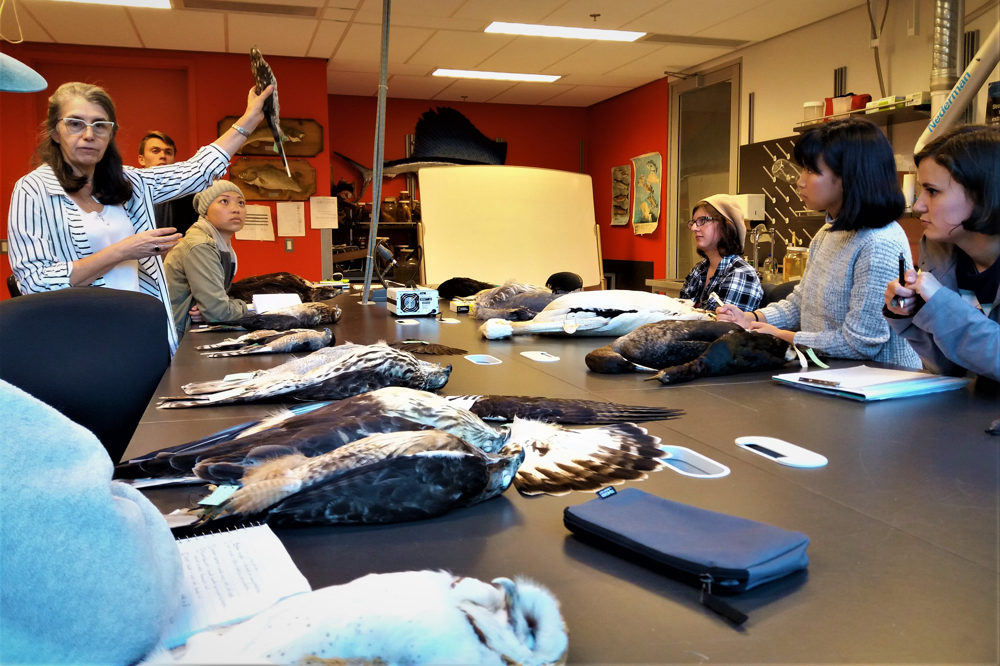

#### # X
最近和朋友一起設計了一個研究，我們想要在智利的山區紀錄聲景 (沒錯，就是那個南美洲很長的智利)。

合作的因緣很巧，Tomas 剛好有個朋友在研究蝙蝠，他自己對鳥類、兩棲爬蟲有興趣，而我又對分析音檔非常著迷，於是我們就此組成了研究小隊，開始到處借儀器、並一起討論了研究細節。終於在一陣忙亂的準備後有個計畫的雛型了(累癱)。我們到時會在智利三座火山上不同的海拔架設錄音機，同時記錄蝙蝠、鳥類以及兩爬的聲景，希望能藉由排程錄音機長時間觀測的特性，進一步監測當地的生物多樣性。

我手上這台錄音機再過幾天，就要飛往那個正在夏季的南半球，聆聽那一季的歡熱、瘋狂的盛宴、與夜晚星空下的寧靜。好期待可以聽到南半球的鳥兒與蝙蝠們 ，也好期待可以動手分析這些音檔 (手癢心更癢)。但是我已經事先被警告，還沒寫完自己的論文之前不准碰這些音檔了 (淚)。

PS. 總有一天我也會跟這些錄音機們一起去智利。

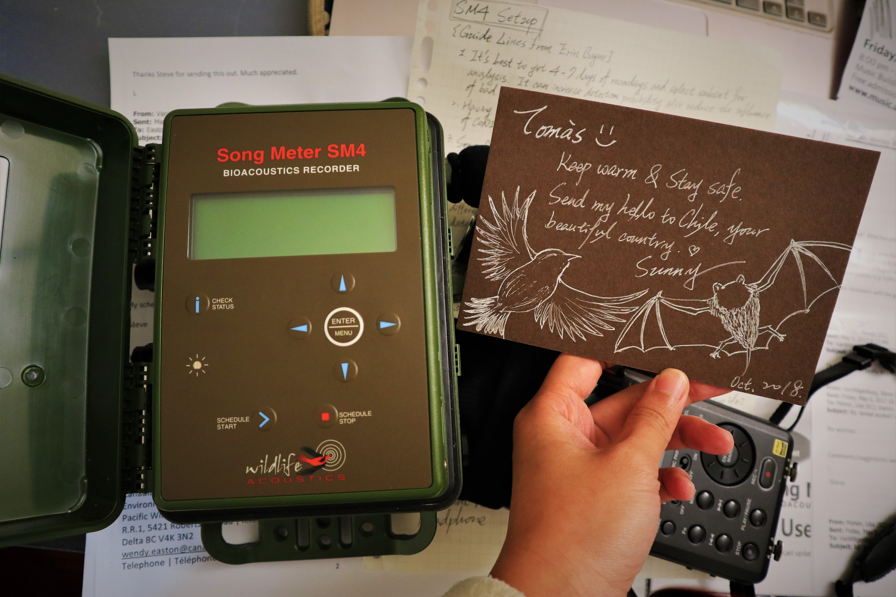

#### # XI
「Sunny, you should be proud of yourself.」Stella 給了我一個大大的擁抱。

這周末到了Squamish 的偏遠地帶參加生態演化的會議 (偏遠地帶是指沒有網路也沒有手機訊號的地方)，終於做出了自己覺得滿意的 oral。啊~之前在 IOC (國際鳥類會議)、CWS (加拿大野生動物服務) 都報告過，但這次明顯的感覺自在許多，問答的 Session也流暢信心多了。除了報告完後的寒暄外，今早回歸城市後還收到了一封來自聽眾的郵件 (一個做 machine learning 的 PhD)，說對我的鳥聲研究很有興趣，想要見面聊聊、多了解我做的分析。非常非常的興奮，實在是值得紀念的一段經驗。

還有另一個很想分享的是，我開始把自己的素描放上學術報告的投影片了(笑)，之前看到有個做 Andean bear 的朋友放了好多她自己畫的插圖在她的 master defense，這次也來有樣學樣。覺得這讓學術報告頓時成為一項屬於自己的藝術作品，分享研究成果，就是分享藝術、分享愉悅。

PS. 學術會議真的是個很棒的交朋友的地方，這次也遇到了好多各有專精的夥伴呢! :) 看來之後在校園的日子又會更熱鬧了。

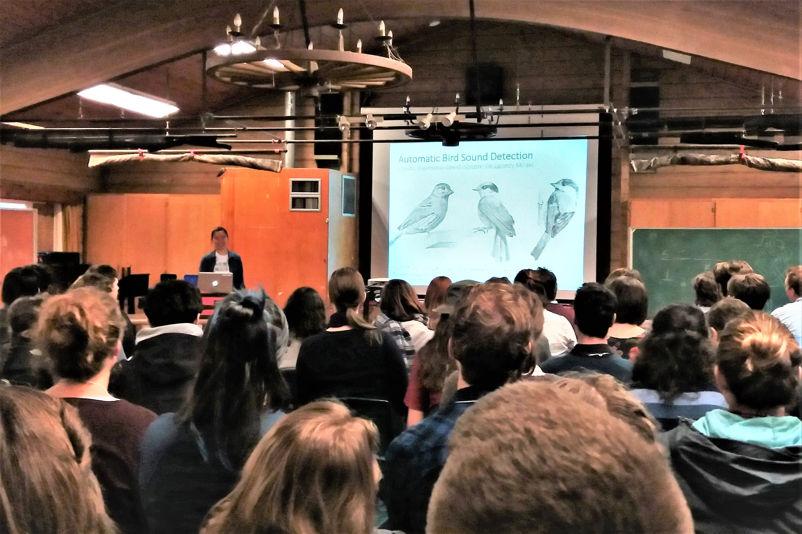

#### # XII
白天時是位平凡的人。

夜晚的時候，就把自己想像成藝術家，放任心思翱翔於那不可及的天際。

-- Northern Harrier (Circus hudsonius)

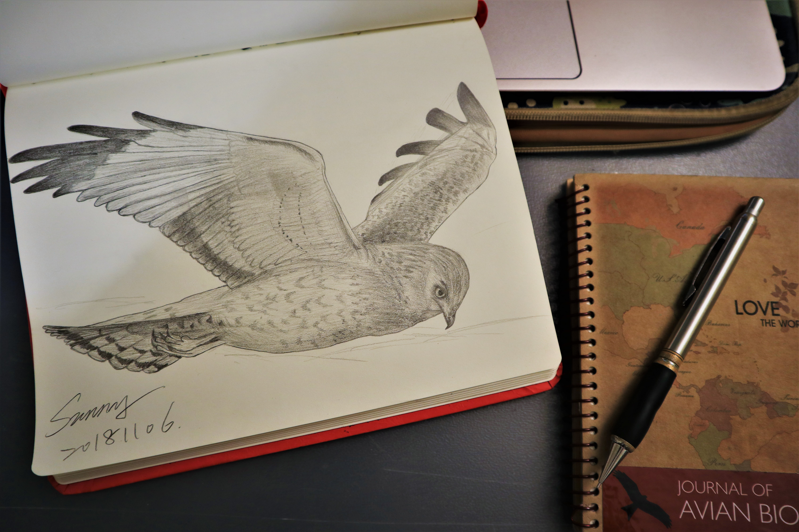

#### # XIII
起風了。周遭楊木 (Aspen) 如鱗片般的葉子閃爍著，再一陣風來，就沙沙的作響，像浪潮聲、又像是森林裡窸窸窣窣的笑語。樹林裡的 Hermit Thrush 及 Swainson’s Thrush 交替的合唱著。噢，就算已經聽了一個夏天，我還是好愛那如玻璃般清亮的旋律。

這樣美妙地享受，就是那照片裡的故事。

今年夏天還在 Williams Lake 做野外調查時，收到了UBC 林學院季刊 (BranchLines) 的徵稿通知，於是就在每天晚上結束調查的閒暇時刻，戰戰兢兢地寫下自己關於鳥音分析的研究，以及那些聽鳥的故事。雖然自己開始聽鳥起步很晚，但懵懵懂懂地，也已經慢慢地學會了一些皮毛。而能夠有機會分享那樣的喜悅，更是一件令人感到幸福的事情。

BranchLines: https://www.forestry.ubc.ca/publications/branchlines/

#### # XIV
「Owl，一個如此簡短的字詞，卻含括了一整個神祕的世界。」-- Paul Bannick 《OWL: A year in the lives of North American owls》

追逐雪鴞，是從去年冬天就開始的故事，說不上來牠們有怎樣的迷人之處，但就是被這些來自北極圈的白色幽靈們深深吸引著。也許是為了那雙如琥珀般的眼吧、也許是為了那身如雪花般的羽衣吧、又或許，是為了那遊蕩無懼的性格。

一天，在生物多樣性博物館製作標本時，送上來的竟是一片雪白而帶有黑色紋路的美麗左翼。「是雪鴞」，我倒抽了一口氣，「好美…」。我小心翼翼地展開眼前的這片翅膀，飛行羽還參差不齊、換羽的痕跡明顯可見（舊年的羽毛是棕黃色的，且羽片有磨損的痕跡），覆羽則華麗得像是天上的點點繁星，只是天空是白的，星是黑的。太迷人了，我輕柔地撫摸著這眼前近乎完美的藝術品。

製作羽翼標本的步驟很簡單，基本上就是將橈骨與尺骨之間的肌肉完全去除，這個部位等同於人類的小手臂，過程中唯一要注意的，就是不能傷到尺骨與次級羽之間的連結（鳥的次級羽羽囊就位在尺骨上，可以想像這些羽毛是從骨頭裡長出來的）。

手術刀輕輕順著肌肉的紋理劃下，不知道這隻雪鴞生前到過哪些地方呢？不知道牠曾在北極的苔原度過幾年的夏季？這讓我想起 Noah Strycker 曾在他書裡寫道「雪鴞的遊蕩行為很罕見，不過有些人大概會與他們起共鳴，畢竟，誰不曾夢想過要消失在天邊呢。對雪鴞來說，遠離家園不是夢想，這是他們的生存之道。」

也許吧，就是那樣以流浪聞名、天生就愛追求新體驗的個性，讓這樣美麗的生物，又添了一層神秘與迷人。

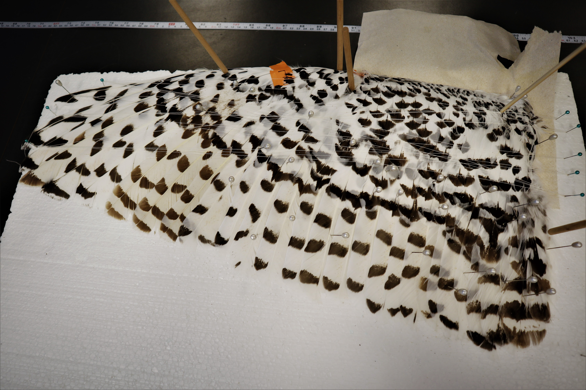

#### # XV
從今年九月到現在：遷徙繫放、野外錄音、博物館標本製作、鳥音研究發表、科普文章寫作、素描創作、常見鳥種聽音辨認… 如今回想起，瞞著指導老師修的這堂鳥類學，以及親身參與的這些經驗，大概值得自己回味許久（朋友都說瞞著指導老師的行為實在很好笑）。

路途中的跌跌撞撞都留在日記裡了，雨天時還是分不出 Bushtit 與 Kinglet 的聲音、素描時還是沒辦法勾勒 Great Horned Owl 的絨毛、製作標本時還是會不小心劃破 Golden Pheasant 的薄皮膚。總還是希望自己能再學得快一些、再認真一些、再聰明一些… 。

本想督促自己將學習的點點滴滴寫成文章分享，而學期中一忙，也就未臻完整，如今也該有個悠然而溫馨的收尾。最近將收藏的飛羽布置於房間的一個小小角落，其中 Great Grey Owl 的羽毛成了鎮館之寶。在飛羽的世界裡，牠們給了我一個可以飛翔到世界盡頭的想像。

