#### # I
Peter, my lovely neighbor, is a wonderful natural observer and a professional nest box (巢箱) builder. It was a great pleasure to know him and get involved in his projects. Along with Stella and Derek, we went on a 5-day field trip in a remote area called Big Bar Lake for checking nest boxes. A total of 52 boxes were set in Big Bar Lake and those boxes have been checked annually for the last 10 years – the species of bird nested in the box was recorded and the nesting condition was measured. (It is like a graduate student thesis research!)

The resident of the nest box can be identified by looking at the materials and the structure of the nest: twiggy nest from house wrens, feather/fine grass materials form tree swallows, and chewed up grasses from small mammals. We also found several dead young, including birds and mammals, in the nests. Every box has its own story and we have to tell the story by observing what was left behind – like a detective, but in the bird version!

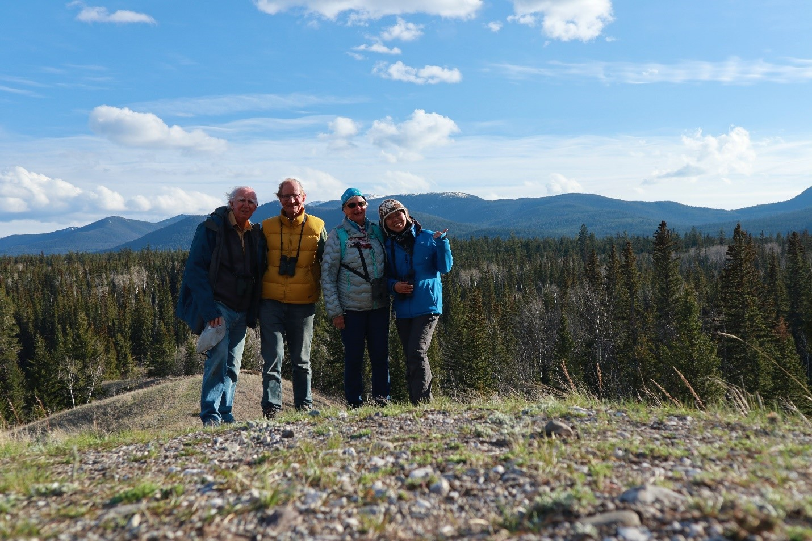

#### # II
趁著陽光正好的這天，我們到了溫哥華南邊的 Tsawwassen 做木工、蓋巢箱。

Peter 跟他的團隊已經經營了這個巢箱建造計畫有三年之久，在這幾年之內，他們已經建造了上百個給倉鴞（Barn Owl）的巢箱，並廣泛的設立在溫哥華市郊。要蓋一個給貓頭鷹的巢箱可不簡單。從設計、選木、切割、黏接、與油漆，全都由團隊一手包辦。多虧 Jim 在 Tsawwassen 有個大大的工作室，這才讓這個團隊有了個生產房屋的基地。

這群阿伯、大叔們來歷也不簡單，有些是 UBC 退休教授、有些是森林護林員、有些是工程師…，跟他們一起工作真的是個愉快無比的經驗，各有專長又能夠在工作之餘笑聲滿屋。繼上次蓋了小巢箱之後，這次用上大電鋸也越來越順手了，為自己培養新技能。

最後要拍照時這群可愛的夥伴們還推著我說，”Sunny, you have to sit on one of our boxes!”。夏季果然就是個跟鳥兒們一起享受陽光與認真工作的日子!

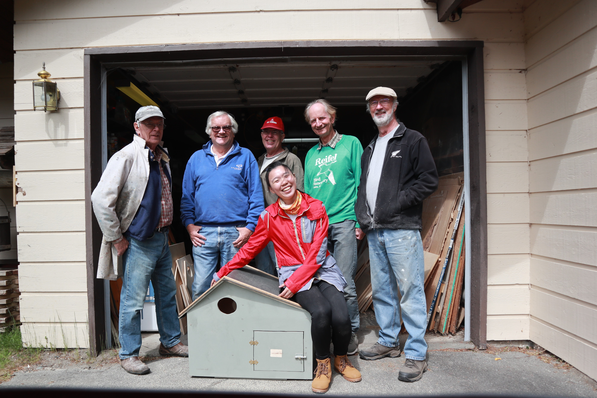

#### # III
清晨三點半，鬧鐘放聲響起，還以為是夢裡的鳥兒，飛到耳邊來唱。

夏天日出的早，要趕上日出前開始繫放（Banding），就得乖乖的早起，摸黑架起 Iona 繫放站的十四座霧網，一切都熟悉又陌生。參與繫放工作也需要身備十八般武藝，要會架網、打繩結、摘鳥（!?）、認鳥種、上腳環、由換羽辨認年齡…其中個人最愛的就是摘鳥了。顧名思義就是要把纏繞在鳥兒身上的細網慢慢地解開，一整個就像是益智遊戲，若遇到小夥伴不停掙扎，還得好聲勸說、輕聲安撫。

於是一天就這樣從清晨五點繫放到中午，下午又到 UBC 工作，傍晚再去教小朋友做巢箱，晚上再回家趕畫作到十一點（還有前次出野外錄的音檔還沒處理、還接了一個素描的工作、還有論文要寫…）。

真是燃燒青春的夏季阿。

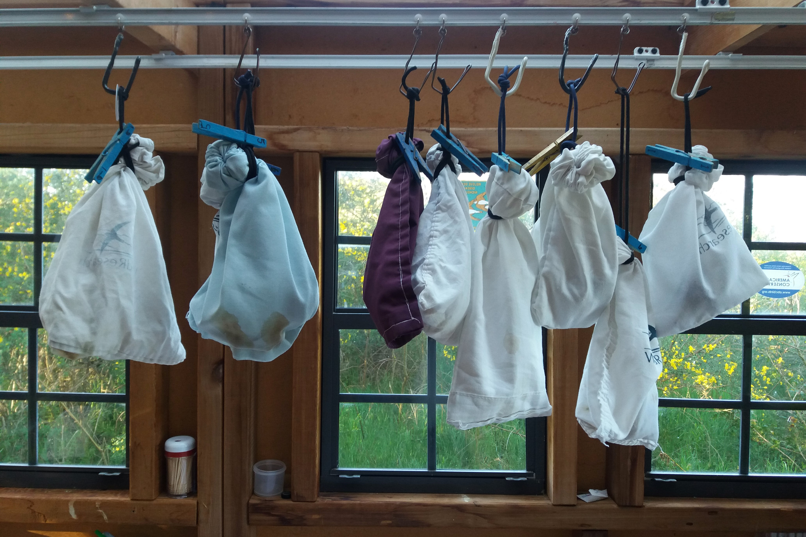

#### # IV
作天傍晚臨時應了朋友的約，到了住家附近的童軍團教小朋友做木工，工作內容很有趣，小朋友們要做給 Chickadee 的巢箱。

我一開始還在想，這麼複雜的步驟，要上膠、鑽洞、敲釘子、鋸木材…這些小小孩真的可以完成嗎…沒想到他們對這些看似危險的工作完全不害怕，拿起電鑽、榔頭、釘子，就像吃飯拿起刀叉一樣順手，過程中還不忘打鬧，玩得不亦樂乎。

最後非常驚人的（在場可能只有我很驚訝），十一個小朋友全數在時間內完成自己的巢箱，不僅裝上了活動式的門，有門閂，箱上還有熱鐵烙上的印記。要離開的時候有幾個小朋友貼心地跑來我身邊跟我說謝謝，還說要把這個巢箱放在後院給家裡的 Chickadee 住。天啊… 心都完全融化了…。

昨晚，伴隨著榔頭敲擊釘子的聲音，小孩們天真爛漫的童言童語迴盪在我腦海，夜晚的星空微笑著。

#### # V
上週接到系上教授 H 的來信，說想要邀畫（內心雀躍啊），在信中問了價錢與交稿的時間。我回了信說需要一個月，因為畫畫需要靠靈感（可能只有我…），而且現在手上也有進行到一半的作品，老師很客氣地說沒問題，但如果能盡早就更好，因為他想要送這幅畫給他的太太當作母親節禮物，他說他太太在 3MT 上看過我的畫，非常的喜歡。

此言一出，這個案子立馬變成優先處理的作品，最喜歡這樣有故事背景的創作，也很喜歡這樣突破他人期望的感覺。最後在茶水間幫作品裱框時，偶遇教授 C ，他睜大眼睛看著我的小蜂鳥 ”Wow! I also saw your drawing on BranchLine. You are very talented.”，既害羞又內心愉悅啊。

每次完成作品後都會捨不得放手，交畫的瞬間就像要離開自己的孩子一般，萬分不捨。我想我一定偷偷把給媽媽的愛放在這幅作品裡了。媽媽母親節快樂。♥

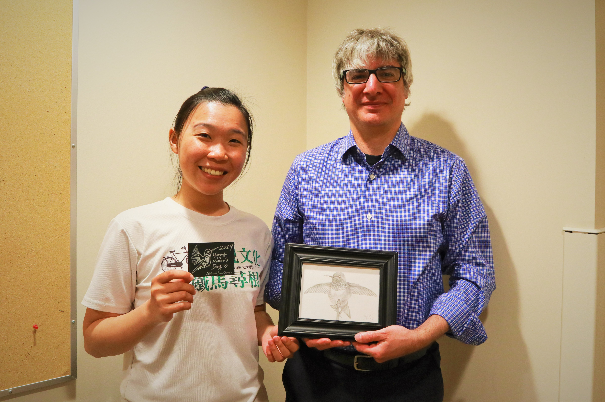

#### # VI
一早到了溫哥華郊區的國小，上了一堂「鳥類學」，內容是要教小朋友聽鳥聲。我在課堂上要小朋友「畫」出鳥的聲音，初衷是想讓他們了解，其實我們可以藉由視覺來幫助聽覺上的記憶，而這也是我在初學鳥音時常用的方法。令人驚豔的，小朋友們都各有創意，大圈圈代表 Raven 的聒噪沙啞、密集的波型象徵 Hummingbird 的嘎吱嘰喳、階梯狀的格子則是 Chickadee 口哨般的歌聲。看小朋友們踴躍的舉手分享，還一直跟我說他們在家裡後院還聽過哪些哪些鳥，實在是內心愉悅。不只是小朋友們，連原本嚴肅的老師也「畫」（聽）得很起勁，直興奮跟我描述她聽見貓頭鷹的經驗。

最後玩遊戲時全數小朋友都藉著自己的畫，順利的分辨了不同鳥聲喔！小朋友的學習潛力真的不容小覷！

聽說小學一到三年級是惡名昭彰的好動又上課不專心，但跟小朋友們相處完只有覺得滿心愉悅啊。因為他們，讓我的一整天都是微笑著的。

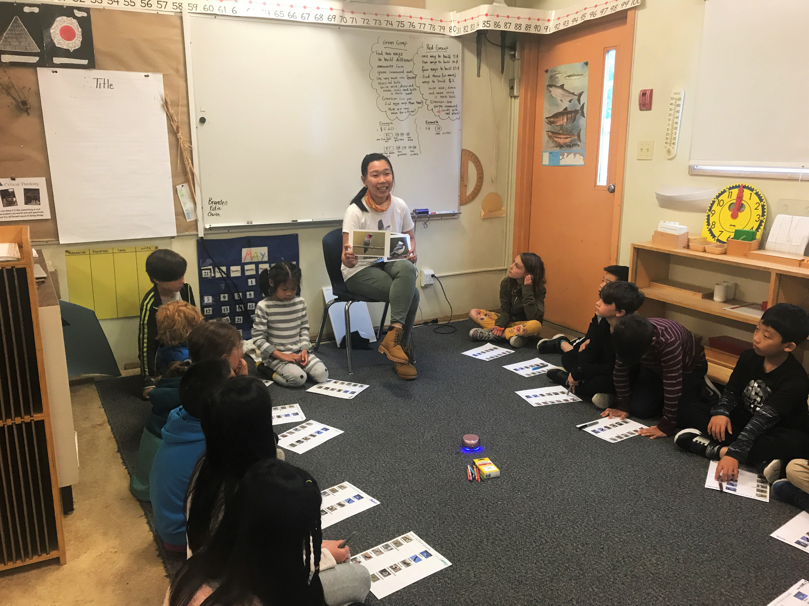

#### # VII
Barn owl box checking, one of the most exciting moments of this breeding season! These chicks are around 30 days old based on the aging system of Barn Owl Trust. Still about one month for them to turn into fledglings.

Safe growing up babies. 

#### # VIII
每一個畫作的背後都會有個動機，有時候可以很簡單。

那天在繫放時被分派到跟 M 一組，通常都是這樣的，會由一個經驗較豐富的繫放員帶個新手。M 已經從事繫放工作好幾年了，同時也是個好老師，跟他一起巡網總是可以學到很多有用的小技巧。他在 Nova Scotia 長大，是一個加拿大偏遠到不能再偏遠的地方，他說，從事野外工作是他從小到大的嚮往。

他的身上有種很正向沉穩的氛圍，我想一定是因為他總是做著自己喜歡的事情吧。能有這樣的朋友也總是讓我感到充滿能量。

「What is your spirit bird?」我問。

PS. 這是 Canada first nation 的風格，對我來說是新畫風，用的也是新的媒材，加上大篇幅的畫紙，整個作品從開始到結束實在是令人感到非常舒暢!!

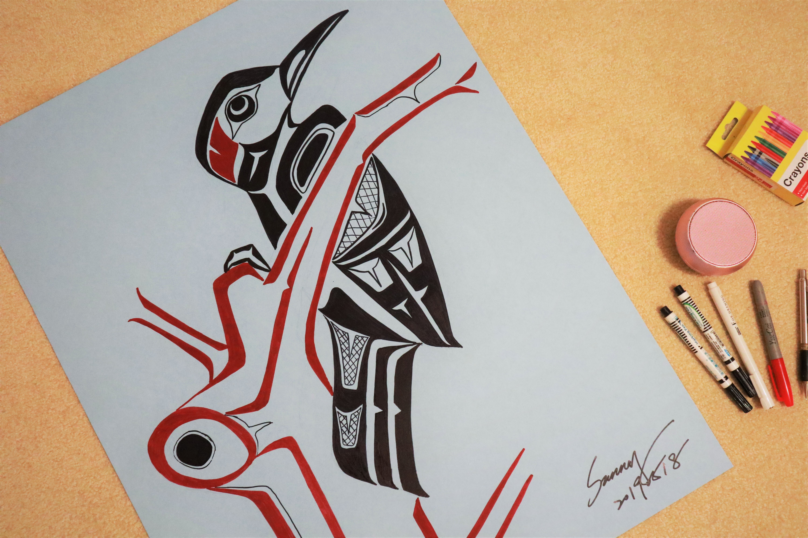

#### IX
第二次上 BranchLine 了（UBC 森林學院的季刊），最開心的是這次可以跟自己的畫作一起（笑）。

當初剛進 UBC 時，一心想著總有一天要登上 BranchLine，算是小夢想吧，於是寫了一封信給季刊美編 J，「如果有文章需要畫作的話，我可以幫忙畫喔！」，不知道是哪來的天馬行空的想法，當時也是夠勇敢能提出這樣的要求。結果當然是音訊全無、沒有下落。

輾轉過了一段時日，沒想到這期的季刊就刊出了 3MT 的比賽結果，而我比賽當時用的投影片也被放了上去（剛好就是心愛的畫作之ㄧ），現在這張畫的原稿還在房裡的牆上，是能帶來好運的畫呢！

PS.1果然只要相信可以，就會有好事發生。

PS.2 原本跟 Nicholas 的合照被拿掉了QQ 。

PS.3 繼續乖乖寫論文。

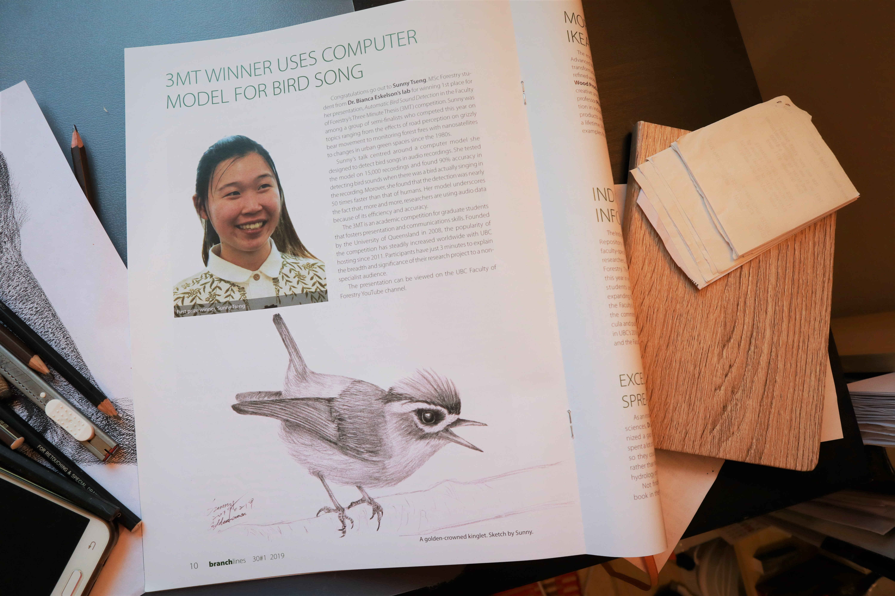

#### X
繼白炭筆、壓克力、麥克筆之後，最近又找上了那水與彩的美麗結合。

經過多人長時間的遊說，終於鼓起勇氣來嘗試這看似困難的媒材（其實真的是很有學問），要從原本的黑白素描跨到有色彩的世界，就像之前說的，真的是隔行如隔山，也如所料，這個初體驗又是一個不知所措的過程。

那天就這樣趴在房間地上左塗塗右抹抹，水彩很有趣，只要沾多一點水，就可以把不滿意的部分「洗掉」，但有時不小心又會把原本打好的底色也一併清掉，會有「啊…我剛剛畫的…不見了」的感嘆，只好再皺著眉乖乖重畫。我特別喜歡水彩的渲染技法，在瀟灑上一層水後再任顏料奔騰其上，在乾和濕之間調和而能呈現色彩的朦朧迷人（小聲說，其實這也是我目前唯一會的技法）。

創作總是令人愉悅的，而學習新事物更是令人備感興奮。新技能解鎖。

PS.1 我覺得用鉛筆在水彩作品上簽名，有令人屏息的美感。

PS.2 他是 Warbling Vireo，帶有白色眼圈的美麗鳥兒。

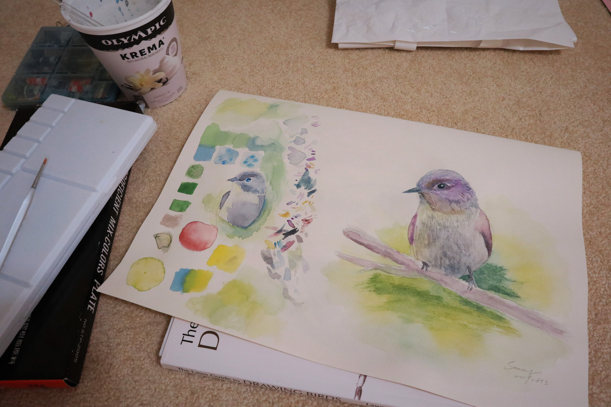

#### XI
主角是在我前方十公尺大聲唱歌的 Sooty Grouse，配角是滿山的雪。

兩周前到了 Squamish 附近的 Elfin Lake，Z 說要為我們七月的爬大山行程做準備（其實是要幫我做雪地特訓）。我們從海拔1000處開爬，三人正在車旁蓄勢待發整裝時，就遠遠的聽到了松雞 (Grouse) 的低鳴聲，嗚--嗚--嗚--嗚--嗚--。三人會心一笑，我們都知道這隻 Grouse 還離我們很遠。Grouse 的聲音因為頻率低的緣故 (~300Hz)，儘管在鬱閉的森林裡也可以傳遞好長一段距離，通常都是只聞其聲、不見其鳥。

就這樣走啊走，一路有腳下的碎石聲伴著我們，還有那隻 Grouse 仍然奮力地唱著，那聲音越來越大聲，突然間，Z抓住我的手臂倒抽了一口氣，「Sunny! It’s there!」，我順著她指尖的方向望去，也跟著倒抽了一口氣。天啊!是一隻 Sooty Grouse ! 就是那個聲音的主人!!

就這樣心情愉悅欣賞完松雞後，迎接我們的就是連續16公里的雪地路，實在是太累人，所以後來連把相機拿出來的力氣都沒有，但，路上的美景實在是不可言喻，而與朋友一同上山更是最珍貴的回憶。

PS.1 就算是雪地上，其實也還有20度左右，穿短袖短褲其實不稀奇。

PS.2 走雪地爬山超累，走一步滑三步。

PS.3 用手機或電腦可能會聽不到Grouse 的聲音，或不清楚。這是因為內建喇叭的頻率響應不擅長低頻的聲音，建議戴上耳機會有幫助(https://www.xeno-canto.org/479798)。

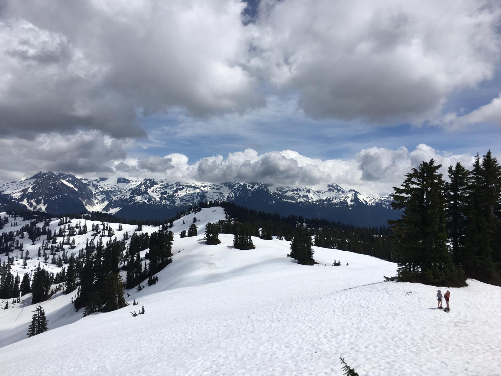

#### XII
Sofi 絕對是我目前見過最強悍又自信的 Biologist，沒有之一。

十二年，她說，跟這群倉鴞（Barn Owl）小朋友們已經一起工作十二年了。倉鴞的繫放（或許多其他調查）都需要在傍晚進行，而加拿大夏季的傍晚，你懂的，指的是晚上十點、十一點之後。身為一個熱忱的 Biologist，不只要有好的頭腦，更要有好的身手與體力。一口氣在野外工作到天亮，也是家常便飯。

我好喜歡，她看這些倉鴞小朋友的眼神。

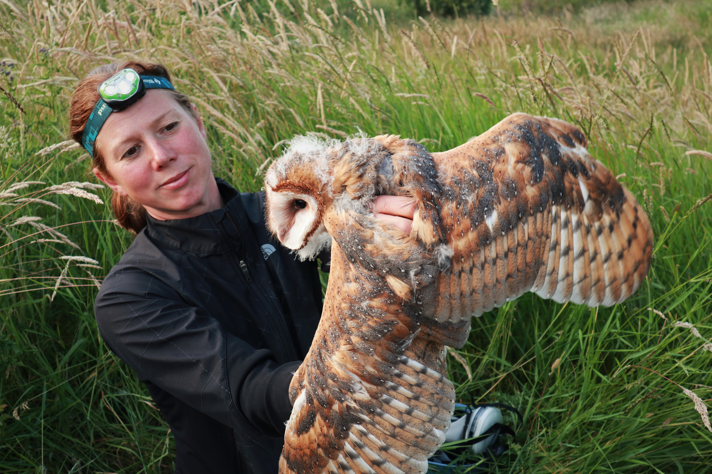

#### XIII
吵著要 P 帶我去划船很久了。自從四月在他們家發現一艘獨木舟，就開始安排兩個人都有空的平日時間，一直到前幾天才終於成行。

我對錄音的環境很挑剔，所以需要找個人少又風平浪靜的地方，我們扛著獨木舟到了 Widgeon Creek，放船，一路沿著支流上溯。我的聽力比 P 好，但他懂的鳥比我多、經驗也豐富多了，所以常常都是我先聽到鳥兒，再兩人隨波逐流的靜聽那和諧的奏樂。

在獨木舟上錄音有很多好處，除了非常悠閒愉悅外（誤），另一個就是很容易接近聲源。獨木舟在水上移動是非常安靜的，因此岸上的鳥兒們常常就這樣不知情的放聲唱歌，非常輕易的就可以捕捉到漂亮乾淨的聲音，看錄音機上的訊噪比就可以知道，這裡真的是錄鳥音的絕佳地點。唯一的缺點是偶有飛機經過，因而必須停下錄音。

最後一路到了上游的小瀑布，勇敢的跳進水裡後，再返程順流而下，回程的岸邊偶遇兩隻 Sandhill Crane ，與一隻健壯的黑熊。

PS.1 這趟旅程總共見了41個鳥種，其中9種有漂亮的聲音紀錄。
PS.2 之所以熱衷於紀錄鳥音，其中一個原因是可以認識各樣特別的人。

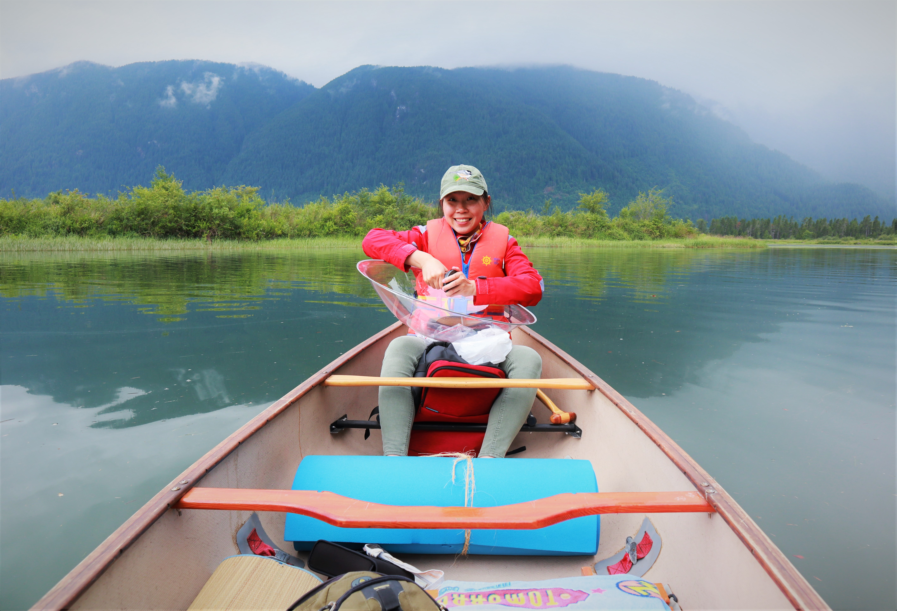

#### XIV
好希望有一天可以成為名正言順的 Field Biologist，現在只是打雜的，所以只能站在一旁負責抓好這些小傢伙。

PS. 我手上那位小朋友大約35~40天大，正是適合繫放的年紀，要等到60天大時才會離巢。又，臉上黑黑的，所以是位小女孩。

--倉鴞 (Barn Owl)

#### XV
算是盛夏結束前少數的大工程了。Cascade Bird Box Team (CBBT) 這次與溫哥華機場合作，在機場人員的協助下於機場旁非公共的區域豎了兩個給倉鴞（Barn Owl）住的巢箱。

溫哥華南方的一整片粗放草地（rough grassland）本就是最適合倉鴞的棲地，這裡提供了大量的田鼠及其他小型哺乳類作為食物。只是這幾年，倉鴞的個體數量受到棲地破碎化及人為干擾，加上與牠們競爭的白頭海鵰（Bald Eagle）在近幾年又數量增加，許多研究都已經注意到倉鴞的數量已經顯著下降，需要人為介入的幫助。

一個倉鴞家庭一整個繁殖季下來大約需要 2000 隻田鼠，牠們敏捷的狩獵能力深受附近農民的喜愛，因此過去 CBBT 都是與附近的農民合作、借用農地豎巢箱。而這次與機場的合作更是難能可貴。怪手、水泥、挖土、電鑽，機場方從原本的無動於衷到最後出動了許多重機械及人力來幫忙，著實令人感動，否則要立起一根近百公斤的原木可不簡單。

這又再一次的讓我體會到，相信的力量。

PS. 這個照片中的巢箱，正是我今年五月時與夥伴們一片一片木板慢慢架起來的。

#### XVI
儘管知道鳥兒們的繁殖季已經將近結束，還是忍不住出了門想抓住夏天的尾椎。

這回來到海拔 600 米的Jones Lake，心想也許可以錄一些溫哥華少見的鳥種，像是 Hermit Thrush 及 MacGillivray Warbler。錄音前晚，Y 問她的鬧鐘該設幾點好讓我們起床錄音，我自信的笑說不用了，只要鳥開始唱了我就會醒來。

清晨四點半，帳篷外的 Swainson’s Thrush 已經開始了早晨的宴會，用他們玻璃似的聲音地唱著，我瑟縮在睡袋裡，空氣很冷、大腦還留戀在夢裡。此時整個山谷地形就像一個大型集音盤，將遠方的聲音聚集傳進湖邊的帳裡，我還能聽見遠方的 Varied Thrush、Steller’s Jay 以及 Pacific-slope Flycatcher。我靜靜地聽，聽湖畔的水波，與牠們的和聲。

慢慢地搖醒身旁睡的正甜的 Y，帶上裝備，一起走進了還未完全清醒的森林裡，真是乾淨又漂亮的氛圍。「今年夏季最後一次錄音了吧」，我心想。

PS. 這一趟出們回來就感冒發燒，看來自己的身體也要我從瘋狂的夏季好好休息一番了。

#### XVII
幾天前去找 Val 討論了正在一起合寫的 paper，本來一切話題都圍繞著統計與數學，不知怎麼的開始聊起賞鳥。

Val:「我曾經看過一種很酷的啄木鳥喔，牠們的身體有這~麼大!」

我:「喔!是Pileated Woodpecker嗎?」

Val:「對!就是牠!我以前在加拿大北邊做野外調查時就有見到，非常的 fascinating。」

我:「嗯…老師，可是學校旁的Stanley Park 就有很多喔!」

Val:「真的假的! （十分震驚）」

大概也只有 Val 可以在討論 paper 時這樣跟我閒聊了，那天她花了一整個下午慢慢地帶我走過每個文章的細節，還仔細地問我是否明白回去要如何修改，最喜歡與她討論時那充滿正向的氛圍，讓人也隨之鼓舞起來。願意在她忙碌的行程空出一個下午給我，連我自己的指導老師都沒這麼耐心了。甚為感動，繪圖以記之。

PS. 仍然是 Val 的忠實粉絲，自己也要好好加油把文章寫完投出去了（埋頭）

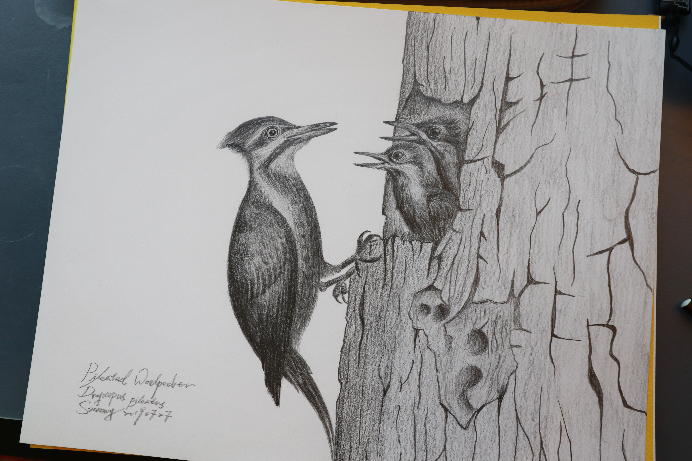

#### XVIII
我，與我的小天地。

最近收到一位朋友的訊息，說Sunny 妳怎麼最近這麼閒，又是爬山賞鳥，又是畫畫錄音的。其實，我還是一樣每天早上六點半起床（繫放錄音時就是早上四點），還是每天到辦公室待上八個小時，還是工作著存自己的生活費及學費，還是每天自己準備三餐，還有論文要寫，也有朋友要顧。跟大家的生活都是一樣的。

那些當繫放志工、到木工廠蓋鳥屋、錄音、爬山、偶爾畫畫、偶爾寫作，還有後院的向日葵、偶然的獨木舟之旅、幾個與朋友暢聊的夜晚。每天傍晚睡前的四個小時、還有假日的時光，就是完成這些小夢想們的時間。鳥兒唱歌的季節這麼短、夏天這麼短、青春這麼短、陽光這麼誘人、而創作的靈感又來訪的倉促。心中的熱血仍在，於是決定燃燒。

今年的夏季，也算是幸福滿滿的落幕了。

PS. 應該是鳥兒系列的最後一篇文章了，若有機會的話，下一個系列想來分享這幾個月來的錄音故事們（磨刀霍霍）。

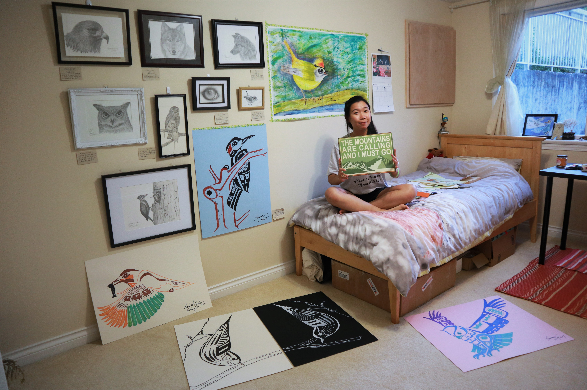
