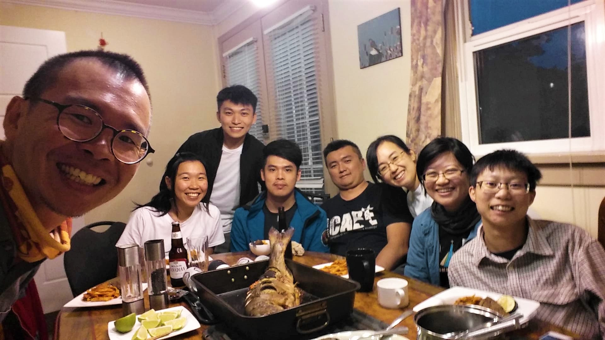

#### # I
Vancouver is the site of the 27th International Ornithological Congress (IOC) and is now being occupied by birders from all around the world. I was really lucky to be selected as one of the speakers (my third international meeting, first oral presentation.). The most exciting thing, of course, is to meet people/birders/researchers from different places with all sorts of interesting projects. 

A great walk to the Manning National Park revealed the beauty of sub-alpine birds to these cute Europeans. I was truly amazed by how knowledgeable these people are. Will definitely learn more from them in the following days. 

Welcome to this Beautiful British Columbia! 

PS.1 The Steller’s Jay won the final prize as being favorite bird of the day.

PS.2 Feeling blessed to sit beside my idle, Kathy, in the picture. 

#### # II
It is a great honor to know that the first plenary talk of IOC is from Lucia Liu, a worldwide-known ornithologist from Taiwan!! 

As the oldest and largest international meeting of ornithologists, IOC 2018 attracted more than a thousand of ornithologists from all around the world. The very first talk of the congress, is exactly about the Lanyu Scops Owl (蘭嶼角鴞) in Lanyu, Taiwan. 

Lucia conducted her study in Lanyu from 1985 to 2009. Her research made people start to understand the importance of the Lanyu Scops Owl. Among all these 25 years, she did audio recording, radio tracking, cavity checking, mist netting… all sorts of approaches trying to know more about Lanyu Scope Owl’s population size, habitat preference, nesting cycle, migration path... The hard work is decidedly well-recognized by ornithologists all around the world. 

I am so proud of being from Taiwan, this lovely and wonderful land. 

#### # III
The artists in Artists for Conservation (AFC) are beautiful in their mind.  

AFC is the world’s leading artist group supporting the environment and ecosystem. Today I was really lucky to meet David, the gentleman in this picture. As the oldest child in his one-parent family, David started working in a factory when he was only 17. He has no choice but to quite his school. At that time, he started drawing, and surprisingly found his amazing talent in arts. 

“When I was a child, my dream is to be a veterinary. But, I ended up being here.” He shrugged. “But I can see that you really enjoy being an artist.” 

“Oh, I love my job. It saved my life. Whenever I sit down, I take out my notebook and pencil and I draw. Then I calm down and feel peaceful.” He said. I smiled, as I can clearly see the tranquility and the passion through his eyes.  

PS. Look at that amazing Harpy Eagle!

#### # IV
One of the most interesting parts of attending a big conference is to meet old friends working in the same field. 

This is Dr. Arkady and his family coming all the way from Yakutsk, Russia (We know each other due to my recording work in Siberia last summer). It is always great to meet new people new but meeting old friends in a corner of the world is definitely another wonderful experience.

#### # V
We all have our own way to love birds—most of us watch birds, some of us study birds, and even some of us paint birds -- but, only few of us use our soul to listen to birds.

John Neville is an exception.

John has been involved in recording birds for the last 18 years. Even being blind, he still found his way to love birds. “It was really hard when I first started.” He said. Fortunately, he got supports from the Cornell Lab of Ornithology (Oh my dreaming place), the biggest bird sound library of the world. Now, he is the featured nature recordist famous around the world. 

He makes me think of Ted Parker, one of the most recognized ornithologists and best recordists ever. I hope one day, I can also hear the beauty of this Nature, just like they did. 

PS.1 The picture shows my recording equipment when I am in field, my beloved Telinga. 

PS.2 Website: http://www.nevillerecording.com/

#### # VI
It is a big milestone for me – my first conference talk in English! Mission completed!

Bird sound audio analysis is my side project of the master study. I was truly lucky to get supports from Bianca (my fantastic supervisor), Kathy (my super idle), and Val (my another super idle). The project started as a small course project, and ended up being a complete project that I can share in this international conference. Much appreciation to all the friends who came to support me. 

“The only person you need to impress is yourself.”—I especially appreciated one of my friends, David, who told me this before my presentation.

#### # VII
Doing research is like painting (and anything else), requires lots of efforts, time, and hard working. However, things always become easier when having great partners around. Feel really blessed to know/work with these wonderful people. 

It is the end of IOC, but for sure we will continue to pursue what we are passionate about!

