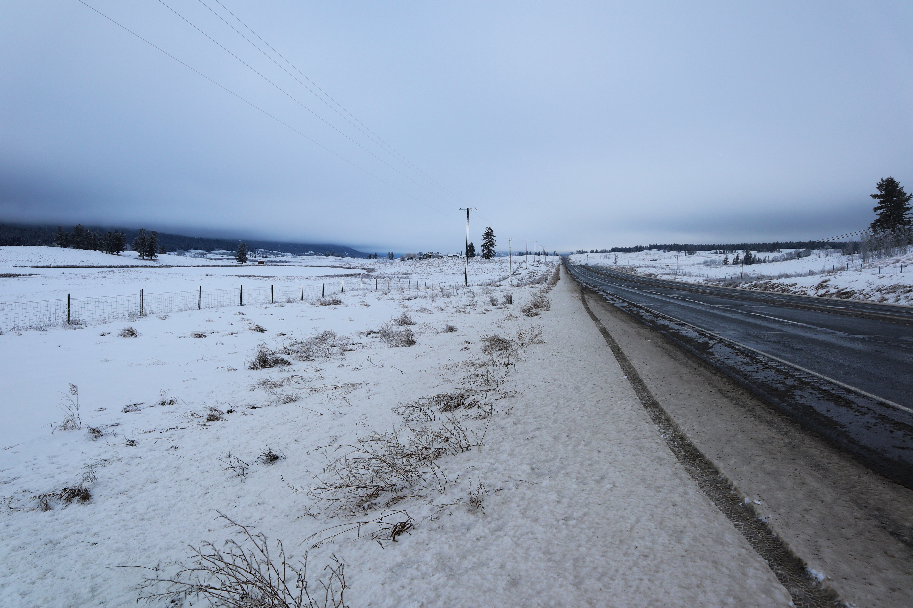
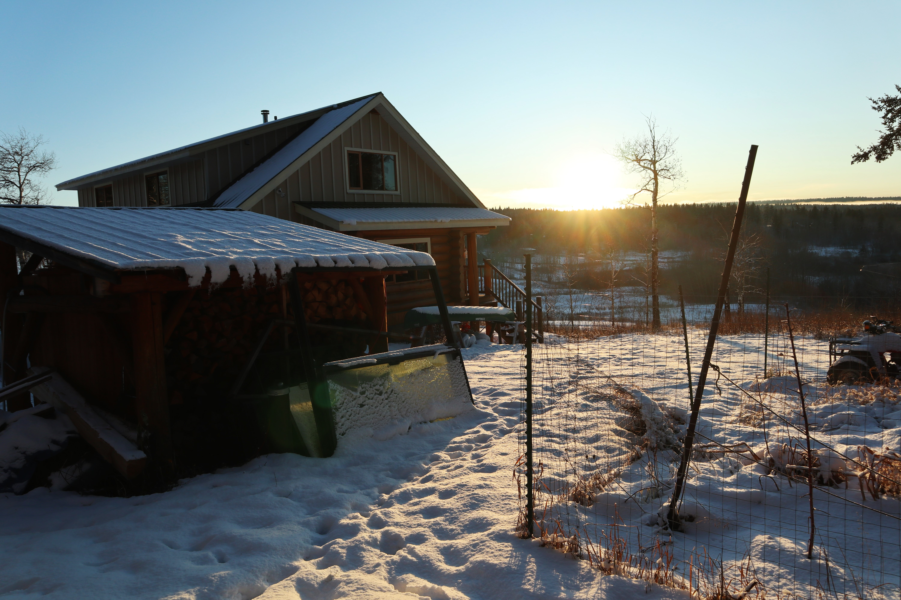
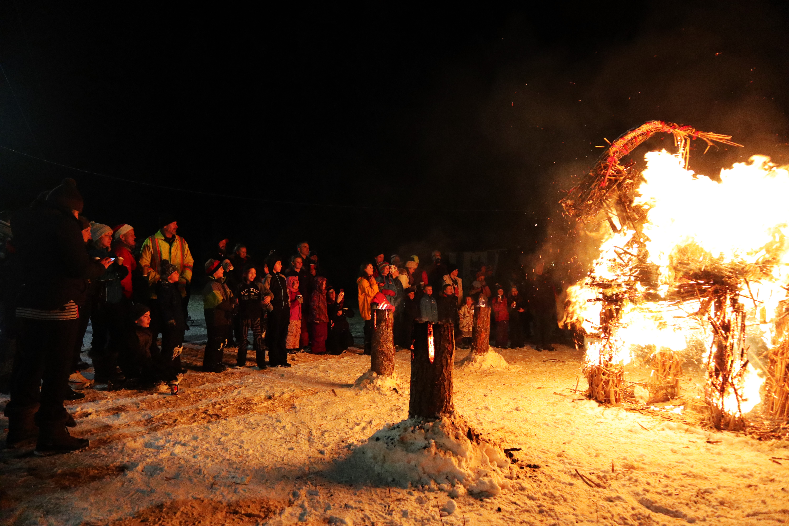
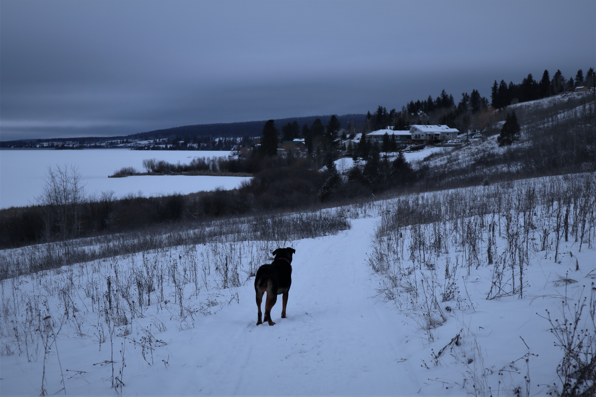
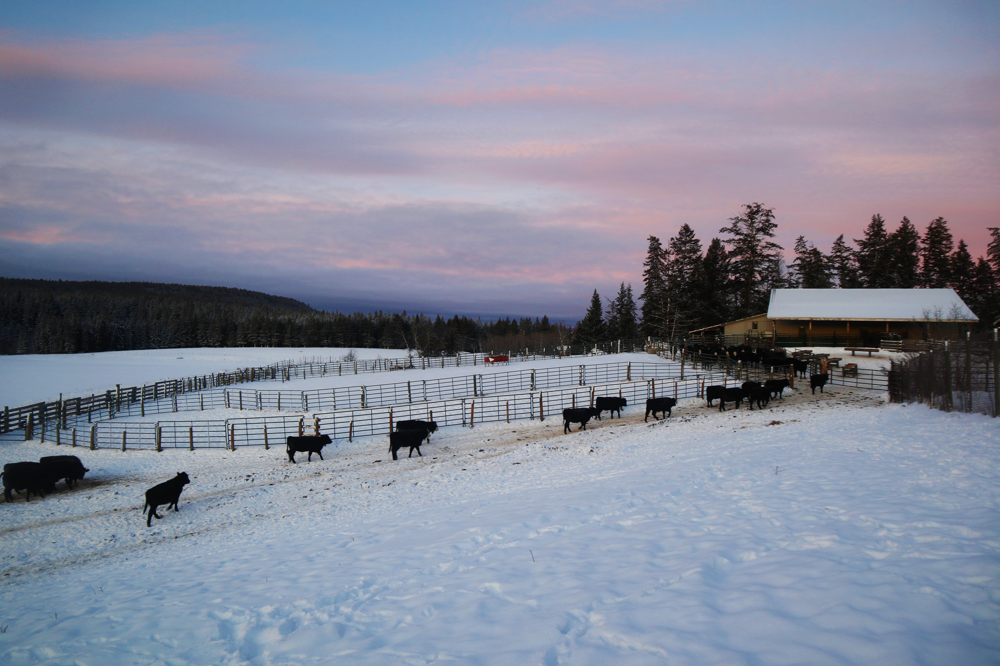
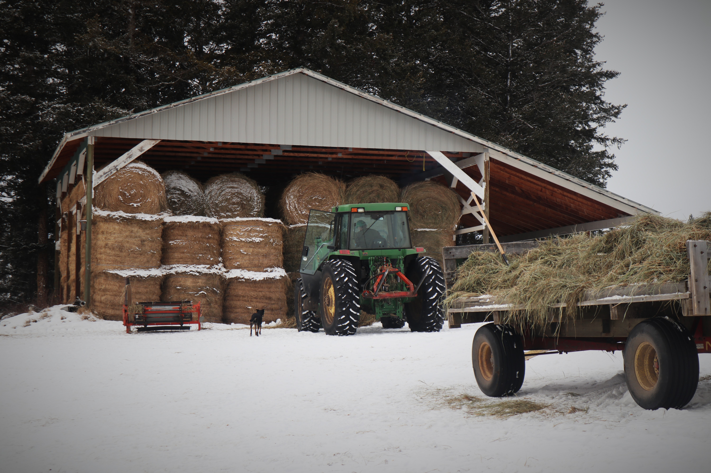
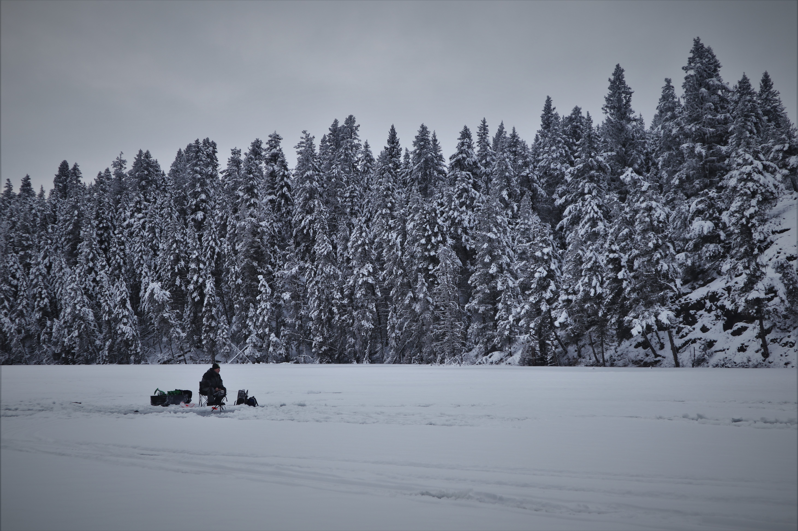
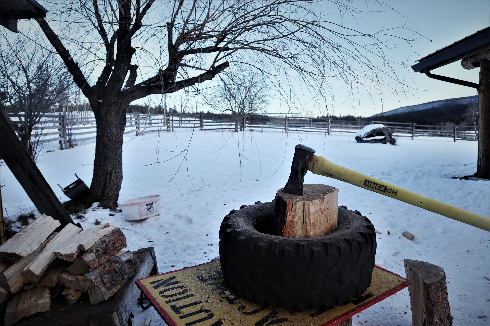
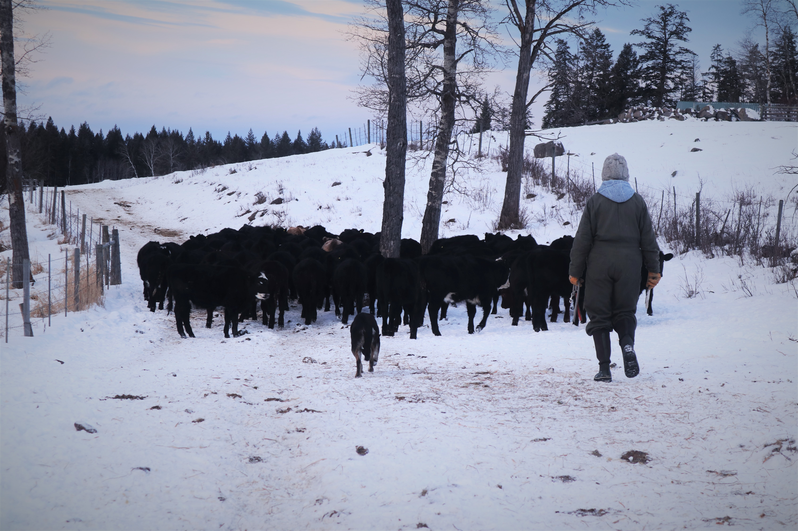

#### # I
On the way north. 

It has been a year since last time visiting Cariboo, one of my favourite region of British Columbia. Chilliwack, Cache Creek, Clinton, 100 Mile House, Lac la Hache, 150 Mile House, Williams Lake… Being known during the gold rush in 1860s, these small towns remained as historical sites and provided an opportunity for one to experience the rich history, even after 150 years.

#### # II
Reading a clock is not a necessary thing here in a remote area.

A day started with sunrise, the time I was awaken by dim light through a window. I worked, played, read, and enjoyed my day when the sun is shinning. I ate when I am hungry and slept when the sun is gone. Here, time flows smoothly, instead of being sliced into tiny artificial units, like people usually do in a city.

Sometimes I think, freedom, fulfillment, and pure happiness can only be felt when you are following the rules of Nature.

#### # III
The Gävle goat is a Christmas tradition from Sweden that people build a Swedish Yule Goat figure made of straw. Since its first appearance in 1966, the Gävle Goat has been the subject of arson attacks. Burning the goat is illegal in Sweden. Interestingly, on another side of the world, people in Canada enjoyed the flame out of the goat. The fire, snow, warmth, and smiles bring people together in this cold winter.

#### # IV
“I hate travelling and explorers.” - Claude Lévi-Strauss, Tristes Tropiques.

When I was younger, going on adventures is the reason itself – to explore the world, to meet diverse people, and to experience life that I never knew. Indeed, I have learned tremendously during all my travelling, without any exception. This world is a great gift for all people living in it. The adventurous spirit is also probably the most precious thing I have in my personality; however, somehow I realized my desire to go on a "long" adventure (i.e., in years) has gradually settled down, unless I have a solid reason for it. 

Well, not because I don’t like adventure anymore, but somehow, I can hear a part of me is calling for stability in life: my career and a deep relationship with a place, and people.

#### # V
We heard wolf howling on that morning.

I was carrying buckets of grain into the troughs feeding the calves, and heard these calls coming from the other side of the valley. The sound haunted around the valley with the air being quiet, cold, and steady. Later, we noticed one of the calves got bitten on his right thigh, where blood came out from the wound. “It’s from the wolf.” It is said that a pack of wolf usually injures an individual with very contagious wound, and come back to enjoy their meal after their prey gets weakened.

Wolf howling, the sound that I have long been waiting for.

#### # Postscript

I belong everywhere, but nowhere.

