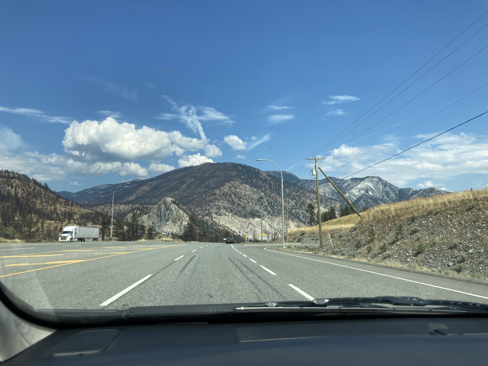
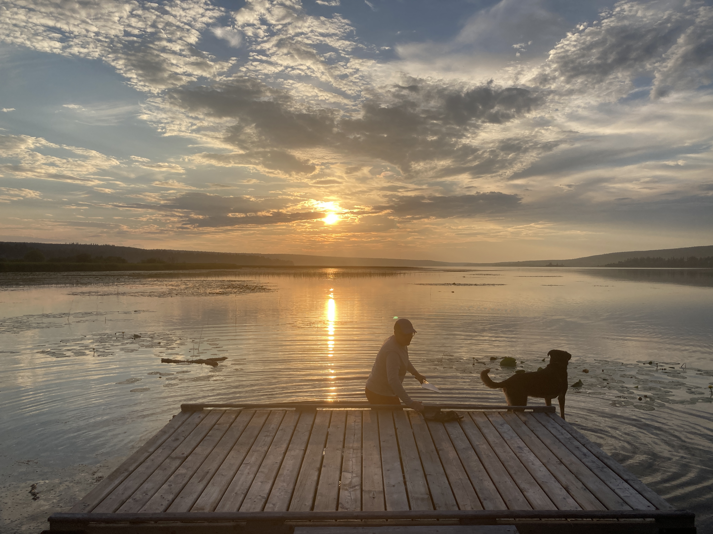
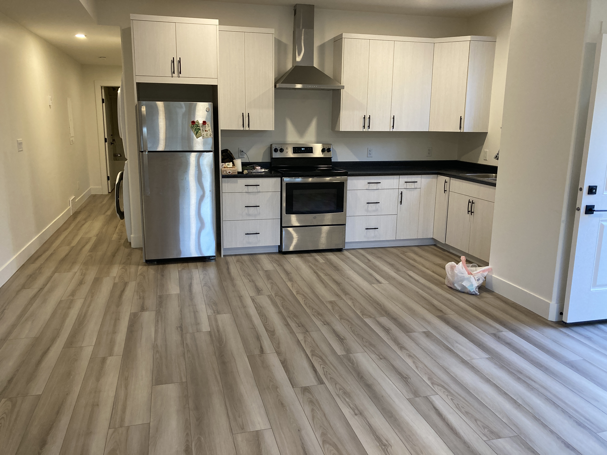

#### # I
「A solo road trip is cool!」 難得再次在加拿大的 solo car trip，就是一趟來回兩千公里的旅程，一端是 Vancouver，一個我在加拿大最像家的城市；另一端是 Prince George，一個讓我體驗到世界之大的小鎮。對的，要成為移動城堡向南遷徙了。

仔細算算，這兩年來搬了六次家，有跨國的、有跨城市的、有同個城市移動幾段街道的。這次的南遷特別令人興奮，其一是在北方小鎮的魔幻歷險記已滿一周年（已心滿意足）；其二是終於能有一趟屬於自己的 Fraser Canyon road trip。

Fraser Canyon Hwy1 在 Cache Creek 接到 Hwy 97，由南向北延伸，是連接 Lower Mainland 與 Cariboo 的唯三公路之一，也是一條充滿回憶、歷史、與故事的道路。第一次認識這條公路是四年前的夏天， Kathy 載著我到 Williams Lake 做野外調查，一路沿著前人掏金的路途北上，從那次起就深深地被 Cariboo 的人文歷史與自然壯闊所吸引。這趟北上南下，將會沿路拜訪散佈在 Fraser Canyon 各地的朋友，也會停留一些久違的小鎮，主要目的還是把遠在千里之外的生活南遷。

難得一趟能自由自在移動的旅程，過足了在廣大天空下開車的癮，也重遊舊地、重新翻閱數年前的回憶。

#### # II
「Sunny, so nice to see you again!」Ken 給了我一個大大的擁抱，真的是好久不見了，上回來拜訪他們在 Lac La Hache 的家已經是 Covid 發生前的聖誕節，才兩年的時間，世界變了好多，他們家的貓狗成員也經過不少變革。「The spring is quite late this year in Riske Creek, how about your site?」Ken 喝了一口茶。他今年夏天也在 Riske Creek 做鳥調，我說北方的鳥兒也是一樣，大概比起去年晚了一兩周的時間才到。他問了問臺灣的狀況、問了問家人，然後我指著窗外的大湖「Can we do paddle board after dinner?」。

和 Ken 相識的際遇很奇妙，當初在 Chilcotin 做調查時因為樣區位在軍事基地，要在該樣區調查的研究人員都需要經過行前訓練、至少要認得地雷和子彈未爆彈的樣貌，Ken 就是一起和我訓練的鳥調人員之一，當時一聊之下才發現，他的老闆是 Kathy 過去的學生，而 Kathy 正是我的 committee member 之一，所以我們有著遙遠的學術親戚關係。

「明天鳥調，凌晨三點Chilcotin Lodge ，我會開一台白色的 Toyota pick-up。」因為電話訊號和網路訊號不普及的緣故，這裡的人要約見面都非常的「簡約」，找路的指示也是「第一個岔路右轉，看到路牌後左轉，第三間綠色屋頂的房子就是我家」之類的。就這樣和 Ken 一起度過了幾個很臨時才約的鳥調、好多個沒睡醒的清晨、被蚊子咬爆的樣區、還有好多超棒的 interior bird sound recording。

那天伴著夕陽的 paddle board，他才提到「I still remember the Sandhill Crane recording that we did in the Separation Lake. It’s gorgeous.」，對阿，真的是很棒很美的地方。

PS. 那天狗狗 Tipsy 也跟著我們一起在湖上游泳。

#### # III
如果說每個生態人都有一個「啟蒙地」的話，那麼 Riske Creek 這片高地就是引領我進入生態研究的啟蒙與開端。

Hwy 20 進到 Chilcotin 後右轉，兩串 pick-up truck 的軌跡引向原野深處。這是我四年前的夏天，每天都經過的原野，有時會有 Western Meadowlark 在路旁被驚飛；有時會有 Sandhill Crane 在空中展翅；有時會有 Black Bear 在原野漫步。是在這裡與 Tomas 穿梭於草叢找尋一個個樹洞、在這裡與 Kathy 檢閱著無數個被大火燒過的樹牌、在這裡與 Alice 在暴風雨中逃離咆嘯的森林。

是一片同時教人成長與謙虛的地方。因為太喜歡這裡，儘管要從 Williams Lake 繞道一個小時，還是要開過來看看老朋友。

#### # IV
「超爆炸，忙到翻掉 QAQ」在國外搬家真的偶一為之就好。

一路上的 road trip 都很輕鬆愉快，每天雖要開上四、五百公里，但一路拜訪朋友，行程都還算鬆，沒想到到了 PG 之後就整個爆炸了。留了三天的時間，要交接實驗室、要見朋友們、最緊湊的是要把大型家具賣掉然後把家當們全收在小車上，行程一個接一個，每天都在睡眠不足的彌留狀態。

曾經充滿饅頭香味、運動音樂、還有冬天零下二十度窗外滿滿的雪，小小的家，回憶和家當都被收起來了。最後有驚無險，連植物寶寶們都安穩的坐好頭等艙，還能看到後照鏡實在深感欣慰。

再見囉。很快就會會再見的。

#### # V
約定好的，最後一晚和 Colin 到 West Lake 湖畔。終究還是捨不得呢，儘管是段充滿淬煉與風雨的時光、是個充滿冰雪與驕陽的地方。

但也是個開車二十分鐘就能看到銀河的地方。

還是一些人情暖暖的，腳底下踩著的土地暖暖的，微風溫和、夏末星空下的心暖暖的。

Photo credit: Colin Halseth

#### # VI
啟程的早晨，坐在木地板上吃早餐，收著露營睡墊、睡袋。

再見了，陪我揉過數百個饅頭的廚房、陪我看過百個日出還有幾隻黑熊的大窗、陪我每個週末運動的木地板。

萬分的多愁善感啊，每到一個地方，多留戀一個地方。

#### # VII
來記錄一些路上遇到的小趣事。

回程走的 Trans-Canada Hwy 和鐵路路線重疊，BC 的鐵路由東向西出口煤礦、穀物；由西向東運輸進口貨物，不論是哪個方向，一輛火車輕易就有上百節車廂，若碰巧遇到火車，所有高速公路上的車都得停下來，一等就是十幾分鐘，駕駛們都會熄火下車看風景聊天，也算是高速公路奇景。

開著這輛小車也第八天了，要換檔時還是反射動作往方向盤右後方抓（pick-up 卡車的排檔桿通常都在方向盤右後方，一般雨刷的位置），每次抓空都是莞爾一笑，看來身上已經住著大車魂。

#### # VIII
Barkerville，一百多年前因為金礦而曾經輝煌的小鎮。

1860 年代，歐洲殖民者在 BC Cariboo 地區發現了金脈，一路沿著今日的 Cache Creek, 70 mile house, 100 mile house 北上至 Prince George 。Barkerville 就是當時赫赫有名的滔金小鎮之一。

這一路有名到了當時的中國。

清朝時期的中國東南沿海地區，廣東、香港一帶，因為鴉片戰爭、飢荒和天災，使人民普遍貧窮，聽到外商的大船傳來消息說北美有金礦可致富，農民們無不爭相爭取上船遠征的機會，高峰時期一艘商船可以載上一千多名工人，但因為路途遙遠加上環境惡劣，大約 15% 的人會命喪大海。

而等著成功上岸的人，是更多的挑戰。

他們必須背著扁擔，背著所有家當，從現今的溫哥華一路「走」到 Barkerville，大概兩週的步行 。因為出生貧窮，多數工人根本不通英語，在人生地不熟的環境靠著同鄉、同姓的互助會才能生存，隔著一道「China Town」的大門，就是碧髮藍眼的歐洲人，說著完全不懂的語言。一直要到拓荒者的下一代，歐洲人和當時的清朝漢人，才在 Barkerville 有比較密切的文化、經濟交流。

幸運致富的工人，才有機會回到中國把妻子、家人接來 Barkerville，但生活環境仍是惡劣。「在這裡生活太困難了，我昨晚將一杯茶放在桌上，隔天早上起來竟全結成了冰⋯，我好想回家。」一名女子的日記寫道。

#### # IX
150 mile house，絕對是在 Gold rush 的這條路上，個人最喜愛的一個城市了。

每次到 150 mile house 拜訪，都能學習各式不同的技能，像開 tractor、像餵養馬、牛、雞，像幫忙收割牧草、做牧草卷、砍柴… 每次來訪總是有新的驚喜。

母牛皮草、日式卡車右駕、後院自種的紫色花椰菜，和去年打獵捕獲的鹿肉，新狗狗 Oriole 和 Midge。唯一紀錄著時間的，是看到他們家的小朋友們一個一個長大，才驚覺已經認識了這個美好的地方，四年。

#### # X
經過幾個月的準備、幾千公里的漂泊，終於把身家安頓到新住所。

木地板踩起來喀嗤喀嗤的，彩繪玻璃和大大的窗，後院有一整片看似荒廢的園地，在溫哥華這樣的城市裡找到一個帶有歷史韻味的住所，也算是為這個 Gold rush road trip 寫下一個完美句點了（笑）。

至於遷入之後就收到昨天借住的朋友的確診通知，又是另一段故事了啊（才剛入住就立馬被送走隔離 😅）。

#### # XI
和過去任何的旅行一樣，最令人想念及回味的依然是路途中交錯的人們。

這一路上拜訪了散佈在 BC 各地的朋友，一些是四年前在 Williams Lake 做野外調查認識的；一些是過去一年在 Prince George 一起奮鬥的。

總是叫我去他們家吃飯的隔壁爺爺、明明很害羞卻會邀我一起運動的 Colin、一起攀岩讀書搬家的 Sara & Brayden、永遠有無止境好玩事情的 Fletcher’s family、家就在大湖邊有兩隻狗狗的 Ken、還有總是牽著我的手叫我不要搬家的 Faezeh （笑）。

啊，正是因為有你們，加拿大地圖上的一個個小鎮，不再只是地名，而是一段段充滿故事的回憶。

P.S. 最後儀表板上的 2,133 公里，算算也開了五個台灣這麼長。

