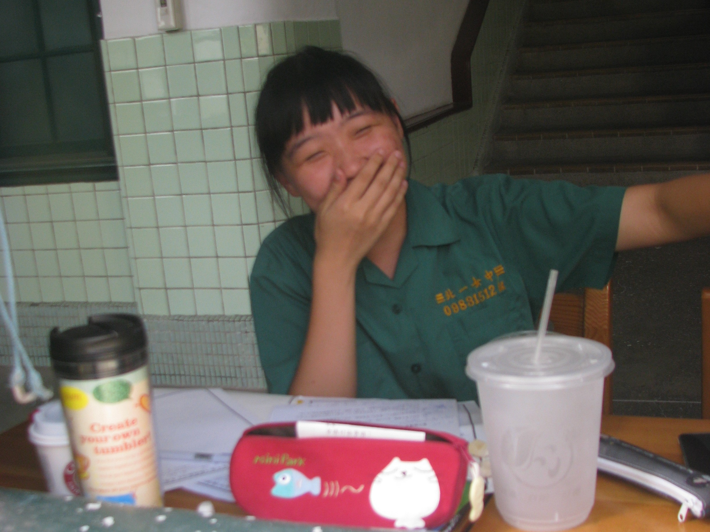

#### # I

其實，今年不是我畢業的日子（任何學位都不是），這身碩士袍是在紀念三年前在 UBC 完成的碩士學位，精確來說， 2019 年的十一月八號，一個陽光和煦的日子，當天下午在森林學院的口試，就已經是我的畢業典禮了。當時的我穿著領口繡著綠葉的白色長襯衫、綁著馬尾，Bianca, Kathy, Nicholas, Darren, Gary，還有差點把四樓會議室擠到沒位置坐的眾人，興奮的我站在台上和大家分享著兩年歲月裡一點一滴的研究成果。

只是今年剛好搬回溫哥華居住、剛好 UBC 正在補辦因為 Covid 而取消的歷年畢業典禮，這才有機會再穿上一身充滿魔力的巫師袍。我大學的畢業典禮比真的畢業早了一年、碩士的畢業典禮比真的畢業晚了三年，這輩子的巫師袍還沒有準時穿過。本來想著都已經事過境遷，不過是參加典禮、拍個照也不一定要參加，後來才被 Stella 強力說服說一定要去（強力的海外遊說）。

覺得畢業，不只是慶祝一個學位的完成，更是一個機會可以想想那些工作以外的自己（比起「讀書」，在國外讀研究所更像「工作」）有甚麼不一樣的改變，特別是那些習以為常的改變。兩年的時間不是一張紙、一本論文、或是一場典禮可以代表的。之於自己，可能有些單純被磨掉了、無懼的膽量被挑戰了、直率的夢想受挫了。然後是不是能在陰晴風雨之後陪著自己，慢慢的消化理解這些產生的改變，然後繼續的選擇以單純、無懼、直率的本性前進。

「見山是山，見山不是山，見山還是山」。

在時間軸上不斷前進的我們，所有的經歷、成就、相遇、分離都以強大的力量形塑著每一個人，有時那股力量會強大到讓人忘記思考。但要一直記得，我們仍可以自由的選擇想成為的樣子、自由的選擇去面對這一切的心境（雖然有時很不簡單），並為自己寫自己的故事 – 那種自由，是在這裡的歲月裡學到的，也是我覺得最幸福的地方。

PS. 1 不同於從小到大習慣的鳳凰花開畢業季，在加拿大的大學畢業季有兩個，一次六月、一次十一月；不是陽光撒滿地的華麗夏季，就是楓紅雪落的陰雨冬天。

PS. 2 畢業當天有阿寧來陪開場、有薛景中臨時被約來、有收到曉萌的花、有臨時被禁足的 Peter （笑），還有物理空間外的強力支持（但手機在典禮當天掉了，拿回來時才看到），謝謝所有陪在身邊的你們（抱）。

#### # II
「唯有勇氣認同現在的自己，才能成為真正的強者。」翻翻 2016 年畢業典禮的回憶，驚艷的發現人的思考狀態甚至記憶可以在短短幾年內有許多變化。當年下台後，第一排的學姊還說看的到我拿的手寫稿。再讀一次，再次為無悔的青春舉杯。那兩張講稿上鉛筆筆跡是這樣寫的：

（敬禮）
我們之中，有人會從事學術研究；
我們之中，有人會當老師；
我們之中，有人會成為工程師。
我們之中，有人會到科技業上班；
我們之中，有人會轉行，到電機系、資工系、森林、中文、商研所；
我們之中，有人會去流浪；
我們之中，有人會失業。

親愛的家人們，今天走出這個會場，拿著一張臺灣大學的畢業證書，我們的人生並不會因此更加順遂，我們可能在踏入社會的一開始受到挫折；我們可能在求職的過程中，四處碰壁，在離開學校體系的保護後，我們面臨的困難只會越來越多、越來越重。

但是，在這裡，我們保證，我們會對自己負責，對所有的每一個決定負最大的責任；我們會對自己誠實，知道所走的每一步路，都是自己想要的；我們會對學問謙虛，因為了解到學海無涯；我們會勇敢的去闖、我們會積極地為自己的未來規劃；我們也會努力的學習，如何和你們，溫柔的相處。親愛的家人們，請相信我們，經過大學四年，我們已經成為可以為自己負責的大人了。

我們的成長，來自於大學四年的學術訓練。

從大一開始飛躍式教學的微積分，永遠都有科學”突破”的普物；教我們如何計算硬幣飛到山上的機率的普化；拿著 iPad 一定要坐第一排的應數；讓大家戰戰兢兢、永遠不敢鬆懈的大刀電磁學；以及報告寫到手軟的基物實驗。也許有許多理論、證明都記不得了，但正因為這些課程，我們開始有能力去解析複雜的問題；開始有能力有條理地闡述自己的想法。在廣大的資訊量下篩選可信的訊息，面對新事物可以快速的理解學習。謝謝我們，敬愛的老師們。

我們的成長，來自於身邊一同學習的夥伴們。

在這裡，我們遇到了許多像神一般的同學，也遇過許多神雷的隊友，每一次的相處和合作，訓練著我們的溝通及規畫能力，也開始學會欣賞他人的優點。在社團、系隊、系學會，我們學會當一個領導者，也學會如何當個稱職的小螺絲；從物夜、物理營、杜鵑花節，每一段一起努力寫下的故事，每一次情緒激昂的落淚擁抱，為我們的青春多加了一份光彩。謝謝你們，最珍愛的朋友們。

我們的成長，來自於和自己相處的那些時光。

台大校訓，每天三個小時的思考，我們開始問自己，到底真正想要的是甚麼，到底自己的人生意義是甚麼，到底現在的努力是為什麼。而思考後，更重要的是行動，所以我們去環島、去旅行、去當志工、去做那些自以為冒險而勇敢的事情。而在之後，開了眼界，了解到世界是這麼的大；見識到地球上各地的人，生活和我們如此的不同。所以期許自己，更要知足而感恩的活著；所以期許自己，更要勇敢地向外走，去體驗那些看似遙遠而未知的世界。謝謝我們自己，那個因為夢想而發光的自己。

蘇打綠的主唱，青峰曾經寫過一句話給他的父親，是這樣寫的：「我忘了說，心理面的願望，始終是要你的肯定啊。」親愛的家人，謝謝你們一路上的支持與不支持，你們的支持，讓我們可以安心的在你們身後飛翔；你們的不支持，讓我們學會堅強、學會獨立、學會努力成為一個為自己的決定負責的人。真的很想讓你們看見我們的努力、我們的成長。也真的很希望在你們的眼中，我們永遠是那個，最耀眼、最珍惜的寶貝。

最後，給所有 B01 的大家，這四年來，我們一起瘋過、笑過、哭過、玩過，傷心過也快樂過，四年前的青春熱血，四年後又多了一份沉著穩重。

如果說畢業真的代表了甚麼，那應該是，我們的角色逐漸被定型了，再也不能想成為甚麼，就成為甚麼；再也不能想嘗試甚麼，就嘗試甚麼。但我們一定要相信自己的選擇，因為只有自己才最知道，自己最適合、最想要的事情是甚麼。

Randy Pausch 最後的演講，他的主題就是”Really achieving your childhood dreams.”。祝福未來的我們，也要繼續為有趣的事情努力著，因為我最喜歡看到你們，因為追逐夢想而發出的光芒；因為心懷自信而散出的笑容。

我們畢業於臺灣大學物理學系。

我是 B01 畢業生致詞代表 曾奕晴。

謝謝四年來的一切，謝謝大家。

#### # III
從家裡老舊的電腦主機翻出來的老舊照片。完完整整的十年，北一日快樂！

看了照片研究很久，這一系列應該是高三要畢業前的某周末，和柯柯一起在光復樓邊玩邊拍的，當時還沒有寫日記的習慣，所以每過一個北一日，能記得的高中回憶就少了一點，幸好還有這些照片可以回味。眼睛瞇瞇瀏海超平。

那個紅色的鉛筆盒最後掉在火車上、再也沒找回來了，左邊的保溫杯還在舊家，右邊那個…沒想到當時會喝這麼大杯的飲料。
「惟天為大，如日方中，英姿煥發，北一女中」。感謝這段帶我從鄉村到都市的青春歲月；感謝這個教會我尖叫、任性、奔跑、哭泣、成長、揮灑無悔青春的青青校園。

