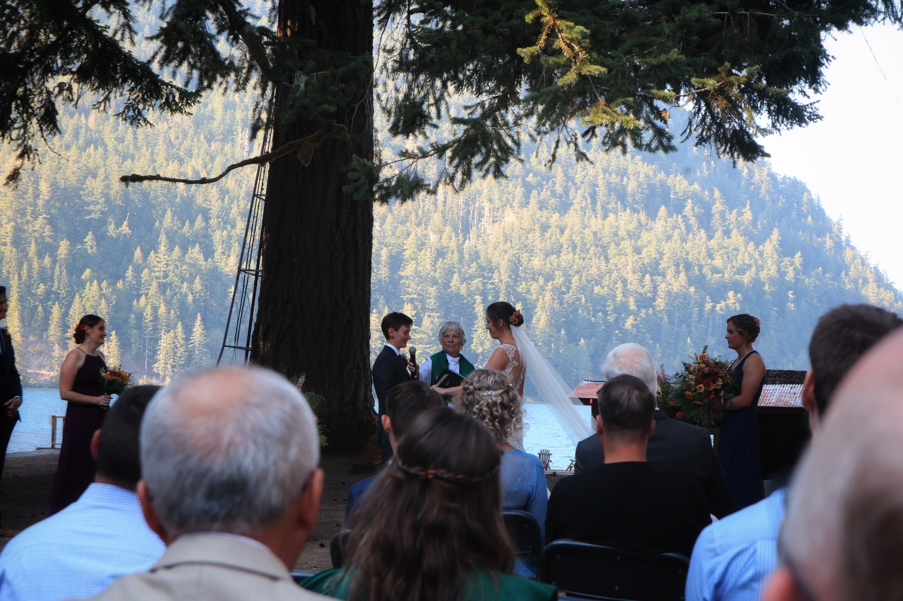
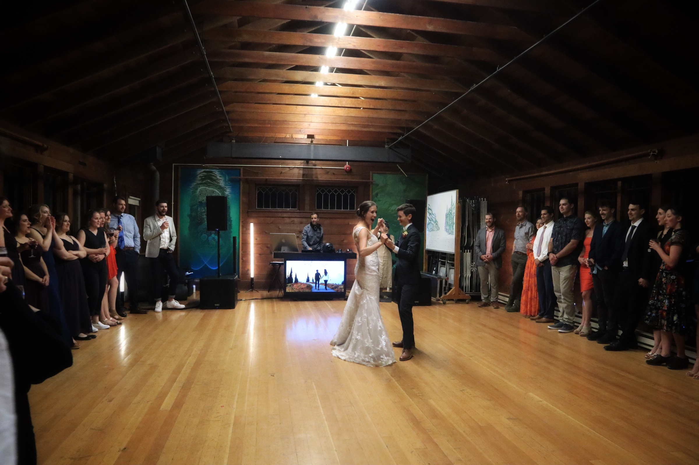
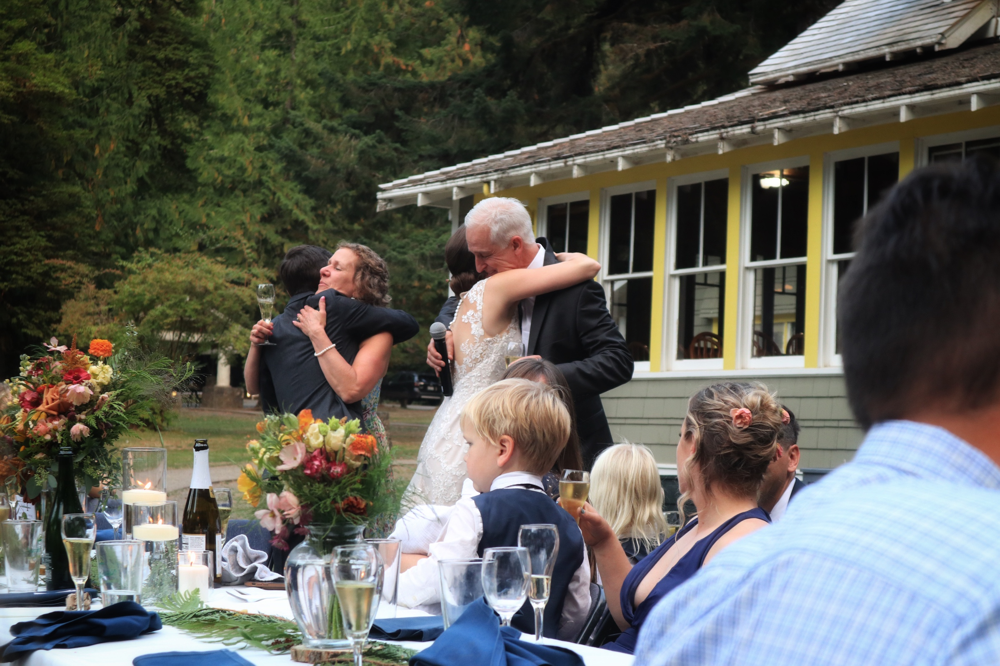
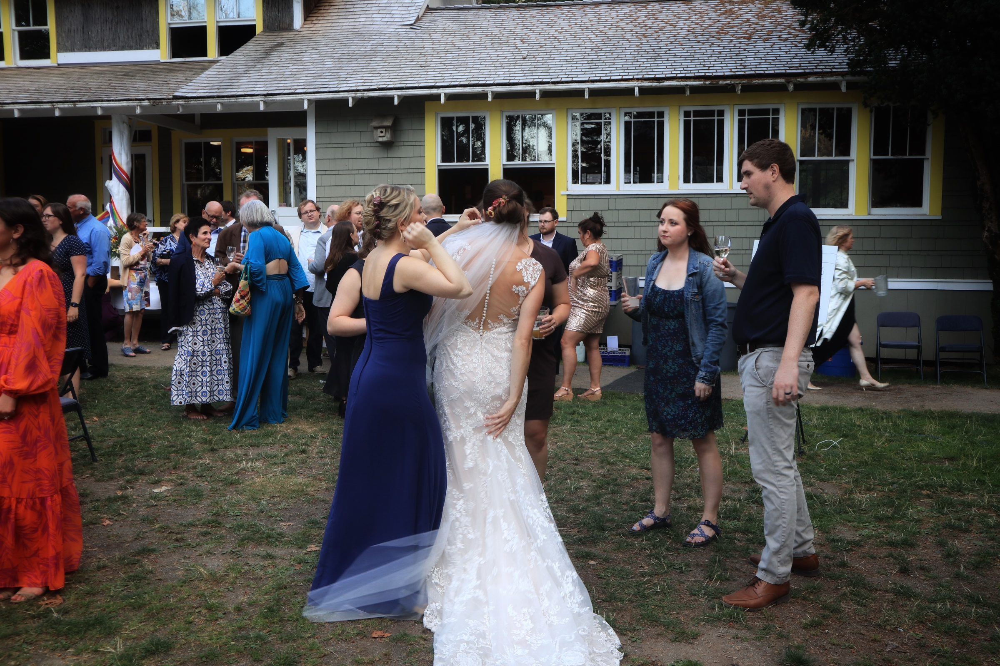

#### # I

這幾天到華盛頓州的奧林匹克國家公園（Olympic National Park) 參加 Lisa 的婚禮，行程總共兩天三夜，在這裏要過夜的婚禮很正常，但特別的是，這場婚禮直接把一整個露營區包下來，讓所有的賓客都住在小木屋裡。

把賓客聚集在一起過上幾天的美妙之處，就是每個賓客都認識了新娘人生中不同片段，交互拼湊起來常有「Oh! I didn’t know she did that!」的驚嘆。就像我就不知道原來 Lisa 是在瑞士出生的、我都不知道原來他的爸爸在 CERN 工作過、都不知道原來她會講法文。

大概就是這樣的一個大型聚會，滿滿的愛滿滿的歡笑。

#### # II

話說這個國家公園真的是偏遠的可以，光是要到達場地就讓我絞盡腦汁，好不容易才找到同行夥伴 Sam 和 Andrea 一起開車，然後從 Washington 一路迷路，花了六個小時才開到目的地。

散佈世界各地的將近一百位親友，搭飛機、開車、搭渡輪，聚集到這，準備見證這兩位美麗女孩的愛情。

到達會場後那片掛在門口的彩虹布幔，真的美麗到不行。

#### # III

婚禮的儀式在下午，上午時間就讓賓客四處漫遊，無意間和另一位新娘 Ruth 的家人（她的媽媽的妹妹的小孩們）早餐時聊了起來，連名字和血緣關係都還沒記清楚就約好要一起出去玩了（笑）。

Ruth 的表兄弟姐妹，Andy, Hans, Nick，他們是在 Ecuador 長大的，非常體貼溫馨的一家人，一行人七個人在海邊散步看螃蟹（？）看國家公園等級的海灘，海上還有還有數不清的 Brown Pelican！後來想想，才發現我這根本是亂入人家的家庭旅遊啊啊啊（笑）！

中午到了一家炸麵包的餐廳，北美的食物真的不容小覷，一塊麵包跟濃湯就要十塊美金！但是被請客了，對方的媽媽說「I am happy to have a girl join the group!」再次覺得這樣才認識不到幾個小時就亂入人家家庭旅遊，有點好笑有點有趣。

#### # IV

婚禮儀式當天下午！不用多說直接感動到不行。精心設計的小題庫、新娘的開心、互相感謝的小貼心、對彼此的誓言、交換戒指。在森林裡的，有山有森林，有大湖見證的婚禮，整個哭爆。

聽台下有位親友說，來參加婚禮有 25% 是來見證新人的幸福，而 75% 是來提醒他們這些已經結婚數年的人，提醒他們當時結婚的誓言與承諾，有哪些是可以再互相更愛彼此的。

#### # V

在北美婚禮最特別（台灣絕對不會有）的橋段，就是晚餐後的 Dancing time，先說，我個人超級喜歡這個橋段的！

先是新人共舞、女兒和父親（father and daughter dance）再來是女兒與母親。最後則是邀所有賓客直接到 dancing floor 上，直接 party 到收場。

我原本是很不習慣北美的 party 文化的，對於跟著音樂跳舞、盡情釋放歡樂的情緒，覺得有點格格不入。但近兩年來，漸漸發現其中的美妙之處，這是一個非常值得狂歡的時刻啊，而隨著音樂跳舞，偶然拉起朋友的手轉圈圈，就是一個分享喜悅、分享情緒的形式。在理解這些之後，站上 dancing floor 就是一件非常享受的事情！（雖然我還是需要幾個好朋友，才夠勇氣一起進舞池就是）。

#### # VI
最後一天是與 Lisa 家人相聚的一天。Lisa 的叔叔 Jeff，他的太太 Janet，媽媽 Laura 和爸爸 Deil，媽媽的爸媽、爸爸的爸媽⋯⋯最喜歡的是 Janet 還有爸爸那邊的爺爺奶奶 Don 和 Marsa。

和 Janet 聊天很舒服很溫馨很溫暖，早餐後的天氣突然轉涼，我們就兩個人蹭在板凳上取暖，她說不要難過人散了回家了，我們沒有散，只是我們的道路在不同時候交會，每個人的道路在不同的時間空間上穿梭。

後來和 Lisa 的家人一起走了瀑布步道，認識了曾經待過 CERN 的爸爸（太強惹啦！）。最後和爺爺奶奶 Don Marsa 一起玩了 Farco! 超級刺激好笑的！

最後晚餐的聊天更是精彩，和媽媽那邊的爺爺，還有 Janet 直接坐在屋簷下聊了好久。聊 covid 、聊 3M 口罩的製作、聊感情生活的維繫。

Lisa 的媽媽說:「I am so impressive that you seemed to talk to everyone in the wedding! I am so impressed and very grateful for you.」

Lisa 說「There are about 7 people coming to me and said “I chatted with your friend Sunn and she is so delightful to talk to!”」

Ruth 說「It’s such a treat to have you here.」

太美妙的婚禮，滿滿的幸福在心裡。

