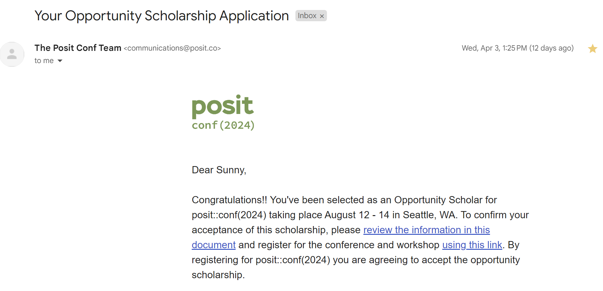
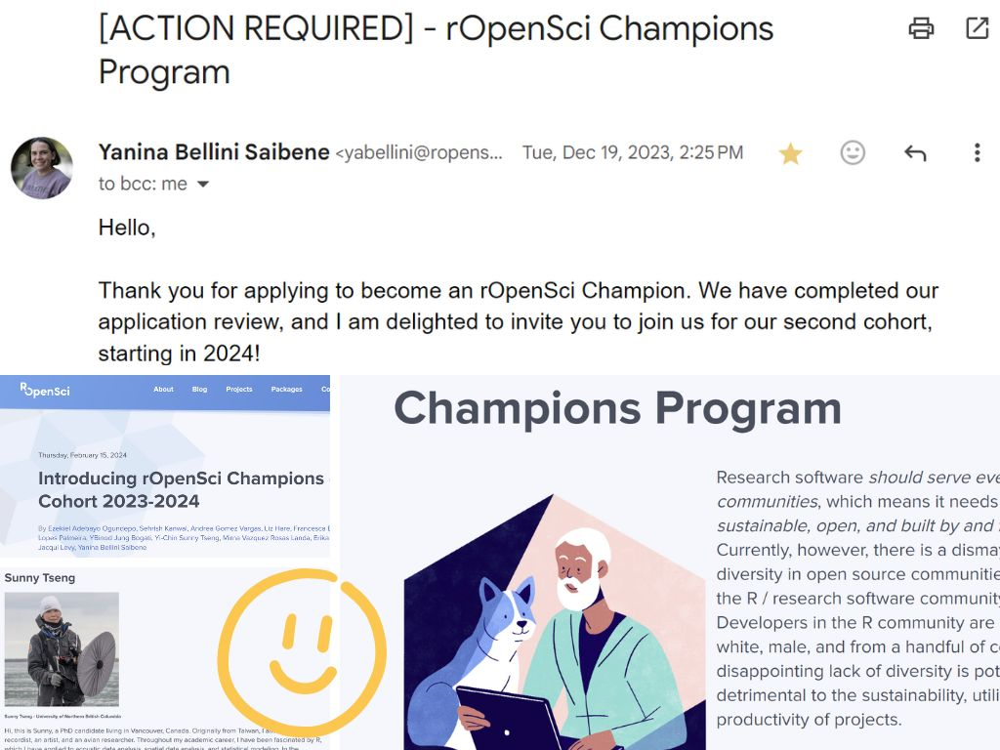

### Opportunities

自去年底至今約莫半年的時間，在 R programming 的技能上不停地獲得新的機會，不論是申請經費、申請加入 program、或是接資料分析的 contract 都不可思議的順利 (敲桌子，敲敲)，而且還體驗到了好多次收到 email 的當下，興奮到想要跳起來的瞬間!

想把這些興奮的瞬間好好記錄下來，並想記錄這些半年來參與的 community，還有未來想參與或投入的機會。

### Posit conf 2024 Opportunity Scholar

想必會讀到這邊的你一定對於 POSIT 不陌生吧，POSIT 就是擁有 RStudio 的公司 (擁有最多使用者的 R IDE，沒有之一)，同時還擁有許多 Python 的開發介面。想當然爾，每年舉辦一次的 POSIT conference 就是聚集了世界各地、各領域的大大們，不論是生物、數學、經濟、化學、醫學、...只要是有用到高階程式語言做統計分析模擬或視覺化的，大概都會出現在這場 conference 中。

POSIT conference 的報名費出名的昂貴(大約一千美金，台幣三萬左右)，但他們同時也提供了全球 40 個 Opportunity Scholar 的名額，由 POSIT 直接幫你付報名費、機票、住宿及參加 conference 那周的所有花費。

抱著平常心申請，然後就這樣拿到全球只有 40 個名額的機會啦! 非常非常的興奮 - 就是收到信的當下很想要跟全世界說的那種開心 (和搶到五月天演唱會門票同等級的開心)。覺得一直以來的耕耘被肯定了，而且竟然還能進到這樣的國際間的大場合，來享受一下當小海綿的震撼感。

Conference 當場會有 Jenny Bryan 噢，她是我在 R 領域上的學術偶像 (迷妹模式開啟)! 雖然人家明明就在 UBC，距離我辦公室大概 10 分鐘的距離而已 (笑)。

POSIT conference: https://posit.co/conference/

### ROpenSci Championship Program

如果以搶到五月天的票當作一個興奮單位，收到 rOpenSci 邀請信的興奮程度大概有十個五月天。

使用 R 到現在也有將近九年的時間，其中一個從來沒有踏進過的龐大領域，就是 package development，寫 R package 是個耗時耗力的任務，需要的時間從幾個工作天，到幾年的時間都有可能。總而言之能夠擁有一個 package 的 authoriship 就像是藝術家擁有代表作的概念，雖然窗外已經有數千個 package 在，但擁有一個自己的代表作感覺就是不一樣。是非常令人嚮往的技能。

就這樣剛剛好 - 去年八月在鳥類會議受到 Adam 的啟發，又從 Steffi 那裡得知 rOpenSci 正在招募夥伴 (眼神閃亮亮)。

ROpenSci 是個非營利組織，主要負責審核以及維護 R package 的品質，並推動各種 program 想要改變 "R community are overwhelmingly white, male, and from a handful of countries." 的現況。一樣也是超級稀有的機會，rOpenSci Championship Program 每年提供全球 10 個名額來做 R package development training，申請者提出想要開發的 R package，他們會幫忙配對專屬的 mentor、提供 workshop、還會幫你做 public speech training 和 publication! 甚至還提供了 funding。
就是一個幫你找老師、教你做你想做的事情、還給上一小筆 funding 的概念...天下怎麼有這麼好的事!

也是超級幸運的，從茫茫大海的近百件申請中被選上了 (尖叫)! 這次要開發的 package 和台灣有關噢! 還有特地聘請了一位強力精神顧問 (笑)。目前已經在 program 快四個月了，正如小海綿般跟著 mentor、跟著強大團隊一步一步走(眼界大開)，也非常、非常的享受開發 package 的過程，也越來越喜歡 rOpenSci 這個小小的 community。這部分的經歷會獨立開另外一篇文章來寫。

大推 rOpenSci 的 Championship program 給在台灣的 R 同好們，而且身在台灣申請非常有利!

PS. 話說當初交上去放 profile 的照片真的有點...(笑)，明明就是個寫程式的 program 我卻交了一張要去極地求生的樣貌。

ROpenSci Championship Program: https://ropensci.org/champions/

### Other R communities for future participation

- [rOpenSci](https://ropensci.org/)
- [Rladies](https://rladies.org/)
- [POSIT::conf](https://posit.co/conference/)
- [useR! conference](https://www.r-project.org/conferences/)