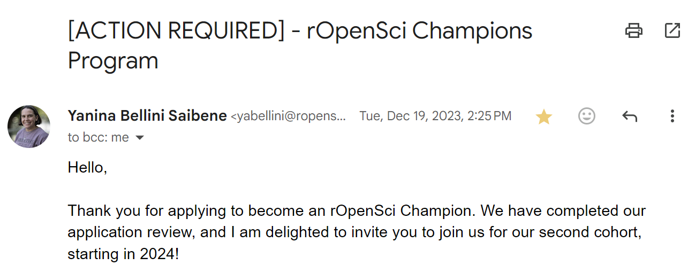

#### Opportunities

自去年底至今約莫半年的時間，在 R programming 的技能上不停地獲得新的機會，不論是申請經費、申請加入 program、或是接資料分析的 contract 都不可思議的順利 (敲桌子，敲敲)，而且還體驗到了好多次收到 email 的當下，興奮到想要跳起來的瞬間!

想把這些興奮的瞬間好好記錄下來，並想記錄這些半年來參與的 community，還有未來想參與或投入的機會。

#### Posit conf 2024 Opportunity Scholar

想必會讀到這邊的你一定對於 POSIT 不陌生吧，POSIT 就是擁有 RStudio 的公司 (擁有最多使用者的 R IDE，沒有之一)，同時還擁有許多 Python 的開發介面。想當然爾，每年舉辦一次的 POSIT conference 就是聚集了世界各地、各領域的大大們，不論是生物、數學、經濟、化學、醫學、...只要是有用到高階程式語言做統計分析模擬或視覺化的，大概都會出現在這場 conference 中。

POSIT conference 的報名費出名的昂貴(大約一千美金，台幣三萬左右)，但他們同時也提供了全球 40 個 Opportunity Scholar 的名額，由 POSIT 直接幫你付報名費、機票、住宿及參加 conference 那周的所有花費。

抱著平常心申請，然後就這樣拿到全球只有 40 個名額的機會啦!非常非常的興奮 - 就是收到信的當下很想要跟全世界說的那種開心 (比五月天演唱會搶到票再開心一些些)。覺得一直以來的耕耘被肯定了，而且竟然還能進到這樣的大場合，來享受一下當小海綿的感覺。

Conference 當場會有 Jenny Bryan 噢，她是我 R programming 的學術偶像! (雖然人家明明就在 UBC，距離我辦公室大概 10 分鐘的距離而已，之前在路上還遇過一次的)。

POSIT conference: https://posit.co/conference/

#### ROpenSci Championship Program

再來一封當時收到信也是開心到跳起來的 email。如果以搶到五月天的票當作一個興奮單位，收到這封邀請信的興奮程度大概有六個五月天。

ROpenSci 是個非營利組織，主要負責審核以及維護 R package 的品質，並且非常強調 Open Source 以及 community 的相互支持及友善的合作。一樣也是超級稀有的機會，ROpenSci Championship Program 每年提供全球 10 個名額來做 R package development training，申請者提出想要開發的 R package 概念，ROpenSci 會幫忙配對專屬的 mentor、提供 workshop、還會幫你做 package review 和 publication! 甚至還提供了 funding。

就是一個幫你找老師、教你做你想做的事情、還給上一小筆 funding 的概念...天下怎麼有這麼好的事!

也是超級幸運的，從茫茫大海的近百件申請中被選上了，這次要開發的 package 和台灣有關噢! 還有特地聘請了一位強力精神顧問 (笑)。目前小寶寶正緩慢但穩定的長大中，也從 mentor 那裏見識到甚麼叫做專業的 R programmer (眼界大開)。

其中一個目標，是希望自己可以好好的回饋在這個 program 裡學到的，寫寫文章記錄，算是第一步!

PS. 話說當初交上去放 profile 的照片真的有點...想要換掉(笑)，明明就是個寫程式的 program 我卻放了一張要去極地求生的樣貌。

ROpenSci Championship Program: https://ropensci.org/champions/

#### SCO-SOC Mentorship Program

### Other R communities and contributions
