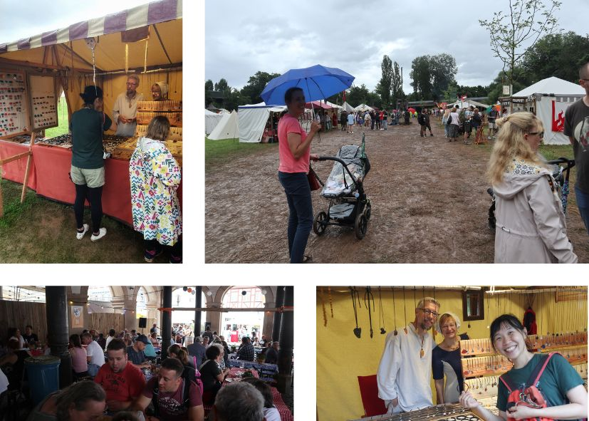
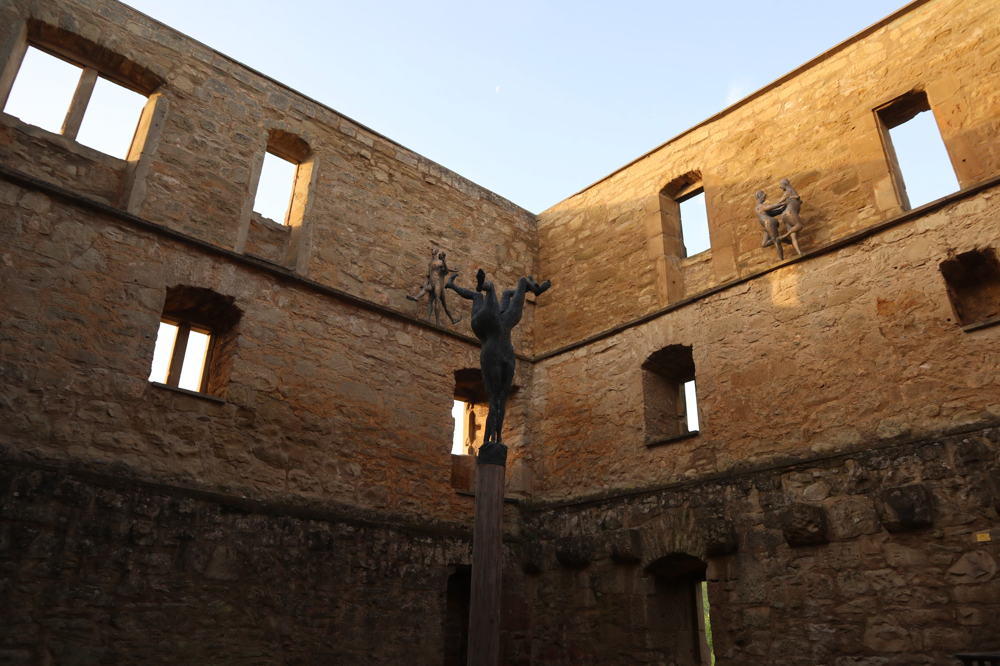
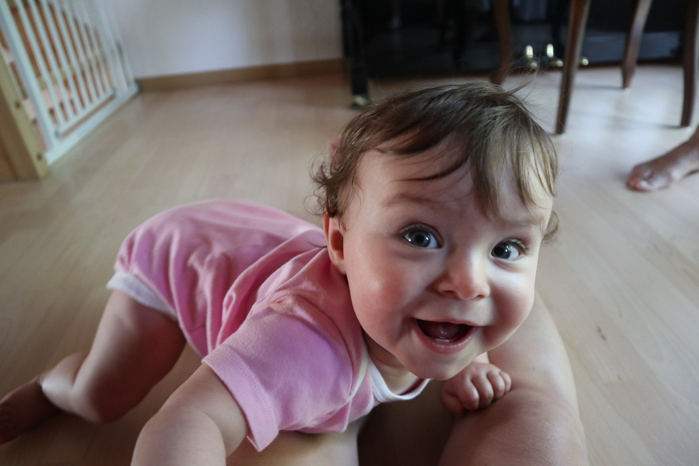
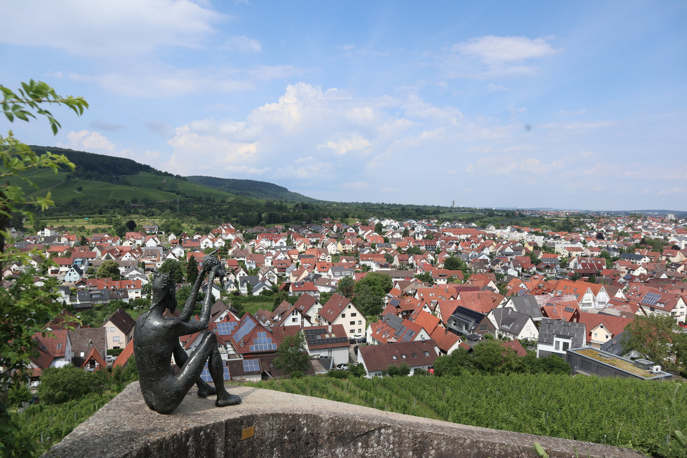
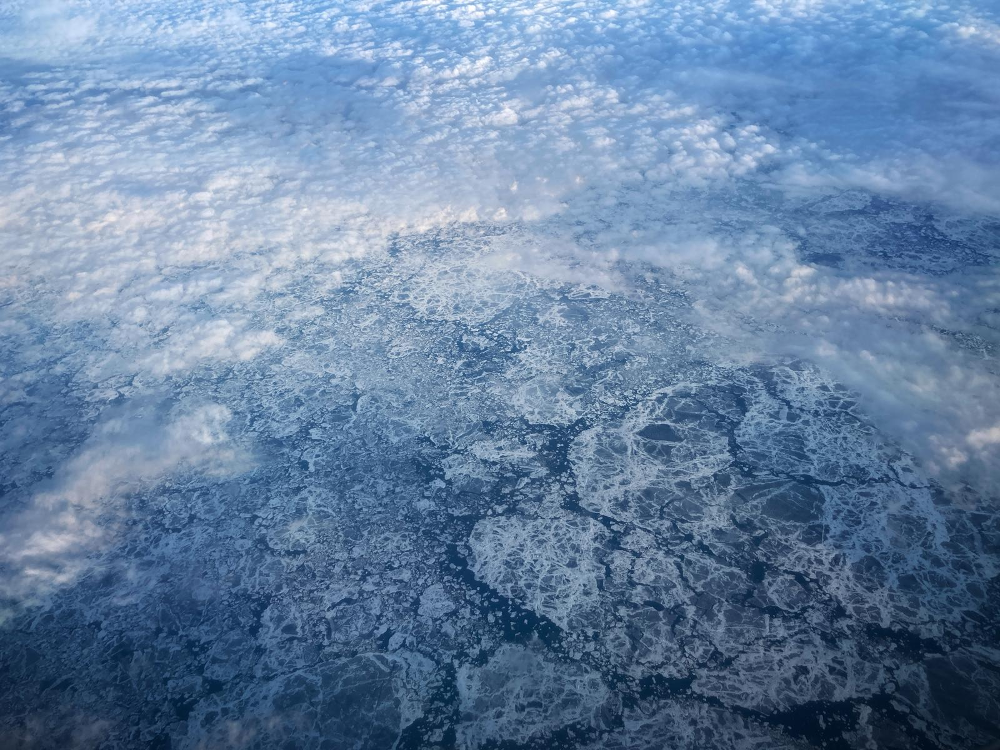

### 城牆裡一起跳舞

在 Girona 的這天碰巧遇到歐洲的足球盃，西班牙大戰德國(而且這場比賽就在 Stuggart!)。整個鎮上熱鬧的很，一群一群的人們聚集在城牆下的酒吧，緊盯著螢幕上奔跑的紅色和白色人影，西班牙進球的那刻，哇!巨大的歡呼聲從整個城鎮的小巷與門戶冒出來。非常有臨場感。

城牆如迷宮，樂聲如指引。

跟著音樂進來了一個廣場，剛好遇到小鎮一年一度的音樂跳舞慶典。中世紀的音樂，大家一起在木地板的舞池裡跳起舞曲，不論是倆倆結伴的、爸媽牽小孩的、爺爺奶奶、各自跳舞的、或是整個舞池裡的人手牽手一起，整個氛圍溫馨到不行，太有夏日慶典的熱鬧氛圍，每個人忙著享受夏天，在日落的餘暉裡、城牆包圍的廣場裡，跳著慶祝的舞蹈。

我後來也觀察了很久，看到一首比較簡單的就碰碰碰的跑下去一起跳，非常非常的幸福。

才待上一天就愛上了這個小鎮。

### 熱到融化的西班牙城牆

原本預計要去的巴塞隆納被另一個小鎮 Girona 替代了，能避免大城市就盡量避免。The best decision ever!

一路向南的火車之旅來到西班牙東南方的小鎮，巴塞隆納以北一百公里的 Girona。一下火車的艷陽、路上絡繹不絕的摩托車、大家在屋頂曬衣服、磚紅色的城鎮，除了西班牙文聽起來像是密碼，還有時不時冒出的壯麗大教堂，根本回到台灣!

整個鎮上以至於整個舊城區，光是步行就可以完成。護城河旁邊的城牆都被建築取代，好像在瑞芳四腳亭家前面的基隆河。在城牆上走一遭，完全體會到了西班牙著名的豔陽，又熱又濕，在法國囤積起來的，肚子裡的奶油都融化了。

不知道是不是因為同為熱帶，又同為深受太陽影響的國家，在西班牙這個小鎮的感受特別溫馨與舒適。

PS. Airbnb host Cristina 是個會說西班牙文與當地語言 Catalan 的媽媽，進到家裡時竟然有許多書法與中國文物。一問之下才得知她在一胎化政策的時候領養了一個來自中國的女孩，非常的可愛。被照顧的無微不至，不論是一起吃飯，說好要一起散步，連我要洗衣服她都幫我烘好摺好。我們約好下次要再見面的，要再來享受這個西班牙南方的小鎮。

### 冷冰冰地中海

從 Aix-en Province 開車往東，一路向海就會遇到這個叫做 Cassis 的小鎮，Cassis 是一種莓果，我都直接稱這裡莓果小鎮。

是清澈碧藍的地中海，也是這趟旅行唯一靠海的城鎮。

海水清澈的像湖水，卻像所有的大洋般冰冷，冷到皮膚會微微刺痛，但在楓葉國的訓練也不是白費，掙扎一下就可以下水。水清澈到看的到五米以下的岩石，從淺層的碧綠到深水的墨藍。距離岸上不到三十米，當低頭看見海面下峽谷般深不見底時，還是會有對於大洋深不可測的敬畏。

今年夏天第一趟海泳，就獻給法國莓果小鎮的地中海。

### 突發奇想的 Aix-en Province 

出發歐洲的前一周，聯絡起之前在 PG 認識的法國朋友 Charlotte，查了一下地圖發現她居住的城市 Aix-en Province 就在我從德國南下到西班牙的路上，幸運地獲得拜訪未知法國小鎮的機會。

從巴黎一路到 Aix 馬上能感受到小鎮的舒適與溫馨，步行就可以結束的城鎮，與每天早晨的菜市場。在熱鬧的小市集裡遇見了 Montreal 來的阿姨，送了我一顆桃子。坐在街頭的板凳上，呼吸、聆聽、觸碰陽光，發現安靜的時刻更能感受四周。

Charlotte 在這個鎮上的研究機構工作，他們機構裡有許多二、三十歲的年輕人，因為小鎮上的娛樂不多，他們幾個好朋友會每周聚在一起學陶藝、跳舞、或嘗試各種才藝。聽起來超像法國版的集集特生。

### 關於食物與火車

來到法國之後，光在巴黎那天就吃了三個可頌麵包，整個人聞起來像奶油。而後又被法國鹹派迷上。不論是德國還是法國，麵包都超級好吃，德國的牛奶很好喝!

這次在城市之間的移動以火車為主，每一趟都是三個小時起跳的高速列車，再看一次車票，碰巧的把三個國家的高速列車都搭過一回，在德國從 Stuttgart - Paris 的 ICE、在法國 Paris - Aix-en Province 的 TGV，最後是在西班牙 Aix-en Province - Girona - Madrid 的 AVE。對於西班牙的 AVE 特別有好感，因為它的名字聽起來像 AVIAN (鳥類)。

歐洲內的火車搭到跨過國家了都不知道，沒有護照檢查也沒有安檢，周遭的人們混雜著英文、德文、法文、西班牙文，應該還有更多沒被我認出來的語言。

PS. 在法國的火車上遇見了來自加拿大西岸的 couple，他們就住在 Victoria，分別是學校的數學老師與藝術老師，在世界的遠方遇見同鄉人，特別的有思鄉情緒。

### 宮殿聚集的巴黎

凱旋門位於巴黎市中心，和巴黎鐵塔隔著塞納河對望，以凱旋門為起點，整個城市的道路就此輻射向外，進不了凱旋門之後決定到處走走，挑了一條大馬路，往車站方向前進。

走走發現到處都是巨大的宮殿、橋梁，在河的對岸甚至還有屋頂鑲金的建築，到了一個巨大廣場，上頭有個金字塔，人超級無敵多!!

回家一查才發現，那條巨大的馬路就是在塞納河右岸的、赫赫有名的香榭大道（Champs-Élysées）。而屋頂鑲金的建築則是榮譽軍人院（L'hôtel des Invalides），專門收治在戰爭中的士兵。然後那個巨大廣場跟莫名超多人的金字塔，就是聞名千里的、曾經是路易十四行宮的羅浮宮（Louvre Museum）、杜伊勒里宮 （Tuileries Garden）還有中間的協和廣場 (Place de la Concorde)。

太驚人了，原本只是因為進不了凱旋門而隨意晃晃，沒想到著名古蹟的密度竟然如此之高。而最為眾人所知的凡爾賽宮，不在巴黎境內，當時路易十四為了脫離巴黎中心的紛亂與繁雜，將之建造於巴黎的遠郊。

巴黎真的有世界首都的氣魄。

### 進不去的凱旋門

竟然因為背包太大進不了凱旋門。

除了巴黎鐵塔外，凱旋門是巴黎的另一個著名攀爬地點，興致高昂的到達後，就在入口被擋下來了。四十升的背包不能進去室內，猜是因為即將到來的巴黎奧運，所以安檢特別嚴謹。

凱旋門建於將近兩百年前，以紀念拿破崙的奧斯特利茨戰役，同時也描繪著法國歷史上的重要事件與參與的戰爭，並刻著在這些戰爭中犧牲的士兵名字。當時是怎麼記錄這些人名的呢，而我也驚訝有被記錄的名字並沒有想像的多。

PS. 在背包客棧認識了 Max，是個來自義大利、決定到法國讀哲學的主廚男孩，相談甚歡，最後我掏出珍貴的維力榨醬麵，相信是個台灣美食的良好入門。

### 世界中心的巴黎

路過巴黎，還是不免俗的背包裝著 croissant、爬了一趟巴黎鐵塔。

很不幸運的巴黎鐵塔，剛好在我遇到全德國最美好的村莊隔一天被我拜訪，思念朋友的情緒正是濃烈，邊爬著鐵梯，邊想念著德國小小村莊裡通往後院山坡的石梯。

巴黎鐵塔再壯麗，也比不過小村莊的山坡上，那個從窗戶就能看見的廢墟 Yburt，那個在我清晨五點起床，陪伴我度過寧靜的早晨時光，陪我看日出、聽見教堂鐘聲響徹整座村莊。還有等待著寶寶怪獸甦醒的時光。

能夠踏上這座名聲響亮的建築固然幸運，整個建築之壯觀，再度讚嘆人類歷史的進展。一路向上的攀爬，更讓我珍惜親情、友情、愛情，的簡單與幸福。

PS. 在鐵塔上遇到了一位年輕導遊，英文流利的法國人。「Thank you for letting me know. It means a lot to me.」。在快速移動的城市裡找的小小溫暖，他的名字叫做 Leo。

### 單獨旅行

坐在 Stuttgart DB 的第九月台，剛和 Philippa 說再見後就是一個人旅行的開始，眼睛看到的文字、耳朵聽到的聲音，都是另一個完全不熟悉的語言。五官開始敏銳、感受開始強烈。

熱血沸騰。

還是說不清到底是甚麼，如此依戀朋友伴侶與家人的陪伴；又如此嚮往陌生未知充滿樂趣的新鮮刺激。我想念每天規律的嬰哭聲、想念平凡的散步與豔陽、想念後山坡簡單卻壯麗的 Ruin。也想念背起背包的欲望。

### 寶寶聚會與德國的家

Felicitas is the cutest. 

早上去 baby fun，遇見了各式各樣的同年小寶寶，才發現原來寶寶也可以長得很不一樣。有只會單手匍匐前進的寶寶、有胖嘟嘟自信滿點的寶寶、有很怕生沒有表情的寶寶。唯獨 Felicitas 最有美麗的笑容，是可愛的小公主。

最後一天和 Philippa 還有她的家人一起喝茶，整個像是溫馨的家，從她的孕期開始，一路看著她到生產，從溫哥華到德國。沒有想過可以如此自在。在一起的時光都是歡笑，煮菜、哄小寶寶、當專屬祕書、打掃家裡、散步修洗衣機，然後一起喝茶討論彼此的生活。

一個小小的家，在一個叫做 Stuttgart 旁邊的小村落，發現原來這裡是全德國最美麗的地方。

### 小白鞋與中世紀市集的立陶宛手環

下過雨後的中世紀市集泥濘不堪，超級好玩但是我小心翼翼為了正式場合準備的小白鞋整個被我放棄。整個市集都有裝扮成中世紀的人物來回穿梭，中間還有舞台表演中世紀的戰士如何打架。想買橄欖樹做成的炒菜鏟子結果被 Philippa 勸退。一心想找到手環然後竟然遇到和 Gintas 一樣來自立陶宛的好朋友。

Philippa 在肚子餓到 grumpy 之前直接把我們兩個都餵飽。超級厲害。回家後小白鞋直接獲得兩次洗澡。

### 揮手看不見的城牆

周日是個整個德國都在休息的日子，正在精打細算到底要到哪裡郊遊時，Philippa 想到她爸爸在 Waiblingen 的村莊正好舉行中世紀黑暗時期的慶典。儘管下著像溫哥華一樣的雨，二話不說立刻出發。

名為 Staufer 的部落曾經居住在這座城牆裡，老城區保存著舊有的高塔，觀察敵情用，當時中世紀時期各領地互相爭戰時，這裡也是其中一個大聚落。整座城區是禁止車輛進入的，每個六月的最後一周舉辦的中世紀慶典，是當地人聚會遊樂晾小孩的好去處。

我爬到瞭望塔上觀望整個城區，Philippa 在下面的水池陪 Felicitas，邊和媽媽聊天邊看我拍照，然後朝我瘋狂揮手，但是我都沒看到。

PS. Philippa 和 Felicitas 在這張照片裡水池旁，粉紅色的衣服。

### 牛的臉頰

晚餐時光大家都爆累，Philippa 在回家的路上經過超市買了一些 Sausage(因為 Gintas 的遠距挑戰)，說要讓我試試看德國的道地產品，還買了這個看起來像是牛肉片的食物，她說是德國的特別食物要我試試看。

然後就是牛的臉頰啦!是有沒有這麼特別，除了醋的味道有點重真的還蠻好吃的。

### 森林裡的葡萄酒軌道，與村莊裡的夏日泳池

從到達 Stuttgart 之後，太陽就曬的熱人(聽說有三十五度之高)，而知道我很愛散步的狀態下 Philippa 還是帶著我和 Felicitas 去森林裡散步，葡萄酒村莊的山邊有個木球軌道，有點像個小遊樂園，設置了利用重力而使木球滾動的軌道，軌道中設計了各種機關讓小朋友學習葡萄酒的製造過程，還有各種物理(重力、平衡、位能、加速度)，我最喜歡的大概就是利用小球滾動過機關的衝擊而敲擊出音樂。

軌道不只是這一個小區塊，綿延到一整個步道，共有 25 條軌道，中途一度機關故障把我的綠色小球關在籠裡，Philippa 整個超強壯的又踢又敲，硬是把小球救了出來。走完之後是個攀岩場。還有一個水是黃色的湖。我們三個都熱到不行，整個快要虛脫。

回家整裝待發之後(三個人都好好的睡了一場午覺)，就和 Philippa, Felicitas, 媽媽還有我，一共四人到了村莊裡的泳池，超級冰涼的水與簡單的設施，這個小村莊 has so much to offer。

### 後山坡上的廢墟

從 Philippa 的家閣樓的房間向外望去，就是代表了整個村莊的 Ruin Yburt. 因為和 Gintas 的周末約定，半夜三點起床睡不著後，決定早上六點出發來個後山坡的散步。

趁還早太陽還沒升起趕緊出門，前一天的經驗讓人完全明白，這裡的夏日陽光有多曬人。是個很安靜的地方，一早甚麼人都沒有，藝術家的創作與古老廢墟的氛圍，加上日出時的寧靜，除了教堂整點的鐘聲餘音迴盪。

### 寶寶怪獸

Felicitas 是個讓人又愛又困惑的存在。

一直都知道照顧寶寶是個非常艱辛的工作，真的親自過上有寶寶的一天，才真的能理解。吃飯、打掃、餵奶、陪玩、睡覺、散步、吃飯、無限循環，一天都沒能做上幾分鐘自己的事情，真的是太驚人的破壞力。

最崩潰的莫非是尿布換過了、餵好母奶了、洗好清爽的澡了，在陪玩的時候就是狂哭，太莫名了吧(兩個一起哭)。

而且我才陪她一天而已，就有這樣完整的感受。

除了寶寶的大冒險外，到處探查了小村莊裡的各種建築，去傳統市場買菜、到 Ruin 散步、遇到暴風雨而在外頭奔跑回家，和 Philippa 穿上姊妹裝，在路邊的 Free item 找到了我的太陽眼鏡和人生第一雙高跟鞋(?)一個大冒險呼嚕嚕過一天，發現能有人幫忙顧寶寶，好好洗個澡就已經是全世界最幸福的事情。

### 葡萄村莊

登陸 Frankfurt 後，一震熱氣襲來，轉機的兩小時空檔，就在迷宮般的機場來回穿梭，在一個小小的咖啡廳買了麵包和茶，吃著不知道是早餐還是晚餐的食物，生理時鐘大錯亂。

從 Frankfurt 到 Stuttgart 的飛機一路睡，甚至連起飛都完全沒有感覺。Philippa 來接機時不僅帶上了小朋友，還帶了一支加拿大國旗，也太出乎意料的可愛了吧!沿路向東，她指著前方的山丘說，跨過那座山丘，就是她的村落。

Philippa 是住在溫哥華時的鄰居，當時我們三不五時就一起吃飯，我當時要視訊教書在家待的荒，而她因為懷孕和新生小朋友也常常在家，我們因此就成為了互相取暖的好夥伴。飛越了高山和海洋，在世界的另一個角落相間的感覺很奇妙。

映入眼簾的是滿滿的葡萄，而葡萄綿延的山坡上一座 Ruin，她們家則是一座 Town house，像是高塔一樣，到底有幾層我也數不清，我就住在最頂樓的閣樓，一張小床旁邊伴著一扇大窗，向外一看就是整個村莊的 Ruin 地標。大約三千人口的小鎮，鳥兒唱著我聽不懂的歌曲。

### 飛越大西洋

此刻的我坐在飛機上靠窗的位置，剛進到這台波音747時，往右一看竟然有通往二樓的樓梯，不愧有空中巴士的稱號。坐在我左邊的德國女孩問我可不可以跟她的朋友換位置，我很委婉地拒絕了，畢竟是我人生的第一次飛越大西洋，我想好好看看這片海。

先前的移動主要都是以台灣為中心，往東到美洲、往北向俄羅斯、朝南向澳洲、朝西到歐洲，就是從來沒有一條線是會跨過大西洋的。這次從溫哥華起飛一路向東，沿路經過 Alberta, Saskatchewan, Manitoba, 當飛機進到 Hudson Bay，像從無線綿延的平原一頭栽進了鹹水的世界。海面上的冰破碎著，有點像是培養皿裡的菌種各自成為部落，卻又禮貌的不互相觸碰。深藍的海水映在白色的冰下。眼見這樣的景象，直直地觸及了腦中那條「游牧」的神經，好想到很遠很遠的地方的衝動。

這股衝動從昨天見到 Kaitlyn 就開始種下了，她剛從西班牙和葡萄牙的朝聖者之路回來，這趟旅程她自己一個人走了超過 400 公里，早上剛從 Iceland 飛回 Vancouver，滿滿的旅人能量不言而喻。光是她的舉手投足，甚至都不用聊到旅程細節，就能感受出她完完全全是個心靈充沛的旅人。某些遠行的經驗，是可以讓人自然的散發光彩的。Kaitlyn 在 Vancouve island 長大，她說她在旅行的時候，完全離不開海，或是只要是在內陸的城市，就會覺得渾身不舒服。

窗外一片從灰白到淺藍的漸層(這次的飛行路線幾乎沿著永晝線)，透過一層雲，我知道下面就是大西洋。

PS.後來左側的德國女孩還是有跟朋友坐在一起，還一起看了一部電影，一路玩樂。

