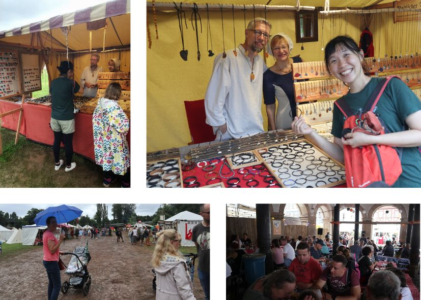

### 單獨旅行

坐在 Stuttgart DB 的第九月台，剛和 Philippa 說再見後就是一個人旅行的開始，眼睛看到的文字、耳朵聽到的聲音，都是另一個完全不熟悉的語言。

熱血沸騰。

還是說不清到底是甚麼，如此依戀朋友伴侶與家人的陪伴；又如此嚮往陌生未知充滿樂趣的新鮮刺激。一個生命、許多面向。

### 寶寶聚會與德國的家

Felicitas is the cutest. 

早上去 baby fun，遇見了各式各樣的同年小寶寶，才發現原來寶寶也可以長得很不一樣。有只會單手匍匐前進的寶寶、有胖嘟嘟自信滿點的寶寶、有很怕生沒有表情的寶寶。唯獨 Felicitas 最有美麗的笑容，是我的小公主。

最後一天和 Philippa 還有她的家人一起喝茶，整個像是溫馨的家。沒有想過可以如此自在的和這裡，像是家一樣的生活。走在村莊裡的遺址。一個小小的家，在一個叫做 Stuttgart 的小村落，發現原來這裡是全德國最美麗的地方。

### 小白鞋與中世紀市集的立陶宛手環

下過雨後的中世紀市集泥濘不堪，超級好玩但是我小心翼翼為了正式場合準備的小白鞋整個被我放棄。整個市集都有裝扮成中世紀的人物來回穿梭，中間還有舞台表演中世紀的戰士如何打架。想買橄欖樹做成的炒菜鏟子結果被 Philippa 勸退。一心想找到手環然後竟然遇到和 Gintas 一樣來自立陶宛的好朋友。

Philippa 在肚子餓到 grumpy 之前直接把我們兩個都餵飽。超級厲害。回家後小白鞋直接獲得兩次洗澡。

### 揮手看不見的城牆

周日是個整個德國都在休息的日子，正在精打細算到底要到哪裡郊遊時，Philippa 想到她爸爸在 Waiblingen 的村莊正好舉行中世紀黑暗時期的慶典。儘管下著像溫哥華一樣的雨，二話不說立刻出發。

名為 Staufer 的部落曾經居住在這座城牆裡，老城區保存著舊有的高塔，觀察敵情用，當時中世紀時期各領地互相爭戰時，這裡也是其中一個大聚落。整座城區是禁止車輛進入的，每個六月的最後一周舉辦的中世紀慶典，是當地人聚會遊樂晾小孩的好去處。

我爬到瞭望塔上觀望整個城區，Philippa 在下面的水池陪 Felicitas，邊和媽媽聊天邊看我拍照、自拍，然後朝我瘋狂揮手，但是我都沒看到(尷尬)。這張照片裡有她還有小朋友(笑)。

### 牛的臉頰

晚餐時光大家都爆累，Philippa 在回家的路上經過超市買了一些 Sausage(因為 Gintas 的遠距挑戰)，說要讓我試試看德國的道地產品，還買了這個看起來像是牛肉片的食物，她說是德國的特別食物要我試試看。

然後就是牛的臉頰啦!是有沒有這麼特別，除了醋的味道有點重真的還蠻好吃的!

### 森林裡的葡萄酒軌道，與村莊裡的夏日泳池

從到達 Stuttgart 之後，太陽就曬的熱人(聽說有三十五度之高)，而知道我很愛散步的狀態下 Philippa 還是帶著我和 Felicitas 去森林裡散步，葡萄酒村莊的山邊有個木球軌道，有點像個小遊樂園，設置了利用重力而使木球滾動的軌道，軌道中設計了各種機關讓小朋友學習葡萄酒的製造過程，還有各種物理(重力、平衡、位能、加速度)，我最喜歡的大概就是利用小球滾動過機關的衝擊而敲擊出音樂。

軌道不只是這一個小區塊，綿延到一整個步道，共有 25 條軌道，中途一度機關故障把我的綠色小球關在籠裡，Philippa 整個超強壯的又踢又敲，硬是把小球救了出來。走完之後是個攀岩場。還有一個水是黃色的湖。我們三個都熱到不行，整個快要虛脫。

回家整裝待發之後(三個人都好好的睡了一場午覺)，就和 Philippa, Felicitas, 媽媽還有我，一共四人到了村莊裡的泳池，超級冰涼的水與簡單的設施，這個小村莊 has so much to offer。

### 後山坡上的廢墟

從 Philippa 的家閣樓的房間向外望去，就是代表了整個村莊的 Ruin Yburt. 因為和 Gintas 的周末約定，半夜三點起床睡不著後，決定早上六點出發來個後山坡的散步。

趁還早太陽還沒升起趕緊出門，前一天的經驗讓人完全明白，這裡的夏日陽光有多曬人。是個很安靜的地方，一早甚麼人都沒有，藝術家的創作與古老廢墟的氛圍，加上日出時的寧靜。

### 寶寶怪獸

Felicitas 是個讓人又愛又困惑的存在。

一直都知道照顧寶寶是個非常艱辛的工作，真的親自過上有寶寶的一天，才真的能理解。吃飯、打掃、餵奶、陪玩、睡覺、散步、吃飯、無限循環，一天都沒能做上幾分鐘自己的事情，真的是太驚人的破壞力。

最崩潰的莫非是尿布換過了、餵好母奶了、洗好清爽的澡了，在陪玩的時候就是狂哭，太莫名了吧(兩個一起哭)。

而且我才陪她一天而已，就有這樣完整的感受。

除了寶寶的大冒險外，到處探查了小村莊裡的各種建築，去市場買菜、到 Ruin 散步、遇到暴風雨而在外頭奔跑回家，在路邊的 Free item 找到了我的太陽眼鏡和人生第一雙高跟鞋(?)一個大冒險呼嚕嚕過一天，發現能有人幫忙顧寶寶，好好洗個澡就已經是全世界最幸福的事情。

### 葡萄村莊

登陸 Frankfurt 後，一震熱氣襲來，轉機的兩小時空檔，就在迷宮般的機場來回穿梭，在一個小小的咖啡廳買了麵包和茶，吃著不知道是早餐還是晚餐的食物，生理時鐘大錯亂。

從 Frankfurt 到 Stuttgart 的飛機一路睡，甚至連起飛都完全沒有感覺。Philippa 來接機時不僅帶上了小朋友，還帶了一支加拿大國旗，也太出乎意料的可愛了吧!沿路向東，她指著前方的山丘說，跨過那座山丘，就是她的村落。

Philippa 是住在溫哥華時的鄰居，當時我們三不五時就一起吃飯，我當時要視訊教書在家待的荒，而她因為懷孕和新生小朋友也常常在家，我們因此就成為了互相取暖的好夥伴。飛越了高山和海洋，在世界的另一個角落相間的感覺很奇妙。

映入眼簾的是滿滿的葡萄，而葡萄綿延的山坡上一座 Ruin，她們家則是一座 Town house，像是高塔一樣，到底有幾層我也屬不清，我就住在最頂樓的閣樓，一張小床旁邊伴著一扇大窗，向外一看就是整個村莊的 Ruin 地標。大約三千人口的小鎮，鳥兒唱著我聽不懂的歌曲。

### 飛越大西洋

此刻的我坐在飛機上靠窗的位置，剛進到這台波音747時，往右一看竟然有通往二樓的樓梯，不愧有空中巴士的稱號。坐在我左邊的德國女孩問我可不可以跟她的朋友換位置，我很委婉地拒絕了，畢竟是我人生的第一次飛越大西洋，我想好好看看這片海。

先前的移動主要都是以台灣為中心，往東到美洲、往北向俄羅斯、朝南向澳洲、朝西到歐洲，就是從來沒有一條線是會跨過大西洋的。這次從溫哥華起飛一路向東，沿路經過 Alberta, Saskatchewan, Manitoba, 當飛機進到 Hudson Bay，像從無線綿延的平原一頭栽進了鹹水的世界。海面上的冰破碎著，有點像是培養皿裡的菌種各自成為部落，卻又禮貌的不互相觸碰。深藍的海水映在白色的冰下。眼見這樣的景象，直直地觸及了腦中那條「游牧」的神經，好想到很遠很遠的地方的衝動。

這股衝動從昨天見到 Kaitlyn 就開始種下了，她剛從西班牙和葡萄牙的朝聖者之路回來，這趟旅程她自己一個人走了超過 400 公里，早上剛從 Iceland 飛回 Vancouver，滿滿的旅人能量不言而喻。光是她的舉手投足，甚至都不用聊到旅程細節，就能感受出她完完全全是個心靈充沛的旅人。某些遠行的經驗，是可以讓人自然的散發光彩的。Kaitlyn 在 Vancouve island 長大，她說她在旅行的時候，完全離不開海，或是只要是在內陸的城市，就會覺得渾身不舒服。

窗外一片從灰白到淺藍的漸層(這次的飛行路線幾乎沿著永晝線)，透過一層雲，我知道下面就是大西洋。

PS.後來左側的德國女孩還是有跟朋友坐在一起，還一起看了一部電影，一路玩樂。

