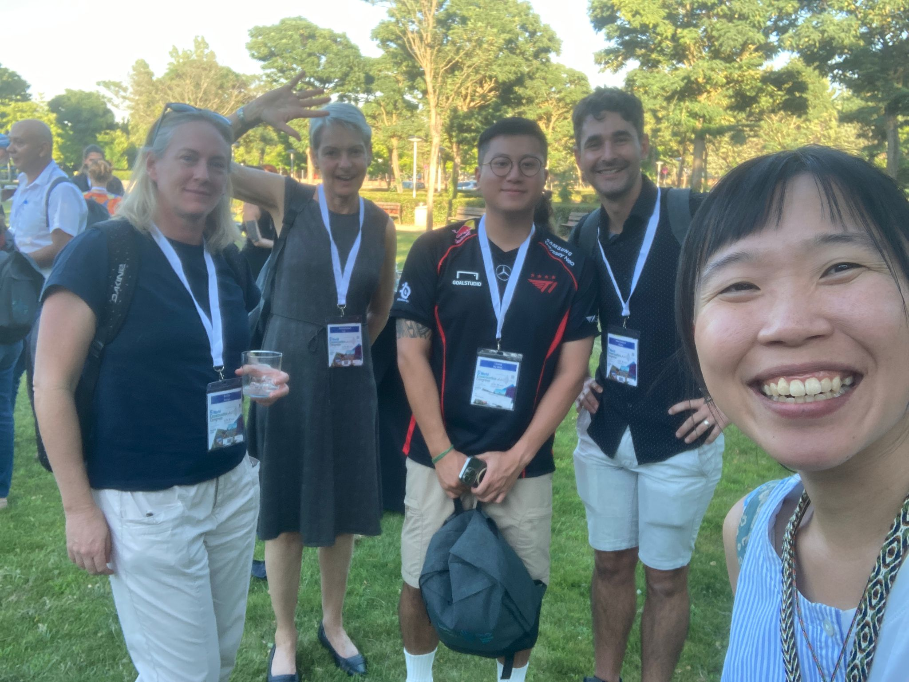
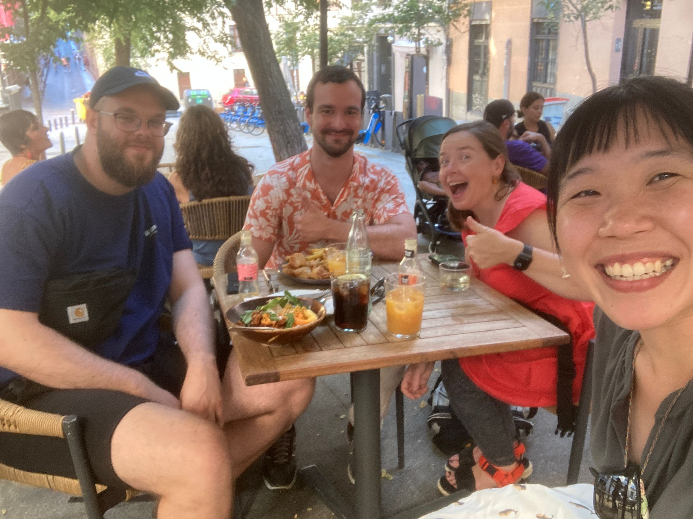

### Ecoacoustics Congress 筆記 - Acoustic monitoring projects

- World-wide Soundscape Project by Kevin Darras
- Australia Acoustic Observatory by Lin
- Germany by University of Feiburg
- Spain by Christian for frogs
- French by Jerome
- United Kingdom by Oliver (for the monitoring guideline)

### Ecoacoustics Congress 筆記 - potential research

"Listen with love is understanding." 大概是這次 conferenc 收到最感人的訊息。說這句話的 Renata，還有一直很尊敬的學者 Jerome，遠端合作過的 Kevin，都再次強調了親自到野外聆聽、真心的關懷自己所分析的資料。在這個技術與分析方法盛行並為人稱道的世代，更要提醒自己聆聽的重要性。

還有另一句很愛的，來自 Jerome，他說 "Don't listen to your supervisor."

- The relationship between perforamnce to more metrics. Potentially the loudness of the species (the quiet species would have clear signals while loud species can have faint signals).
- Building the Audacity plug-in with signal detection (output frequency range and time range). And provide a standard annotation prototocal. 
- Link the number of detections to the number of signals. 

### Ecoacoustics Congress 筆記 - Xeno-Canto

我的 talk 剛好跟 Willem-Pier 同場、同時間，她說他的 talk 有放我的 Spotlight 當作示範! 阿超級惋惜!!但是後來有直接找到他本人好好聊聊。話說這次會議的名牌之小完全看不到名字，要找 WP 時一直小心翼翼的看著人家的名牌，幸好第一次就認對!

- XC 目前除了鳥音以外，已經開始收集青蛙、蝙蝠、蟋蟀，未來有想要拓展至水下哺乳類。
- 目前 XC 最大的改變，是想要針對標記做更新，從原先的 weak labelling (一段音檔只有一個標記，可能包含了許多背景聲音、其他物種等等) 加強成 strong labelling (一個標記只包含了一種物種的聲音，且有框框包圍住)。
- Strong labelling 可以大大的加強之後在 train BirdNET 或其他工具時的準確性。
- 標記的工具，目前想要開發可以結合 Audacity 的工具，直接做 signal detection。可能可以結合的工具有: BirdNET、Perch、

### Ecoacoustics Congress 筆記 - BirdNET 

這次會議的主角有兩位: Xeno-Canto 以及 BirdNET (個人私心選擇)。這篇先來講講 BirdNET。對我來說 BirdNET 就是用非常謙虛的態度改變了整個 Ecoacoustics 研究領域的技術。這次不僅有 BirdNET 團隊直接來辦 workshop，還有兩場 Seminar 直接分給 BirdNET (我的報告就在第一場)，簡直是大旋風。

- BirdNET GUI 已經有提供 training 的 tab，可以用來訓練各種未知物種(青蛙、直升機、或是在他們六千種鳥種以外的物種...)! 是在 CNN 的最後一層做改寫，所以訓練得很快!非常值得嘗試!
- 如果訓練的錄音資料太少，也可以考慮用 BirdNET embedding 的技術，甚至是一兩筆資料就可以用來訓練模型。
- 目前 Merlin 的表現比 BirdNET 還要好(但是只有 BirdNET 有公開 Github 可供使用)，主要是因為 BirdNET 訓練的資料庫是以 weakly labelled 資料為主，這點 Xeno-Canto 有在加強!
- 關於加強 annotation 的平台，目前有另一個叫做 BirdNET annotator 的，還沒用過，很好奇，值得試試看。
- 除了 BirdNET 以外，還有另一個叫做 Perch 的鳥音辨識技術。好像是 Windows 開發的。
- 關於 BirdNET threshold 的設定，去讀 Connor Wood 最新發表的文章，是否有用到 Stratified sampling。
- 關於 BirdNET 的應用，如何從 number of detections 轉換成 number of signals 還沒有人研究過(非常心癢手癢!)

第一場 Seminar 結束後，Josef (其中一位 BirdNET 的工程師)直接來說「Your presentation is the best of all.」天啊，整個融化。發現 BirdNET 的團隊非常的小，他們的工程師也非常的好奇這個工具目前是怎麼被生態人利用的，他們對於生態的語言以及我們常在使用的工具其實不甚了解，但就資訊分析方面非常精準，有甚麼需求都能變出來的厲害。

PS. 第二天晚上一起去看西班牙大戰法國，然後一直討論 Avatar，太開心啦!兩個大男孩非常的可愛!

