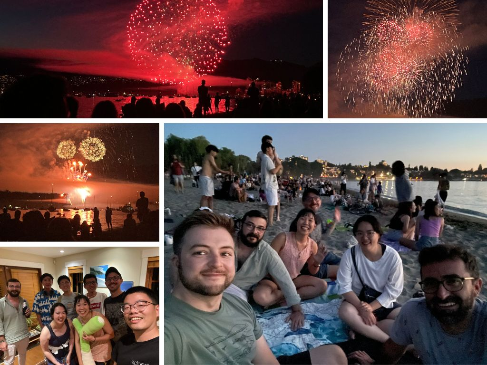

太久沒有當 host 了一整個突然很緊張，記得很久之前邀 Peter, Stella 和 Drek 來古蹟家作客的時候，也是很擔心會待客不周之類的。曉萌說，就是因為想要讓朋友都開開心心的，所以才會緊張，很正常。

這次有 Gintas 陪著就好很多，他一直跟我說其實不用安排甚麼大家就可以自己玩得很開心。我也是，突然約到的 Sam 和 Jose，還有很突然成團的台灣小隊(竟然還有快十年不見的球友)，還有鄰居 Victor，很混亂，但就是因為這樣的混亂才會開心啊!真的只要好好放鬆，好好的享受，每段有朋友的陪伴都可以很溫馨。

小小的家被十個人充滿的感覺很溫暖。

