### Opportunity Scholar 

這次獲得了 2024 posit::conf opportunity scholar 的機會，POSIT, PBC (之前叫做 RStudio) 直接提供了會議的參與費用、機票、所有食宿費用。這次來到了西雅圖開會，是第一次參加由公司舉辦的會議，POSIT 本身雖然提供了許多 open source 的服務，像是最多人熟悉的 RStudio IDE，同時地也在付費的服務上提供大型公司所需要的 Posit cloud connect 等等。一年一度的會議，主要是發佈及更新 POSIT 這一年來的開發成果，覺得有點像產品發表會(而且是 open source 的)。

Opportunity Scholar 不限職業，只要是對 open source data science 有興趣的都可以申請，全球每年有 40 個名額，超級幸運可以來看看 POSIT 的氣魄。

來到會場之後，整個驚為天人。POSIT 直接包下整個西雅圖市中心的飯店，從三到七樓都是會議場地，而同個飯店就是與會者的住宿地點。從前身叫做 RStudio 就可以推測，大部分的 workshop 與 session 都以 R 為主，連註冊的小本本都是一整冊的 cheatsheets! 直接深深的切中我心。同時也有很多 Python 的 talk。

幾個亮點，親自上了 Jenny Bryan 一整天的 Package development workshop，如沐春風，本人超級和藹美麗，還有獲得 debug 小鴨鴨；Posit 繼 RStudio 之後推出新的 IDE 叫做 Positron；開完會頓時成為 hexagon stickers 富有人家。

身為一個 RStudio 與 Open source 的熱愛者，和兩千位擁有同樣熱情的軟體工程師共同參與的會議，和今年稍早參加的鳥鳥會議，或是生物聲學會議完全不同的氣氛，簡直像來到另一個世界。

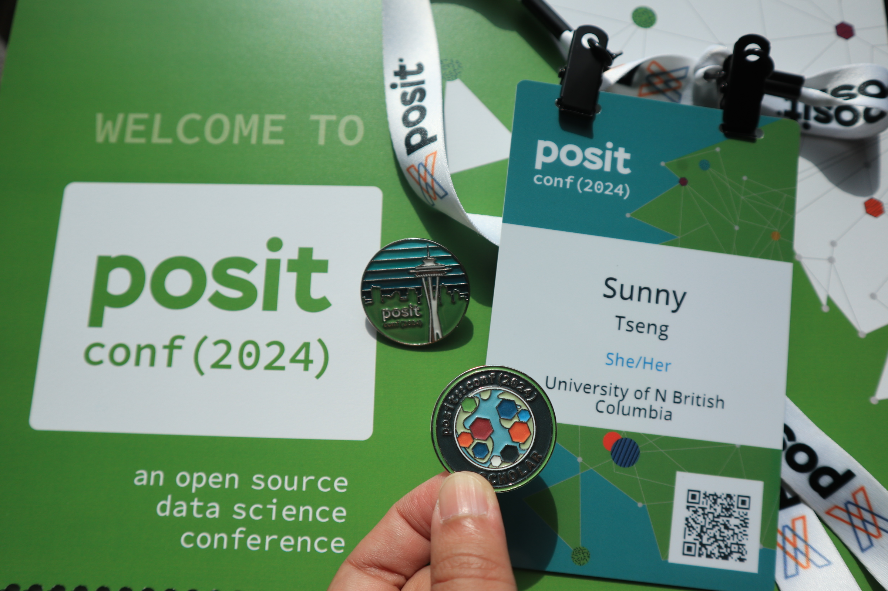

---
### Workshop: Package development - 來見見偶像 

自從加入 rOpenSci 開發 R package 以來，已經將近半年的時間，在 R package 的世界裡有無限的可能。有在寫 R package 的人大概都知道 [R Packages (2e)](https://r-pkgs.org/) 這本書，由 Hadley Wickham 與 Jennifer Bryan 共同撰寫。這次的 package development 就是 Jenny 主講，親身體驗到偶像的無限魅力 (再度被圈粉)。

Workshop 主要針對 package development 背景的人，大概就是我這樣程度的人，已經會畫貓頭鷹的兩個圈圈，但還有很多可以讓貓頭鷹變漂亮的細節。這次主要包含了四個主題: General workflow、Test、Documentation、GitHub actions and CLI package。

Workshop Github repo 在此: https://github.com/posit-conf-2024/pkg-dev

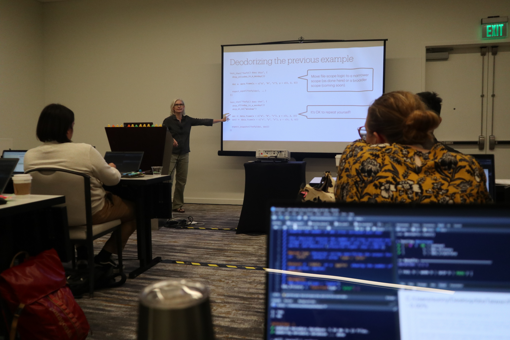

一些令人眼睛一亮的新技能

For Test: 
- Don't include `library()` or `source()` in any test scripts.
- Turn on `testthat()` parallel testing by using testthat 3rd edition. Check [instructions](https://testthat.r-lib.org/reference/is_testing.html).
- The `tests/testthat/helper.R` will run before all the test files, thus a good location to include files needed in the test.
- For single file test, use `devtools::test_active_file()` and `devtools::test_coverage_active_file()`. And use `devtools::test()` for the whole package.
- [Snapshot test](https://testthat.r-lib.org/articles/snapshotting.html) is good for complicated test. 
- [Skip tests](https://testthat.r-lib.org/reference/skip.html) whenever needed! This is SO useful, especially in the GitHub Actions and on CRAN. Will add this to the BirdNET project. 
- GitHub Action for R-CMD-check can be disabled on the browser. 

For Documentation:
- Never do the following in the documentation: writing files, setting up options, or changing working directory. 
- Write detailed examples. Use `try()` for code that don't run in the roxygen, instead of `don't run`. The later one will be rejected by CRAN.
- Make use of links in the roxygen to link between functions. 
- Write `_pkgdown.ymal` for customized pkgdown arrangment.
- Check the urls by `pak::url_check()`.

CLI package (Command Line Interfaces)
- Use [CLI tools](https://cli.r-lib.org/) to build attractive command line interfaces

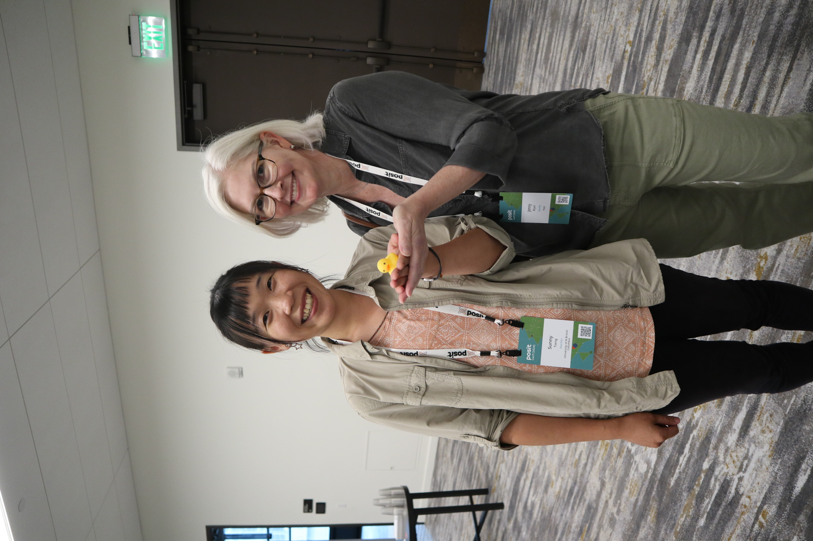

--- 
### Keynote: POSIT update

聽到 keynote 就發現原來自己還是 POSIT 王國的小囉囉，連 Quarto 是 POSIT 旗下的產品都是到現在才知道，我都用了 Quarto 用了多久了(汗顏)。第一場 Keynote 就是 CEO Hadley Wickham 主講，主要是發表公司的三大進展:

1. [Quarto update](https://quarto.org/): 新推出了一個 Quarto Live 功能，官方簡介是 "an official WebAssembly backend for Quarto that supports both R and Pyodide interactive code cells and exercises"，但對我來說有點遙遠，我用 Quarto 也只有用在 slide, book, 或是 website，目前也不知道會不會用到他的 live coding 還有 auto marking 功能，
2. [WebR](https://docs.r-wasm.org/webr/latest/) - R in the Browser: 可以在沒有下載 R 的狀況下直接用 Browser 跑 R code，甚至可以互動而且更改環境。我其實不太清楚他跟 [Posit cloud](https://posit.cloud/) 的免費版本有甚麼不一樣(汗顏)，可以再研究看看!
3. [Positron](https://github.com/posit-dev/positron): "A next-generation data science IDE built by Posit PBC"。這個不用多提了，把 RStudio 的好直接改成 polyglot tool，

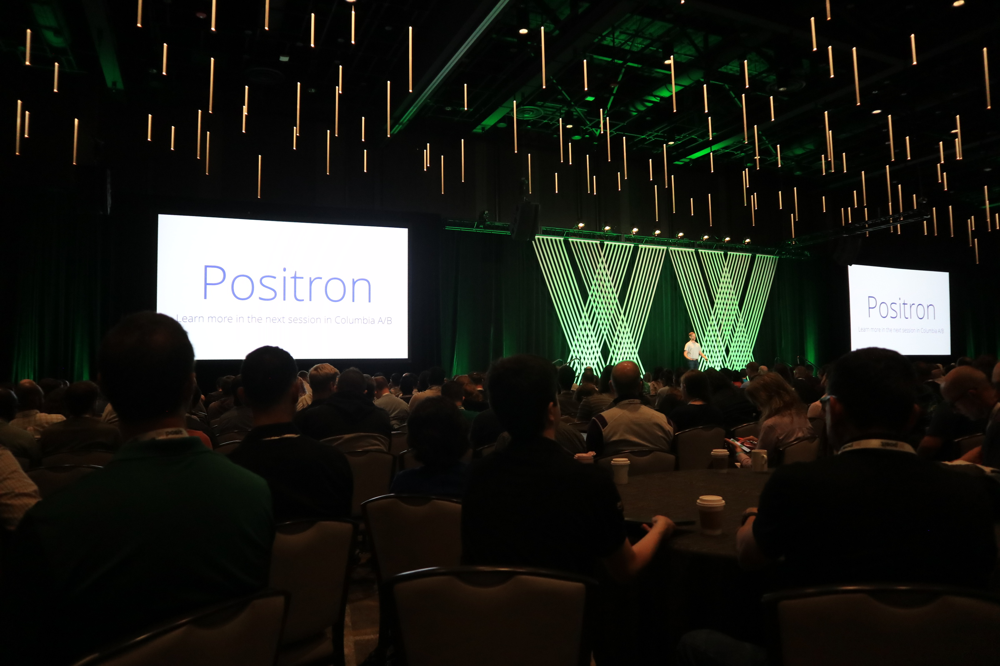

其他的就是再複習一次 POSIT 的經典 open source product: 
- Rstudio IDE
- Shinny 
- Shinny Server
- R packages (tidyverse, tidyvermodels, ggplot2, etc.)
- Quarto

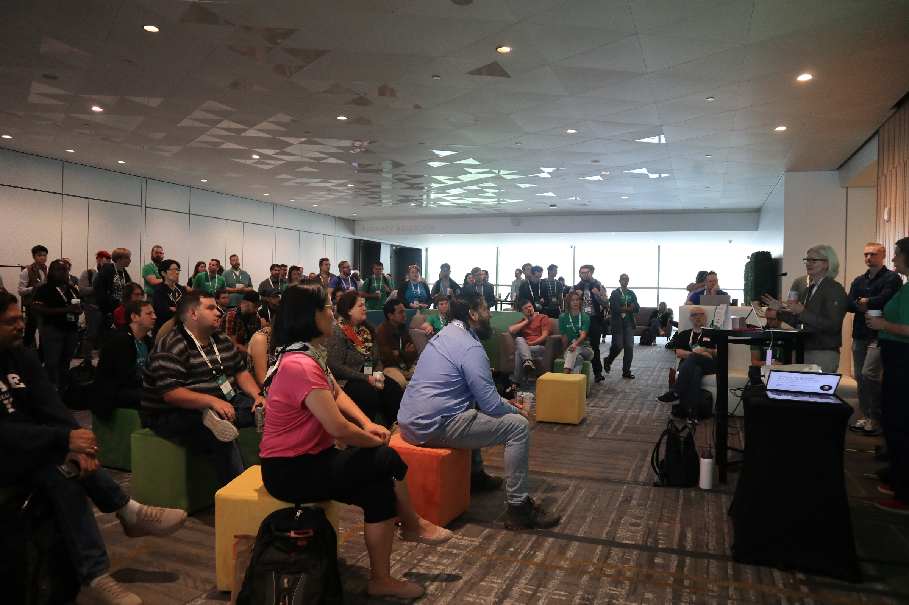

---
### How to make Great Tables

- gt
- gtsummary

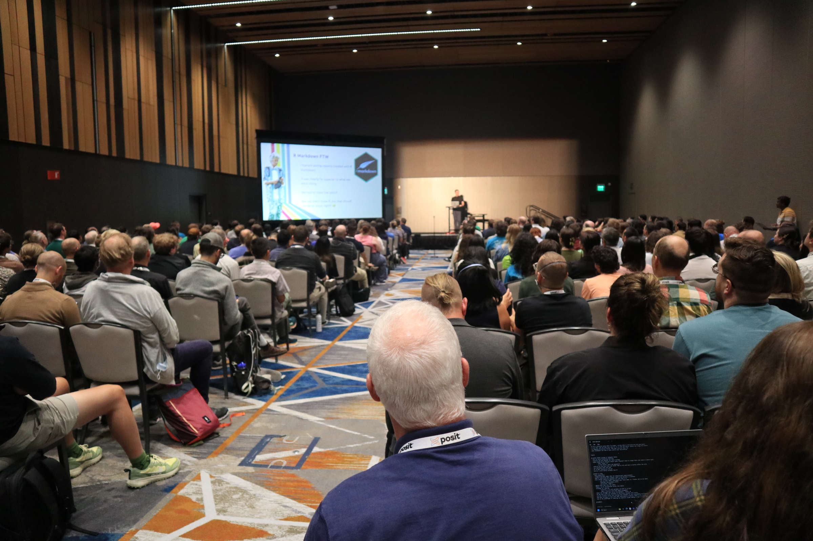

---
### Keynote: Use GenAI for Data Science

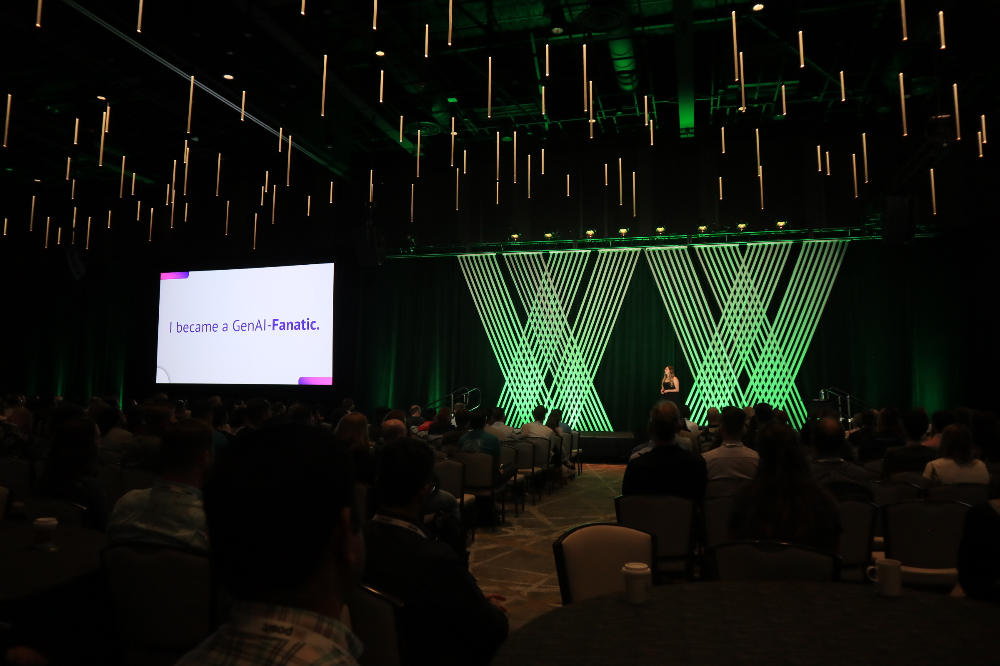

---
### Keynote: The Future of Data Science 

這次上台的是個老先生 Allen Downey，話說我對 Data Science 裡面的人物其實所知不多(畢竟我也是半路出家)，剛剛聽完 keynote 一上網查才知道人家是赫赫有名的 Think Stat 的作者，這裡先附上人家的 [Github](https://github.com/AllenDowney?tab=repositories) 。

聽講之前我才想怎麼會把主題定的這麼廣，這個 title 真的是要講甚麼都可以。但不愧是有經驗的講者，一下就擄獲全場人心。

第一個段落提到他和太太在懷第一個小孩的時候，不知道第一胎是不是比起其他的嬰兒更容易晚生，與其直接 Google 看個人案例，他去找了 data base 來做統計分析，發現其實第二胎之後的寶寶更容易 delay。特別引人注目的是，他在分享這個發現到個人部落格上之後，竟然被媒體轉發，瞬間變成了孕婦產期的專家(?)。

The key of data science is to transform "unanswered" to "answered". 

接著對於 Data Science 的期望之後，又提到 statistics 和 computer science 並不是同一件事情，不是把彼此加起來就會變成 Data Science。我們在一個資訊爆炸的世代，[Doomscrolling](https://en.wikipedia.org/wiki/Doomscrolling#:~:text=Doomscrolling%20or%20doomsurfing%20is%20the,the%20web%20and%20social%20media.) 加上近十年來的錯誤分析、資訊洩漏、個資外洩等等的醜聞，讓大家對於 Data Science 的認知偏向負面，但適當的遠離負面資訊以及藉由資料認識世界，是個很好的開始，介紹了一些書籍:

- [Factfulness](https://www.amazon.com/Factfulness-Reasons-World-Things-Better/dp/1250107814)
- [Not the end of the World](https://www.amazon.com/Not-End-World-Generation-Sustainable/dp/031653675X)
- [Element of Data Science](https://allendowney.github.io/ElementsOfDataScience/index.html)
- [Probably Overthinking It](https://www.amazon.com/Probably-Overthinking-Questions-Statistical-Decisions/dp/0226822583?crid=1OPZI2WEGNPTA&keywords=probably+overthinking+it&qid=1681258805&sprefix=probably+overt,aps,212&sr=8-1&linkCode=sl1&tag=greenteapre01-20&linkId=7cf54619116fbf7a0e8312c4daf08619&language=en_US&ref_=as_li_ss_tl)

介紹的 Ted 短講和用資料認識世界的網站:
- [Our World in Data](https://ourworldindata.org/)
- [Hans Rosling's 200 Countries, 200 Years, 4 Minutes](https://www.youtube.com/watch?v=jbkSRLYSojo)

最讓人印象深刻的是他對於世界的正向心態，並不是無知的正向心態，而是完整的藉由資料來提供客觀的證據，藉此建立起自己世界觀的信心。在 QA 中被問到 "你身為白人男性的身分影響你對世界的看法，你要如何抽離這樣身分造成的的偏差"，在我聽來非常尖銳的提問。

他只是簡單地承認自己身為白人男性的確是擁有了很多優勢，但是他所提供的這些想法是他盡量找到的客觀知識，同時他也提到了，這些推論都是自己的想法，很樂意聽大家的想法與討論。他也說，鼓勵有這些疑問的人，可以思考一下自己為什麼自己會有這樣的情緒出現。

幾段想記錄的話:
- Data science exists because statistics missed the boat on computers. 
- Wanting to know the truth is the key for defeating confirmation bias.

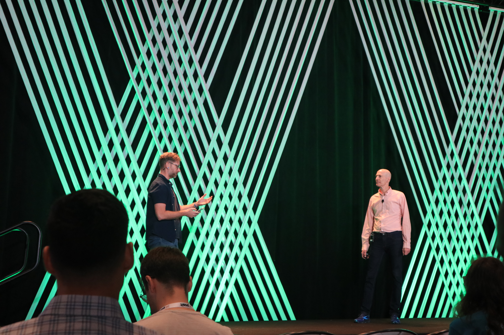

---
### Keynote: DuckDB

會議進行到這個時候，已經呈現知識疲勞狀態，從早上七點起床到傍晚十點回到飯店房間，大概只有十分鐘是可以好好休息的時間。大腦一直維持在興奮狀態，不是在 social 就是在講話的路上，最後一天好好靜下來然後竟然又放了好像很有趣的 talk!

作者超可愛，取 duckDB 原來是因為曾經養過鴨子。

[DockDB](https://duckdb.org/) - 做 database 的工具，不太熟悉，但全場幾乎有一伴的人有用過 DockDB!

跟 DockDB 不熟的我也許可以先試試看這個跟 tidyverse 共同開發的 [duckplyer](https://duckdb.org/2024/04/02/duckplyr.html)

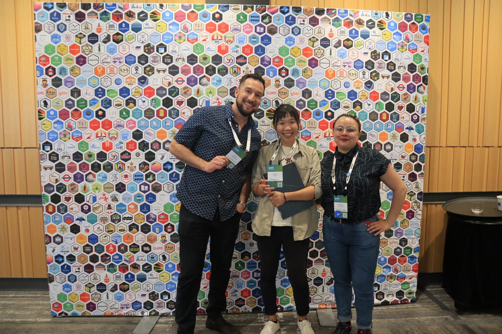

---
### 好朋友們還有我自己的照片

有幾個需要聯絡的 connections!

- Jorge A. Ahumada (jorge@wildlifeinsights.org): 是 Wildlife Insights 的創辦人，認識 Cole，他們的公司主要處裡生物多樣性的資料處理，包含自動相機與自動錄音機。他們的公司也是製作 [Arbimon](https://arbimon.org/) 的!! 其中付費的選項就是使用 BirdNET 的 API。想寫信問問他願不願意來給 UNBC 一場 talk。

- Stefanie Butland (https://github.com/stefaniebutland): ROpenSci 的前任 community organizer，認識 Steffic 還有

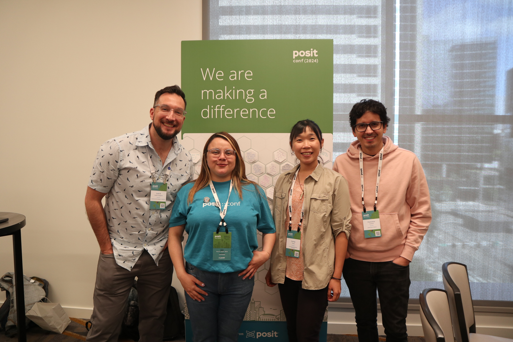
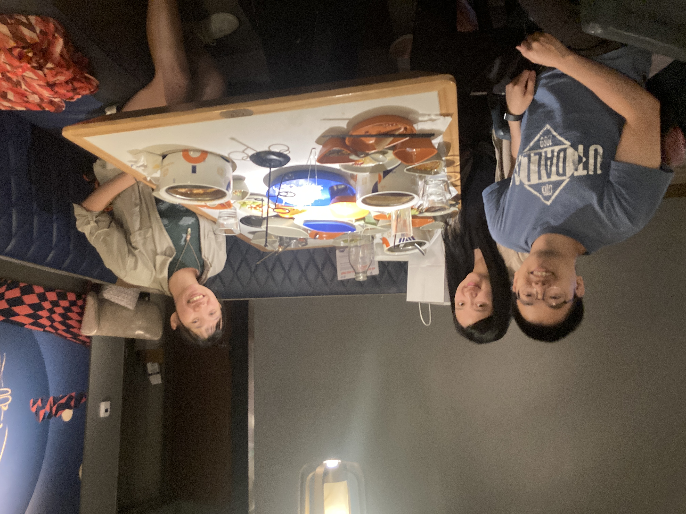
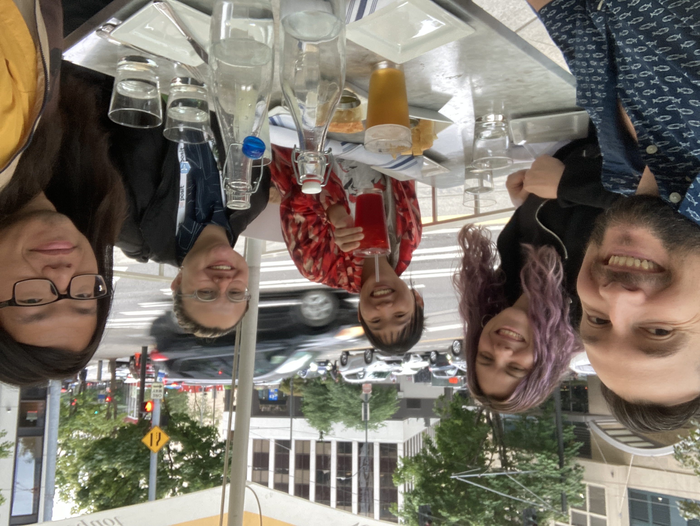
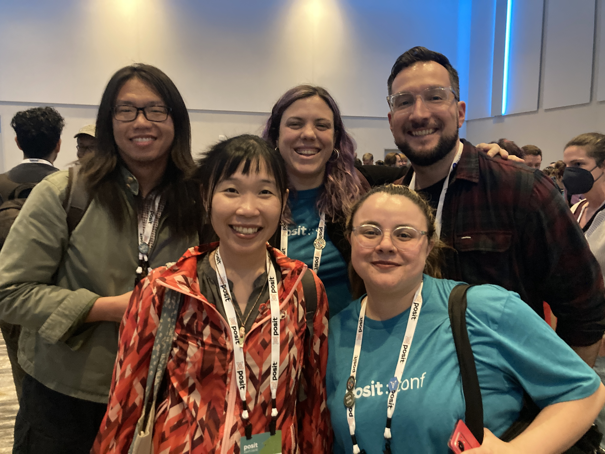
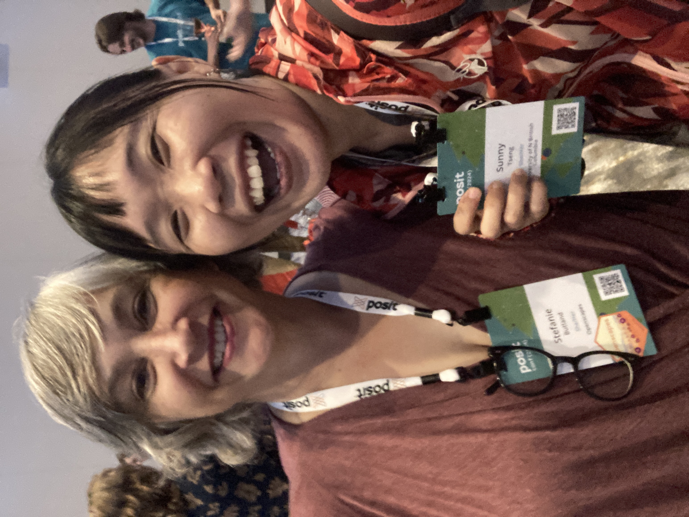

