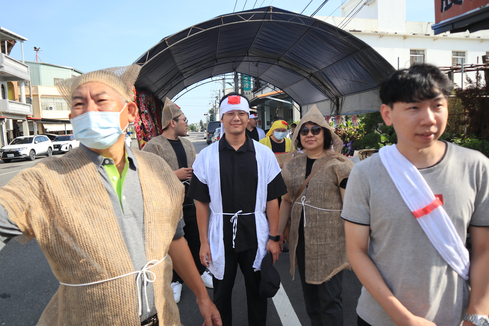
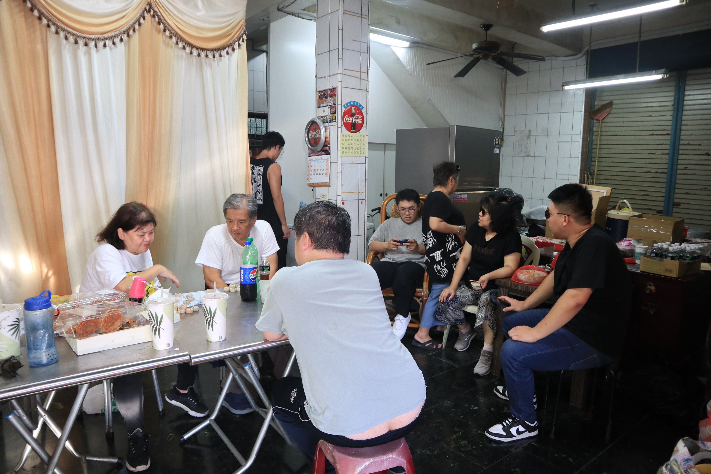
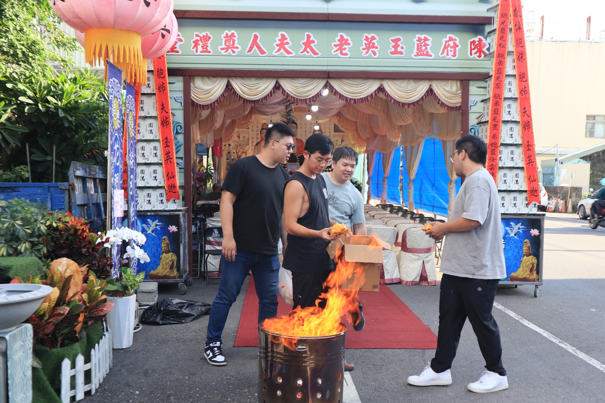
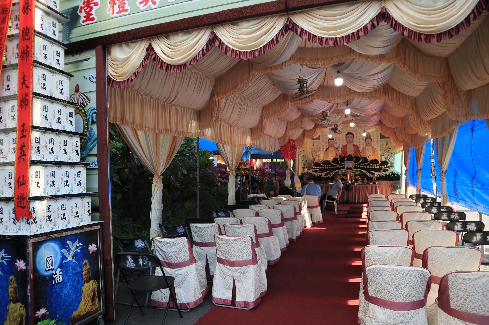
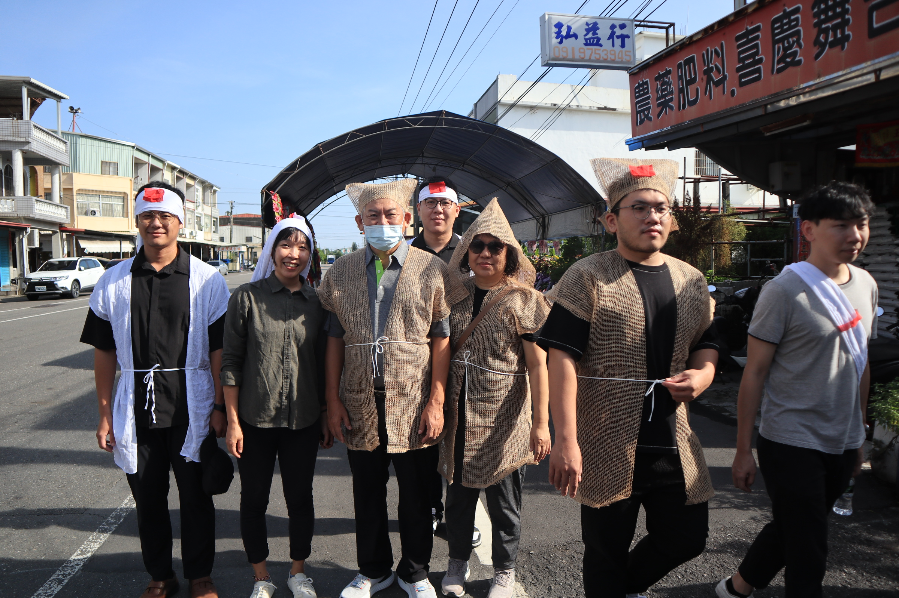
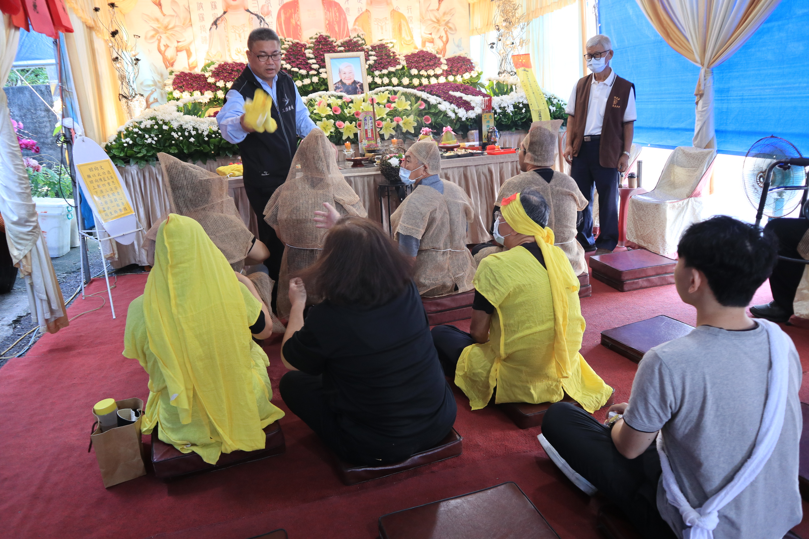
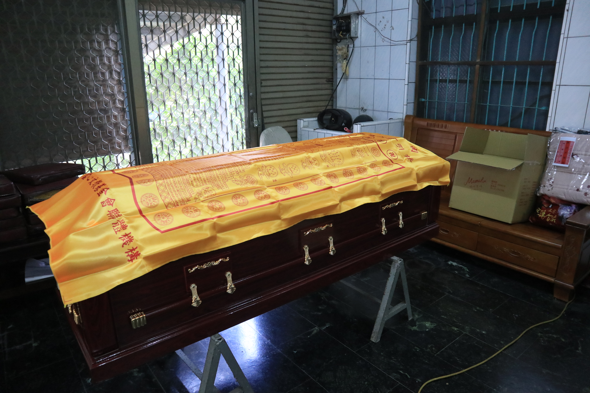
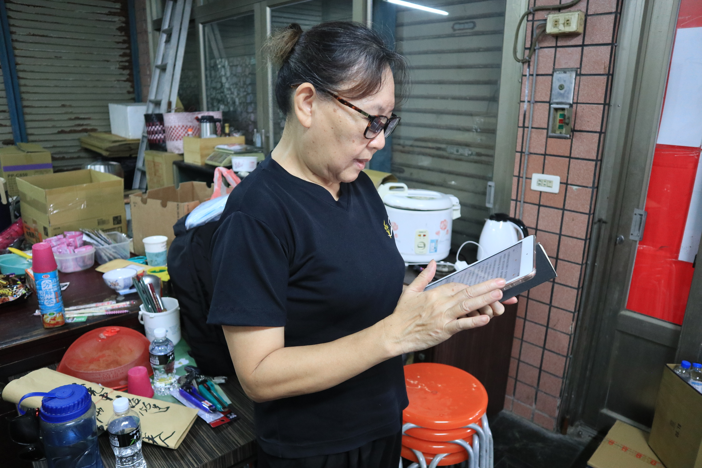

### 回國
在溫哥華的周一傍晚聽到婆婆過世的消息，周一那天就睡不著覺，不知道是前兩晚吃的 Pealla 抑或是因為外婆的消息心神不寧，看了機票，要五百多加幣，闔眼先至少睡個幾小時再說。

隔天一早一樣的心神不寧，連實驗室的人在喧鬧都是一陣陣的折磨，覺得世界太煩躁，為什麼不能好好地、安靜地、真心地對待彼此，為什麼每段對話和笑聲都覺得好刺耳，只有在 Sam 及 Jose 來的時候，我才能安定一些，Jose 一進門，就是一陣溫暖的擁抱 "I am so sorry, my friend."。真的，哭了好久，過世了，到底是甚麼樣的概念，一樣的軀殼，突然心跳就不跳了。要怎麼好好地說再見呢? 我問 Jose，他說，跟著家人一起，一起哀傷一起回憶，be present，就是最好的方法。

Derek、Stella、Peter，都在第一時間伸出援手。Gintas...怎麼說呢，只能說他盡力了。在下班之後直接飛奔到家裡陪我，幫我修理了手環、一起簡單吃了晚餐，幫我把所有的食物都帶回家，然後再跟 Derek 陪我到機場。

### 摺蓮花
一下飛機就呼嚕嚕的直接前往高雄，飛機上睡得不多，但也還不算太累，在買捷運車票的時候檢到五百塊。因為早上五點多就到了機場，輾轉還是搭上了當天的第一班車，砰隆隆前往高雄，因為沒有電話也沒有網路，整個呈現失聯狀態，我在車上也是整個睡到亂七八糟，真的是有感覺到累，因為太累了連消化系統還有肌肉都很遲緩的那種疲憊。

一到高雄就有小舅舅來接(好幸福)，還有舅媽跟張智謀，我還在精神混沌(還是從來沒有清醒過)，一上樓就被叫去摺蓮花，張智謀說婆婆不在家，我毫無猜疑，沒想到婆婆從頭到尾根本就在我們旁邊。下午兩點一起去誦經，誦經完燒了 108 朵蓮花，說是要給外婆在西方極樂世界踩著。

### 離開

告別式當天，七點半，洗完澡換好衣服，就如所有的以往一樣當第一個到現場的，要去幫婆婆換衣服。燒香拜拜的時候，突然覺得，好不想要開始告別式，因為告別式結束了，婆婆是不是就會真的離開我們了。

### 儀式的跪拜，家祭、公祭

大舅舅面色凝重看著婆婆的遺照，"啊曾一華起床了嗎?"，應該還沒吧，我說。"那曾奕晴妳去搬椅子來幫忙掛輓聯，要照順去排噢，名字越大的要排越前面"。

整天的不公平感從這裡開始。

孫女就孫女，還要分外孫女還是內孫女。排隊就排隊，還要分男生這邊女生這邊。為什麼我不能搭靈車、為什麼男生才可以在現場等、為什麼哥哥就可以現場在划手機跟爸爸討論婚禮的事情、為什麼爸爸可以在現場兇我。

當天天氣很熱，大家又忙碌又緊張，而且真的是跪到不行，還要一直磕頭，可以理解情緒難免會有起伏。要出發到火化場時，爸爸在哥哥車上不停對我大吼大叫，我當時身兼重任，跟小舅舅約好要把東西都帶到，但爸爸就一直催，我整個超憤怒。"你才莫名其妙"，我好生氣，都快氣哭了的那種，為什麼要一直把我當小朋友一樣。

我從那開始，將近四天都沒有再跟爸爸說話。

### 燃燒與骨灰
爭取到了可以到焚化爐看婆婆的機會，我其實整個告別式都不太有感覺，一直到了跪拜，看到棺木滑進焚化爐的那刻，整個眼淚像是潰堤，"婆婆真的要離開我們了"，我心想，"進到那裏之後，她的肉身就會不見了，真的要說再見了"，我邊流淚邊想著。

大家去吃午餐，我跟小舅舅還有嘉嘉留在焚化爐等，葬儀社的人來通知婆婆的骨灰燒完了，撿骨師把骨頭放在兩個托盤，一個放頭骨；另一個放其他的骨頭，我們邊念經，邊把婆婆的骨頭夾進骨灰罈裡。好脆，不知道是因為燒過，還是因為骨質疏鬆，那個骨頭的聲音聽起來像是空心的一般，好清脆。

"婆婆要住新家了噢"。

住新家，活著的時候需要廣大的資源，水、食物、安頓的地方、光、朋友、人情，死去之後只需要一個骨灰罈，小小的，以骨頭的形式存在於世界上。

### 媽媽的故事
其實我最擔心的是媽媽。

雖然外婆對我來說也是很重要的人，雖然悲傷是無法量化無法比較的，但我在想，媽媽的悲傷，是不是也能有人可以接住呢。阿姨跟小舅舅，還有像大哥一樣的大舅舅，兄弟姊妹之間的情誼，是不是能夠緩和失去母親的辛苦。媽媽這次一樣擔任了撰寫祭文的角色(不知道是不是文筆特別好)，開始之前還緊張著練習，真的要念的時候還要戴上老花眼鏡才看的到，我看著就覺得好心疼，覺得媽媽年紀也大了。看到媽媽漸漸老，不是那個甚麼都可以抵擋的媽媽，我也是會好難過。

媽媽說想要請我幫忙留著她的祭文，我就先留著她當場念的版本。

