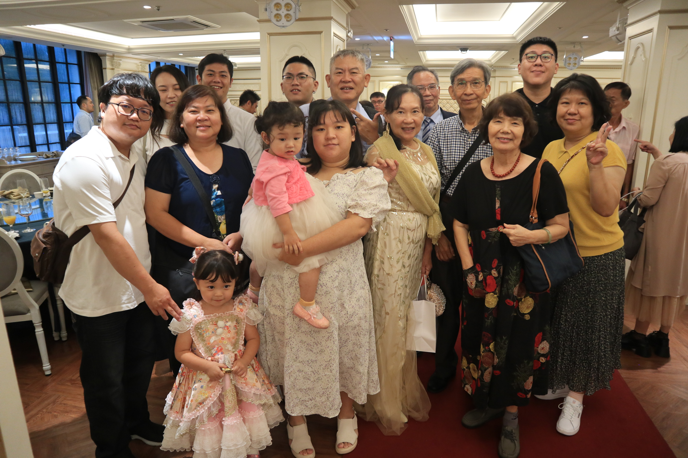

最帥氣的哥哥結婚啦，擔任收禮金的角色，第一次收錢就上手。簡單列出這次婚禮覺得好玩的地方。

- 和媽媽在事前挑禮服花了很大的功夫，最後找到的禮服只要台幣兩百塊，摸起來像雨傘布哈哈哈但是很鮮豔漂亮。

- 因為邀不到化妝師，我跟媽媽直接決定我們自己來！後來一直看影片，試妝的時候整個悲劇，把媽媽化的不能上場，最後決定自己畫。

- 婚禮當天和姿吟一起收禮金，覺得多認識人家好多，很幸福。

- 沒有坐在主桌（為何！？），但其實蠻開心被安排不是在主桌的：）

- 跟璐璐還有瑤瑤一起玩到被側目，我們玩得很開心。

- 哥哥一直被叫帥哥新郎，是真的有帥啦!

