### # 感謝隨著時間一起、在各地一起前行的夥伴們

2024 的這年阿，仔細算了一下，總共飛了 18 趟飛機、來來回回了亞洲、澳洲、歐洲、北美；在台灣的家、在溫哥華的家、還有在各地的工作場域們。

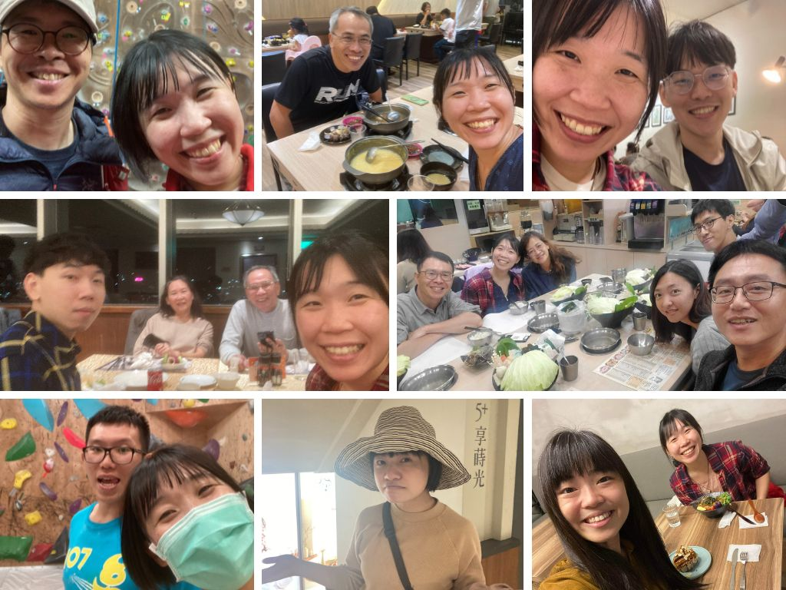

在往返各個城市的工作之餘，在身邊來來往往的家人朋友們總是給了最多的安心。剛剛翻出一年裡的照片，整個回憶湧現，實在是太難一一細說，但與每個人的回憶與每次的對話，我都記得。

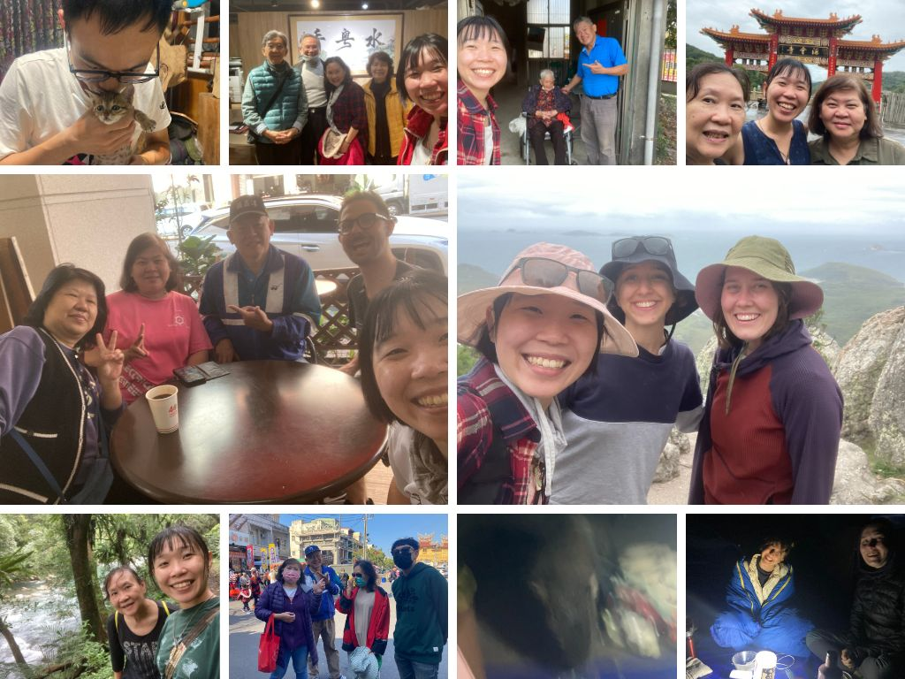

年初回台灣，投票大選兼過年，順道去了動行見見生態圈的朋友們；動行報告完隔天直接飛澳洲找老朋友，除了看到企鵝大軍還有眼睛是紅色的烏鴉很特別之外，露營晚上還遇到來搶吐司的袋熊；立陶宛先生在農曆過年期間頓時空降台灣，馬上帶著他環島一圈，上山下海跳飛行傘，還在台東夜市各自遇到好朋友，結果他跟我說印象最深刻的行程是騎摩托車。

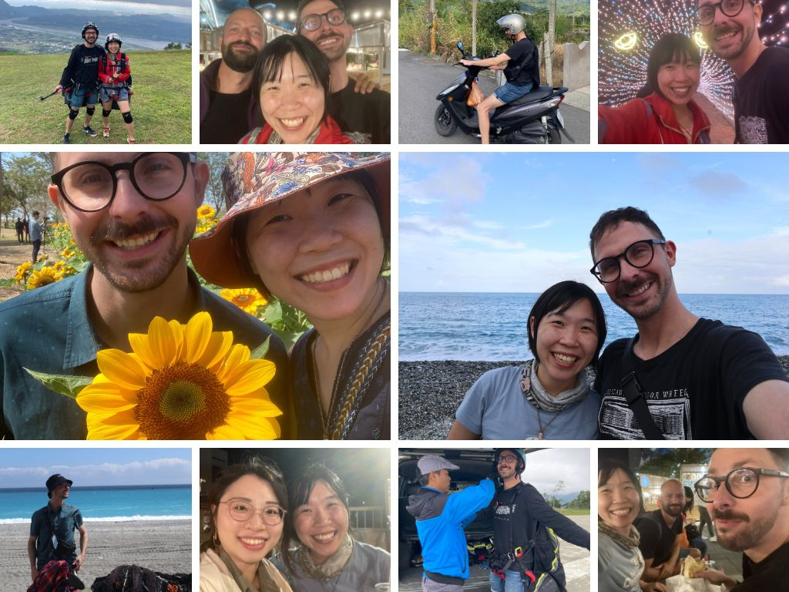

回到溫哥華後，就是幾乎一個月出遠門一次的規律。先是去了 PG 做野外調查，再飛德國去找小寶寶，一路從德國搭火車南下到西班牙見了歐洲在做生態聲學的研究人員們。長途旅行回來後，又再幾趟飛美國的會議，見見那些做鳥類研究的人們、還有做 Data science 的人們。

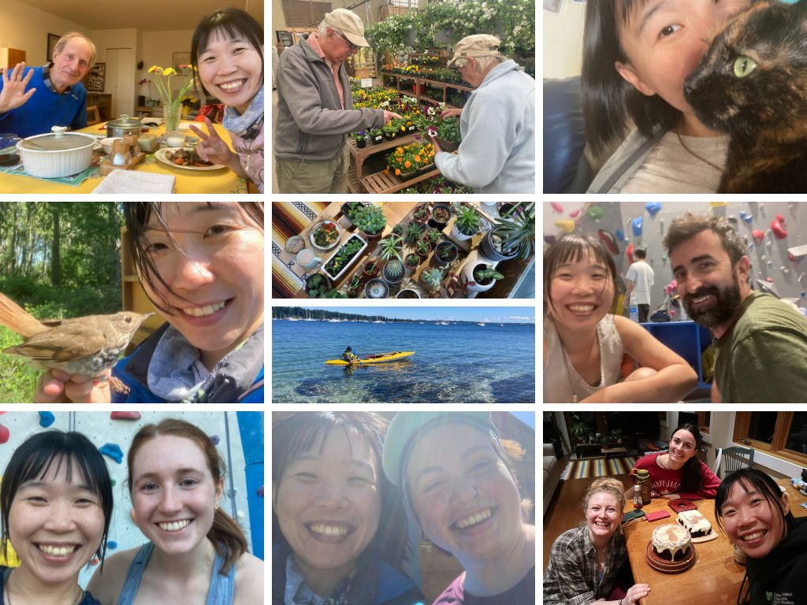

在整理這些照片的當下，剛好在跨年的影片中聽到五月天的《任意門》，"你問我全世界是哪裡最美？答案是「你身邊」"，頓時好感動。過去一年走過大大小小的城市、見了各式各樣各有專精的人，工作上固然是興奮刺激與充滿自我實現，最溫暖的地方還是熟悉的人身邊，也開始很珍惜，可以好好的、安心的窩在安穩的家裡陪伴自己與珍惜的人們的時光。

不論是台灣，有很熱很黏偶爾颳颱風的家、每次回家總是要鬥嘴很久的家人、還有很久沒見但每次見到面都很開心老朋友們；或是在溫哥華，有爺爺奶奶、貓咪狗狗、還有立陶宛先生，跟可以一起煮飯攀岩賞鳥暢談生活的好朋友們。

謝謝你們都在，謝謝過去的一年有你們陪伴。

PS. 年末感謝寫到年都過了還沒寫完，但就這樣慢慢來，有空的時候來整理一下回憶。

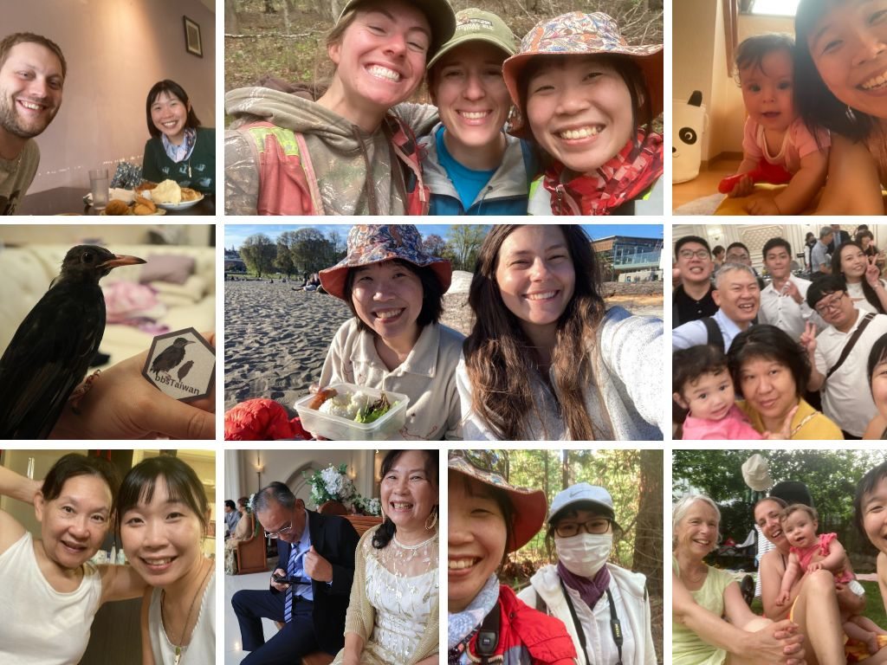

### # 感謝立陶宛先生 - 還有努力餵養生命的食物們

趁著聖誕節這樣溫馨的日子，來感謝一下立陶宛先生在這一年來的陪伴，在這些吵吵鬧鬧的日子裡，總認為在親密關係裡，可以以突飛猛進的速度認識自己 (雲霄飛車的概念)。

兩個人一隻貓 (Kiki 黑到在照片裡幾乎看不到)，煮了整桌的菜。這次的聖誕夜，我準備了火鍋 (大餐標配)，Gintas 則是做了立陶宛的傳統料理 Balta mišrainė (白沙拉) 還有 grybais idaryti kiausiniai (菇菇魔鬼蛋)，貓貓 Kiki 則有新的貓食口味做聖誕晚餐。

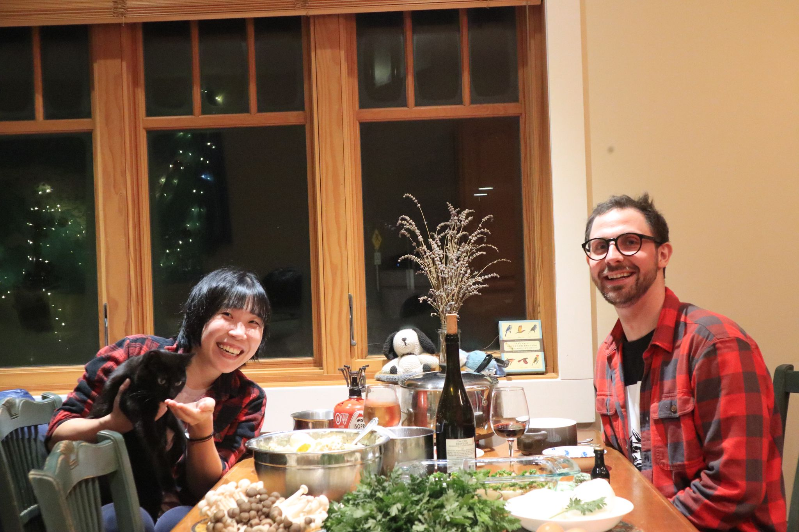

手做麵條、包水餃、馬鈴薯包肉、烤藍莓派、poppy milk。我們一起在書裡面讀到看起來很厲害的料理，就會一起想辦法把它做出來，每次都像在廚房裡做化學實驗，偶爾成功、偶爾失敗、每次都很好笑。

除了人跟貓都吃得很飽連冰箱都被我們餵的飽飽的。這真的是我第一次體驗到過聖誕節過得像台灣的農曆新年一樣，每天都有剩菜但每天都要煮新的料理然後每天都吃超飽。

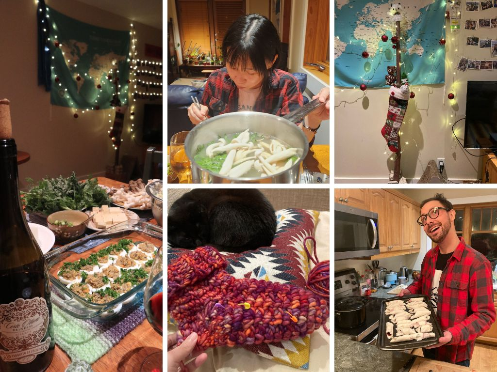

### # 感謝有貢獻感、有幸福感的 side project 們

今天除了我和 Z 兩個人，整個辦公室因為聖誕假期空蕩蕩的，卻因為人少少的而有莫名的溫馨感，Z 烤了 Sourdough Bread 一起分享，整個空間都有酵母的香味。

下午和 Birds Canada 開完會之後，今年的工作就算是暫時告一段落了，(除了一些 personal project 在年底前想完成)。因為要開 invoice 換 cheque 的緣故，回顧了過去接案開出的 invoice 們，發現今年除了本身的鳥音研究以外，大大小小的竟接了十個案子，一年十個案子的概念大概就是，一整年的時間，都同時有主要研究工作 side project 同時進行。

- 最幸福的是，這些事情是有選擇的，而且完全是為了自己開心。

不論是設計 (infographic, logo, poster) 或是資料分析的案子，大部分都只會接受朋友的請託，或至少要有基本的認識或互動過。對我來說，幫忙做設計，是一種和朋友交流的管道，讓我可以更深入地去瞭解對方的研究內容、去理解他的需求還有喜好、還有在過程中因為不同的想法而切磋出的火花 (碰)，是一種，更了解朋友的感覺，也為彼此的作品留下漂亮的回憶。也有一些朋友是，正在進行的時候彼此對於設計的意見相左到不行，到最後還是再接著合作了幾個案子 (一種不打不相識的概念)。

- 最深的體悟是，只要心甘情願，每個決定都可以幸福。

今年對於自由接案，領悟到了一個很重要的環節，就是在一開始簽 contract 的時候，要把事情說清楚: 預計會花的時間、預計的收費、繳交的日期、要怎麼溝通、可以修改幾次、每次修改的時間。這些項目能討論的越清楚越好。

一開始接案經驗不多的時候，會因為對方是朋友，以為留有彈性的空間、把話說得模糊一點比較有溫度、有人情味。但後來發現，這些模糊的空間某部分是來自於逃避溝通 (擔心理念不同、預期結果不同、或是方向不同)。反而是能在一開始一起寫 contract 的時候好好的打開心房、界定好彼此的界線，簽下 contract 之後就是一段心甘情願的道路。在有良好的溝通以及規範下，就可以在工作的路途中感到舒適自由以及滿滿的幸福，也會為彼此的相處大大的加分。

當然，如果在寫 contract 的時候，就認知到彼此的期待不能互相符合，那也是一個很好的發現。

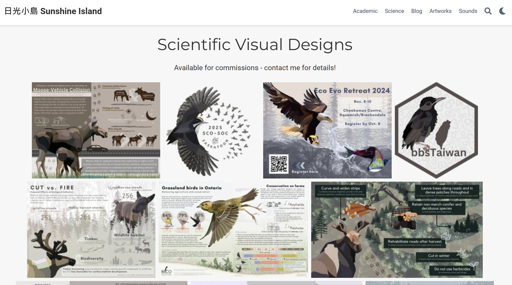

### # 感謝工作夥伴們 - 野生動物、鳥鳥、還有 Data Scientists

在聖誕節將近的這周，一連參加了三個不同工作的聚會 (今年真的接了很多工作)。UBC Wild-Co lab 去了超級熱鬧的 bar、rOpenSci Championship program 從世界各地一起 zoom call (我的早上六點吃早餐)，到 Birds Canada 在餐廳大聊鳥鳥，再相約隔天一起淋雨去 Christmas Bird Count。

每個團隊，都給了我像家的溫馨感和歸屬感。

UBC Wild-Co lab，一群擅長野外調查的女孩們(除了 Cole 是萬年長老)。兩年前剛到 lab 的時候，只有三隻小貓在辦公室互相取暖，一轉眼過就變成數十個人的龐大團體，一起 road trip 去參加會議、一起跳水、攀岩、一起在 lab meeting 忘記讀該讀的 paper，有人研究發表的時候就放煙火；有人被 reviewer 刁難的時候就一起取暖。

Cole 很溫馨的幫每個人都準備了 Award，我的 Award 是 "Who cooks for your Award" - 不僅代表我研究鳥類的特殊性，還有說我總是不吝於幫忙解惑 R 相關的難題，感動到快哭。沒想到一個意外的 adopted student，找到像家一樣的地方。

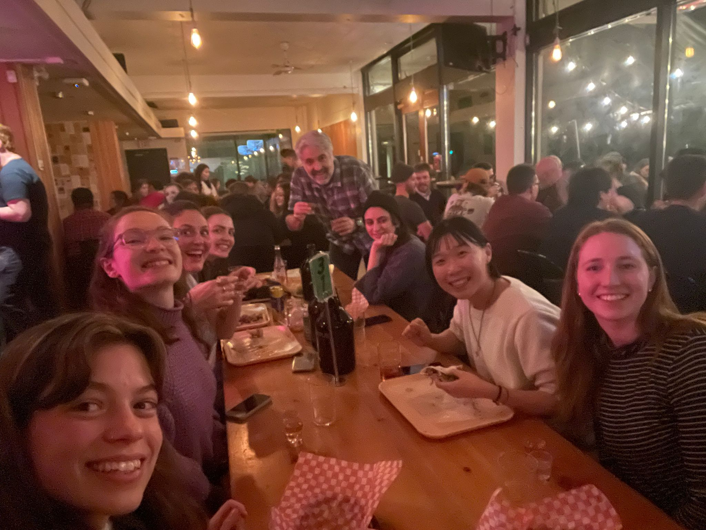

rOpenSci，年初時幸運的選上全球只有 10 個名額的 rOpenSci championship program，這群散落在世界各地的 data scientis 就此聯繫在一起，謝謝 Yanina 總是給我們這麼多自由發揮的空間、相信我們、並在我們需要的時候給予所有可能的資源。謝謝 Eunseop，大概使有史以來最有趣的 Mentor 了! 從來沒有每次到了 Mentor 的時光都這麼的開心，聊電影、聊人生、最後再聊怎麼寫 package。

到西雅圖參加 posit::conf 時親自見到了 Luis 和 Andrea，深深地被中南美洲人的熱情所吸引，開心地合作開心的工作再開心地享受。

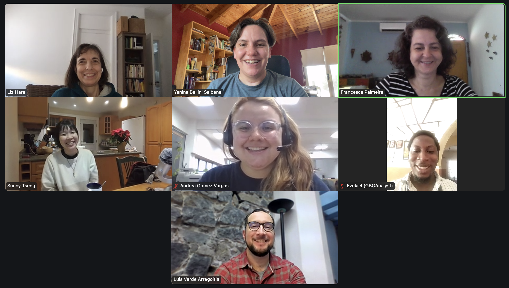

Birds Canada!! (掌聲加尖叫)，今年再度回歸 Birds Canada 團隊，主要擔任分析 ARU 資料的工作，從 2018 的緣分到現在，這群人還是一樣，講到鳥鳥、生態、ARU，每個人的眼睛都亮起來，有一群人可已在我說出 "BirdNET" 的時候有龐大反應的，大概就是這一群人了!! 還會為我開發的 ShinyApp 讚嘆有加 (快笑到哭)，最愛的 David、Catherine，還有新認識的法國男孩 Remi。

泰式料理超級好吃，炒麵加上芒果糯米甜點，但是都沒有人幫我分糯米甜點 (吃太飽)。

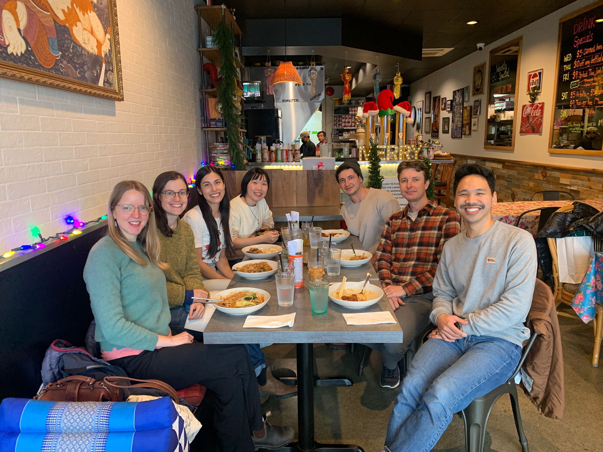

