### # 第四十六周 - 開學第三周 - 2025 Jan. 26

因為過年將近的緣故 (Jan 29)，這個周末都忙著工作，除了到 Kits point 附近走走之外並沒有出遠們，就是想要幫自己放個年假，所以要提早把工作做完。

這周一開始的大事記就是送貓貓回家了，周日有 Gintas 和 Mandy 在家裡做芋圓紅豆湯，當作是給貓貓 Kiki 的餞別宴會，同一天剛好 Ashley 回到溫哥華，非常難過竟然還有希望人家不要回來的想法。貓貓真的是太可愛了，舉手投足吃飯洗澡上廁所都有貓貓陪。周一貓貓被接走之後我就成為 Vorka 的忠實用戶了，實在是太想念有貓貓陪伴的生活。好想要自己來養一隻貓貓。今年從歐洲回來之後就來認真考慮!

這周是我的第三週工作，忙到爆炸，還是一樣論文、TA、BirdNET、還有立陶宛的研究，每個任務都不停地有小瑣事一直一直來，真的快爆炸。這周尤其是 TA，整個讓我焦慮到不行，幸好 Heather 和 Nicky 是超級大靠山，覺得快要崩潰的時候就趕緊找他們。

論文方面這周摸不著頭緒的收到了 journal 的來信，說 "I am preparing your manuscript for publication"，這真的太困惑了，我連文章被接受了都不知道阿，portal 上面也沒有更新阿。但是 journal 來的信沒有甚麼好反抗的反正人家要甚麼資訊就乖乖給就對了(笑)。

Gintas 在這周也是昏天暗地，加班加到不行，真的是非常辛苦的。是 Minecraft 的最後一周了。終於。

這周好冷，池塘都結冰了。

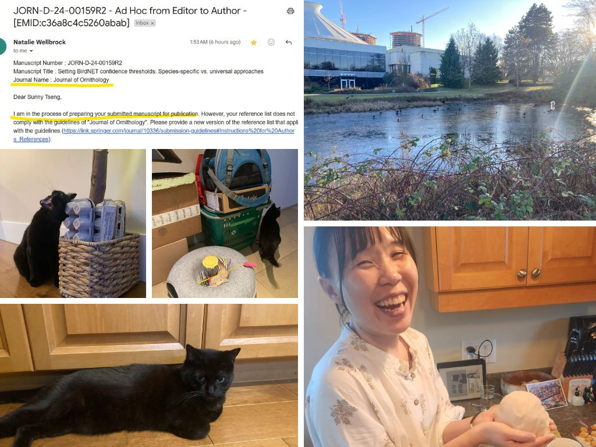

### # 第四十五周 - 貓貓最後一週 - 2025 Jan. 19

這週是 Kiki 待在家裡的最後一週，算是一半找藉口、一半真的想把握時間好好陪她，這星期我幾乎都在家工作，真的要不是 Kiki 我真的完全沒辦法待在家工作的。這週的工作量一樣很爆炸，一樣是有好多的待辦事項不能一下子就結束，很多事情卡在心上的感覺有點困擾。

週間去找了 Gintas 做伴，他戲稱我們是 Pajama date，我舒服地在他的沙發上看書，他則是認真地工作著。希望可以陪伴他度過這段辛苦的時間。Gintas 從去年的九月到現在就不停地加班，真的是太誇張了，五個月的加班耶，周間都要工作到至少八點，周六再繼續加班半天或整天。真的都不知道他怎麼撐過來的。原本公司說上週就是最後一周了，這周又延期讓他多工作一周，真的太辛苦了。加油啊剩下最後一點點就可以好好睡覺了。

有爺爺奶奶在真是太幸福了，一起拼圖，再加上周末一起去 Stanley Park 散步，好喜歡跟爺爺奶奶們一起。哥哥送來北方的信，Kiki 在家裡每天都很可愛、一直睡一直睡。周末有 Mandy 來一起煮芋園還有紅豆湯。成功的推掉不想要做的工作。

也太幸福了吧!

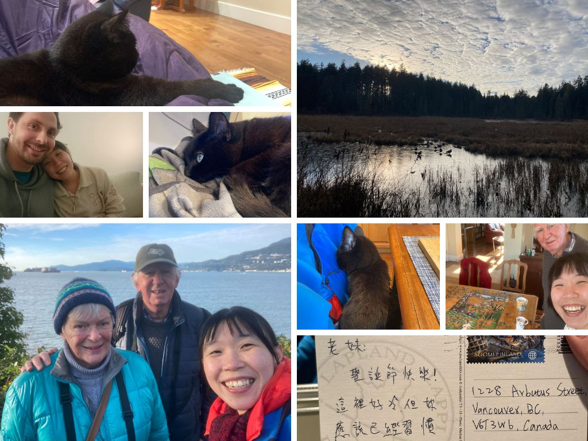

### # 第四十四周 - 開學爆炸週 - 2025 Jan. 12

上周的文章獻給狗狗，這週就是獻給貓貓 Kiki 了! (充滿黑色貓貓)

這周真的是無敵爆炸忙，真不知道為什麼一開學第一周就可以有這麼多 deadline，各種獎學金阿、申請書阿、還有要連絡很多人啊、又不知道到底有誰會回覆阿...這周在跟 Gintas 一起寫要寄給立陶宛那邊的信，邊查資料邊能感受到對於未知世界的期待愈好奇，國家公園、保育區、鳥類繫放站...

對於德國那邊也是，約了要見面，然後又在開始如火如荼的查詢怎麼樣可以租到好住的地方，還又開始和 Stefan 還有 Felix 聯絡。

總而言之就是一開始就忙到爆炸還一直忙到想哭，竟然連周末都要再繼續工作，第一周就忙到不行忙到很焦慮還晚上都睡不著。幸好還有貓貓陪。

### # 第四十三周 - 狗狗貓貓游泳滑雪日 - 2025 Jan. 5

這周的一週記事就獻給狗狗 Kibo 了! 從來沒有養過狗狗的我第一次幫朋友帶狗狗，經歷了...一直不停勸架。狗狗 Kibo 對貓貓 Kiki 有無限好奇，但 Kiki 對 Kibo 則是敬畏三分，這幾天真是辛苦 Kiki 了，一直住在床底下不敢出來，連廁所跟餐廳都搬到我房間解決。

Kibo 則是有了暢快的四天海邊度假，還獲得了第二條 crochet bandana (在這個家唯一的 house rule is being cute)。除了附近的 Dog beach 可以遇到超多狗狗好朋友，還有水池可以追鴨子跟烏鴉，想變臭臭狗還可以直接跳進池塘裡，當我要工作的時候可以做在後座欣賞風景、到 UBC 追松鼠，不僅有自己的食物可以吃，靈機一動還會去破壞 Kiki 的自動餵食器，獲得一周的貓食(飽)。趁所有人都不在的時候就霸占床上，要一起分沙發不夠位置的時候就把我推到地上 (我那幾天都鋪 camping mattress 睡地上)，真的在我們家住久可能會被寵壞，但真的是太難以抗拒的，滿滿的愛。

然後照慣例去了家前面的海邊 polar bear swim 啦 (超級無敵冷但超爽快)!

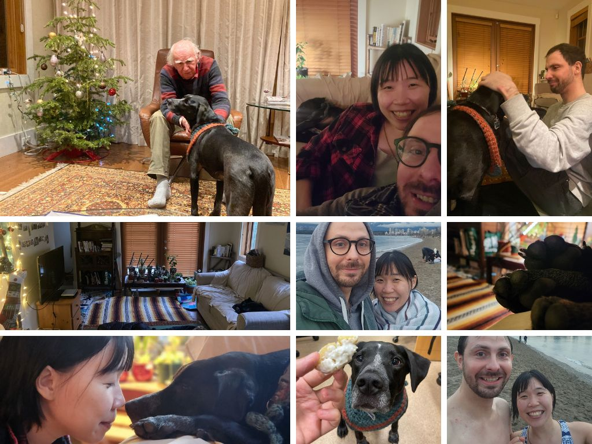

最後是許久不見的 Ski/Snowboard!! Gintas 穿 snowboard 的時候真的超帥!然後我一直很在意頭盔不是白色的(放錯重點)，前一晚沒睡好真的是會減低勇氣，下次要先做好功課然後勇敢去嘗試難度高一點的 run! (但好多年沒滑能記得這樣也是不錯了啦!!)

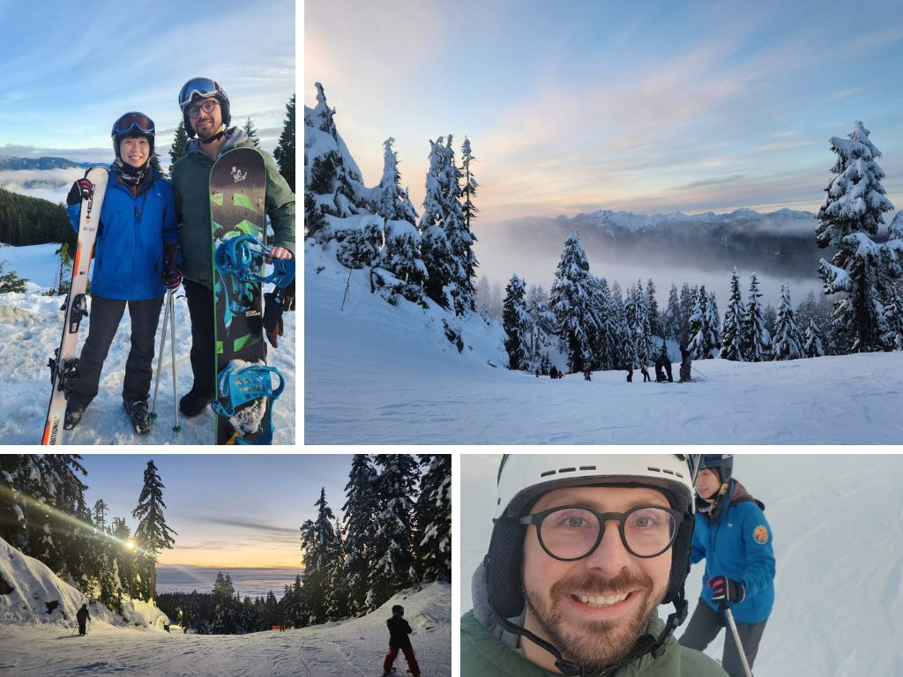

### # 第四十二周 - 聖誕大餐之快看不到貓貓日 - 2024 Dec. 29

兩個人煮飯煮到超餓，真的要開始吃聖誕大餐的時候就不餓啦!

"Do we forget to invite some friends?" 把備料一擺出來，發現我們準備的食物真的足夠餵食一桌人了，我們兩個人一隻貓也是吃得很飽很開心把冰箱都餵飽飽的。這真的是我第一次體驗到過聖誕節過得像台灣的農曆新年一樣，每天都有剩菜但每天都要煮新的料理然後每天都吃飽飽。

這次的聖誕夜，我準備了火鍋 (大餐標配)，Gintas 則是做了立陶宛的傳統料理 Balta mišrainė (白沙拉) 還有 grybais idaryti kiausiniai (菇菇魔鬼蛋)，貓貓 Kiki 則有新的貓食口味做聖誕晚餐。

"For what it was, it is pretty good!" - Gintas 對我的聖誕樹創意也是讚嘆有加。

### # 第四十一周 - 年尾與冬至湯圓 - 2024 Dec. 22

今年的工作最後一周，辦公室和預期的一樣安靜，大家紛紛在上個周末或是這周飛回家過聖誕節，隨著在加拿大的日子越來越多，越來越覺得聖誕節有像台灣的過年，大城市都安安靜靜的。但不得不說，在這周工作真的有很爽快的感覺，整個辦公室都是我的。

Zoe 超貼心的準備了 Sourdough 來分享，我則是回送了一杯咖啡，我們兩個就這樣相依為命的在辦公室，真的是非常的溫馨。最後兩天真的工作不下去了就跑去餐廳吃湯麵，真的太幸福啦!

周末是冬至，沒想到這麼快就過了今年黑夜最長的一天，冬天也過了一半了，冬天上半場還是有難熬的冬季時刻，但整體來說其實還不錯! Mandy 一起來家裡吃了超高級的日式甜點還有茶點，天啊太溫馨的最後一周!

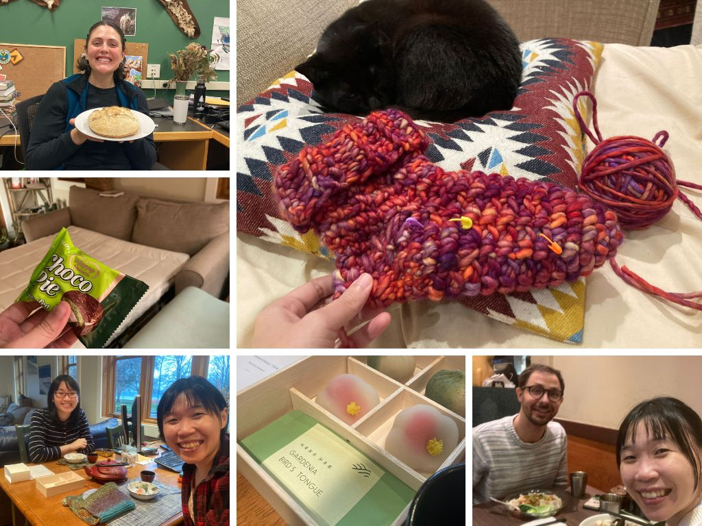

### # 第四十周 - 黑貓包子日 - 2024 Dec. 15

這周一樣有可愛的貓貓陪伴著，一點也不孤單，還有 Tita 需要臨時救援所以還闖進人家家裡餵了貓貓，真的有不少跟貓貓一起的緣分啊! Kiki 目前進入早上狂睡晚上 party 的節奏。

這周一樣是一段賞鳥一段出門約會，Christmas Bird Count 還是一樣溫馨感人而且跟 Sara 一起也太令人安心。Remi 則是有點超乎我的談話極限，但一樣是個賞鳥好夥伴。和 Gintas 一起去了 Stanley Park 看燈會，砰隆隆的心情，沒有甚麼太大的激盪，但就是這樣兩個人慢慢地走。

後來一起去他心心念念很久的包子店，好啦是真的還不錯吃啦 (特別是那個椒麻餛飩!)，但是價位也太高了吧! 不過我應該是在慶祝的時候還是會想再去吃的，阿不行，目前的最愛還是烏克蘭餐聽，那個熱湯跟鮮奶油水餃真的無法抵擋。

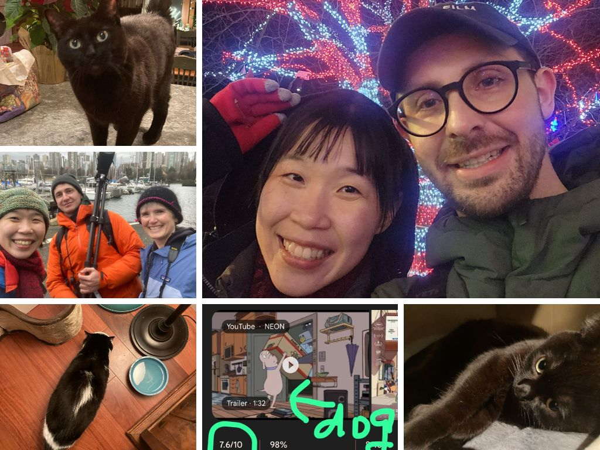

### # 第三十九周 - 聖誕市集日 - 2024 Dec. 8

週六因為 Gintas 太累了所以我們約好周日一起好好的陪彼此。去了北溫的小森林散步，他教我怎麼踩 snow berry，真的是有戳到我的痛快之處(超愛)，一路上都是北溫再夢幻不過的山水景色，我們看到飄在水上的房子，都說之後真的可以住在這裡!

後來去了聖誕市集巧遇 Gintas 的同事 Connor，在 Disney 工作的動畫師，發現是個來自南非的帥氣男孩! 一直在 Christmas market 裡面找酒(笑)。北溫的聖誕市集真的超級推! 我們後來吃了 Borscht、Hazel nuts, Glühwein、Potato pancake、Maple bacon pancake。幸福到人暖心也暖。(只是我一杯酒下肚就直接昏倒，真的有兩天後才解酒的感覺)

最後就是這周無限的 reviewer 修改周!!整個很地獄，連續好幾天窩在圖書館才寫完，真的是...幸好還有可愛的貓貓陪，狗狗應該要是下周的事情了但是不小心放一下沒關係。

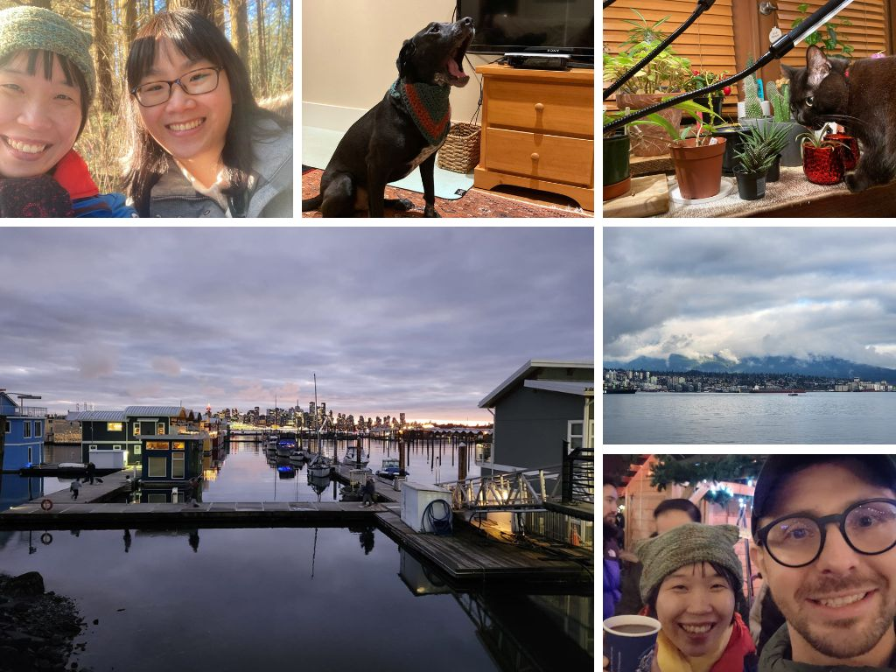

### # 第三十八周 - 新貓貓 IKEA 日 - 2024 Dec. 1

轉眼間就十二月了啊!之前一周年的時候都沒有好好慶祝，但其實我跟 Gintas 都不太清楚我們要怎麼算哪一天開始 dating 的。

終於到了周末有好好陪伴彼此的時間了，煮了從來沒有看過的 Spagatti Squash，超級無敵新奇的!而後就是一起晚餐聊天，然後我們花了很多時間討論 BirdNote 的 logo 設計，玩 inkscape 玩了超久，兩個人對於設計的概念和想法碰撞的火花，最後的成果版本做出跟一開始完全不一樣的東西 (還在交稿前最後十分鐘大改)，再幸福不過的陪伴就是這樣了，

這周去了 IKEA，因為 Gintas 要買一張 coffee table，用來搭配他新買的沙發，但就是有人完全不解風情阿不懂為何我要一直對於 IKEA 鯊鯊這麼著迷(算了)，然後也是花了超久時間站在倉庫討論，到底要圓的桌子呢還是方的，最後是圓形勝出!

忘了提到這周還認識了新貓貓!!黑貓 kiki!

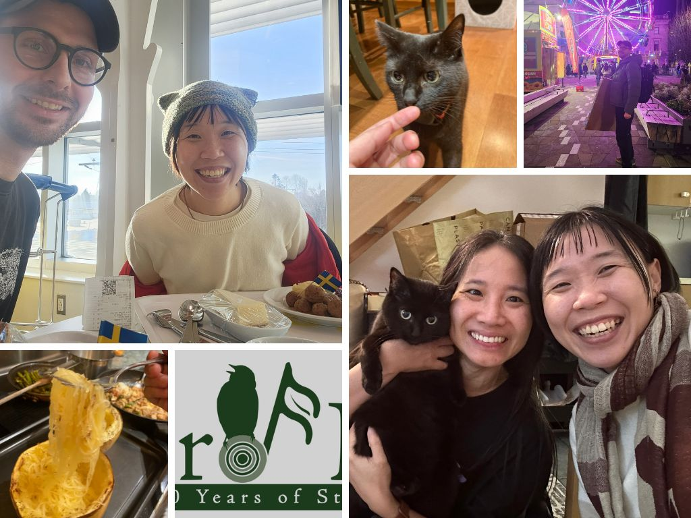

### # 第三十七周 - 好好安靜日 - 2024 Nov. 24

發現這個日記寫了三十七週了耶，一個小寶寶若是在第一週生成，這樣的時間裡都可以從胚胎長成一個可以哭鬧的生命體了。是很長的一段時間。

這週算是平靜的，過了第一週的情緒風暴之後這週其實不太會想 Gintas，也沒有甚麼想要傳訊息給他的衝動，但還蠻有趣的是，我如果偶爾想到他竟然是會生氣的，想分享事情的時候就會想反正他也不懂；想要去某個活動的時候就會想反正他也沒興趣；想要分享電視劇的時候就會想反正他也不會看。反正就是各種覺得他都不好，就自己一直想一直超生氣(笑)。真的很有趣耶，所以他就是甚麼都沒做但就被我很生氣，而這種生氣就跟之前幾周的大吵小吵的生氣一樣，所以，根本就不用發生甚麼事情我就會對他超生氣了阿(發現新大陸)。

週末見到 Gintas 就整個融化了，他還是好好的，看起來傻傻的。給人很真誠很溫暖很努力又小心的不想碰到我的情緒。特地選了亞洲料理的餐廳、特地說要先來我們家一起走過去、特地準備食物。我這邊倒是蠻難過的，其實我也還沒完全釐清那是甚麼情緒或是甚麼原因，反正就是不知道要怎麼相處...很想要對他好，但又很怕被拒絕被冷漠或是對方沒有時間，每每聽到他說要工作或是在忙自己的 Project，就會整個很受傷，好像是針對我一般，是嗎...是這樣嗎...有沒有辦法讓我自己好一點呢?

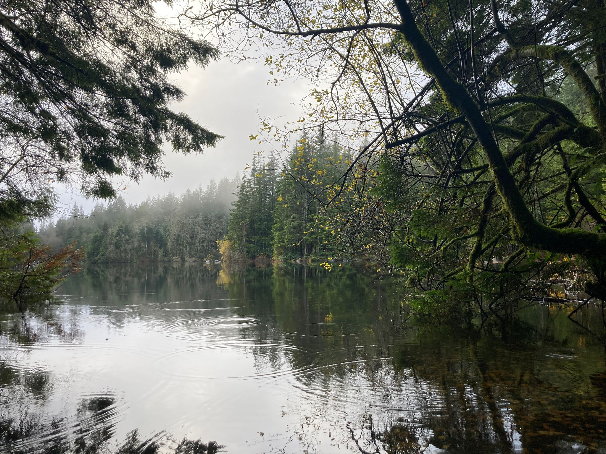

### # 第三十六周 - 自己一個人周 - 2024 Nov. 17

說是自己一個人，卻是有朋友家人，更重要的是還有貓貓陪的一周。

這十七天來跟 Tita 成為室友，她總是留守在家，不是睡覺就是看窗外要不就是偶爾興奮地追逐玩具，一開始總是待在床下，每每靠近都會對我哈氣，現在已經可以安然的睡在沙發上，看著我工作。最讓人感動的是可以互動的時間，不論是在餵她吃飯的時候，汪汪叫要我摸她的時候、或是每天回家都有人會來門口迎接的時候。看著 Tita 對我的戒心越來越小，還有在這個家住得愈來越舒適、越來越有自信，我也會覺得開心。

昨天 Alesey 和 Athena 來把 Tita 接走的時候我也是難過了一陣，好像空間裡少了一點溫度，但 Tita 是該要回家的，那裏才是她的家，這裡只是個短暫的旅館她只是剛剛好今天來到這裡把她的愛分享給這個自己一個人住的女生。

想到那天跟 Jose 聊天真的很好笑，他說貓咪們根本就是人生哲學達人，「阿，今天換主人了嗎，沒關係，貓生這麼短暫，沒有時間好難過的，我們要在新的環境也適應的舒適。」我爆笑，真的是很棒的哲學耶，隨遇而安。

所以呢 (又要來心理學剖析)，真心的愛一個人，不是要把他放在身邊，而是能夠幫助對方成長。

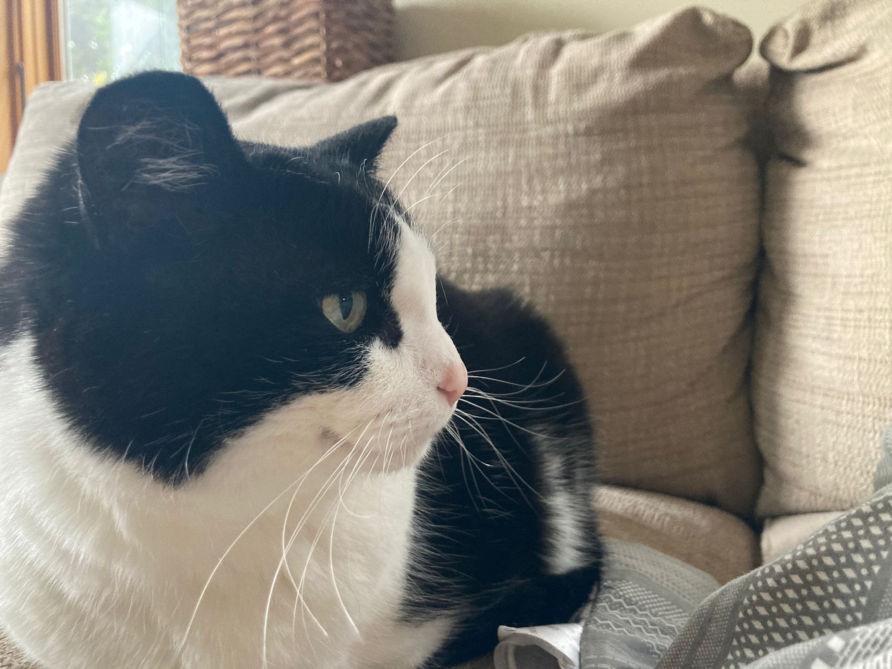

### # 第三十五周 - 只剩貓貓陪周 - 2024 Nov. 10

其實是個難過的一周。

小小的事情好像就可以讓我們兩個之間爆炸，兩個人見到面之後卻總是可以好好的說話好好的和好。但就是這樣一直不斷的循環，讓兩個人都好像精疲力竭一般。我是，Gintas 也是，特別是在我們兩個的事業都還在初始的狀態，似乎有許多精力都花在工作上了，比較少有能力去好好控管我們的感情。

覺得實在是不行，我們兩個約好了給彼此兩周的時間，去好好思考我們接下來該怎麼做，如果想要兩個人繼續在一起，會需要怎麼樣的相處方式讓彼此好過一些；如果不想在一起了，也趁這段時間好好思考一下釐清自己在感情上的需求和期待是甚麼。

這是在認識 Gintas 之後，第一次有超過一天以上的時間沒有傳訊息給他，從我們好好地擁抱，他送我離開門口後，也快要三天了，阿，竟然才快要三天嗎，怎麼覺得好像過了一周這樣的久。我很想念他。

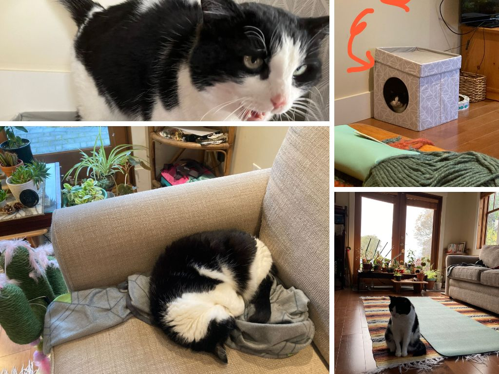

### # 第三十四周 - 烘焙周 - 2024 Nov. 3

一樣是吵吵鬧鬧的周間，很好玩的周末。

發現自己在自己的情緒都顧不好的時候，很難去對另一個人產生同理心，然後就會變成兩個很難溝通的靈魂，兩個人都覺得自己不能被理解，覺得個狀況很讓人緊張。

真的好需要練習，要怎麼樣能夠讓自己的需求獲得滿足，然後同時也要學會給予愛，把自己的關懷放在外面，一個需要打開自己同時也需要聆聽，要說也要聽的平衡。

這周我做了人生第一個蜂蜜蛋糕(大成功)；Gintas 則是做了媽媽很擅長的 Cottage Cheese 肉桂捲，真的超級好吃!! 好久沒有吃到這麼好吃的甜食了。Gintas 因為從小對很多食物都過敏，所以對於糕點烘焙之類的品項特別的著迷。

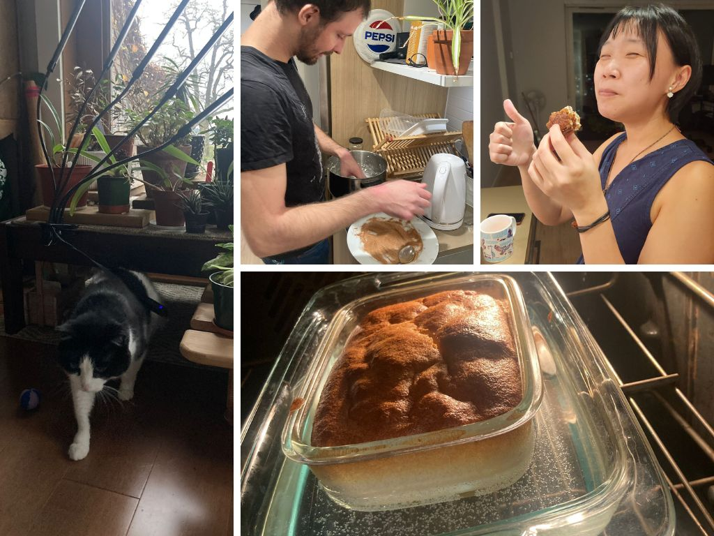

### # 第三十三周 - 南瓜周 - 2024 Oct. 27

有幸再一起度過了一個周末。

和 Gintas 的關係還是一樣起起伏伏的，偶爾會覺得這段關係實在是維持不下去了(通常是一連著好幾天都沒有辦法講到話或是見到面，然後討論過的問題遲滯不前時)，時常在相處的時候又覺得無比的貼近和溫暖(通常是可以見到面好好說出彼此的地雷的時候)。在吃飯的時候我們把兩個人還能夠開心地在一起當成慶祝的原因。

剛回來滿三周了，其實我們的 pattern 還蠻穩定的，真正能夠溝通成長的都是要等周末 Gintas 終於沒有要加班的時候，我們本來就是需要長時間溝通相處認識的兩個人(很多文化成長背景還有生活習慣的不同)，剛好遇到他每天都工作 12 小時，不定期的周六加班，對這樣的狀況不是很有幫助。我們都很努力。

但能夠看到忙碌中的 Gintas 也是另一種認識。

至於我的話，覺得自己還是可以多練習放多點專注在自己身上，多練習肯定自己一些，偶爾想要放鬆在傍晚的時間看看電腦、看看電視劇也沒有關係，多看看自己已經完成的事情，在季節的轉換加上身體不適本來就會比較累，多允許自己休息也沒有關係。但是不要因為這樣所以遷就到周遭的人們。

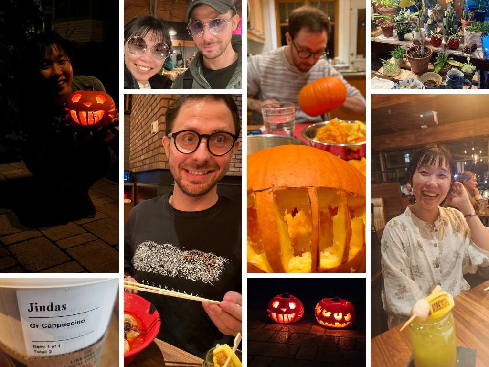

### # 第三十二周 - 水餃八十大壽周 - 2024 Oct. 20 

先說，是個再幸福不過的週末了。

因為時常不能見面的緣故，只有周末才能夠好好地坐下談談，每一次兩個人在沙發上，都能夠好好地說、好好地聽，真的是好重要。Gintas 說常常想著未來，想著該怎麼走才能繼續往前進。他說他的理想關係並不存在，因為那些都是他的理想，如果他只是自己一個人在空想的話，並不會達成。我也想好好分享，但有時候的我也會很害怕他到底是有沒有心。他有，兩個人都要練習相信。

這周跟 Mandy 一起包水餃，下午在直接到樓上參加 Derek 爺爺的八十大壽，好不開心。我們聊了小時候的鉛筆盒回憶，Gintas 出門買了雲吞皮回來，Peter 的鞋子在離開 party 的時候竟然不見了。

太好笑。

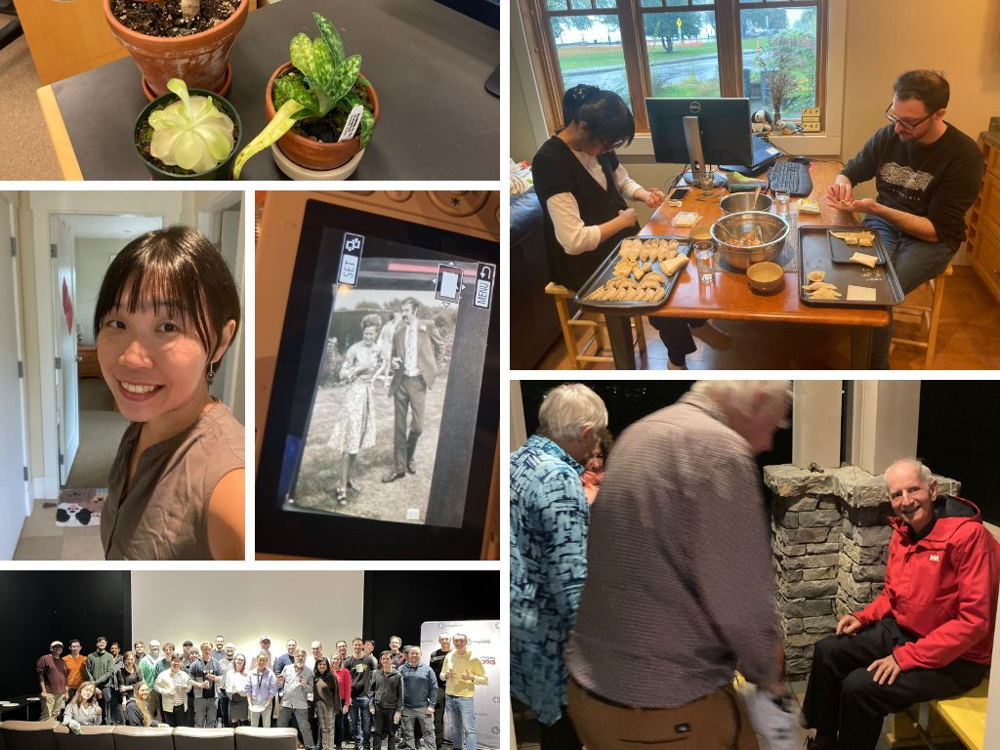

### # 第三十一周 - 南瓜泳池跳水周 - 2024 Oct. 13 

有史以來最好玩的 UBC 泳池日!

周間一起去了一間很好吃的烏克蘭餐廳，Gintas 大推甜菜根熱湯，是配牛肉的，同時點了蘑菇水餃、高麗菜捲、跟陶壺燉羊肉。超級好吃!! 

Gintas 煮過甜菜根湯但當時是煮冷的，對我這個亞洲胃真的是怎麼吃都吃不習慣，這次的熱湯就一整個打中我的胃口，服務生上菜的時候還附上一張小卡教我們怎麼吃，先用蒜頭沾鹽巴，咬一小口之後吃一口黑麥麵包，再大口的喝湯，甜甜綿綿的再配上軟嫩的牛肉，很少吃到這麼對胃口的燉湯。

一樣好吃的是水餃!裡面包了馬鈴薯和蘑菇，底下襯著 Sour Cream 還有上面的紅蔥頭，超級好吃再一次。

還有很巧妙被遇到的極光!還有在 UBC 泳池玩到的南瓜跳板吊繩遊戲池還有水上城堡!之後再來一個熱量滿滿的冰淇淋。完美。

### # 第三十周 - 最後的颱風周 - 2024 Oct. 6 

這週的一開始就一直跟媽媽說，早知道就晚一天回台北了 QAQ 舅媽跟小舅舅都在問我說要不要多待一天，在高雄玩好玩滿之後再回台北，但颱風看起來來勢洶洶，實在是不好意思再多花時間跟台鐵在賭他們會不會停駛(可見台灣人心態)。

總而言之，過去的三週每天都有任務的通過之後，這週就是好好跟家人相處的一週啦，週一到周四不是放颱風假就是在欣賞風雨中度過，和爸媽到灣潭走了一個颱風天前的步道，在大河旁邊，颱風前的風吹得特別過癮。

不論是在家工作(趕工 SCO 的 logo)、跟鳥鳥玩、動不動就去找媽媽、一直吵架但是又一直很好笑的我們，有時候就會覺得，這樣的時間也真的很幸福，有鳥鳥好幸福啊(但鳥鳥一直在我的筆電上大便)。

這周的時間感有點錯亂，因為颱風的緣故全部都混在一起了，搭火車回家之後，阿姨在周末來訪，一起去海會寺拜拜做第三個七，然後再去家裡完小孩，跟璐璐成為最佳拍檔，跑來跑去還有不停排彩虹圈圈，阿姨還誤會了我是個很有耐心的人!

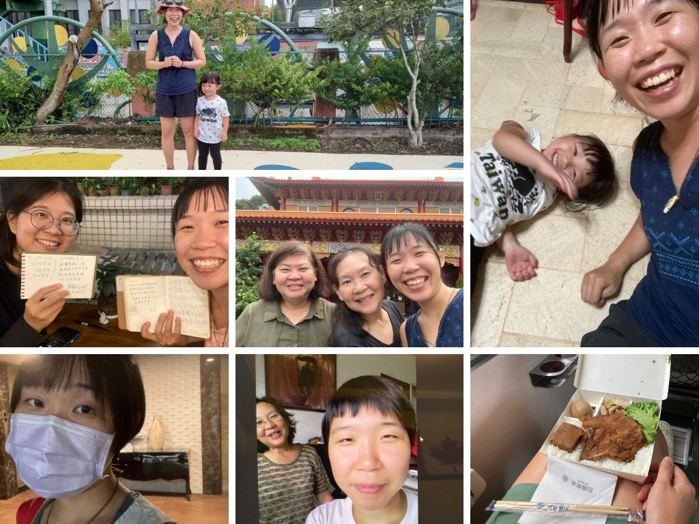

### # 第二十九周 - 工作坊鳥鳥周 - 2024 Sep. 29

這個是將近一個月之後的 catch up 啦!該忘記的細節都差不多忘了。

參加完哥哥婚禮之後的一周，剛好就是要講工作坊的一週，特別的緊張跟不知所措!哈哈就跟所有以往的經驗一般，每次講之前都會超級緊張，連續好多天的咖啡廳工作，想要做 120 分的準備，每次就會有 100 分的表現!都會有傳到橋頭自然很直的感覺(!?)

週二先下到雲林石龜(在斗南附近的不知名小鎮)，整個小鎮竟然要走到便利商店要 10 分鐘，而且只有萊爾富，太驚人了，本來都一直跟各地好友宣稱台灣是個便利商店 2 分鐘的地方。

然後隔天就見到小柯、紅冠、還有好久不見的若詩老師啦!還有站上舞台的親切感，再次覺得能站上舞台好好享受，就已經是整個演講最成功的地方!

然後到嘉義匡家住了兩天，再回到台南，跟紅鳩臨時約了吃火鍋之後再被載到高雄，隔天去拜拜，臨時約了學長姐，隔天再去找草鴞。

滿滿的回憶的一週。

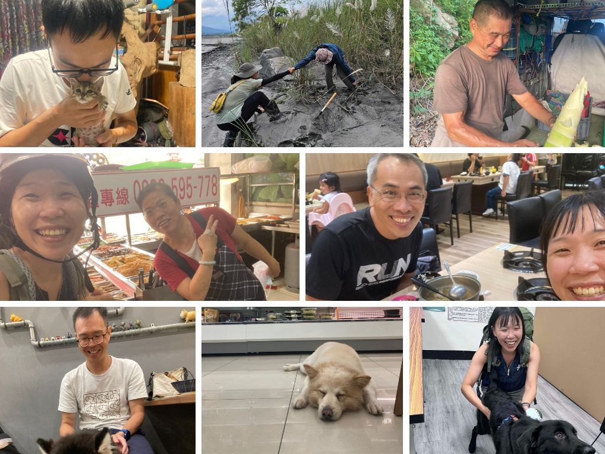

### # 第二十八周 - 哥哥婚禮周 - 2024 Sep. 22

忙完外婆告別式的下周末，緊接著哥哥的婚禮。這周的狀態其實蠻好的。

週二從屏東陪著爸媽北上，一路上還在生爸爸的氣，沒有甚麼講話。

週三跟媽媽去寶雅採買，回程順道去了瑞芳，幫媽媽修漂亮的鞋子，還在主要的菜市場買到了內衣，當初哥哥登記結婚的地方，媽媽說要買甚麼都可以，她會出錢，整個非常的慷慨。結果那天早上神秘的拉肚子，還以為是生理期來，但真的不知道是吃了甚麼，也許只是水土不服。趕工畫了 ECOEVO 設計初稿，交稿，傍晚跟媽媽練習了化妝，大失敗，整個像是要去唱歌仔戲。

週四一早幫自己化了妝，出門看婦產科，做了有點害怕的陰道超音波跟子宮頸抹片檢查，剛好傍晚在聽烏烏陪你聊的時候，他們也建議每年至少做一次陰道超音波跟抹片檢查。醫生還是超級溫柔，真的是從以前看到現在，算是找到了自己很喜歡的醫生，而且我怎麼以前都不記得人家長這麼帥氣。不過健保還是沒有準時復保，讓我付了好多錢。

週五開始準備工作坊，早上先跟媽媽去七堵逛街，買了鍋鏟，跟一些毫無相關的產品，把我放在基隆後就跑到一間臨時找的咖啡廳坐著準備工作坊，結果吃了一個超好吃的抹茶蛋糕，整晚睡不著。

週六待在家裡，整個情緒很不穩定，一直跟媽媽吵架，因為看電視的事情。這兩天都有去健身房跑步，有跑步的時候情緒就會安穩許多，邊跑邊聽了 Maybe You Should Talk To Someone。聽完了，很多時刻，我們在乎的是那個當下的經驗，一個人與人面對面能量流動的經驗。

週日，哥哥很帥氣的日子，跟姿吟美美的一起收禮金。最喜歡有人可以一起度過美好日子的經驗與分享。

狗才上班是要送給 Gintas 的。

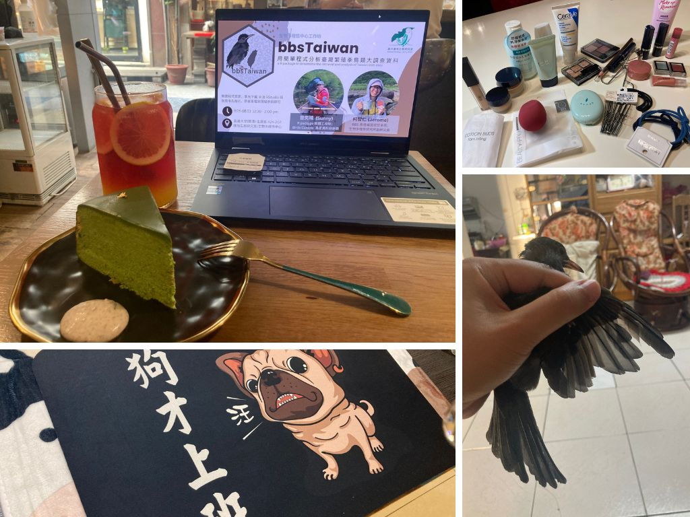

### # 第二十七周 - 外婆日 - 2024 Sep. 15

匆匆忙忙的，周一傍晚得知外婆過世的消息之後，利馬改了機票，周五傍晚直奔台灣。

每次都是這樣，出門前的前幾天都會爆炸性的忙碌，因為同時接了很多工作的緣故(論文、兼差畫圖、兼差分析資料、TA、還有未來的歐洲行程)，所以安排時間起來特別的混亂。Gintas 的工作也剛好是在一個非常混亂的行程中，我們還是在忙亂的行程裡找到了一些時間溝通。有溝通的時候就會好很多。

每次溝通的主要原因，似乎都是我感覺不到他的在乎或關心，但是他總是會用一種，"該怎麼辦呢"的眼神看著我，看到這個眼神的時候，又瞬間覺得被療癒了。其實我們的相處很不簡單，文化和語言上的差異本來就需要更多時間去調適跟溝通，剛剛好又遇到彼此都很忙碌的時候，就會覺得緊張，是不是沒有辦法繼續有前進的感覺了呢。

回到台灣的時間又好很多，因為雙方都很忙碌，連生氣的時間都少了XD 但偶爾又會很想念有人陪伴在身邊的感覺，不用多說甚麼，你知道有人很關心你。

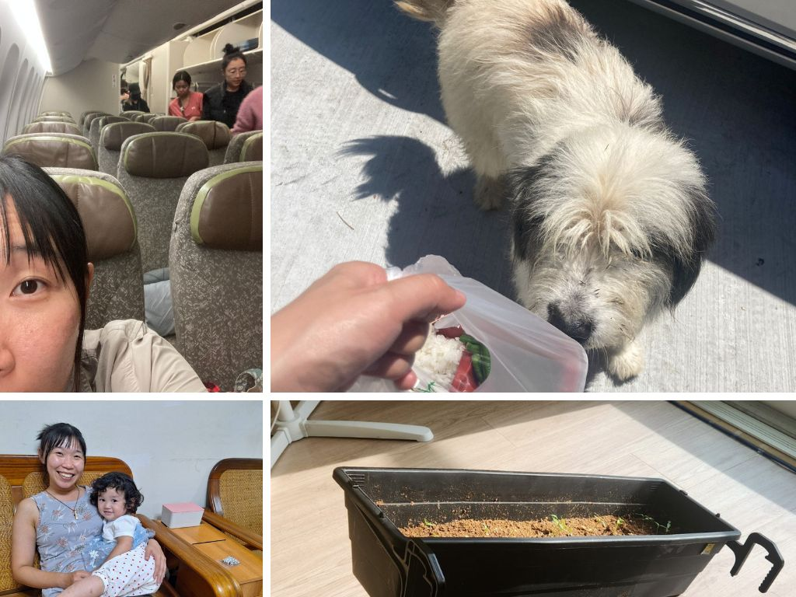

### # 第二十六周 - 愛自己日 - 2024 Sep. 8

這週五去找 Matt 聊聊，因為正在讀 "Maybe you should talk to someone." 所以對於我們的對話內容以及舉動特別的注意，他說 "I am worried about you."。我有點驚訝，竟然會被 Matt 擔心嗎? 他說整個小時的對話裡面，我大多的時間都關注在 Gintas 在想甚麼、Gintas 的感受是甚麼、Gintas 會怎麼應對和他是否感到舒適。

What about you Sunny? How do you feel? You should take more care of yourself. 

他說，要有能力去想像沒有另一方的生活，要有能力去想像自己的生活就算沒有對方，儘管難過，但還是可以過。當對於失去一個東西太過於恐懼時，反而會容易在其中受到傷害。他舉了鑽石和水的例子，Let Gintas be the dimond, instead of water. He is wanted, but not needed. 

Wanted, but not needed. 

很多時候其實都是，要自己買小鐵魚的時候、要自己去爬山的時候、要自己去看鳥的時候、正在學立陶宛語的時候。第一個是，其實自己不用對方就可以完成很多事情，現在的我也相信就我的經濟、社交、以及情緒穩定上，就算沒有對方也可以生活；接下來要練習的就是，當感受到對方沒有滿足自己的需求的時候，是不是能夠有勇氣去討論，還有想像分開的可能。要能有這樣的能力去想，如果待在這段關係裡不會比自己過還要開心的話，那麼把自己綁在關係裡就不必要，在適當的努力及磨合發現沒有辦法後，也要了解不是誰不好，就真的剛剛好對不到彼此的需求。

雖然這樣說，但一起爬山真的還蠻好玩的。

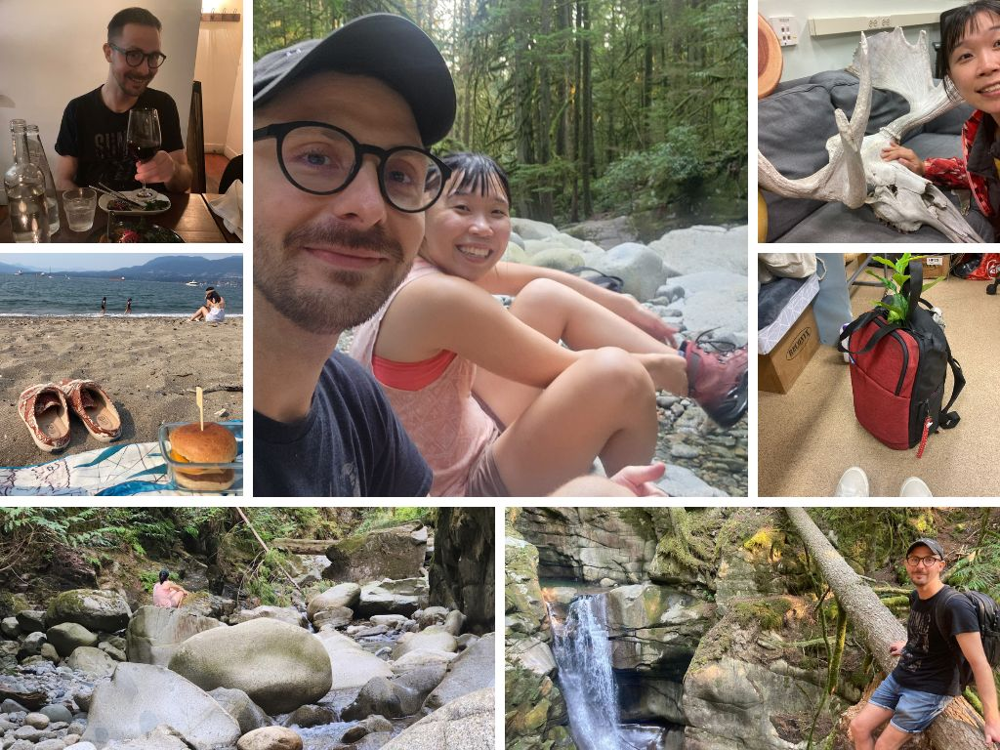

### # 第二十五周 - 眼淚日 - 2024 Sep. 1

Gintas 曾經說過，真正勇敢的人不是不會害怕，而是在很害怕的狀態下還是願意嘗試那件讓她害怕的事情。

在 Mt. Baker 營地旁的湖邊，在要跳下水之前，他說我很勇敢，因為我看起來怕東怕西的甚麼都很擔心，卻嘗試了很多人不敢去觸碰的經驗。如果對於感情也能這樣勇敢就好了。這周 Gintas 開始忙碌，開始會因為要去聚會還有跟朋友見面而把我們的見面延期，甚至是很久才會傳來一封訊息之類的。心如刀割。

太熟悉的場景了，會不會他就像過去的那些人一樣，不過就是個只為自己著想而想要毫無改變的享受有人在身邊的感覺；會不會他就只是個自私的人完全都不會想要改變；會不會...

眼淚嘩啦啦地掉。

### # 第二十四周 - 貓頭鷹日 - 2024 Aug. 25

週日的下午一起去騎車，兩個人都想要嘗試新的路線，最後妥協了前往 Mountain Pleasent 然後到 Queen Elizibeth Park，進入公園後不久，就聽到近處有橫斑林鴞的叫聲，而且還是一對!近距離的觀察貓貓很過癮。

Gintas 種的小酪梨發芽了，我的 rOpenSci 標章成形。

這幾周其實我們兩個都過得不是很好，每周都會因為各式各樣的原因兩個人很難過，週六，他來找我的時候我們直接兩個人抱著哭，到底怎麼了。真的會心很累，光是翻翻過去的筆記就發現每周真的都會有難過的時刻發生。很心碎的，我到現在都還沒能理出頭緒。

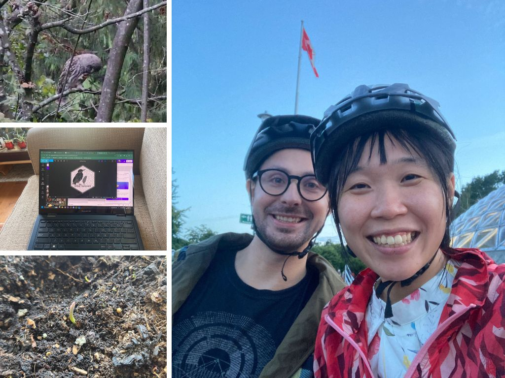

### # 第二十三周 - 游泳男孩日 - 2024 Aug.18

終於來到夏日環遊世界會議之旅的最終站，西雅圖，還有西雅圖結束之後和 Gintas 的露營小旅行! 每次安排要出去露營都像是要安排出國一樣複雜，要租車阿、安排日期、看好交通、準備裝備食物阿等等，每次到後來都覺得其實不用這麼擔心，能一起開開心心的玩，比甚麼都重要。

這次住了兩個營地，第一個叫做 Bay's View (住一晚)，另一個是 Silver Fir (住兩晚)，好巧不巧兩個營地都靠河邊! Gintas 樂歪了，森林裡的湖根本就是他的天堂，他說他的小時候幾乎一整天都泡在湖裡游泳，跳水阿潛水阿，甚至還會跟朋友比賽憋氣，能玩的他都玩過了，這次他看到營地旁邊的 swing 整個豪不猶豫的一躍而下，是有沒有這麼勇敢!

然後我在那邊哀號半天，最後還是跳下去了!!整個超清爽刺激心跳加快!

後來幾天的行程都和水有關，第二天 hiking 結束之後我們兩個都熱到受不了，直接在營地洗澡然後跳進河裡，超級冷，這些都是冰河直接融化留下的水阿。連能好好刷牙洗臉有蓬鬆的頭髮都可以讓我們開心到不行。還有簡單的吊床和帳棚、奢池的牛排與咖哩還有 burrito。

帳篷的部分，三天都是溫暖舒適的溫度，就連把帳篷打開來睡都不是問題，最後一天被大雷雨淋的徹底，整個非常的爽快。我在半夜拿起錄音機錄了一些雷聲，還有爽朗到不行的大滴雨水，Gintas 在身旁沉沉的睡著，很幸福的溫度。

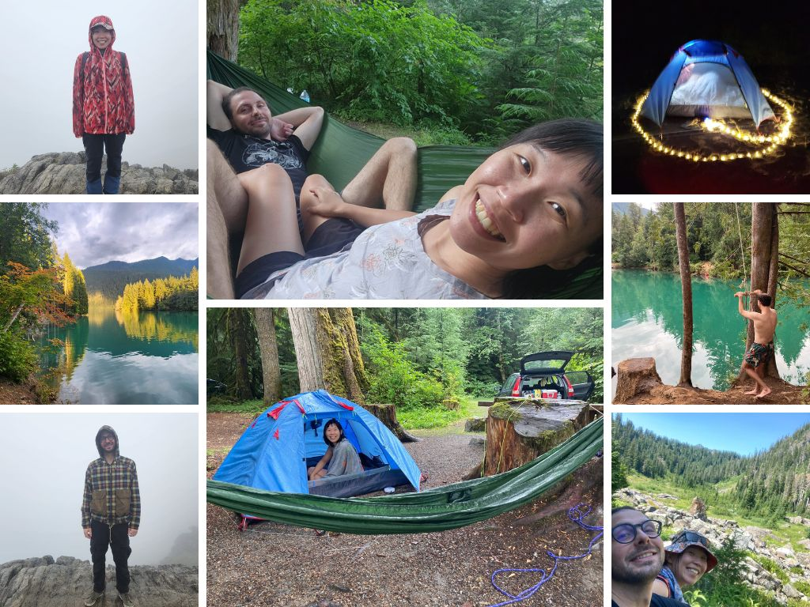

### # 第二十二周 - 不說話日 - 2024 Aug.11

除了周末的粉紅湯之外，這周的我們一起做了很多好玩的事情，像是一起騎單車繞 False Creek 一圈，利用機智在都市的樹林裡找到架設吊床的地方；在周三下班後去 Second beach 的戶外泳池，加上好吃的西瓜跟好玩的滑水梯(然後在水裡跳來跳去的)；周末第一次載 Gintas 去採買露營食物，回到家煮了粉紅湯好好想念家園。

當天早上還有一個獲得到德國當 Visiting Scholar 的機會，整個興奮到不行。

然後我們就不說話了。到底是怎麼了，明明就親眼看到 Gintas 這麼努力且改變了這麼多，開始學會計畫、會主動打電話、主動傳訊息、配合我的時間早睡早起、主動說要煮飯、還在身心疲憊的工作之後總是打起精神聽我的一天。

但我總是有辦法找到他還做不夠的地方，好像只要有一點點不如意，就會觸發到某條"警示神經"，告訴我必須要教導眼前的這個人，不夠貼心、不懂照顧自己、為什麼要吃餅乾。但這永遠不會有結束的一天，因為這是基於非常強烈的控制感。能不能心平氣和地接受愛，是我的課題，不是他的。

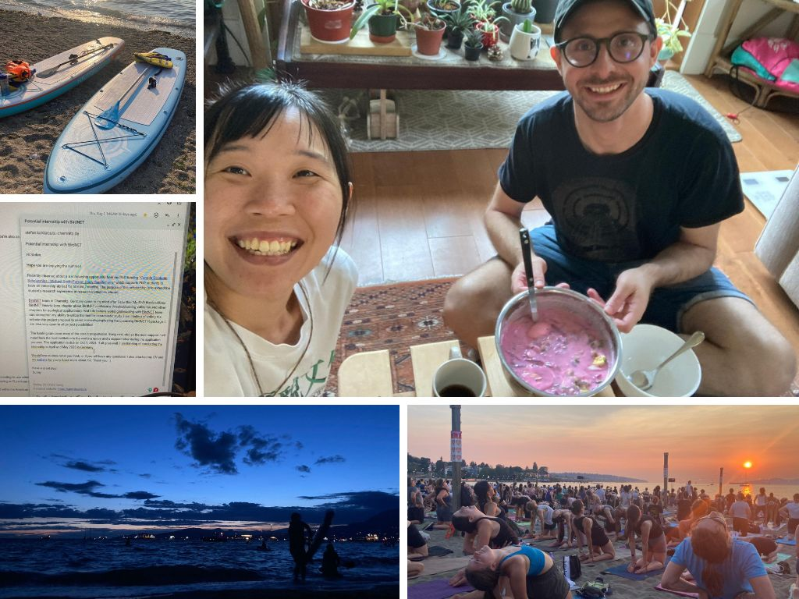

### # 第二十一周 - 抹茶會議日 - 2024 Aug.4

一樣又是飛來飛去的一周，出門時的焦躁不安有 Gintas 在，旅程中還是不免有混亂的情緒，甚至跟 Gintas 要了一天安靜的時間，他也是人好好的，說沒問題，結果沒想到我一天就康復了話說不停(笑)。

SCO 會議有多好玩就留給專屬的篇章寫，這裡紀錄一下 Gintas 的好，一回到溫哥華就看到機場中的野生 Gintas (泣)，除了陪我好好安頓之外還一直陪我找奧運，難得的假日就去 Downtown 的日本夏日祭典，最好玩的是巧遇的一場 Tea ceremony，拉著他到處跑說甚麼就是要進去看看，最後還一起坐在榻榻米上喝了超級好喝的抹茶(跟甜甜的好吃餅乾)。

學到的喝茶哲理是，專注於當下，專注於眼前的客人與眼前的茶，外面的世界暫時放在外面。好喜歡在專業場合中發光，然後回家又可以自在地做自己，有個好夥伴一起分享生活。

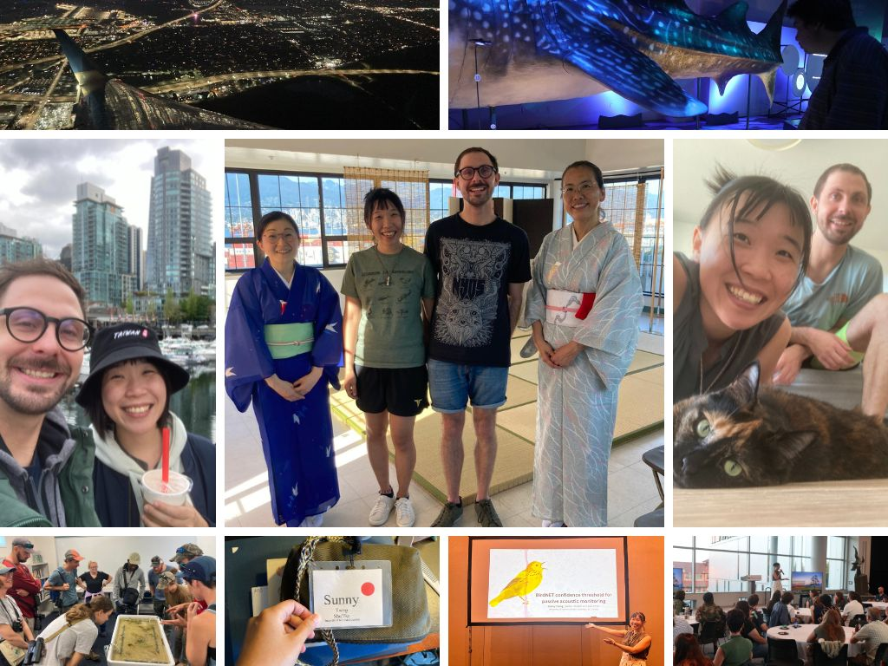

### # 第二十周 - 生理期 Peoria 日 - 2024 Jul.28

這周最值得紀錄的大概是第一次體驗到生理期前的 emotional swing 有多驚人，一到晚上就會心神不寧的，覺得自己很不值得，覺得做甚麼都很沒有動力，很想要有人支持又覺得自己很軟弱，然後時不時就覺得想哭，想哭的時候就會念立陶宛先生，把他也弄得哭了，真的辛苦了兩個人，(幸好有你在)。

真的還是要好好的找到方法好好調整，還有小柯跟曉萌，也幸好自己有好好的運動，不論是攀岩、跑步或是游泳，還有找到好朋友 Katie、Mandy、Derek，一起聊天走走就真的會好很多。

然後學會這種時候不要再逼自己去工作，多喝水多看 Avatar，things will be fine。

這週六搭了紅眼班機到 Peoria，會議都還沒正式開始就遇到了兩個去年在 SCO 遇到的小夥伴，說記得了去年的 Storytelling。好開心能這樣每年每年的遇到相同的好夥伴們。

室友 Rebecca 是個非常溫和非常柔軟的人，好喜歡講話慢慢的人，好溫柔。

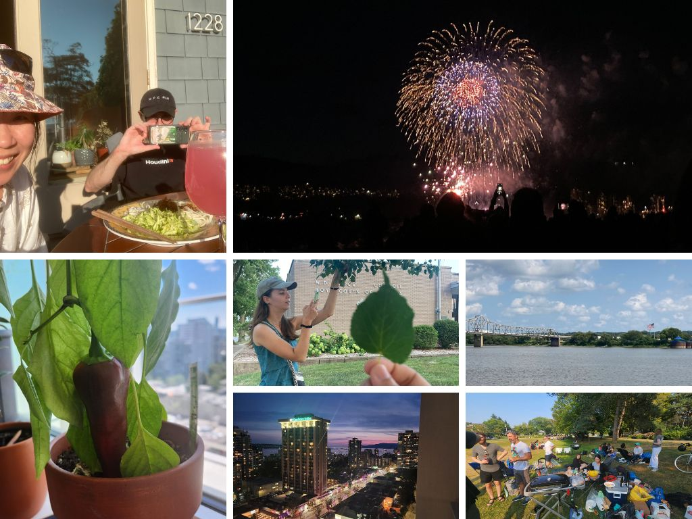

### # 第十九周 - 追打花火日 - 2024 Jul.21

突然發現 Jeda 的發音有點像追打，有嗎?有像嗎?

從歐洲回來的第一周因為 Derek 和 Stella 有訪客，所以暫時借住 Gintas 家，Jeda 也是，頓時他家成為了收留中心。早睡早起的規律還是得不停的溝通，但 Gintas 也是人很好的都會陪我早睡早起，然後自己再喝好多咖啡。看到 Gintas 認真工作的樣子都會讓人忍不住尊敬。

我的工作努力度就跟 Jeda 貓貓一樣。

周二的時候不知道是甚麼原因，整個情緒起伏不定，很焦慮，會一直收信，會一直覺得有很多事情要做但是又完全沒有動力。然後就開始打擾 Gintas (泣)，他非常認真地跟我說 "There is no readon that you doubt yourself."

周末是一年一度的花火日，回想起去年和懷孕中的 Philippa 一起，好美，碰碰碰的連心底都震起來，一二三四五...沒想到今年能約到十個好朋友一起看煙火，好幸運有 Gintas 陪我一起。一路上有好多需要克服的情緒(是我啦)，但總歸一句，能有你在真好。

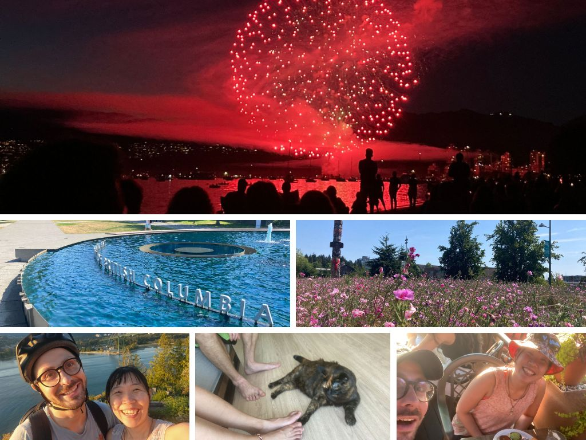

### # 第十八周 - 批喇日 - 2024 Jul.14

Paella... Piella... 到底要怎麼念。

呼嚕呼嚕的歐洲之旅就這樣告一段落了，最後一站的 Madrid 會議整個忙碌到不行，連續好幾天的知識爆炸，加上見到 BirdNET team 與 Xeno-Canto 的興奮感，Kevin 以及澳洲的團隊。太令人措手不及。怎麼每次的旅行都能夠這麼的美好。

回到加拿大有 Gintas 來機場接，還有貓貓 Jeda 在家裡不停灑毛，在很混亂有點時差又有點興奮有點累，整個混亂的周末有 Gintas 陪著到 White Pine Lake 游泳，一整趟旅程都在討論著 Paella 有多好吃，還有到底這個字要怎麼念。我說我整個還在旅行的狀態，帶著旅人的興奮歸來。

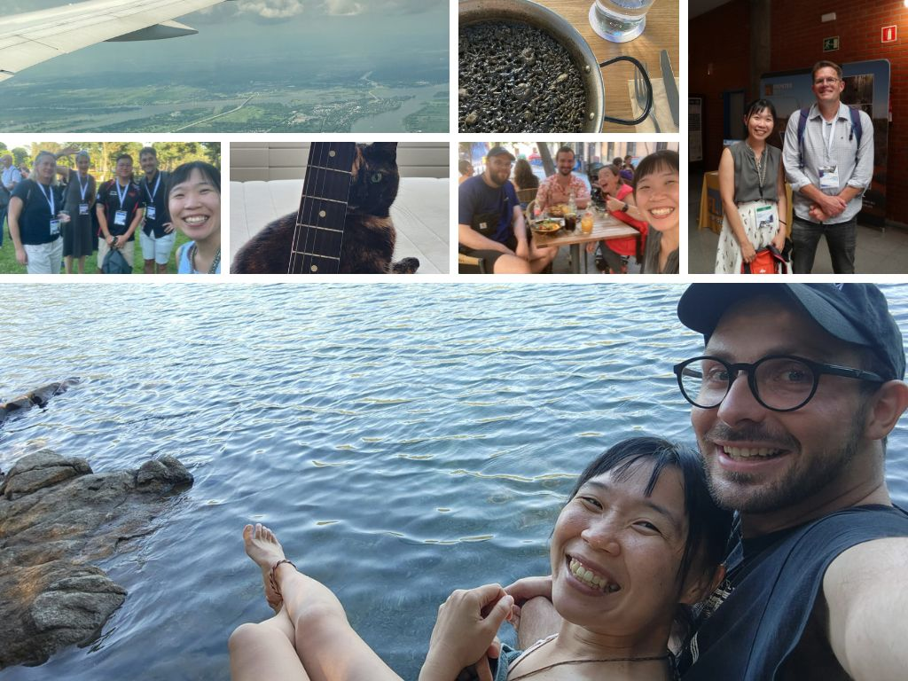

### # 第十七周 - 歐洲旅行日 趴兔 - 2024 Jul.7

一樣是在歐洲水深火熱中度過了這個交換周末，寫下這個片段的當下已經是整整一週後了，只能用回憶來寫了。

上周末發生的時候剛好是從 Girona 遷徙到 Madrid 的時間，那天有兩趟火車，Girona 到 Barcelona 的 AVE 還有 Barcelona 到 Madrid 的鯨魚火車，加上到了馬德里還要要尋找新住處、跟 airbnb 房東 check-in。

早餐時間和 Cristina 一起喝了一杯咖啡，只吃了一片餅乾當早餐，而後在 Barcelona 又在可愛的咖啡廳吃了 omelet 和果汁 (歐洲夏天的李子果汁超好喝)，還有咖啡! 一天兩杯咖啡，加上遷徙半個西班牙的行程，整個大爆炸。

本來跟 Gintas 約好要看誰可以把室內溫度降到最低，那個周末 Vancouver 29; Madrid 31，到了 airbnb 才發現我有冷氣，直接獲勝!然後我直接以煮上一頓好好吃晚餐，躺在床上直接昏倒。真的是太累了吧!兩杯咖啡讓人累到不行，像是能量都被耗盡了，大腦卻不讓你休息。

那個周末大概是此行第一次感到精神疲憊。

### # 第十六周 - 歐洲旅行日 - 2024 Jun.30

這周的我人在德國 Philippa 家，Gintas 則是在 Vancouver 熟悉的家裡。Gintas 超可愛，給了一個要吃德國香腸，還有要跑到後院的廢墟的任務。而我則是要他去騎腳踏車(運動!)。

週二的時候到了巴黎，晚上要回家時忘記傳訊息，把 Gintas 嚇到了，他說我沒回訊息、沒接電話的時候他整個很害怕，聽說法國最近正有集會，加上巴黎本來就不是個安全的城市，來自台灣的我，真的拿出渾身的細心在注意周遭。幸好沒事。

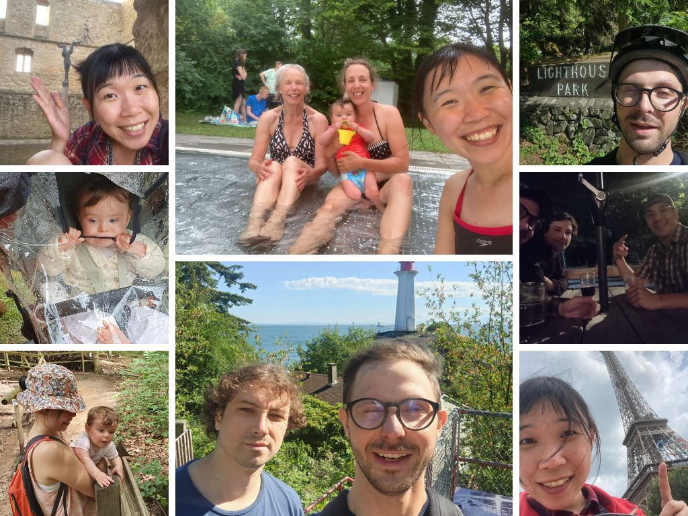

### # 第十五周 - 走繩日 - 2024 Jun.23

因為要寫文章，剛剛才查了 slack 的中文，原來叫做走繩，還蠻貼切的。

要出遠門前的一周，還是一樣鬥嘴不斷(笑)，說了將近三個月的植物終於從我家搬到 Gintas 家了，就在我賭氣的時候，他很認真的問「Sunny what happened, can you tell me?」超級真誠的不知道為何我在賭氣，只好慢慢的好好說出來。

真的每次和 Gintas 面對面說話，都有好好被療癒的感覺，他是真的不知道，他是真的想要幫忙。

這周攀岩的時候出了一點小意外，在確保的時候不知道為什麼左手小指突然出現一大塊瘀青，上周在飛盤時間也是多一片瘀青。兩個人都緊張到趕緊送我去看 walking clinic。幸好沒事。要多吃鐵劑。

能一起運動真的是太棒了，游泳、攀岩、腳踏車、走繩、飛盤、桌球，期待有你在一起的每一天。

PS. 然後我們一起討論了我在歐洲時的對策，超好笑，兩個人都很緊張(笑)，好夥伴這次也加油。

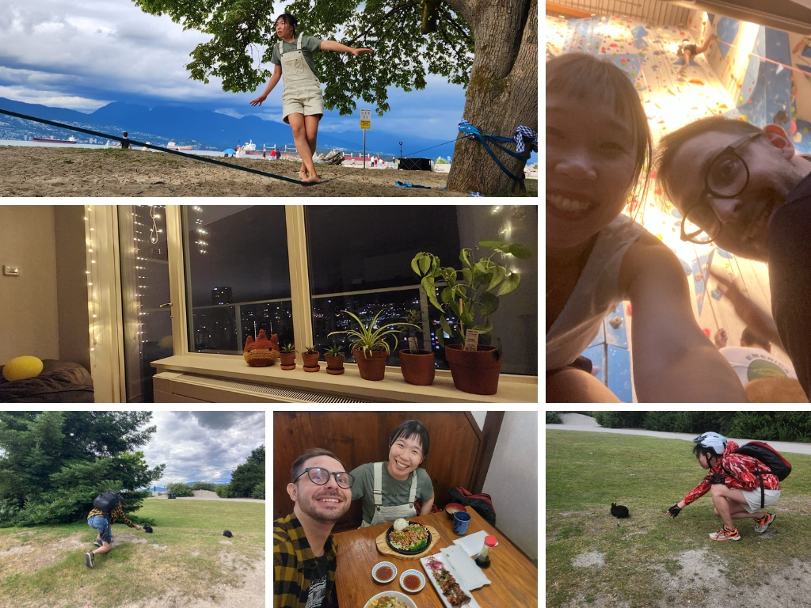

### # 第十四周 - 蒸饅頭日 - 2024 Jun.16

說是蒸饅頭，其實是肉包，然後某人又吵著說想要吃掛包。反正某人就是想要學可以蒸出來的麵粉製品。

非常豐沛的周末，後院的草莓成熟了，各分了一顆成熟草莓，發現自己種的草莓好甜好好吃，自己做的肉包也是超級無敵好吃，一個擅長擀麵皮、另一個擅長從 Youtube 學如何把收口收得漂亮。然後赫然發現從台灣帶回來的小物中，竟然有個超驚嚇飛盤(爆笑)。

想想，因為立陶宛先生而經驗了很多事情，有人可以一起爬樹、一起玩破破的飛盤、因為很可愛的相機鏡頭所以到處找螞蟻、因為他而想要嘗試超級複雜的食譜像是肉包之類的、開始試著體驗新餐廳、還有增進了新技能，像是剪頭髮。

話說幫他剪頭髮真的很有趣耶!從來沒有拿過電動剃刀的我一臉疑惑「So, you just push this?」他一臉驚恐(笑)。最後看到頭髮一層一層的掉下來，很像在雕刻一個藝術品，最後成品超級帥氣的!!成就感一百分，剪完頭髮後的晚餐約會都一直忍不住讚嘆(笑)。

突然覺得這個周記的重要性，就是提醒自己我們曾經經歷過了多少，在大腦非常善於專注在「偵測錯誤」的狀態下，用自己的心靈提醒自己「What's has been right, and most things have been right.」不是催眠自己，而是體認到自己大腦的偏誤，幫忙校正一下而已，這樣的思考非常的有控制感，因為知道情緒不能控制，但如何解讀與理解自己的情緒，是自己可以控制的。

PS. Peter 精心準備的芒果蛋糕、和他的家人一起慶生真的好幸福。和立陶宛先生一起冒險的生活裡，也不要忘了和朋友在一起有多美好。

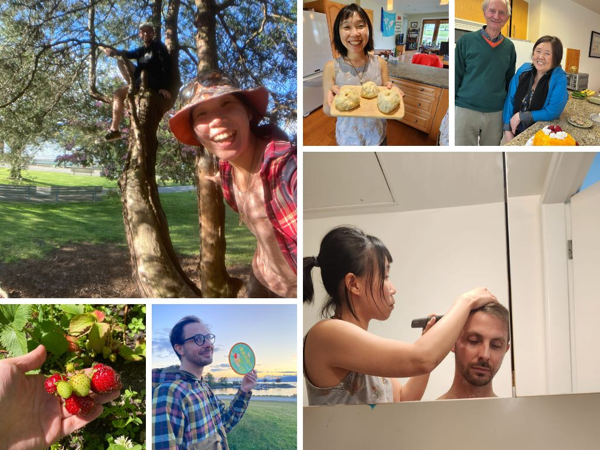

### # 第十三周 - 橄欖樹日 - 2024 Jun.9

橄欖樹是這周的交換禮物主角。

在 PG 去 Faezeh 家作客時，帶了一株 Olive tree 當作禮物，原先是陪伴自己的小樹，已經陪伴快一周的時間，要在最後一天時送出去本來就已經有夠捨不得，再加上路人不停的冒出 "噢!這棵小樹好可愛噢!" 的評價，真的，大概有五個人跟我說他們要去買一樣的小樹了!

這讓我心中小天使與小惡魔不停對話(笑)。

"It is a cute tree. But you also have a lot of cute plants." Gintas 的訊息傳來，言下之意要我把小樹送出去。

然而，這位立陶宛先生，竟然在我回到 Vancouver 的那天傍晚，在我家門口等著，手中還捧著一棵中等的 Olive tree!! 竟然竟然竟然! 太用心了。 

而後就是生日的慶祝，簡簡單單的，沒有甚麼驚喜也沒有甚麼特權。最喜歡這樣單純的生活，修輪胎、騎單車到 Stanley Park、再到海邊野餐，帶上他自己烤的蘋果派，還有(超級貼心)幫我準備的牛奶。

小小的貼心，是我在你的心中看到最美的地方。

PS. 有點後悔昨天和 Gintas 聊天時不小心跟他說了這個周記的存在，真的本來是想好好當作自己的秘密天地的。默默希望他不要用 Google 翻譯來偷讀這裡的文章。

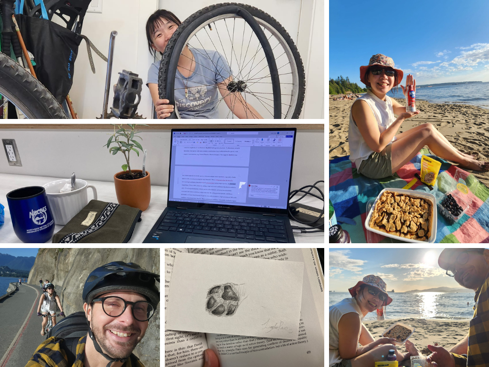

### # 第十二周 - 野生日 - 2024 Jun.2

不知道從甚麼時候開始，已經學會，每次回到 PG 只需帶上一兩件任務，自然而然地就會被滿滿的人們、狗狗、及野生動物佔據，永遠都做不完、永遠都學不完的好玩事情。

這周的 JPRF lodge 房間都各有主人，所以就擁有了個人的小木屋一間，非常的舒適，最大的差別就是要自己生火取暖，在這個夏初的季節，晚上也是可以到零下的。超級怕冷的我，第一個晚上就把木屋燒得像桑拿一樣，邊睡邊流汗，連睡袋的表面、保溫杯的表面都是燒燙燙的，還要一直在身上灑水才不會過熱(汗顏)，最後是只好把木屋的門大開才能稍微呼吸。

大概過了三天晚上，才學會了如何與親愛的火爐相處。

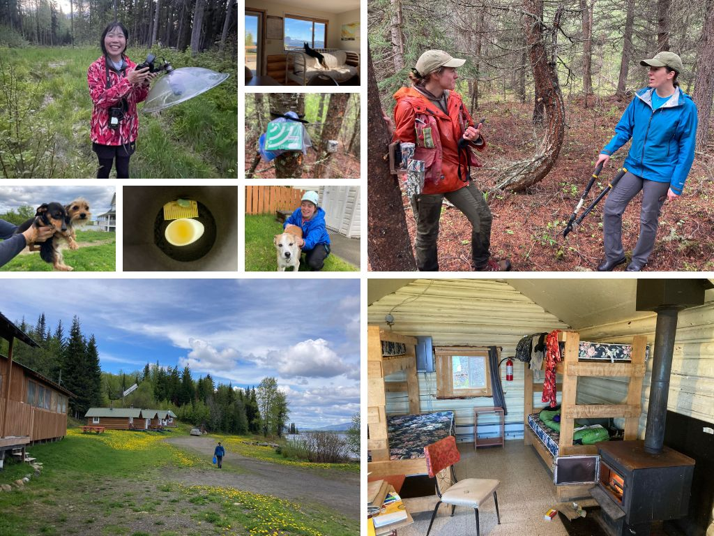

一樣地到處跑跑跳跳。和 Luren 到樣區換 Camera trap 放 ARU，Lisa 來樣區一起 BBQ、到 Dexter 家看狗狗和雞、然後晚上再和女孩們一起到野外去找貓頭鷹，沿路新鮮熊便便 "You find the owls, I will scare the bears away." 是有沒有這麼讓人安心。

一起在島上看到 Moose 媽媽與寶寶、一起鑽熊窩、一起找真的 Morel。週五回到 PG 再直奔 Lisa 的 convocation；周六再幫忙 Hannah 做她的 Tree swallow 野外調查。

情緒高漲的時候有你們在、開心的時候有你們在，重新學會如何放鬆的說話、放鬆的生活。謝謝你們。

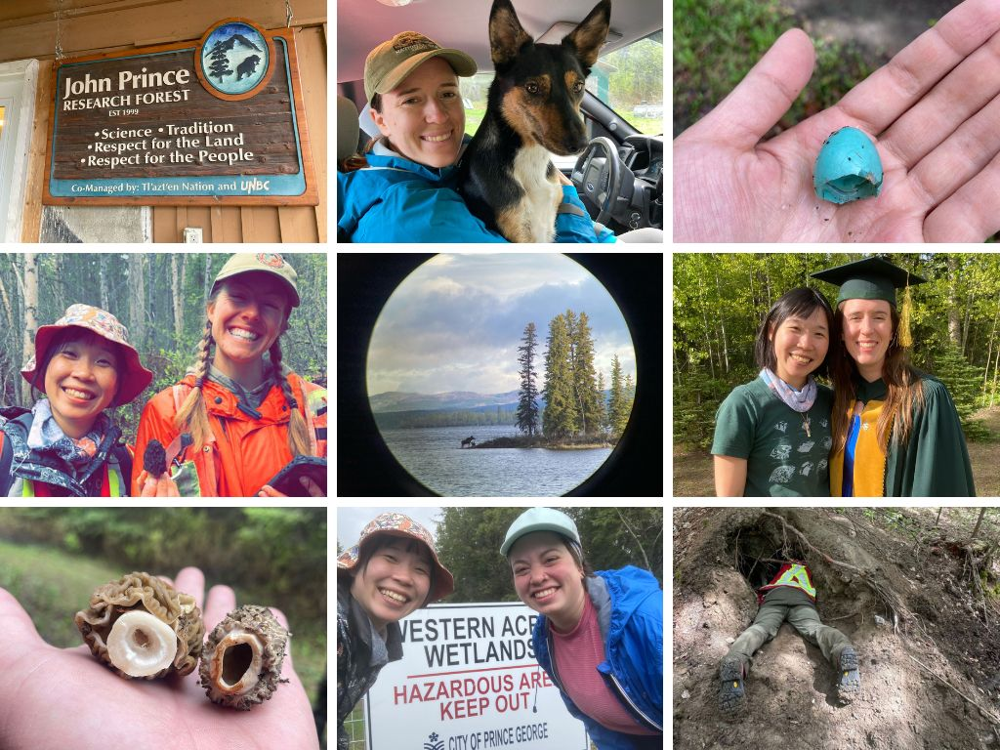

### # 第十一周 - 獎學金按摩日 - 2024 May.26

很快又很慢的，來到旅行大富翁的行程啦!在那之前先和 Gintas 好好享受了兩個人的行程。

首先是周二傍晚，暴風雨過後的大停電，隔天到 Gintas 家求救之後就是傍晚的按摩與晚餐。到 Downtown 試了人生中第一次全身按摩，也太舒服了吧! 特別是在手腳的部分，特別的舒服!啊，最舒服的還是頭部按摩啦!天啊無敵放鬆。Gintas 則說他的按摩師好像沒有像我的按摩到這麼周到，我們兩個互相交換情報，按完之後都想要自己上網學學看!哈!

然後晚餐是 Gintas 說要一起慶祝獎學金還有 owl paper 的 publication!去了一家尼泊爾中式餐廳，覺得普普通通，倒是我們在討論各種 Google 議題簡直笑翻天。

Nature Vancouver 獎學金發放當下竟然有 Gintas 來到現場，除了 Peter 爺爺、Stella & Derek 還有 Gintas 的感覺真的太幸福了。滿滿的幸福感。

隔天一早直飛 PG，有 Lisa, Colin, Ken, Hannah, and Nikky 共度周末 (路上還見了 Heather 與 Matt 親自做 Counselling)。

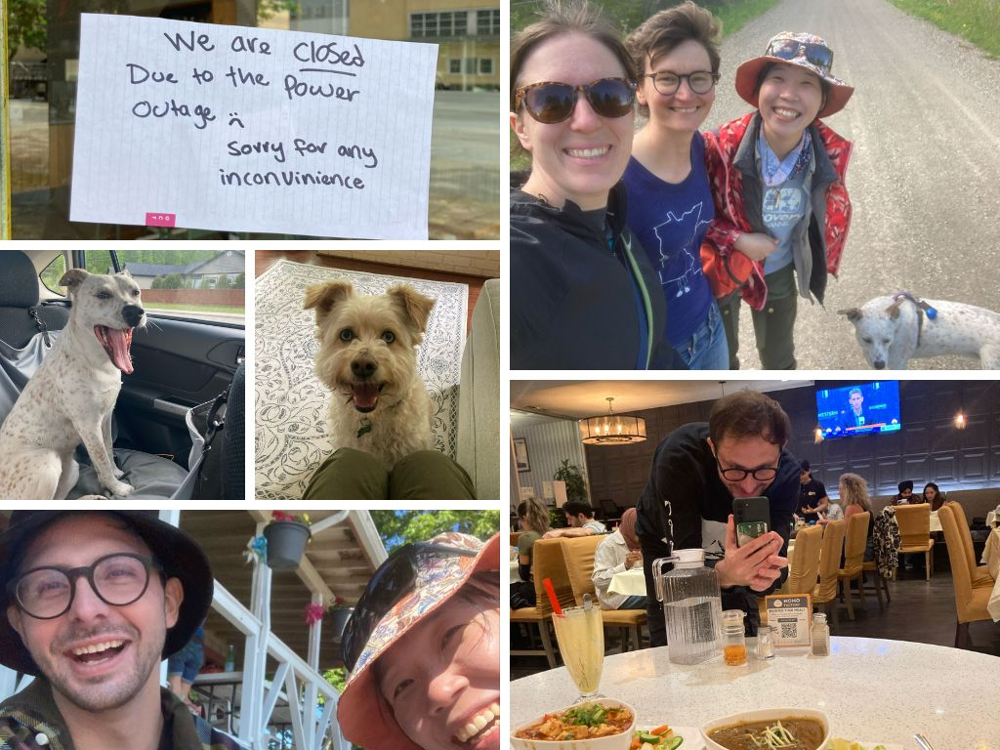

### # 第十周 - New Castle Island 露營日 - 2024 May.19

期盼超級久的，是第一次在加拿大認真的露營!(OS:之前的露營都不認真的意思)。

果不其然的，一起旅行總是能夠看見一個人的真實面貌(是有多恐怖 XD)。約好要分工想食物，我的選項都是 Couscous、泡麵、還有吐司果醬超簡約，立陶宛先生竟然說要帶上牛排、熱狗、跟特製的立陶宛粉紅湯!是豪華派露營者!!採買的時候我都默默地把東西放回櫃子上，就算買回家了，打包的時候也是默默的把東西從背包移到冰箱。

背包超級重、旅途超級好笑!

登陸 Nanaimo 之後就是一個超級好玩的 playground，各式遊樂園等級的設施，現在的小朋友也太幸福了吧!到達島上後，超乎意料的，立陶宛先生是個擅長火焰技術的人，跑進森林裡不出十分鐘，就抱出兩大根木頭，直接升起火來。超級喜歡自己烤熱狗!!直升個人露營最愛食物。

而後的島上散步、奢侈的廁所、五分鐘戰鬥澡、假裝有游泳其實只是沾濕海水的 dip、還有逆風環島的 Kayake，還有超可愛的 Jeff 給我們 group hug。最經典的大概就是永遠吵不完的食物(大笑)，"You don't let me bring food and now you don't let me eat!" 哈哈哈! 

好啦好啦可以一起吵吵鬧鬧的真的很好玩。

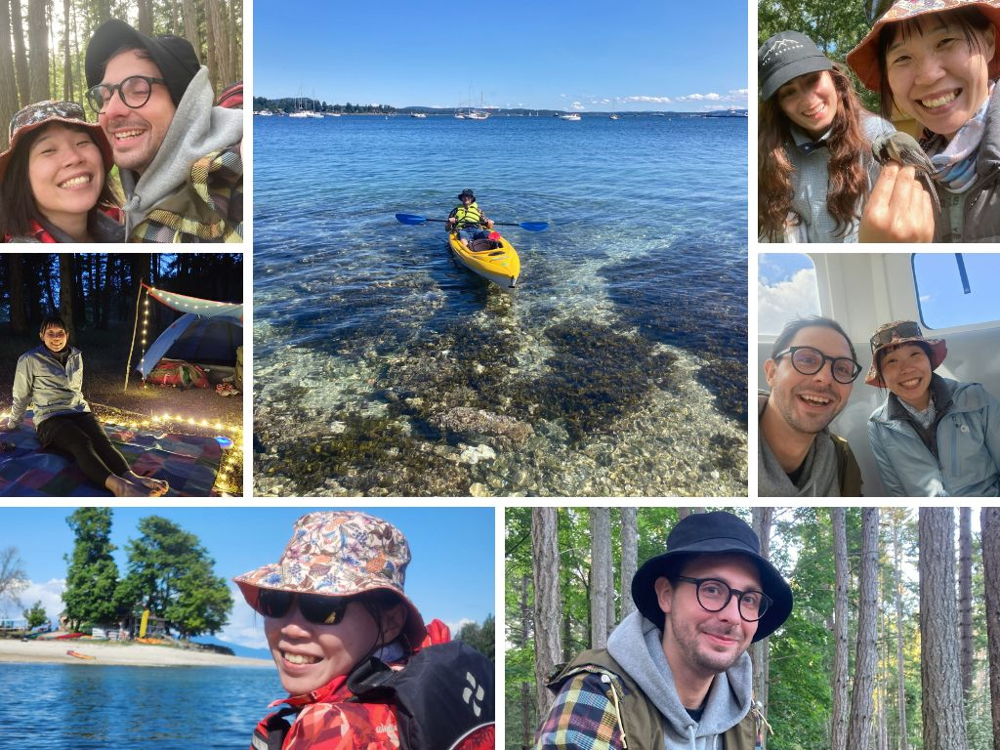

### # 第九周 - 腳踏車繫放日 - 2024 May.12

溫哥華的夏天，就跟春末夏初的花園一樣，突然盛開到讓人措手不及。

挑照片挑了超久，發現過去一周經歷的事情已經是寫作完全接不上的步調，和 Hannah 與 Max 繫放、找 Peter 討論鳥音、和 Katie 攀岩、游泳，週末再去 UBC farm 數鳥。工作的部分則是依然穩穩前進。然後立陶宛先生也被我拉來拉去、跑來跑去的。

最珍貴的回憶大概就是週五一起騎腳踏車去追極光，到了 Jerocho beach 我整個超級累，不知道為什麼當天傍晚就是非常的疲憊、只想要好好地待在家裡。沒有想到對 Gintas 來說追到極光有多麼的重要 (我是因為看過了所以覺得還好)。總而言之我們就是錯過了，而且極光現場就在我的窗外(笑)。就是這樣很靠近地錯過才最讓人扼腕，好啦我欠他一次極光。

週六一起騎車到 Iona 看鳥鳥，讓立陶宛先生看看我平常都在做甚麼，他的體力超好，一整天下來都不會有偷懶的念頭。週日他想要留時間給自己工作，傍晚見面時，Gintas 把鬍子都剃掉了(因為我說我想要看看沒有鬍子的他)。

### # 第八周 - 雞湯養生日 - 2024 May.5

隨著時間進展，覺得這裡越來越像我的個人週記惹(笑)，一個自己霸佔自己回憶的概念。

Gintas 回國的第一週，給我的第一個禮物就是一場感冒，立馬被傳染，整個超暈，加上生理期來潮，不僅僅是身體，連情緒也是起伏不定，然後滿到不行的行程 (畫約、reviewer 的回覆、開發的程式套件，還有 Kaitlyn 來訪招待了人家一晚)，又沒有好好體貼自己的身體、適時的提出需要自己的時間及空間好好休息的需求，整個爆炸到不行。

Gintas 在週間送了雞湯來，令人驚喜的好喝，約好了生病的人就能有雞湯喝，還要互相照顧。周末一起看了 Avatar 等等，感覺一週就這樣乒乒乓乓的、彈來彈去的度過了，很多微小瑣碎的記憶。

除了享受兩個人的時光以外，更重要的是自己陪自己的時間。覺得開頭寫得變成自己的週記非常的合理，如果是想要紀錄一週間發生了甚麼事情，那麼當然還是自己陪自己發生的事件最多了，立陶宛先生只是蛋糕上的一顆小櫻桃 (怎麼感覺很可愛)。

終於去了第一次的 banding! 幸虧了 Laura 的邀約，重新複習和鳥鳥的各種互動，還繫放了人生中第一隻 swallow!! 原來沒有想像中的困難。繼上回的蜂鳥之後，又再一次解鎖燕子小朋友。而竟然在 banding station 在遇到了多年前教我如何繫放的 Amanda，現在轉換身分為 Max，超級驚喜超級興奮。我發現我對於較年長的溫柔性格的人們都有莫名的依賴感，不論是學習或是心靈上的交流，都能感到非常舒適。

再一次的驗證了，因為鳥鳥而聚在一起的美好人們。

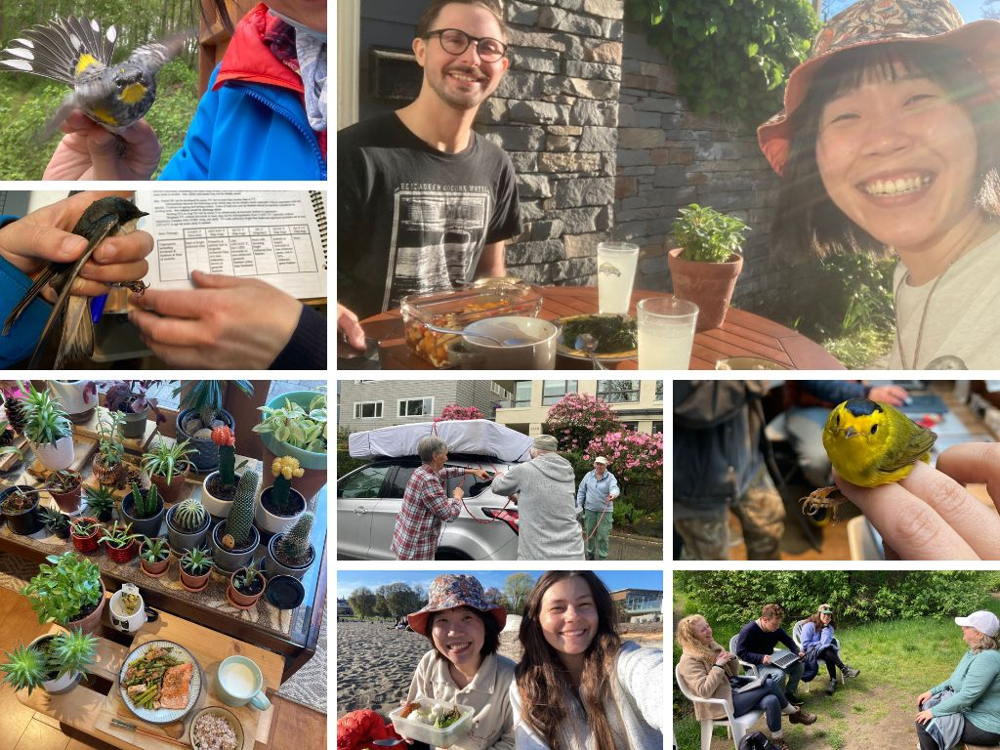

### # 第七周 - 好好說話日 - 2024 Apr.28

某人終於在三個月後，環繞了世界一大圈後，平安歸來啦! 恭喜賀喜! 然後立馬在開工前兩天重感冒 (笑)。

這周我們家有電影團隊來開拍，是個叫做 Family Law 的電視劇，事前溝通了兩周的時間，包含搬出的時間、以及 compensation 之類的，非常驚訝團隊的大手筆以及做事效率。開拍前一天，布置團隊半天就把房間整理得像是另一個家一般，非常不可思議!也默默地讓我有個布置新家的參考依據，而且我的電鍋還入鏡了噢! 萬分引以為傲! 也因此要搬進 Gintas 的家住幾天，剛剛好迎接他的回國。

一起分享蛋糕、分享食物、煮雞湯、去櫻花樹下和海邊、沙灘上夕陽的野餐、他幫忙我帶牛奶和雞蛋、幫我重新布置家裡、某人生病突然缺席的攀岩、照顧番茄寶寶和偷採竹子。不過短短幾天、看似平凡的幾天，就滿滿的回憶並深覺每一刻都值得紀念。最令人珍惜的，是終於可以親自面對面，好好說話的感覺。

就是你眼前這個人現在、當下就是專注在你身上，想知道你的狀況、想知道你在想甚麼；而我也是，現在這個當下，就是專注在對方身上。這種全然專注不分心的感覺，儘管只是短短十分鐘的對話都能覺得非常滿足與幸福。

今天早上他說「The tomato is teaching the bamboo how to grow.」也太可愛了吧!!

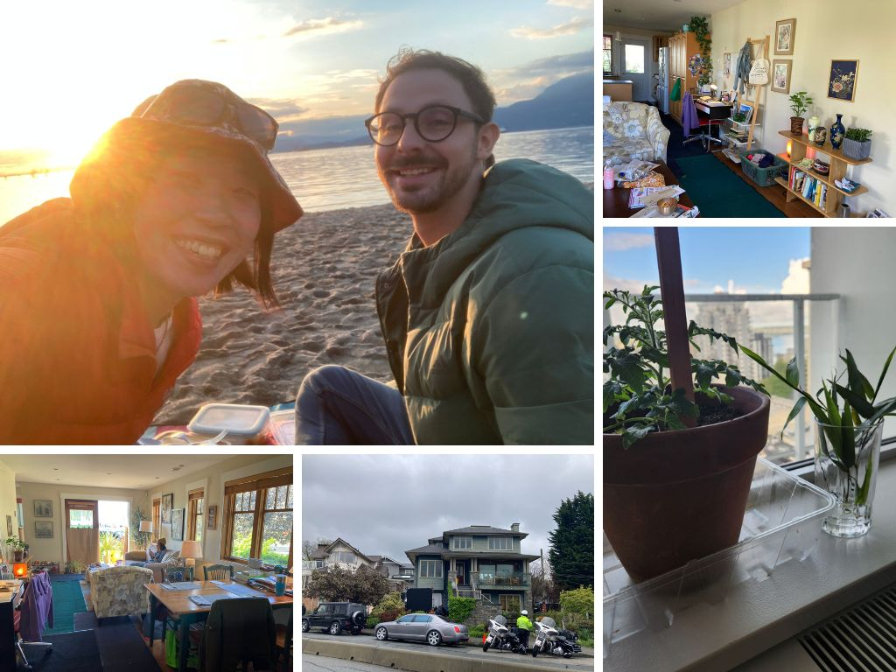

### # 第六周 - 花花日 - 2024 Apr.21

一樣是情緒起伏如海浪的一週，大概不止一次覺得快要停刊了 (笑)。

怎麼說呢，就是在遠距離的狀態下真的會變得非常敏感，很沒有安全感，尤其是我們又是實行一個沒有特別約時間聊天的政策，對我這個凡事都要按照行程來的個性真的是很難調適，總覺得沒有被馬上做的事情，就代表不在乎。

「When I don't do things straightaway, it doesn't mean that I don't care. I do care... And I hope you can assume that I do care.」

覺得除了 Gintas 之外，應該還有其他原因的，像是跟一群人在一起的相處之類的，目前還不清楚，先穩穩地過，穩穩的運動，每次運動完就有世界太平、生活如喝水一般簡單的感覺。在最無助的低潮時，Gintas 一通電話，看看眼睛，就又好了起來，好像魔法似的。

這週和 Stella & Derek 到 Merritt 賞鳥，Selina 臨時聊到天發現竟在同一團。Townsend's Solitare 依然是我的最愛。Gintas 則是有姊姊一起共度周末，太幸福的家庭時光。

因為電影開拍的緣故而要借宿 Gintas 家，一進到房間，嘩，這個味道...是 Gintas 的味道啊! 三個月真的好久，都覺得這個人快要變不真實的了。這週是花花週，我們都採了花花要來送對方。

期待真實的擁抱，還有拍拍頭。

### # 第五周 - 好朋友電影日 - 2024 Apr.14

這周過得飛快，好像和之前的回憶都混在一起了，又過了七天。

在遙遠的那邊，墨西哥的日全蝕慶祝、去 ikea 的傳統粉紅色湯、終於通過的駕照體檢、Godspeed You! Black Emperor 的巡迴演奏會。聽說這周冷到下雪了。

在溫暖的這邊，陰天下雨的霧濛濛日全蝕、Peter 爺爺煮的牛尾巴、Derek 和 Stella 的花園時間、和實驗室小夥伴的種花時間、還有腳踏車與散步的享受陽光。Gintas 還為我爭取到了他住宿的備用鑰匙，我的地方在拍電影的時候可以去他那邊住。

終於在周末兩個人都有空好好的講話，但 Gintas 因為在家不方便講話而必須要在外頭邊走邊講，我則是很不喜歡別人講話不專注的，所以他特地停下來，好好地聽我說。我為你做的粉紅色的湯，還有你為我在冷冷的天走到戶外。體貼不需要說，但需要對方細細體會。

彼此貼心一點、彼此溫暖很多。明天要一起看 Avatar 第二集啦 (但其實我...不小心先看惹 XD)。Gintas 再一周就回來了，真的是有苦苦等待的感覺呢，覺得每個遠距離培養感情的情侶都非常厲害!

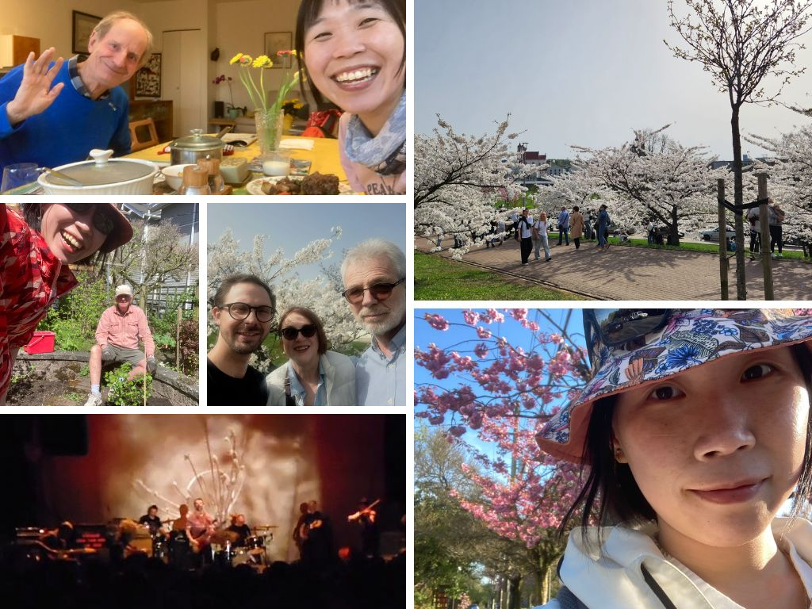

### # 第四周 - 腳踏車日 - 2024 Apr.07

細翻了這周的照片，才發現我們在這周也一起經歷了好多有趣事件。

第一個，不約而同地都去聽了音樂會。Gintas 去找他以前樂團的朋友，殊不知就是去看他們演出，他這個搖滾樂的靈魂我至今都還不是很明白，他傳來的影片是陣陣的嘶吼聲，聽了直覺得喉嚨好痛啊(笑)，如果他當初沒有來加拿大工作的話，現在應該還是跟著樂團一起，一直玩音樂的吧。我則是去了 UBC 合唱團的演出，本來是要跟 Mandy 一起去的，但她前一天得知 Covid，幸好 Chan center 有提供退票，到場參加非常的驚豔! 最喜歡一首全員在舞台上跳舞開心的非洲樂曲，每個人都笑咪咪的，還有另一段組曲是搭配著麥克風收音，以及舞台燈光的變化。

第二個，不約而同地騎了單車。這周因為我的公車卡出問題，本來野心很大的想要來個單車省錢月，才騎了兩天往返 UBC 就放棄了(笑)，真的會全身痠痛到不行，單程 8.6 公里，上坡，加上我那台剎車會卡到輪框的老奶奶腳踏車。Gintas 則是到市中心找朋友時都會騎單車出門，傳來的街道、夜景、還有河邊的風景都好有異國風情，每次在視訊上看到他都會覺得到時候見面一定會很不真實，單程 12 公里。

最後，最值得紀念的就是後院農場正式開張啦! 今年從爺爺奶奶那裏獲得了一塊土地，從沒想到擁有幾顆草莓、幾株小樹，就像變成大地主一樣的快樂。

Gintas 的生日禮物也在 nursary 買好了(笑)。

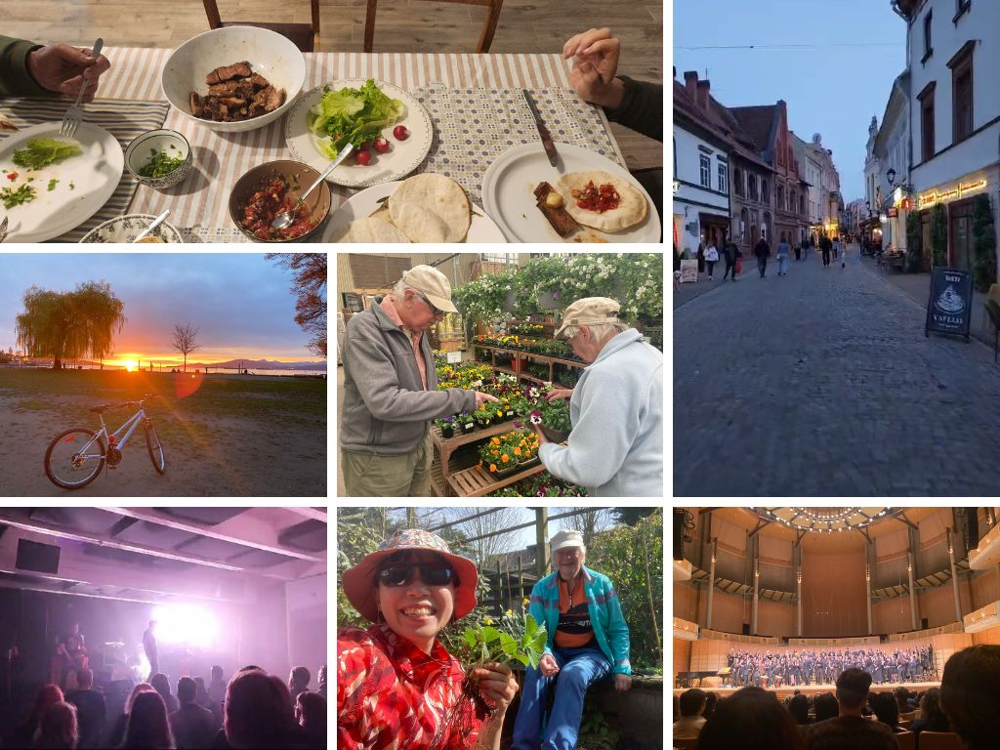

### # 第三週 - 兒時哭哭日 - 2024 Mar.31

這周發生了一個小插曲...某人在上周抵達了立陶宛，整個鄉愁大爆發，約了朋友約了家人行程滿滿，然後就...忘記了!

忘記了!! 是怎麼樣，不知道我對這個最敏感的嗎((氣噗噗))，最害怕這樣總是只有單方面付出的感覺，而且又因為時差、還有他和朋友見面的行程因素，所以溝通上又特別困難，不僅是忘了我們的約定，還沒有辦法好好地打電話溝通。我瞬間小劇場爆發，在 Easter Monday 當天整個邊工作邊哭爆。

Jeda 貓貓在旁邊傻眼，邊伸懶腰邊看我爆哭。過去的回憶及恐懼湧現。

覺得可以當個很好的心理學教材呢(笑)，過去的感情雖然是過去了，但是因為曾經那麼親近、那麼在乎，那些傷口都還是在的，只要碰到類似的場景，大腦就會自發性的警鈴大作，用「疼痛」來提醒當下的危險性，儘管只是風吹草動，都會變成驚滔駭浪，那就是傷口還沒癒合的展現。很喜歡周慕姿心理師說過的:「人類的大腦會帶領我們遠離痛苦，卻不會帶領我們走向幸福」，如何應對進退，還有如何做到共同邁向幸福，是需要觀察、理解、及好好練習的。

幸好有小柯和曉萌的強力援助。"He is dreamy, but he is not the sun. You are!"

最後等到立陶宛先生親自上場，一句句話都打在心頭上，說很抱歉自己離開三個月這麼久(說之後不會了!?)、很抱歉有時太累就會忘記回復訊息、還有最重要的 "Let's talk when you are awake."。把自己放在第一位，是所有關係的最佳解，因為只有自己才能最在乎自己。

小時候的我超愛哭，但超級可愛(自己說)，看那個瀏海跟圓圓的臉! 遙遠的那邊呢，小時候的立陶宛先生超愛放空，就他本人的陳述 "I was living in my own world when I was a kid."。

### # 第二週 - 面膜冥想日 - 2024 Mar.24

立陶宛先生說，想要試試看自我照護，所以要各自在周末找時間敷面膜，然後靜坐冥想 15 分鐘。我說，這個有點少女心啊太可愛了。

立陶宛先生這周到達沖繩旁的一個小島，叫做無間座島，說實話，他的整趟日本行就屬沖繩最讓我嚮往，據說是個非常小的小島，沒有甚麼居民也沒有遊客。我在想也許跟蘭嶼的感覺類似吧!然後也突然意識到他的日本行也快接近尾聲，也就是說，我回加拿大也快一個月了。每天聊天總覺得時間很慢，但這樣猛然想起就覺得不知不覺又一個月，一開始還很不習慣沒有人在身邊，但慢慢適應，現在覺得一個太平洋的距離也蠻美好的(笑)，可以自由自在地享受自己的生活。

說道冥想，這倒是我第一次嘗試 unguided medidation，當靜坐時，不要刻意去抵抗想法的產生，但是也不要去抓住想法，就是當一個想法的觀察者 (observer)，不評論、不反駁、不去衡量重要性。我很驚訝地發現，短短十五分鐘內我的大腦真的是穿越了各種時空，想到兩個月前吃的摩斯海洋珍珠堡、想到幫學長姐買的早餐咖啡、想到電腦程式...各式各樣的意識穿梭，回過神來才驚覺，阿，竟然又分心了。而我也才想到，我每天睡前有開燈發呆五分鐘的習慣，就甚麼也不想的任意識漂流，也許也是冥想的一種。

面膜的部分...因為照片實在太好笑了只能拿委婉一點的來分享。立陶宛先生的面膜還因為鬍子而不能完全服貼(笑)，然後他還自己沒有做完冥想作業，是想等著被電咩(抖)!

櫻花祭來了，代表春天的 warbler 和 swallow 都來到了溫哥華。

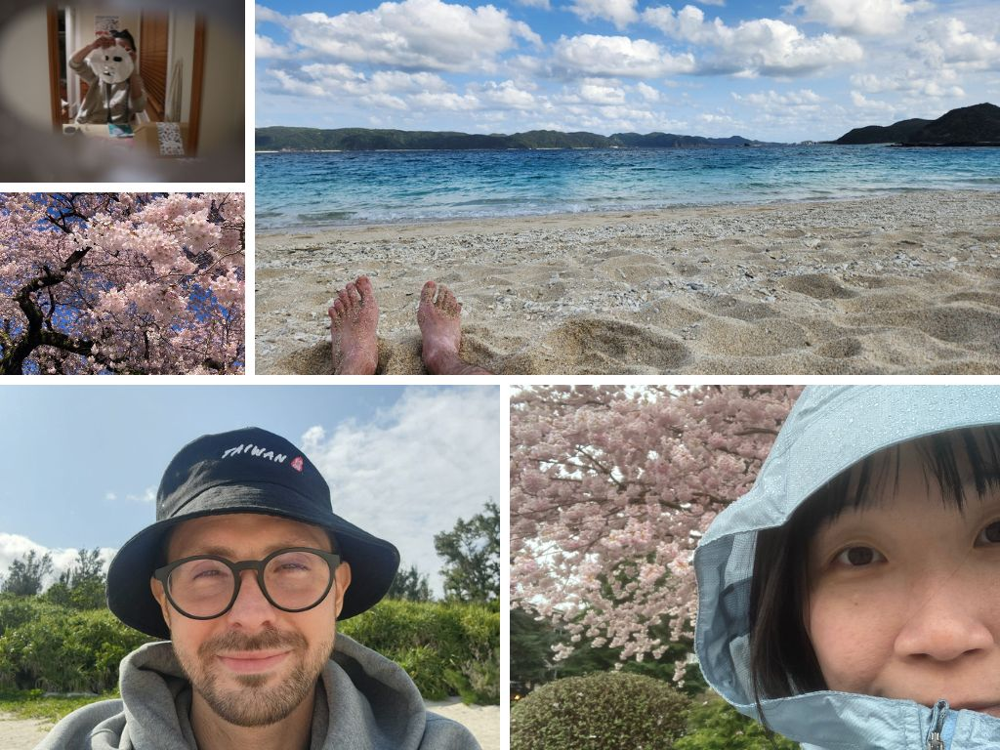

### # 第一周 - 交換周末計畫，正式實施 - 2024 Mar.17

要和隔著一個太平洋的某人培育情感是一件非常需要技巧的事情，畢竟生活圈太遙遠，連天氣都聊不起來(笑)，早安晚安、還有因為時差和作息時間不同的各種交錯，也讓認識彼此的生活和本質困難了一些。與人相處對我來說彌足珍貴的，就是因為對方的出現，可以對世界有更多的認識、去做些自己一個人生活時不會嘗試的事情。太多想一起做的事情了，不如就從每個周末開始。企劃大綱就是，每周由一個人決定兩個人的周末行程，可以是邀請對方嘗試自己平常喜歡做的事情、可以是一起完成之前說過的計畫，一個交換興趣的概念(笑)，剛剛好也可以放飛我這個崇尚生活穩定的性格(誤)。

是不知道會執行多久啦，且做且走，重點是...第一周就超有趣的啊!本週由我開始，分派的任務是: "替在太平洋對岸的對方挑一家餐廳還有餐點，要對方去享用一頓美好的一餐!"

Gintas 挑給我這家店在 Downtown Vancouver，叫做 #e food，指定的餐點是 Sandwitch of the day 和 Soup of the day。不得不說，到外面的店吃飯真的不是我在溫哥華平常會做的事情，因為太貴了我都覺得自己煮就好，但就是因為這樣我才想要藉此機會好好拓展技能(甚麼技能!?)。一走進店裡還有點徬徨(笑)，是家小小的店，裝潢很簡單樸實，因為烤麵包的關係有點氤氳。我特地帶了自己的碗裝湯，還被老闆主動加湯了(竟然)，連在我後面點餐的女孩都跟我說這家店是他的最愛(特別是 Lemon Rosemery Chicken)，光是人的部分就非常有好感。到了 Sunset beach 躺在陽光下吃，好吃，特別喜歡它的 Chicken noodle soup，飽餐一頓後馬上倒下，直接在陽光下睡了一覺，超級滿足超級雀躍!儘管是一個人，心裡卻像是被滿滿的陪伴著，畢竟餐聽是 Gintas 選的、餐點是他挑的。一整個滿足感。

這個周末 Gintas 從 Mito 流浪到 Okinawa，在他住處的街頭晃了許久，終於找到這家看起來非常有趣的當地小店，點了苦瓜炒蛋和沖繩蕎麥麵，再加了一小杯梅酒，阿，這家店裡還有賣豬腳，若不是知道他不吃豬腳我真的好想請他點給我吃(又不是我在吃)，他說兩道菜都超喜歡! 

第一周算是順利平安結束啦!期待下周立陶宛先生的創意。

