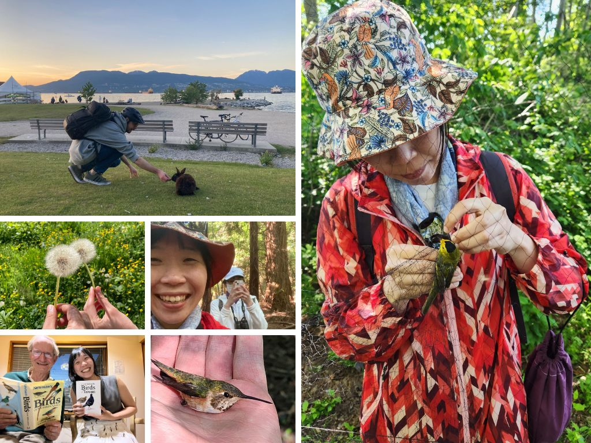

### # 第九周 - 腳踏車繫放日 - 2024 May.12

溫哥華的夏天，就跟春末夏初的花園一樣，突然盛開到讓人措手不及。

挑照片挑了超久，發現過去一周經歷的事情已經是寫作完全接不上的步調，和 Hannah 與 Max 繫放、找 Peter 討論鳥音、和 Katie 攀岩、游泳，週末再去 UBC farm 數鳥。工作的部分則是依然穩穩前進。然後立陶宛先生也被我拉來拉去、跑來跑去的。

最珍貴的回憶大概就是週五一起騎腳踏車去追極光，到了 Jerocho beach 我整個超級累，不知道為什麼當天傍晚就是非常的疲憊、只想要好好地待在家裡。沒有想到對 Gintas 來說追到極光有多麼的重要 (我是因為看過了所以覺得還好)。總而言之我們就是錯過了，而且極光現場就在我的窗外(笑)。就是這樣很靠近地錯過才最讓人扼腕，好啦我欠他一次極光。

週六一起騎車到 Iona 看鳥鳥，讓立陶宛先生看看我平常都在做甚麼，他的體力超好，一整天下來都不會有偷懶的念頭。週日他想要留時間給自己工作，傍晚見面時，Gintas 把鬍子都剃掉了(因為我說我想要看看沒有鬍子的他)。

### # 第八周 - 雞湯養生日 - 2024 May.5

隨著時間進展，覺得這裡越來越像我的個人週記惹(笑)，一個自己霸佔自己回憶的概念。

Gintas 回國的第一週，給我的第一個禮物就是一場感冒，立馬被傳染，整個超暈，加上生理期來潮，不僅僅是身體，連情緒也是起伏不定，然後滿到不行的行程 (畫約、reviewer 的回覆、開發的程式套件，還有 Kaitlyn 來訪招待了人家一晚)，又沒有好好體貼自己的身體、適時的提出需要自己的時間及空間好好休息的需求，整個爆炸到不行。

Gintas 在週間送了雞湯來，令人驚喜的好喝，約好了生病的人就能有雞湯喝，還要互相照顧。周末一起看了 Avatar 等等，感覺一週就這樣乒乒乓乓的、彈來彈去的度過了，很多微小瑣碎的記憶。

除了享受兩個人的時光以外，更重要的是自己陪自己的時間。覺得開頭寫得變成自己的週記非常的合理，如果是想要紀錄一週間發生了甚麼事情，那麼當然還是自己陪自己發生的事件最多了，立陶宛先生只是蛋糕上的一顆小櫻桃 (怎麼感覺很可愛)。

終於去了第一次的 banding! 幸虧了 Laura 的邀約，重新複習和鳥鳥的各種互動，還繫放了人生中第一隻 swallow!! 原來沒有想像中的困難。繼上回的蜂鳥之後，又再一次解鎖燕子小朋友。而竟然在 banding station 在遇到了多年前教我如何繫放的 Amanda，現在轉換身分為 Max，超級驚喜超級興奮。我發現我對於較年長的溫柔性格的人們都有莫名的依賴感，不論是學習或是心靈上的交流，都能感到非常舒適。

再一次的驗證了，因為鳥鳥而聚在一起的美好人們。

### # 第七周 - 好好說話日 - 2024 Apr.28

某人終於在三個月後，環繞了世界一大圈後，平安歸來啦! 恭喜賀喜! 然後立馬在開工前兩天重感冒 (笑)。

這周我們家有電影團隊來開拍，是個叫做 Family Law 的電視劇，事前溝通了兩周的時間，包含搬出的時間、以及 compensation 之類的，非常驚訝團隊的大手筆以及做事效率。開拍前一天，布置團隊半天就把房間整理得像是另一個家一般，非常不可思議!也默默地讓我有個布置新家的參考依據，而且我的電鍋還入鏡了噢! 萬分引以為傲! 也因此要搬進 Gintas 的家住幾天，剛剛好迎接他的回國。

一起分享蛋糕、分享食物、煮雞湯、去櫻花樹下和海邊、沙灘上夕陽的野餐、他幫忙我帶牛奶和雞蛋、幫我重新布置家裡、某人生病突然缺席的攀岩、照顧番茄寶寶和偷採竹子。不過短短幾天、看似平凡的幾天，就滿滿的回憶並深覺每一刻都值得紀念。最令人珍惜的，是終於可以親自面對面，好好說話的感覺。

就是你眼前這個人現在、當下就是專注在你身上，想知道你的狀況、想知道你在想甚麼；而我也是，現在這個當下，就是專注在對方身上。這種全然專注不分心的感覺，儘管只是短短十分鐘的對話都能覺得非常滿足與幸福。

今天早上他說「The tomato is teaching the bamboo how to grow.」也太可愛了吧!!

### # 第六周 - 花花日 - 2024 Apr.21

一樣是情緒起伏如海浪的一週，大概不止一次覺得快要停刊了 (笑)。

怎麼說呢，就是在遠距離的狀態下真的會變得非常敏感，很沒有安全感，尤其是我們又是實行一個沒有特別約時間聊天的政策，對我這個凡事都要按照行程來的個性真的是很難調適，總覺得沒有被馬上做的事情，就代表不在乎。

「When I don't do things straightaway, it doesn't mean that I don't care. I do care... And I hope you can assume that I do care.」

覺得除了 Gintas 之外，應該還有其他原因的，像是跟一群人在一起的相處之類的，目前還不清楚，先穩穩地過，穩穩的運動，每次運動完就有世界太平、生活如喝水一般簡單的感覺。在最無助的低潮時，Gintas 一通電話，看看眼睛，就又好了起來，好像魔法似的。

這週和 Stella & Derek 到 Merritt 賞鳥，Selina 臨時聊到天發現竟在同一團。Townsend's Solitare 依然是我的最愛。Gintas 則是有姊姊一起共度周末，太幸福的家庭時光。

因為電影開拍的緣故而要借宿 Gintas 家，一進到房間，嘩，這個味道...是 Gintas 的味道啊! 三個月真的好久，都覺得這個人快要變不真實的了。這週是花花週，我們都採了花花要來送對方。

期待真實的擁抱，還有拍拍頭。

### # 第五周 - 好朋友電影日 - 2024 Apr.14

這周過得飛快，好像和之前的回憶都混在一起了，又過了七天。

在遙遠的那邊，墨西哥的日全蝕慶祝、去 ikea 的傳統粉紅色湯、終於通過的駕照體檢、Godspeed You! Black Emperor 的巡迴演奏會。聽說這周冷到下雪了。

在溫暖的這邊，陰天下雨的霧濛濛日全蝕、Peter 爺爺煮的牛尾巴、Derek 和 Stella 的花園時間、和實驗室小夥伴的種花時間、還有腳踏車與散步的享受陽光。Gintas 還為我爭取到了他住宿的備用鑰匙，我的地方在拍電影的時候可以去他那邊住。

終於在周末兩個人都有空好好的講話，但 Gintas 因為在家不方便講話而必須要在外頭邊走邊講，我則是很不喜歡別人講話不專注的，所以他特地停下來，好好地聽我說。我為你做的粉紅色的湯，還有你為我在冷冷的天走到戶外。體貼不需要說，但需要對方細細體會。

彼此貼心一點、彼此溫暖很多。明天要一起看 Avatar 第二集啦 (但其實我...不小心先看惹 XD)。Gintas 再一周就回來了，真的是有苦苦等待的感覺呢，覺得每個遠距離培養感情的情侶都非常厲害!

### # 第四周 - 腳踏車日 - 2024 Apr.07

細翻了這周的照片，才發現我們在這周也一起經歷了好多有趣事件。

第一個，不約而同地都去聽了音樂會。Gintas 去找他以前樂團的朋友，殊不知就是去看他們演出，他這個搖滾樂的靈魂我至今都還不是很明白，他傳來的影片是陣陣的嘶吼聲，聽了直覺得喉嚨好痛啊(笑)，如果他當初沒有來加拿大工作的話，現在應該還是跟著樂團一起，一直玩音樂的吧。我則是去了 UBC 合唱團的演出，本來是要跟 Mandy 一起去的，但她前一天得知 Covid，幸好 Chan center 有提供退票，到場參加非常的驚豔! 最喜歡一首全員在舞台上跳舞開心的非洲樂曲，每個人都笑咪咪的，還有另一段組曲是搭配著麥克風收音，以及舞台燈光的變化。

第二個，不約而同地騎了單車。這周因為我的公車卡出問題，本來野心很大的想要來個單車省錢月，才騎了兩天往返 UBC 就放棄了(笑)，真的會全身痠痛到不行，單程 8.6 公里，上坡，加上我那台剎車會卡到輪框的老奶奶腳踏車。Gintas 則是到市中心找朋友時都會騎單車出門，傳來的街道、夜景、還有河邊的風景都好有異國風情，每次在視訊上看到他都會覺得到時候見面一定會很不真實，單程 12 公里。

最後，最值得紀念的就是後院農場正式開張啦! 今年從爺爺奶奶那裏獲得了一塊土地，從沒想到擁有幾顆草莓、幾株小樹，就像變成大地主一樣的快樂。

Gintas 的生日禮物也在 nursary 買好了(笑)。

### # 第三週 - 兒時哭哭日 - 2024 Mar.31

這周發生了一個小插曲...某人在上周抵達了立陶宛，整個鄉愁大爆發，約了朋友約了家人行程滿滿，然後就...忘記了!

忘記了!! 是怎麼樣，不知道我對這個最敏感的嗎((氣噗噗))，最害怕這樣總是只有單方面付出的感覺，而且又因為時差、還有他和朋友見面的行程因素，所以溝通上又特別困難，不僅是忘了我們的約定，還沒有辦法好好地打電話溝通。我瞬間小劇場爆發，在 Easter Monday 當天整個邊工作邊哭爆。

Jeda 貓貓在旁邊傻眼，邊伸懶腰邊看我爆哭。過去的回憶及恐懼湧現。

覺得可以當個很好的心理學教材呢(笑)，過去的感情雖然是過去了，但是因為曾經那麼親近、那麼在乎，那些傷口都還是在的，只要碰到類似的場景，大腦就會自發性的警鈴大作，用「疼痛」來提醒當下的危險性，儘管只是風吹草動，都會變成驚滔駭浪，那就是傷口還沒癒合的展現。很喜歡周慕姿心理師說過的:「人類的大腦會帶領我們遠離痛苦，卻不會帶領我們走向幸福」，如何應對進退，還有如何做到共同邁向幸福，是需要觀察、理解、及好好練習的。

幸好有小柯和曉萌的強力援助。"He is dreamy, but he is not the sun. You are!"

最後等到立陶宛先生親自上場，一句句話都打在心頭上，說很抱歉自己離開三個月這麼久(說之後不會了!?)、很抱歉有時太累就會忘記回復訊息、還有最重要的 "Let's talk when you are awake."。把自己放在第一位，是所有關係的最佳解，因為只有自己才能最在乎自己。

小時候的我超愛哭，但超級可愛(自己說)，看那個瀏海跟圓圓的臉! 遙遠的那邊呢，小時候的立陶宛先生超愛放空，就他本人的陳述 "I was living in my own world when I was a kid."。

### # 第二週 - 面膜冥想日 - 2024 Mar.24

立陶宛先生說，想要試試看自我照護，所以要各自在周末找時間敷面膜，然後靜坐冥想 15 分鐘。我說，這個有點少女心啊太可愛了。

立陶宛先生這周到達沖繩旁的一個小島，叫做無間座島，說實話，他的整趟日本行就屬沖繩最讓我嚮往，據說是個非常小的小島，沒有甚麼居民也沒有遊客。我在想也許跟蘭嶼的感覺類似吧!然後也突然意識到他的日本行也快接近尾聲，也就是說，我回加拿大也快一個月了。每天聊天總覺得時間很慢，但這樣猛然想起就覺得不知不覺又一個月，一開始還很不習慣沒有人在身邊，但慢慢適應，現在覺得一個太平洋的距離也蠻美好的(笑)，可以自由自在地享受自己的生活。

說道冥想，這倒是我第一次嘗試 unguided medidation，當靜坐時，不要刻意去抵抗想法的產生，但是也不要去抓住想法，就是當一個想法的觀察者 (observer)，不評論、不反駁、不去衡量重要性。我很驚訝地發現，短短十五分鐘內我的大腦真的是穿越了各種時空，想到兩個月前吃的摩斯海洋珍珠堡、想到幫學長姐買的早餐咖啡、想到電腦程式...各式各樣的意識穿梭，回過神來才驚覺，阿，竟然又分心了。而我也才想到，我每天睡前有開燈發呆五分鐘的習慣，就甚麼也不想的任意識漂流，也許也是冥想的一種。

面膜的部分...因為照片實在太好笑了只能拿委婉一點的來分享。立陶宛先生的面膜還因為鬍子而不能完全服貼(笑)，然後他還自己沒有做完冥想作業，是想等著被電咩(抖)!

櫻花祭來了，代表春天的 warbler 和 swallow 都來到了溫哥華。

### # 第一周 - 交換周末計畫，正式實施 - 2024 Mar.17

要和隔著一個太平洋的某人培育情感是一件非常需要技巧的事情，畢竟生活圈太遙遠，連天氣都聊不起來(笑)，早安晚安、還有因為時差和作息時間不同的各種交錯，也讓認識彼此的生活和本質困難了一些。與人相處對我來說彌足珍貴的，就是因為對方的出現，可以對世界有更多的認識、去做些自己一個人生活時不會嘗試的事情。太多想一起做的事情了，不如就從每個周末開始。企劃大綱就是，每周由一個人決定兩個人的周末行程，可以是邀請對方嘗試自己平常喜歡做的事情、可以是一起完成之前說過的計畫，一個交換興趣的概念(笑)，剛剛好也可以放飛我這個崇尚生活穩定的性格(誤)。

是不知道會執行多久啦，且做且走，重點是...第一周就超有趣的啊!本週由我開始，分派的任務是: "替在太平洋對岸的對方挑一家餐廳還有餐點，要對方去享用一頓美好的一餐!"

Gintas 挑給我這家店在 Downtown Vancouver，叫做 #e food，指定的餐點是 Sandwitch of the day 和 Soup of the day。不得不說，到外面的店吃飯真的不是我在溫哥華平常會做的事情，因為太貴了我都覺得自己煮就好，但就是因為這樣我才想要藉此機會好好拓展技能(甚麼技能!?)。一走進店裡還有點徬徨(笑)，是家小小的店，裝潢很簡單樸實，因為烤麵包的關係有點氤氳。我特地帶了自己的碗裝湯，還被老闆主動加湯了(竟然)，連在我後面點餐的女孩都跟我說這家店是他的最愛(特別是 Lemon Rosemery Chicken)，光是人的部分就非常有好感。到了 Sunset beach 躺在陽光下吃，好吃，特別喜歡它的 Chicken noodle soup，飽餐一頓後馬上倒下，直接在陽光下睡了一覺，超級滿足超級雀躍!儘管是一個人，心裡卻像是被滿滿的陪伴著，畢竟餐聽是 Gintas 選的、餐點是他挑的。一整個滿足感。

這個周末 Gintas 從 Mito 流浪到 Okinawa，在他住處的街頭晃了許久，終於找到這家看起來非常有趣的當地小店，點了苦瓜炒蛋和沖繩蕎麥麵，再加了一小杯梅酒，阿，這家店裡還有賣豬腳，若不是知道他不吃豬腳我真的好想請他點給我吃(又不是我在吃)，他說兩道菜都超喜歡! 

第一周算是順利平安結束啦!期待下周立陶宛先生的創意。

