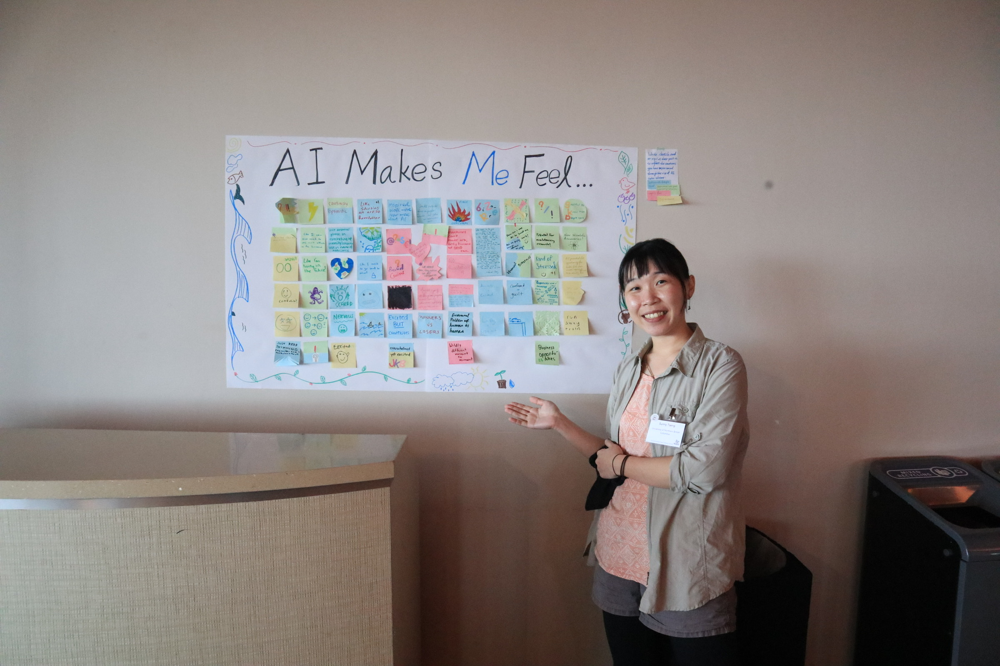

Day 6 湛藍的顏色、追浪、墨西哥家庭 (2/8)

雖說是有三小時的時差，因為早睡的緣故，早上六點半就起床，成為了第一個到櫃檯吃早餐的群眾之一。昨天要睡覺熄燈的時候(十一點)房間都空空的，想必大多數女孩都是 party 去了。

早餐非常的豪華，有一整盤水果優格、茶、還有主餐任選，大部分都是我看不懂的西班牙文，只能憑感覺點餐。

早餐後先去了第一輪海灘，竟然就再 Hostel 的路邊看到人生第一條鱷魚，看起來小小隻的，應該還不是成體，但也夠讓我驚嚇了。

早上的氣溫還需要穿上薄外套，水也是有點冰冷。迂迴了一陣子就趕緊回家換泳衣(還順道訂了後兩天的行程)，回到海灘的時候找到一位看起來和藹的媽媽，自己一個人在沙灘上，小朋友們不時來找她互動，我問她是否方便讓我把東西放在她旁邊。她說了幾句西班牙文，很可愛的點點頭。

回到沙灘上後聊天，就順道變成好朋友了! 原來她是跟她的妹妹 Natatia、先生、還有兩個小朋友 Miguel 和 Aana 來海邊玩，他們本來就是 Cancun 人，趁著假日來海邊散心。我們一下英文一下西班牙文的聊天，他們很客氣的請我吃了 Ceviche 還有喝了超好喝的西瓜飲料。

今天學會了如何衝到破浪區的前方，乘著浪上下，並在浪碎開的時候勇敢的跳進浪底。

Day 5 到達墨西哥 (2/7)

我真的是個連旅行都要準備 120% 的人，一早四點半起床、搭上高級的 Tesla Uber。司機是祕魯人，在韓國做汽車的出口商，公司倒閉後來到 Santa Barbara，說要等 Uber 賺夠錢之後在美國東山再起。後來在早上六點的公車站遇到一樣在做 Environmental Data Science 的人，世界有沒有這麼小。

機場之間的轉換比預期中的要順利簡單多了。墨西哥機場完全沒有人在檢查 Visitor Tax ，出口處會有非常熱絡的 taxi，熱情如火。在墨西哥購買任何品項之前都需要思考三分，不然很容易就會落入騙局。

負責招攬的人員第一眼就叫出我的名子，他說來這裡的沒有甚麼亞洲人，看到我的名字特別好認。司機 Miguel 一直耳提面命的跟我說千萬不要到河裡游泳，會有鱷魚。而到深海潛水的話則是會有鯊魚，是有沒有這麼危險。他說一年前戒酒了，一部份是因為之前聽說有人喝醉之後會忘記跑到河裡游泳，就會被鱷魚帶走。

傍晚到附近的小攤位，餵飽餓了一天的身軀。這裡給人的感覺真的跟台灣太像了，氣溫，連熱鬧的程度也很像。住宿處後方有個禁止游泳的標示，也是說有鱷魚。

Day 4 發表日 (2/6)

- 發表日
- 個個 project 
- say goodbye
- Russian guy
- butter chicken

Day 3 海洋遊戲與美國的震撼彈 (2/5)

一早的 keynote 是海洋科學的研究學者 XYZ，住在夏威夷(這幾天遇到了好多夏威夷的居民)，利用 AI 的技術來分析在深海拍到的影像，用以尋找深海生物。她從太空科學轉行到海洋，並想要利用在太空科學上激發 citizen science 的興奮複製到海洋，在近期利用"尋找海洋裡的所有生物"來吸引研究經費及興趣，並開發了 FathomVerse 的遊戲來吸引一般大眾協助標記，總開發經費超過 1M 並找了專業的 Video game studio 來共同開發，獲得了大量的成功，非常非常的驚豔。

早上 keynote 結束之後有人站起來向大家宣布，今天稍早美國政府決定要減少各部門 (NSF, NIH) 的研究經費，並且任命 Elon Musk 進到政府部門，介入全球氣候相關的資料庫管理。

中午有個 mid presentation，我們的 project 基本上沒有甚麼改變，反倒是看到其他組別有許多其他的想法。蠻有趣的，我提議的 project 程度就跟我的個性一樣保守，要確定自己可以 90% 做到才會安心。

晚上和一群女孩去了 Hotel 的戶外 hot tub，天氣很冷但 hottub 裡面非常溫暖，真的是有夠青春，泳池和 hottub 都照著光，簡直像在電影裡面。女孩們討論著感情上的疑惑，並給相識數天的對面的女孩感情上的建議。還說相約明年的今天這裡再見。

Day 2 小組專題 (2/4)

在第一天的議程開始之前，提早了一個半小時出門到會場附近走走，這次的會議場地就在沙灘旁邊，走路五分鐘就是廣大的海灘，長長的海灘有人在跑步、做瑜珈、遛狗、散步、還有沙灘排球的場地。和溫哥華的海灘很不一樣，這裡的浪特別凶猛。在潮間帶可以完全的沉浸於浪淘的聲音中，雖然車道就在沙灘上方，卻完全聽不到的車聲，只有海浪、海鷗、烏鴉。是小小的聲音秘境。

這次的會議和以往很不同，沒有一系列的報告，有場主要的 keynote，強調人性與故事的重要性，相比於資料一樣的重要。

今年的行程，主要都是由參與者合作演出這場 summit，可以看見主辦單位很用心地想要讓這場大型討論順利，像是 packman rule 可以增加討論度、用 1、2、4、all rule 來激發討稐，並且不停強調這不是一定要從頭到尾嚴肅完成的 project，著實讓人非常安心。

我們的小組提出的主題是 "Environmental and emotional impact of AI"，其他的主題像是統一 AI 的用詞、寫出 AI 的運用手冊、列出各個 AI 的"認證標章"、還有找出對環境衝擊較小的 data center 等等。

晚餐時遇到來自墨西哥的 Annivena，提到我將要到墨西哥旅行，相談甚歡，她給我一長串在墨西哥一定要試試看的食物。遇到了同樣來自 rOpenSci 的夥伴，還有來自 NEON 的 Sam，說他對鳥類的聲音資料庫很有興趣。

Day 1 出發日 (2/3)

原先預定早上八點的飛機，突然延到十點才飛，多了奢持的兩個小時可以睡到早上六點，非常的滿足。在出發前匆匆忙忙的時段竟然還在想，是不是可以來申請個加拿大公民。準備了一千多天的公民申請，竟然在十分鐘內就被我送出申請了。交出申請之後馬上就上了 Uber 飛奔機場。

上飛機之後窗外開始飄雪，飛機要噴上 deicing 的液體才能起飛，先噴上一層粉紅色的，再一層綠色的，在化學藥劑添上顏色是要幫堆高機上面的操作人員防呆。不然一直在做重複的動作真的會忘記自己噴到哪裡了。

如預期的飛機 delay，新的到達時間離我要搭的巴士只有 10 分鐘，我和機組人員商量是否可以讓我早下飛機，他們說沒辦法，理由是很多人都要轉機為什麼妳的可以特別優先，我認為依照轉機的時間應該可以判斷誰真的有需求需要早下飛機，但他們沒有改變想法的意願，我也只能心理嘆氣。果真插了五分鐘，錯過了長途巴士，下班一直要到三小時候(還請 Gintas 和 Ginger 從遠端幫忙改票)。

還沒降落 USA 就對飛機上的缺乏人情味感到灰心。

而後在巴士上巧遇了 Francesco Riva，來自瑞士的物理學家，一樣要到 Santa Barbara 開會，後來才知道同個地點也在舉辦粒子物理的會議。我們從物理聊到台灣、從台灣聊到台大、才發現我們有共同認識的人啊!而且我竟然是從別人的口中才知道原來我的同學在他的領域有多 established。Fransesco 一樣也是 audio book 的愛好者，他推薦了我幾本書:

- The right chose mind
- Solarids
- The ministry of the future
- The wager
- The spy and the traitor
- The immortal life of Henrietta Lacks
- Educated
- Bad blood

Santa Barbara 下車的停車場一片漆黑，幸好 Uber 很快就來，安穩的安頓下來。

